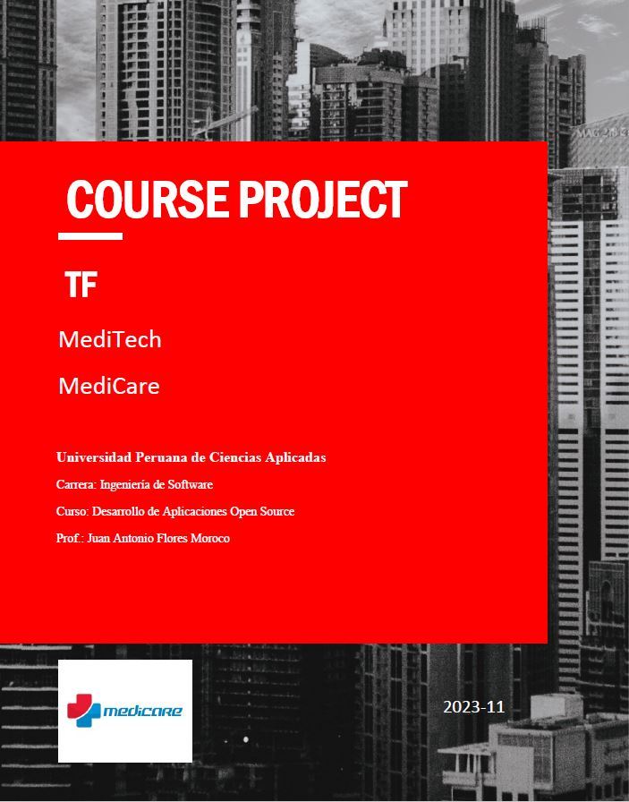
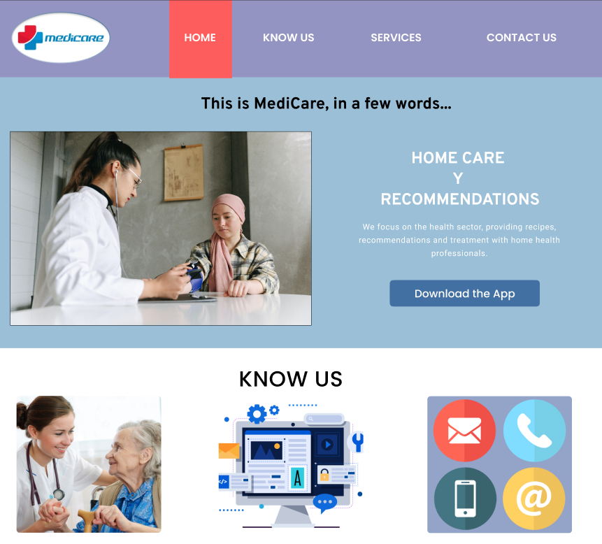

# 1. INTRODUCTION

## 1.1. Startup Profile

A continuación, procederemos a informar sobre a lo que se dedica nuestra empresa “MEDICARE”.

### 1.1.1. Descripción de la Startup

En la actualidad existe un número exorbitante de personas que necesitan ayuda para poder mantener o mejorar su calidad de vida. Específicamente en Lima, Perú. Se ha identificado que realizar un buen cuidado de personas discapacitadas, vulnerables o con una enfermedad grave, es una labor demasiado difícil. Asimismo, los familiares de estos individuos son directamente afectados por las condiciones en las que se encuentran, pues su cuidado requiere demasiado tiempo y, del mismo modo, un gran esfuerzo físico. Además, después de la aparición del COVID-19 en el país, las personas se han acostumbrado a tener una solución a sus problemas de forma remota sin tener que salir de casa.
Por esta razón, hemos decidido crear un startup llamado “MEDICARE”. Somos una empresa emergente con grandes posibilidades de crecimiento. A una primera instancia, no contamos con una gran cantidad de clientes, pero con el transcurso del tiempo estamos enfocados en crecer en el mercado aplicando el potencial de las tecnologías.
Nuestra misión actual es encontrar la forma más viable e innovadora de ayudar a las personas que tienen familiares que padecen de enfermedades graves o limitaciones físicas o de otra índole, apoyándolos en su cuidado diario y facilitando esta tarea. Donde crearemos un software que ofrezca la ayuda de distintos enfermeros o doctores confiables para que realicen una visita médica a la casa del cliente. Al mismo tiempo, nuestra visión es convertirnos en un startup líder en el desarrollo de soluciones con la ventaja competitiva de emplear la tecnología para que ayuden a resolver distintas problemáticas médicas en el Perú.

## 1.2. Solution Profile

En este punto del informe, pasaremos a la explicación detallada de nuestro producto software, tanto su factor innovador y la forma en la cual será monetizada.

**Product Name**
Se decidió llamar a nuestro producto “MEDICARE”, ya que, en el lenguaje inglés, ‘Medi’ es una abreviación de médico y ‘Care’, cuidado; por lo que el nombre completo se traduce como “Atención Medica”. Del mismo modo, se eligió este idioma porque, además de generar más atractivo hacia el público, es el idioma más hablado del mundo, lo cual vuelve más comercial a nuestra aplicación.

**Product Description**
Este software es innovador ya que ofreceremos la posibilidad de contratar profesionales de salud que se encarguen de cuidar a personas con limitaciones físicas o de otra índole. En esta aplicación, los contratantes podrán visualizar una larga lista de personal de salud altamente calificado. Asimismo, se presentarán las referencias de pacientes o contratantes anteriores junto con la tarifa estándar de consulta y diferentes paquetes que se adecuen al área médica correspondiente a cada profesional. Con el registro del usuario y la elección del médico o enfermero se podrá dar seguimiento continuo al beneficiario, el cual será similar a un historial médico virtual que se adecue a la frecuencia de visita elegida por el contratante.

**Monetization**
Nuestro servicio podrá ser adquirido de manera gratuita. Sin embargo, los profesionales de la salud registrados tendrán una retención entre el 5% y 10% de sus ingresos mensuales por conceptos de captación de pacientes a través de nuestra plataforma.

### 1.2.1. Antecedentes y problemática del producto

**Descripción de la problemática**
Este software se enfoca en el sector de salud, ya que se ha evidenciado que hay leve incremento en pacientes insatisfechos con las citas brindadas por las clínicas. Es por esta razón que “MediCare” busca cubrir las necesidades de la comunicación, seguridad y eficacia a la mayor cantidad de personas posibles en su domicilio.

**Objetivos**
Este software tiene el principal objetivo de cubrir las necesidades básicas de atención médica a domicilio de las personas con limitaciones físicas o mentales que no puedan acudir a un centro médico. Por otro lado, lograr ser una empresa reconocida y contar con un producto sostenible económicamente es un objetivo general de MediCare.

**Restricciones**
Una principal restricción que delimita el alcance del proyecto es que el equipo desarrollador es nuevo en estas tendencias o técnicas a aplicar para lanzar nuestra aplicación. Por ello, es que puede ser una restricción de alcanzar el mejor escenario. Sin embargo, el equipo pondrá de su parte para lograr alcanzar el nivel deseable de cada entregable.

**Antecedentes**
Como se mencionó anteriormente, nuestro producto software “MediCare.” tiene la capacidad de contratar profesionales de salud que se encarguen de cuidar a personas con limitaciones físicas o de otra índole y además dar seguimiento continuo al beneficiario, el cual será similar a un historial médico virtual que se adecue a la frecuencia de visita elegida por el contratante. Es por ello por lo que, teniendo en cuenta el funcionamiento de nuestro producto, realizamos la búsqueda de posibles competidores, obteniendo como resultado dos productos software:

- MedicApp:
  - Es una aplicación en la cual una persona puede agendar por medio de llamada o WhatsApp, una cita a domicilio de Médico o Enfermero. Cuenta con un horario limitado de lunes a sábados de 8 am a 8 pm. Asimismo, ofrece tele consultas y pruebas de descarte de la COVID-19. Cuenta con una alianza con una institución dedicada al transporte de pacientes con situaciones graves, ambulancias.Sin embargo, la principal diferencia que separa a MediCare. de MedicApp es que, en nuestra aplicación, es posible contactar con un doctor específico que le brinde confianza al usuario. Por otro lado, en la aplicación MedicApp, los doctores son brindados según la disponibilidad que tiene la aplicación y el usuario no interactúa de manera constante en el proceso de selección. Asimismo, no mantienen, en la aplicación, un registro virtual de todas las citas que ha tenido el paciente ni de las recomendaciones brindadas.
- MediQuo:
  - Es una aplicación donde se puede realizar consultas, gestionar citas mediante el chat que está disponible en su web, además que tiene seguimiento registrado en la aplicación móvil. Sin embargo, una de las diferencias que existe entre MediCare y MediQuo es que, mientras en MediQuo solo se hacen consultas digitales, en MediCare se tiene contacto directo. Además, al contrario que la aplicación MediQuo, MediCare puede generar un historial médico virtual que varía dependiendo de cada contratante.

**Herramienta 5W y 2H**

- What - ¿Cuál es el problema?
  - El problema identificado es la cantidad exorbitante de personas de edad avanzada y/o que sufren de limitaciones físicas o de otra índole. Es decir, que no pueden mantener un cuidado autónomo y requieren de la asistencia de otro individuo para mantener una salud estable.
- When - ¿Cuándo sucede el problema?

  - Cuando es necesaria la supervisión o tratamiento de un médico para individuos con capacidades limitadas, o simplemente cuando se requiere de personas extras para el cuidado de los pacientes y los familiares que carecen de tiempo o son incapaces de atenderlos sin ayuda.

- Where - ¿Dónde surge el problema?
  - El problema surge en los distintos hogares de la capital, pues día a día las personas deben salir a ejercer sus obligaciones laborales y no cuentan con el tiempo suficiente y la ayuda necesaria para mantener la calidad de vida y cuidado de sus familiares con limitaciones físicas o mentales.
- Who - ¿Quiénes son afectados por el problema?
  - Los principales afectados son las personas de la tercera edad y aquellas que presentan enfermedades que precisan de atención inmediata.
- Why - ¿Cuál es la causa del problema?
  - La causa del problema es principalmente la falta de tiempo por parte de los familiares de personas de edad avanzada y/o con discapacidades físicas o de otra índole para cuidarlos y mantenerlos con un estado de salud estable.
- How - ¿Cómo se llevan a cabo los hechos?
  - Cuando una familia cuenta con un integrante que requiere de supervisión constante, los demás miembros tienen que brindar gran parte de su tiempo para su cuidado. Además, el encontrar personas de confianza y que estén capacitadas para la atención del individuo es complicado, lo cual solo genera que la situación sea más difícil, y esto empeora si el paciente requiere de uso de medicina. Por eso, es necesaria una forma fácil y sencilla de contactar con la ayuda necesaria para la atención de los familiares vulnerables.
- How much - ¿Cuál es la magnitud del problema?
  - Según el INEI (2018), se recopiló a nivel de Lima metropolitana que el 84,9% de los adultos mayores femeninas y 67,3% de los adultos mayores masculinos presentan enfermedades crónicas como artritis, hipertensión, diabetes, etc. De esta manera, se identifica que existe un gran porcentaje de adultos mayores con necesidad de un cuidado médico. Cabe resaltar que en el presente informe del INEI (2018), se menciona que esta población mayor de 60 años con limitaciones o discapacidades físicas o mentales, no asistieron a un establecimiento para atenderse (72,7%) y un poco más de la cuarta parte (25,6%) no acudió a un establecimiento de salud porque le queda lejos, no le genera confianza o se demoran en la atención. Así, se identifica que hay una necesidad de atención médica a domicilio, pues es el lugar donde estas personas se sienten más cómodos y seguros.

### 1.2.2. Lean UX Process

#### 1.2.2.1. Lean UX Problem Statement

**Problem Statement**

Con respecto a la atención médica en centros médicos públicos y privados, se evidencia el incremento de insatisfacción por el servicio brindado para los pacientes, ya sea por la mala atención, complicaciones para generar citas, incomodidad en las instalaciones y/o complicaciones de movilidad para desplazar al paciente a estos centros médicos.
Hemos identificado una problemática en este proceso, los pacientes y sus familiares optan por no acudir a los centros de salud, pues el tiempo y el esfuerzo que les genera es mayor al tiempo que dura su consulta. En consecuencia, los profesionales de la salud se vieron obligados a recurrir a las teles consultas para registrar la condición del paciente. Sin embargo, no todos emplean este medio de atención porque no se ofrece un chequeo inmersivo. De esta manera, el número de pacientes ha disminuido y personas mayores con alguna discapacidad prefieren mantener el cuidado en casa con el apoyo de algún familiar.
¿Cómo podemos hacer que los pacientes reciban una atención íntegra, eficaz y beneficiosa para su salud en un ambiente en el que se sienta cómodo, como su domicilio sin la necesidad de realizar un gran traslado que tome demasiado tiempo y así los médicos tengan una mayor cantidad de pacientes y no vean perjudicados sus ingresos económicos?

#### 1.2.2.2. Lean UX Assumptions

**Business Outcomes**

- Generar una plataforma intuitiva, eficaz y óptima que genere ingresos a partir de la contratación de profesionales de la salud dispuestos a brindar sus servicios al domicilio de nuestros usuarios con limitaciones físicas o mentales.
- Establecer nuestra posición en el mercado, a través de resultados efectivos de los pacientes que generará confianza en el público objetivo, calidad del servicio de los profesionales de salud y un sistema web sólido como práctico.
- Producir una rentabilidad económica al servicio de los profesionales de salud, con precios económicos y variables dependiendo de la necesidad del usuario, en el servicio de consultas vía sitio web o por un profesional, y la publicidad de nuestra plataforma con el fin de generar mayores ingresos que costos.
- Sentar una tasa de retención por determinado periodo, para verificar si nuestros usuarios siguen utilizando nuestro servicio, con campañas de marketing, servicio que cumple sus necesidades con funciones de la plataforma, y si no se cumple, identificar cuáles serían las razones del abandono del servicio.

**Users**

- Público adulto mayor o personas con discapacidades físicas o mentales y sus familiares.
- Profesionales de la Salud.

**User Outcomes**

- Identificar el proceso de mejora de la limitación física o mental del familiar, e implementarlo a través de la atención adecuada por un profesional de la salud.
- Generar confianza por el desarrollo constante de la salud del paciente, para que el familiar pueda tener seguridad en dejar cargo al profesional y concentrarse en sus demás actividades.
- Solventar las dudas del familiar acerca de cómo se puede dar una mejora de la salud del paciente a través de las consultas médicas que dispone la plataforma.
- Producir una mejora de la condición económica del profesional a través de propuestas de establecer su sector de pacientes con el tipo de especialidad que tenga, con paga en acuerdo mutuo, y una propuesta de proyección del trabajo en la que esté incluido(a).

**Features**

- Información del paciente y registro de su condición actual para que el profesional de la salud pueda identificar el mejor tratamiento.
- Sección para visualizar a los profesionales de la salud con sus reseñas y sus precios definidos por los conceptos de atención a domicilio.
- Plan de atención por parte del médico.

**1. Creo que mis usuarios necesitan**, empezando por los pacientes, recibir rápidamente una atención médica a su domicilio y tener la información de sus resultados al alcance de sus manos. Por otro lado, los profesionales de la salud necesitan realizar una revisión médica más íntegra e inmersiva para los pacientes que son atendidos desde su domicilio.

**2. Estas necesidades se pueden resolver con** una plataforma que permita contactar a un profesional de la salud para que realice los análisis necesarios y publique los resultados en nuestra plataforma de manera rápida y eficaz. Por otro lado, que le permita al profesional a cargo acceder a la información del historial clínico, actualizado por un profesional anterior, del paciente.

**3. Mis clientes iniciales son (o serán)** los pacientes que desean o necesitan ser atendidos por un profesional de la salud y presentan alguna dificultad de movimiento y, los profesionales de la salud que trabajan en el servicio a domicilio.

**4. El valor #1 que un cliente quiere de mi** servicio es, empezando por los pacientes, recibir atención médica de un profesional de la salud a su domicilio de manera cómoda, rápida y personalizada. Por otro lado, los profesionales de la salud desean mejorar la calidad de atención/servicio que se le puede ofrecer a un paciente que no cuenta con la facilidad de transportarse a un centro de salud.

**5. El usuario también puede obtener beneficios adicionales**, empezando por los pacientes, como la visualización del avance en su tratamiento, los resultados de sus análisis y las recomendaciones del profesional de salud. Asimismo, los profesionales de la salud podrán colocar su propia tarifa de pago, generar su horario médico virtual y que su servicio pueda ser calificado y recomendado por los usuarios.

**6. Voy a adquirir la mayoría** de mis clientes a través de marketing en los medios de comunicación más frecuentados como Facebook, Instagram o entre otros; con la publicación de casos de éxito con los pacientes que utilizan nuestra plataforma. Asimismo, demostrando las funcionalidades médicas y de apoyo para el profesional de la salud.

**7. Vamos a subvencionar el app a través de** la retención del 5% - 10% de los ingresos mensuales de los profesionales de la salud inscritos en nuestra plataforma por conceptos de captación de pacientes y publicidad de nuestros auspiciadores.

**8. Mi competencia principal en el mercado serán** las aplicaciones que brindan funciones similares al público objetivo o programas propios de un centro de salud.

**9. Los venceremos debido a** la diferenciación de nuestros beneficios para los pacientes, como seguimiento de los análisis, contacto casi inmediato con un profesional de la salud y visualización de las recomendaciones de este mismo. Asimismo, del lado de los profesionales de la salud, por la personalización de nuestras funcionalidades como registrar una tarifa propia, registrar/consultar el cuadro clínico de un paciente para acceder rápidamente a la información, recibir valoraciones de los usuarios para retroalimentarse y/u obtener más citas médicas.

**10. Mi mayor riesgo de producto son** las fallas en el sistema de la plataforma, ya que los bugs o huecos de información impedirían al paciente revisar su progreso/tratamiento y, al profesional de la salud, realizar su servicio de manera efectiva.

**11. Resolveremos esto a través de** una inversión constante en nuestra plataforma: formar un equipo profesional dedicado al mantenimiento de la plataforma y la solución de sus posibles fallos a través de las actualizaciones.

1.  **¿Quién es el usuario?**
    Nuestros usuarios son aquellas personas que tienen algún impedimento para movilizarse y necesitan atención médica profesional, o familiares preocupados por ellos. Asimismo, también lo son los profesionales de la salud que brindan atención médica a domicilio.

2.  **¿Dónde encaja nuestro producto en su trabajo o vida?**
    En el caso de los pacientes, en los días que necesiten tratar alguna enfermedad, seguir una terapia o simplemente un monitoreo de rutina. En el caso de los profesionales de la salud, encaja dentro de su ámbito laboral, específicamente durante el proceso de registro de pacientes, consulta médica y prescripción del tratamiento a seguir.

3.  **¿Cómo y cuándo es usado nuestro producto?**
    Para los pacientes, será usado a través de una aplicación o sitio web como un apoyo de interconexión médico-paciente, con la previa inscripción a nuestra plataforma, cuando el usuario requiera de un análisis a su estado de salud actual o quiera darle seguimiento a su tratamiento. Para los profesionales de la salud, será usado como una plataforma de apoyo para la recopilación de información médica relevante del paciente, cuando la cita agendada se realice de forma a domicilio.

4.  **¿Qué problema tendría nuestro producto y cómo se pueden resolver?**
    Nuestro producto está desarrollado en plataformas digitales, por lo que, al ser personas de tercera edad la mayoría de los pacientes, se pueden generar complicaciones al momento de entender el correcto funcionamiento de ella. Asimismo, al ser desarrollado también para un entorno sanitario puede carecer de las especificaciones reglamentarias necesarias para su uso, en otras palabras, las acciones realizadas por un profesional de la salud deben seguir un orden y proceso adecuado permitido por la ley, si no se cumple con ello nuestra plataforma sería inoperable. Sin embargo, esto se puede resolver con profesionales de diseño que hagan más intuitiva nuestra plataforma, así como también con profesionales especializados en el ámbito legal y la asesoría de los profesionales de la salud para la implementación de las funcionalidades adecuadas.

5.  **¿Qué características son importantes?**
    Debe ser intuitiva, las opciones que tendrá la plataforma deben ser específicas y prácticas para que el usuario no tenga complicaciones en su uso. A su vez, el tiempo de respuesta en cuanto a la atención al cliente u recomendaciones para su tratamiento deben ser atendidas con prontitud. Asimismo, la organización y distribución de las funcionalidades deben estar avaladas por la ley. Finalmente, la seguridad también será un factor importante porque estaremos trabajando con información confidencial del paciente.

6.  **¿Cómo debe verse nuestro servicio y cómo debe comportarse?**
    Nuestro producto debe verse práctico, moderno y con contrastes de colores suaves; todo esto con la finalidad de hacer más satisfactoria la experiencia de usuario. Asimismo, debe comportarse como una interfaz fluida y con un manejo eficaz de la información.

#### 1.2.2.3. Lean UX Hypothesis Statements

**1st Hypothesis Statement**

**Creemos que** el uso de nuestra plataforma facilitará la comunicación entre el usuario y el profesional de salud; y así desarrollar una interacción práctica.

**Sabremos que** hemos tenido éxito,

**Cuando** veamos que el 70% de los usuarios están satisfechos con la prontitud que se contacta a un profesional médico a través de sus reseñas positivas en nuestra plataforma.

**2nd Hypothesis Statement**

**Creemos que** publicar los resultados de sus análisis en la plataforma permitirá a los usuarios hacer un seguimiento de su progreso con el tratamiento y su estado de salud actual.

**Sabremos que** hemos tenido éxito,

**Cuando** veamos que un 60% de los usuarios mantienen un progreso constante con cada análisis.

**3rd Hypothesis Statement**

**Creemos que** publicar las recomendaciones del profesional de la salud para el tratamiento de los pacientes ayudará a estos últimos a conseguir mejores resultados en su tratamiento.

**Sabremos que** hemos tenido éxito,

**Cuando** veamos que un 50% de nuestros usuarios utilizan las recomendaciones del profesional de la salud y obtengan resultados óptimos.

#### 1.2.2.4. Lean UX Canvas


## 1.3. Segmento Objetivo

De acuerdo con el INEI (2020), en el Perú se encuentran más de 3.3 millones de personas con alguna discapacidad, de los cuales el 31.2% están ubicados en la capital del país, lo que convierte a Lima en el departamento con más personas que tienen alguna limitación física o mental en nuestra nación. Por eso, se escogió a Lima Metropolitana como la provincia en la cual nuestra aplicación comenzará a funcionar. De la misma manera, los adultos mayores son los que forman la mayor parte de este grupo de individuos con alguna discapacidad y, además, ellos necesitan de ayuda de terceros en su día a día, ya que no pueden valerse por sí mismos. Igualmente, el último reporte del INEI también menciona que el 52.2% del sector de personas limitadas se encontraron o se encuentran con la necesidad de acudir a centros de salud, tales como el MINSA, Essalud, entre otros. Esto evidencia que hay un menester de médicos o enfermeros para apoyar al cuidado de personas con discapacidad y no es posible que solo uno de los familiares se encargue de estos, pues en palabras de Pérez (2016), el cuidado informal de personas limitadas genera problemas de salud y alteraciones emocionales en los cuidadores principales y también en los que los rodean. En otras palabras, todos los miembros de una familia son afectados directamente cuando uno de ellos presenta algún tipo de limitación.
En el siguiente gráfico se muestra un aproximado del porcentaje de aumento de personas con discapacidad según sexo y edad.


Tal como se puede apreciar en el gráfico, se estima que hasta el 2050 habrá un aumento en el porcentaje de adultos mayores, lo que conlleva a que crezca la demanda de enfermeros o médicos para su supervisión también se elevará en los próximos años. Además, en los mismos datos se evidencia que disminuirá la población de entre 20 a 45 años, lo que implica que los cuidados informales de personas discapacitadas se reducirán de igual manera. Por todo esto, llegamos a la conclusión de que los segmentos objetivos de nuestra aplicación son los siguientes.

- Personas mayores que requieran supervisión o Personas discapacitadas o con alguna otra dificultad para movilizarse


- Profesionales de la salud


# 2. REQUIREMENTS ELICITATION & ANALYSIS

## 2.1. Competidores.

### 2.1.1. Análisis Competitivo.

<table>
<thead>
  <tr>
    <th colspan="7">Competitive Analysis Landscape</th>
  </tr>
</thead>
<tbody>
  <tr>
    <td colspan="3" rowspan="2">¿Por qué llevar a cabo este análisis? </td>
    <td colspan="4">¿Cómo identificar a nuestros principales competidores?</td>
  </tr>
  <tr>
    <td colspan="4">Con este análisis, podemos identificar el FODA,   es decir, las fortalezas, oportunidades, debilidades y amenazas de nuestros   competidores. Asimismo, se evalúa su participación en el mercado y qué   estrategias se pueden desarrollar para que nuestra aplicación surja en el   mercado laboral. Pero ¿Cómo identificamos a nuestros principales   competidores?, Debemos estudiar el mercado e identificar las aplicaciones más   usadas por los contratantes del servicio de los profesionales de la salud.   Así se concluyó que los principales competidores son:</td>
  </tr>
  <tr>
    <td colspan="2" rowspan="5">(En la cabecera colocar por cada competidor nombre y logo)</td>
    <td colspan="2" rowspan="5">MediCare
<br>

</td>
    <td rowspan="5">MedicApp
<br>

</td>
    <td rowspan="5">MediQuo
<br>

</td>
    <td rowspan="5">Heal
<br>

</td>
  </tr>
  <tr>
  </tr>
  <tr>
  </tr>
  <tr>
  </tr>
  <tr>
  </tr>
  <tr>
    <td rowspan="10">P<br>E<br>R<br>F<br>I<br>L</td>
    <td rowspan="5">Overview</td>
    <td colspan="2" rowspan="5">Ofrecer una lista de profesionales de la salud por medio de una aplicación que integra a doctores, enfermeros o fisioterapeutas que acuden a los domicilios de sus pacientes para realizar un chequeo continuo a su salud, registrando sus avances médicos en la base de datos de la aplicación para que los familiares a cargo del adulto mayor o persona con discapacidad física o mental, pueda visualizar el seguimiento del paciente, desde cualquier lugar de Lima, Perú.</td>
    <td rowspan="5">Ofrecer consultas médicas a domicilio u online para aquellas personas que se contacten con ellos por medio de llamada, correo o por medio de su página web. Se encargan de brindar apoyo a los pacientes por medio de un diagnóstico que se almacena en su sistema, el cual solo puede visualizar el doctor. Asimismo, ofrece servicios de traslado de su domicilio a un hospital o clínica.</td>
    <td rowspan="5">Ofrece un chat de atención médica a las personas que se contacten con ellos por medio de su aplicación y de su página web. En este chat, se resuelven dudas sobre dolencias, malestares y dan un breve diagnóstico ante la situación que el paciente relata. Es una tele consulta escrita con un profesional de la salud aleatorio.</td>
    <td rowspan="5">Ofrece atención primaria a personas que requieran el servicio de un profesional de la salud específicamente en el lugar donde se sientan más cómodos. Es una aplicación conectada con Medicare que es la aplicación de salud del Gobierno de los Estados Unidos y permite acceder a médicos o enfermeros practicantes o graduados certificados. Estableciendo una relación solida entre el paciente y el proveedor para aumentar el nivel de confianza.</td>
  </tr>
  <tr>
  </tr>
  <tr>
  </tr>
  <tr>
  </tr>
  <tr>
  </tr>
  <tr>
    <td rowspan="5">Ventaja  <br>competitiva <br>¿Qué valor  <br>ofrece a los  <br>clientes?<br></td>
    <td colspan="2" rowspan="5">Formalidad y ofrecer una cartera de profesionales de la salud con reseñas de los pacientes anteriores y su tarifa estándar por consulta y/o visita al domicilio del paciente. Asimismo, un registro actualizado de las citas que el paciente ha tenido en el pasado.</td>
    <td rowspan="5">Cuenta con profesionales de la salud con experiencia laboral en instituciones médicas públicas y privadas. Asimismo, cuenta con un laboratorio</td>
    <td rowspan="5">Respuesta inmediata a la consulta médica que el paciente tenga que efectuar.</td>
    <td rowspan="5">Vínculo con Medicare y los planes selectos en esa plataforma federal que permite brindar seguridad y confianza a los posibles contratantes. Su participación en el mercado aumenta constantemente en USA. Con posibles expansiones a México y Sudamérica.</td>
  </tr>
  <tr>
  </tr>
  <tr>
  </tr>
  <tr>
  </tr>
  <tr>
  </tr>
  <tr>
    <td rowspan="21">P<br>E<br>R<br>F<br>I<br>L<br>     <br>D<br>E<br>     <br>M<br>A<br>R<br>K<br>E<br>T<br>I<br>N<br>G</td>
    <td rowspan="18">Mercado objetivo</td>
    <td colspan="2" rowspan="18">Personas que tengan un familiar adulto mayor o con alguna limitación física o mental y que no cuenten con el tiempo necesario para encargarse del cuidado de su familiar y que requiera de tratamiento y de un control remoto de la salud.</td>
    <td rowspan="18">Personas que requieran el apoyo de un profesional para un diagnóstico rápido y seguro.</td>
    <td rowspan="18">Personas con dudas o consultas médicas donde no sea necesario la revisión presencial del paciente.</td>
    <td rowspan="18">Personas mayores en todas las etapas de su proceso de salud, y aquellas que precisen de algún tratamiento.</td>
  </tr>
  <tr>
  </tr>
  <tr>
  </tr>
  <tr>
  </tr>
  <tr>
  </tr>
  <tr>
  </tr>
  <tr>
  </tr>
  <tr>
  </tr>
  <tr>
  </tr>
  <tr>
  </tr>
  <tr>
  </tr>
  <tr>
  </tr>
  <tr>
  </tr>
  <tr>
  </tr>
  <tr>
  </tr>
  <tr>
  </tr>
  <tr>
  </tr>
  <tr>
  </tr>
  <tr>
    <td rowspan="3">Estrategias de marketing</td>
    <td colspan="2" rowspan="3">Hacer uso de publicidad para así obtener un mayor número de usuarios. <br>Publicidad en Redes Sociales como Facebook, Instagram y Twitter. Pop-ups, banners y anuncios en sitios web pero que no sean intrusivos.<br>Google anuncios.<br></td>
    <td rowspan="3">Hacer uso de publicidad para así obtener un mayor número de usuarios. Anuncios intrusivos no relacionados al ámbito laboral.</td>
    <td rowspan="3">Hacer uso de publicidad para así obtener un mayor número de usuarios. Posicionamiento en buscadores.</td>
    <td rowspan="3">Hacer uso de publicidad para así obtener un mayor número de usuarios. Posicionamiento en Buscadores.<br>Aparición en medios de comunicación como podcasts, programas televisivos y redes sociales.<br></td>
  </tr>
  <tr>
  </tr>
  <tr>
  </tr>
  <tr>
    <td rowspan="25">P<br>E<br>R<br>F<br>I<br>L<br><br>D<br>E<br><br>P<br>R<br>O<br>D<br>U<br>C<br>T<br>O</td>
    <td rowspan="15">Productos &amp;  <br>Servicios<br></td>
    <td colspan="2" rowspan="15">Servicio de búsqueda de un profesional de la salud. <br>Servicio de seguimiento continuo, íntegro y seguro al paciente desde su domicilio.<br>Servicio de almacenamiento de la información en un historial médico virtual con acceso desde la aplicación.<br></td>
    <td rowspan="15">Servicio de médicos a domicilio para un chequeo integral.</td>
    <td rowspan="15">Servicio de preguntas y respuestas de manera inmediata para cualquier disyuntiva médica por medio de su aplicación.<br>Servicio de grupos focalizados relacionados a temas de salud.<br></td>
    <td rowspan="15">Servicio de médicos, enfermeros o practicantes médicos certificados a domicilio.<br>Servicio de exámenes físicos mensuales y anuales.<br>Servicio de vacunación integrado.<br></td>
  </tr>
  <tr>
  </tr>
  <tr>
  </tr>
  <tr>
  </tr>
  <tr>
  </tr>
  <tr>
  </tr>
  <tr>
  </tr>
  <tr>
  </tr>
  <tr>
  </tr>
  <tr>
  </tr>
  <tr>
  </tr>
  <tr>
  </tr>
  <tr>
  </tr>
  <tr>
  </tr>
  <tr>
  </tr>
  <tr>
    <td rowspan="7">Precios y Costos</td>
    <td colspan="2" rowspan="7">Paciente:<br>Descarga: Gratuito<br>Contratación: Depende de tarifa del profesional.<br><br>Profesional:<br>Retención entre el 5% y 10% de sus ingresos mensuales por concepto de consultas médicas.<br></td>
    <td rowspan="7">Paciente: <br>Descarga: Gratuito<br>Contratación: tarifa estándar, no mencionada.<br><br>Profesional:<br>No menciona</td>
    <td rowspan="7">Paciente:<br>Descarga: Gratuito<br>Atención: Gratuito<br><br><br>Profesional:<br>10 – 30 dólares por consulta</td>
    <td rowspan="7">Paciente: <br>Descarga: Gratuito<br>Contratación: Depende de tarifa del profesional y de lugar de residencia.<br><br>Profesional:<br>No menciona</td>
  </tr>
  <tr>
  </tr>
  <tr>
  </tr>
  <tr>
  </tr>
  <tr>
  </tr>
  <tr>
  </tr>
  <tr>
  </tr>
  <tr>
    <td rowspan="3">Canales de  <br>distribución  <br>(Web y/o Móvil)<br></td>
    <td colspan="2" rowspan="3">Web y Móvil</td>
    <td rowspan="3">Web y Móvil</td>
    <td rowspan="3">Web y Móvil</td>
    <td rowspan="3">Web y móvil</td>
  </tr>
  <tr>
  </tr>
  <tr>
  </tr>
  <tr>
    <td rowspan="21">A<br>N<br>Á<br>L<br>I<br>S<br>I<br>S<br><br>S<br>W<br>O<br>T</td>
    <td colspan="6" rowspan="10">Realice esto para su startup y sus competidores. Sus fortalezas deberían apoyar sus oportunidades y contribuir a lo que ustedes definen como su posible ventaja competitiva.</td>
  </tr>
  <tr>
  </tr>
  <tr>
  </tr>
  <tr>
  </tr>
  <tr>
  </tr>
  <tr>
  </tr>
  <tr>
  </tr>
  <tr>
  </tr>
  <tr>
  </tr>
  <tr>
  </tr>
  <tr>
    <td rowspan="5">Fortalezas</td>
    <td colspan="2" rowspan="5">- Confianza.<br>-Reseñas y elección del contratante.<br>-Rápida respuesta.<br>-Atención las 24 horas.<br>-Asociación con farmacias para la compra y envío de medicamentos<br><br>     <br>     </td>
    <td rowspan="5">-Gran participación en el mercado</td>
    <td rowspan="5">-Atención efectiva y al instante.</td>
    <td rowspan="5">-Gran participación en el mercado y con aumento constante<br>-Vínculo con Medicare</td>
  </tr>
  <tr>
  </tr>
  <tr>
  </tr>
  <tr>
  </tr>
  <tr>
  </tr>
  <tr>
    <td rowspan="2">Debilidades</td>
    <td colspan="2" rowspan="2">Nuevo en el mercado de aplicaciones de búsqueda de profesionales de la salud.</td>
    <td rowspan="2">Horario de atención establecido de 8 am a 8 pm.<br>El contratante no selecciona el profesional.</td>
    <td rowspan="2">Su idea de negocio puede ser fácilmente imitada, pues es solo un chat de respuesta inmediata.</td>
    <td rowspan="2">-Horario de atención de 8:00 am a 6:00 pm<br>-Sistema de atención y reserva de citas deficiente e irregular.</td>
  </tr>
  <tr>
  </tr>
  <tr>
    <td rowspan="3">Oportunidades</td>
    <td colspan="2" rowspan="3">Tomar las funcionalidades deficientes de los aplicativos existentes e implementarlo para su beneficio.<br>Mercado actual en crecimiento.<br></td>
    <td rowspan="3">Aumento de público en interacción con aplicaciones relacionadas al tema de salud por la coyuntura actual y nuevos convenios con instituciones médicas privadas.</td>
    <td rowspan="3">Aumento de la tele consultas y de los medios de comunicación tecnológicos integrados con sistemas de chat.</td>
    <td rowspan="3">Ampliar su zona de atención a nivel nacional en los Estados Unidos.<br><br>Expansión de su atención a México y América del Sur.</td>
  </tr>
  <tr>
  </tr>
  <tr>
  </tr>
  <tr>
    <td>Amenazas</td>
    <td colspan="2">Mucha Competencia</td>
    <td>Software e interfaz de interacción desactualizados.</td>
    <td>Falta de actualización de la máquina virtual integrada para respuestas aleatorias ante problemas de salud comunes.</td>
    <td>Sistema de atención, reserva de citas y facturación con deficiencias que perjudican su imagen con los contratantes.</td>
  </tr>
</tbody>
</table>

### 2.1.2. Estrategias y tácticas frente a competidores.

1. Aplicaremos una estrategia de supervisión de los indicadores de desempeño para evaluar el porcentaje de éxito en cada contratación del profesional de salud para medir las métricas de rendimiento de nuestra aplicación y sugerir cambios para el beneficio del usuario.
2. La segunda estrategia es desarrollar un ataque en cadena, como estamos inmersos en un ámbito tecnológico, no puedes atacar directamente al competidor más potente, pues cuenta con más medios que nosotros y podría ser contraproducente. Entonces debemos ir obteniendo mayor participación en el mercado atacando los mercados más pequeños y posicionándonos directamente en ellos.
3. La tercera estrategia por desarrollar es la maniobra envolvente, nosotros debemos evidenciar las debilidades de cada competidor y tomarlas en cuenta para mejorar nuestro producto.
4. Finalmente, emplearemos la estrategia competitiva de diferenciación, consta en ofrecer un producto diferente con una interfaz única y con mejoras totalmente pensadas en la satisfacción del usuario.

## 2.2. Entrevistas.

En este punto presentaremos los resultados de las entrevistas realizadas a los usuarios objetivos.

### 2.2.1. Diseño de entrevistas.

En esta sección, mostraremos las preguntas que hemos generado para realizar las entrevistas a los dos tipos de usuarios objetivos. Cabe destacar, que las preguntas realizadas son de tipo abierto, con el objetivo de recolectar información relevante que nos ayude a tener una idea más precisa de cómo solucionar problemas de nuestros usuarios objetivos.

**Preguntas principales y complementarias para la entrevista**

**1. Personas con dificultad para movilizarse o sus familiares:**

**a. Preguntas principales:**

- ¿Cuáles son los principales motivos por el cual usted contrataría el servicio de un profesional de la salud a domicilio?
- ¿Cuál es la mayor dificultad que ha identificado en el tiempo que lleva cuidando a su familiar?
- ¿Cuáles son las dificultades que ha encontrado en el servicio de clínica en la atención a su familiar?
- ¿Confiaría usted en una aplicación que le ayude a obtener un profesional de la salud calificado para cuidar a su familiar?
- ¿Cuáles serían los factores que determinan su confianza en un sistema web de atención a domicilio?
- ¿Qué tan importante es para usted tener el control de elegir (personalizar) a su profesional de la salud?
- ¿Considera una ventaja tener un registro actualizado de cada análisis que se le realiza a su familiar con limitación para un monitoreo más íntegro?
- ¿Considera que su trabajo u otras áreas de su vida se ven afectadas por el tiempo que debe dedicar a cuidar a su familiar?

**b. Preguntas complementarias:**

- ¿Cuántos años tiene?
- ¿En qué distrito reside?
- ¿Cuál es su estado civil?
- ¿Cuál es su ocupación?
- Mencione algunas de sus habilidades, por favor.
- ¿Cuáles son sus dispositivos de preferencia?
- ¿Cuáles son sus principales frustraciones?
- ¿Cuánto tiempo le toma el cuidado de su familiar discapacitado diariamente?
- ¿Su familiar requiere de algún medicamento o tratamiento? y si así fuera ¿Quién es el responsable de administrar su medicina?

**2. Personal de la salud:**

**a. Preguntas principales:**

- ¿Cuál es el factor principal por el cual los adultos mayores optan por no acudir a los centros médicos?
- ¿Cuánta experiencia tiene usted como cuidador de personas mayores y/o personas con limitaciones físicas o mentales?
- ¿Con cuánta frecuencia atiende a personas con alguna discapacidad física, mental o de otra índole?
- ¿Cuál es el problema más frecuente que se da cuando familiares no capacitados se encargan de administrar el tratamiento médico de algún paciente con limitaciones físicas, mentales o con presencia de enfermedades crónicas?
- ¿Cuáles son las diferencias de ser un médico de casa a uno de clínica?
- ¿Qué características/opciones le gustaría que tuviera nuestra plataforma?
- ¿Qué opina acerca de que usted pueda colocar su propia tarifa de servicio?
- ¿Considera una ventaja para usted que en una plataforma se le pueda valorar su servicio a través de reseñas o puntuaciones?
- ¿Cuál sería el porcentaje apropiado que estaría dispuesto a descontar de sus ingresos mensuales por conceptos de captación de pacientes a través de una aplicación?

**b. Preguntas complementarias:**

- ¿Cuántos años tiene?
- ¿En qué distrito reside?
- ¿Cuál es su estado civil?
- ¿Cuál es su ocupación?
- ¿Cuáles son sus dispositivos de preferencia?
- ¿Cuáles son sus principales frustraciones?
- ¿Cómo reacciona ante situaciones de gran estrés o cómo maneja eficazmente el estrés personal en su trabajo como profesional de la salud?
- ¿Cómo le han ayudado sus habilidades de escucha a entender y diagnosticar correctamente las necesidades de sus pacientes?

**Respuestas a las preguntas complementarias por cada entrevistado:**

1. **Segmento 1: Personas con dificultad para movilizarse o sus familiares**

**a. Entrevistado 1 – Alexis Frogoziolo:**

- Edad: 25 años
- Residencia: Comas
- Estado Civil: Soltero
- Ocupación: Estudiante
- Dispositivos de preferencia: Celular y Laptop
- Habilidades: Buen manejo de situaciones difíciles.
- Frustraciones: No tener a nadie que supervise a su familiar.

**b. Entrevistado 1 – Nicolas Haro:**

- Edad: 22 años
- Residencia: Surco
- Estado Civil: Soltero
- Ocupación: Estudiante
- Dispositivos de preferencia: Celular y Laptop
- Habilidades: Buen manejo de situaciones difíciles.
- Frustraciones: Ninguno.

2. **Segmento 2: Profesionales de la salud**

**a. Entrevistado 2 – Nicoll Abarca:**

- Edad: 26 años
- Residencia: Miraflores
- Estado civil: Soltera
- Ocupación: Fisioterapeuta
- Dispositivos de preferencia: Laptop.
- Habilidades: Manejo adecuado de estrés, angustia en las situaciones.
- Frustraciones: Ninguna.

**b. Entrevistado 2 – Julio Cesías:**

- Edad: 50 años.
- Residencia: San Miguel
- Estado civil: Conviviente
- Ocupación: Médico Oftalmólogo
- Dispositivos de preferencia: Laptop, Tablet.
- Habilidades: Paciencia.
- Frustraciones: Ninguno.

**c. Entrevistado 3 – Zaira Salazar:**

- Edad: 51 años.
- Residencia: Lima
- Estado civil: Casada
- Ocupación: Enfermera Hospital del Niño
- Dispositivos de preferencia: Celular.
- Habilidades: Paciencia.
- Frustraciones: Ninguno.

### 2.2.2. Registro de entrevistas.

**Segmento 1: Personas con dificultad para movilizarse o sus familiares**

1. Entrevistado 1:

   - Nombres y Apellidos: Alexis Frogoziolo Lujan.
   - Edad: 25 años
   - Distrito: Comas
   - Evidencia de la reunión:
   - 
   - URL de stream: https://web.microsoftstream.com/video/5c81c331-6307-4c7a-a2e5-148e2ff388d7
   - Timing y duración: 0:00 – 4:43
   - Resumen sobre la entrevista:

   La entrevista fue realizada a Alexis Frogoziolo Lujan, tiene 25 años y reside en Comas. Es un estudiante universitario, soltero y sus dispositivos de preferencia son su celular y su laptop. Sus principales canales digitales de interacción son WhatsApp e Instagram. Cuenta con habilidades como saber actuar en momentos difíciles. Además, cuenta con ciertas frustraciones como el estrés por el tiempo que cuida a su familiar discapacitado y no poder ayudar en todo a su abuela. Como se mencionó, él es una de las personas que se encargan del cuidado de un familiar con discapacidades, la cual necesita siempre de la compañía de alguien para su supervisión. Por ello, Alexis menciona que la ayuda o atención de un profesional de la salud en su domicilio le facilita el cuidado de su abuela, ya que ella requiere de constante observación y no puede realizar sus labores diarias sin preocuparse por si su familiar sigue con vida. Además, nos comentó que ha habido ciertas dificultades cuando lleva a su familiar a los hospitales, las cuales son como la demora de atención a los pacientes. De igual forma, Alexis asegura que son solo los familiares quienes se encargan de aplicar los medicamentos que son necesarios en el cuidado de su familiar. Por otro lado, con respecto a las plataformas de salud virtuales, él menciona que el principal factor de confianza en un doctor es que este sea verificado con papeles que avalen sus estudios, también piensa que el poder visualizar las recomendaciones, opiniones o experiencias de otros pacientes le sería de gran ayuda. Además, el entrevistado considera fundamental monitorear y controlar los análisis médicos hechos a su familiar.

2. Entrevistado 2:

   - Nombres y Apellidos: Nicolas Haro
   - Edad: 22 años
   - Distrito: Surco
   - Evidencia de la reunión:
   - 
   - URL del Stream: https://web.microsoftstream.com/video/fb420e56-41aa-4d79-bca6-7e4f05c4b69e
   - Timing y duración: 0:00 – 4:49
   - Resumen sobre la entrevista:

   Esta entrevista fue realizada a Nicolas Haro, el cual tiene 22 años y reside en Surco- Lima. Actualmente soltero y estudiante de la UPC. Su dispositivo de preferencia es el celular. Las habilidades con las que se describe son que aprende muy rápido, se explaya con bastante facilidad y es muy hábil socialmente hablando. Nos cuenta que se siente frustrado por la poca empatía que hay en la sociedad con las personas discapacitadas, dice que en la ciudad de Lima debido al tránsito de personas no se les toma mucha importancia a las personas discapacitadas. En su experiencia con las clínicas, el siente que no se les da mucha importancia, ya que, si bien están en una situación delicada, no es tomada como de riesgo. Con respecto a nuestra aplicación, nos comenta que, debido a su situación, no es muy cómodo andarse moviendo de un lugar a otro como en este caso las clínicas, por ello siente que sería mucho mejor si le asistieran personalmente en su domicilio. Finalmente comenta que el factor que determinaría su confianza en nuestro sistema web es poder ver el trabajo que han realizado o curricular de los trabajadores de nuestra aplicación.

**Segmento 2: Profesionales de la salud**

1. Entrevistado 1:

   - Nombres y Apellidos: Nicoll Abarca Cabrera
   - Edad: 26 años
   - Distrito: Miraflores
   - Evidencia de la reunión:
   - 
   - URL de stream: https://web.microsoftstream.com/video/2b0f8d77-6af1-48d3-87cc-c592eb680c18
   - Timing y duración: 0:00 – 7:14
   - Resumen sobre la entrevista:

   La entrevistada Nicoll Abarca Cabrera labora actualmente en la clínica FisioProgres. Reside en el Miraflores, se encuentra soltera y tiene 26 años, sus dispositivos de preferencia son los dispositivos móviles como su celular. Nicoll nos cuenta de que el estrés en su trabajo es muy frecuente por lo que ella hace ejercicio en casa para sobrellevar el estrés del trabajo. La entrevistada nos comenta que una de las razones principales por las cuales los adultos mayores no quieren ir a los centros médicos es debido a que muchos de ellos no quieren ser una carga para sus familias y también por la situación de la pandemia. Además, Ella tiene 3 años de experiencia cuidando a personas con discapacidad física o mental, y adultos mayores, usualmente ella los atiende 3 días a la semana. Según Nicoll, ella piensa que automedicar a un paciente sin una receta médica es muy negligente por parte de los familiares, ya que en algunos casos estos empeoran y algunas hasta llegan a morir por tomar los medicamentos y las dosis inadecuadas. Así también, la entrevistada considera que un médico de casa suele ofrecer atención médica general y preventiva, mientras que un médico de clínica puede tener una especialización y ofrecer servicios más especializados y complejos en un entorno de atención médica más amplio.

2. Entrevistado 2:

   - Nombres y Apellidos: Julio César Cesías López
   - Edad: 50 años
   - Distrito: San Miguel
   - Evidencia de la reunión:
     
   - URL de stream: https://web.microsoftstream.com/video/e3af4971-58d3-40e4-b21f-32b7f169c4bb
   - Duración: 0:00 – 12:14
   - Resumen sobre la entrevista:

   El entrevistado es el médico oftalmólogo Julio César Cesías López de 50 años, procedente de Lima, San Miguel y actualmente trabaja en Minsa. Sus dispositivos de preferencia son laptop y tablet. Mencionó que tiene mucha experiencia con el cuidado a personas, en este caso cuidados del tipo oftalmológicos a sus pacientes. Nos comenta que la principal razón que logró visualizar a el por qué las personas no asisten a sus citas es, en primer lugar, la distancia desde su hogar al destino y, en segundo lugar, sería su estado económico. Luego mencionó que la gran parte de personas adultas mayores tratan de automedicarse y eso en muchos casos en lugar de solucionar el problema lo empeoran. De igual manera mencionó que le parece muy importante conocer la opinión de sus clientes sobre cómo se sintieron mientras estuvieron en la cita. Finalmente, comentó que si estaría dispuesto por pagar tarifas en sus consultas, solo si la herramienta le proporciona realmente lo necesario y en correcto funcionamiento.

3. Entrevistado 3:

   - Nombres y Apellidos: Ruth Zaira Salazar
   - Edad: 51 años
   - Distrito: Lima
   - Evidencia de la reunión:
   - 
   - URL de stream: https://web.microsoftstream.com/video/4e58e484-c56a-4af7-96e9-57bd5605f1db
   - Duración: 0:00 – 8:23
   - Resumen sobre la entrevista:

   La entrevistada Ruth Zaira Salazar Elliott labora actualmente en el Hospital del Niño. Reside en Lima, se encuentra casada y tiene 51 años, sus dispositivos de preferencia son los dispositivos móviles. La entrevistada nos cuenta que tiene habilidad del manejo de estrés y angustia en los horarios de trabajo. La señora Ruth comenta que la razón principal por la que los adultos mayores optan por no ir a los centros médicos se debe al tiempo que esto les consume y el costo de estos servicios. Además, sus años de experiencia laboral le han permitido estar familiarizada a conocer más a fondo a sus pacientes, debido a que en todos los días de trabajo tiene que cuidar a pacientes con limitaciones físicas y/o mentales. Según la enfermera Ruth, ella considera que el problema más frecuente cuando los familiares se encargan del cuidado de los pacientes es que estos no están capacitados y no saben cuáles son los cuidados necesarios que se deben realizar, además, que se encuentran desesperados y ansiosos, no tienen técnicas para manejar el estrés, por lo que terminan dando un tratamiento indebido o servir la cantidad incorrecta de dosis en los medicamentos recetados a los pacientes. Así también, la entrevistada considera que la mayor diferencia entre un médico de casa a uno de clínica es que al ser uno de casa, el cuidado que se brindará será exclusivamente al paciente en específico, pudiendo dedicar las 8 horas laborales directamente a este paciente, por lo que le brindarán un cuidado más privilegiado y cuidadoso. En cuanto a la idea de que pueda colocar su propia tarifa por sus servicios médicos, se encuentra de acuerdo. En cuanto a la idea de la posibilidad de dejar una puntuación y reseña del servicio realizado considera que está bien para una plataforma, y en esa misma clase de plataforma la señora Ruth estaría dispuesta a dar un 5% o hasta 10% de sus ganancias mensuales a dicha plataforma que la ayude en la captación de pacientes.

### 2.2.3. Análisis de entrevistas.

A continuación, se desarrolla una estrategia en conjunto con el equipo para identificar los puntos en común en base a las respuestas de cada entrevistado a cada pregunta. Esto nos ayuda a realizar un análisis más conciso y seguro para desarrollar nuestra aplicación en base a la información recolectada.

**Puntos en común:**

**Segmento 1: Personas con dificultad para movilizarse o sus familiares**

**¿Cuáles son los principales motivos por el cual usted contrataría el servicio de un profesional de la salud a domicilio?**

- El 100% de los entrevistados concuerdan en que el principal motivo por el cual contratan el servicio de un profesional de la salud a domicilio es para que se ocupen de todas las necesidades médicas de su familiar en la comodidad de su hogar, ya que es muy riesgoso y cansado para ellos el movilizarse.

**¿Cuál es la mayor dificultad que ha identificado en el tiempo que lleva cuidando a su familiar?**

- El 100% de los entrevistados coinciden en que la mayor dificultad al momento de cuidar de un familiar con limitaciones es la mala atención en los centros de salud, sobre todo en los públicos.

**¿Cuánto tiempo le toma el cuidado de su familiar discapacitado diariamente?**

- En base a las entrevistas, se deduce que el tiempo que se invierte en el cuidado del familiar varía entre 4 a 12 horas dependiendo de las actividades que se tengan que realizar en el día. Sin embargo, les cuesta realizar sus actividades normales debido al miedo de que sus familiares resulten lastimados cuando estén solos.

**¿Su familiar requiere de algún medicamento o tratamiento? y si así fuera ¿Quién es el responsable de administrar su medicina?**

- El 50% de los entrevistados indica que sus familiares requieren la administración de medicamento constantemente, la cual es brindada por el familiar que se encuentre en casa.

**¿Cuáles son las dificultades que ha encontrado en el servicio de clínica en la atención a su familiar?**

- El 50% de los entrevistados afirma que el tiempo de espera es muy lento, lo cual no satisface las necesidades del enfermo.

**¿Cuáles serían los factores que determinan su confianza en un sistema web de atención a domicilio?**

- El 100% de los entrevistados consideran que la seguridad de los datos, como su curriculum o las opiniones de los pacientes anteriores. es uno de los factores que determinarían su confianza en una plataforma digital.

**¿Qué tan importante es para usted tener el control de elegir (personalizar) a su profesional de la salud?**

- El 100% de los entrevistados coinciden en que es de suma importancia poder elegir al profesional de la salud que acudirá a su domicilio. Sin embargo, les parece más importante que la aplicación te recomiende los profesionales de salud según los síntomas que presenten.

**¿Considera una ventaja tener un registro actualizado de cada análisis que se le realiza a su familiar con limitación para un monitoreo más íntegro?**

- El 100% de los entrevistados opina que el registro actualizado de cada análisis que se le realiza a su familiar es de suma importancia, pues permite acceder a la información sobre la condición actual del paciente.

**¿Considera que su trabajo u otras áreas de su vida se ven afectadas por el tiempo que debe dedicar a cuidar a su familiar?**

- El 100% de los entrevistados afirma que varios aspectos de su vida se ven afectados por esto ya que reduce el tiempo disponible durante el día para realizar sus labores cotidianas.

Análisis General de las entrevistas del Segmento objetivo **Familiares de personas con dificultad para movilizarse o alguna limitación física o mental:**

Haciendo un análisis general de las entrevistas se puede evidenciar lo siguiente. La totalidad de los entrevistados coincide en que la mayor dificultad que se presenta durante el cuidado de algún familiar es la movilidad (100%), lo cual les consume mucho tiempo, por lo que varios aspectos de su vida se ven afectados debido a esto (labores diarias). Asimismo, consideran que es un aspecto muy importante que la aplicación le recomiende el personal médico y llevar un registro de los análisis de su familiar (100%). Sin embargo, para que esto sea viable es necesario que la seguridad de la aplicación sea alta ya que se estaría trabajando con los datos personales de los clientes, al igual que con los datos del personal de médico. Por otro lado, se identificó que, de los entrevistados, 2 eran hombres, y el margen de edades iba desde los 19 hasta los 25 años. Todos ellos vivían en Lima Metropolitana, pero en distintos distritos. La ocupación de cada uno era la misma, ambos eran solteros, los dispositivos que utilizaban son laptop y celular, todos utilizan WhatsApp e Instagram, cada uno posee distintas habilidades y, para terminar, 2 de ellos están frustrados por el deterioro de la salud de sus seres queridos.

**Segmento 2: Profesionales de la salud**

**¿Cuál es el factor principal por el cual los adultos mayores optan por no acudir a los centros médicos?**

- Un 100% de los entrevistados menciona que la razón principal es debido al tiempo y costo que este les ocasiona al tener que viajar cada vez que necesitan de atención médica.

**¿Cuánta experiencia tiene usted como cuidador de personas mayores y/o personas con limitaciones físicas o mentales?**

- El 100% de los entrevistados tiene mucha experiencia médica sobre el cuidado de personas con limitaciones físicas y/o mentales.

**¿Con cuánta frecuencia atiende a personas con alguna discapacidad física, mental o de otra índole?**

- El 66,6% de los entrevistados mencionan que atienden con frecuencia a personas con alguna discapacidad, que en su mayoría presentan limitaciones físicas.

**¿Cuál es el problema más frecuente que se da cuando familiares no capacitados se encargan de administrar el tratamiento médico de algún paciente con limitaciones físicas, mentales o con presencia de enfermedades crónicas?**

- El 100% de los entrevistados asegura que el desconocimiento del familiar, a cargo del cuidado del paciente, perjudica su condición. En otras palabras, no controlar o tratar la enfermedad de forma incorrecta puede agravar la condición del paciente.
- Un 33.3% de los entrevistados mencionó que hay algunos adultos mayores que no tienen de cuidadores y terminan automedicándose, ocasionando que empeore su estado actual.
- Además, el 100% de los entrevistados mencionan que los familiares desconocen cómo llevar un tratamiento. Por ejemplo, tienen dificultades cuando necesitan medir la cantidad de las dosis de los medicamentos y tampoco saben cómo dárselo al paciente cuando este se rehúsa a tomarlo.

**¿Cuáles son las diferencias de ser un médico de casa a uno de clínica?**

- El 100% de entrevistados coincide en que, a diferencia del médico de clínica, el médico de casa genera una mayor conexión con el familiar, por el tiempo que tiene para solo un paciente.
- Además, los entrevistados afirman que otra diferencia ventajosa para el paciente, es que la identificación entre paciente y médico es más abierta lo que permite que exista mayor comodidad para ambos. La atención es preferencial y existe una ayuda más efectiva, porque el médico de casa solo está enfocado en una persona.

**¿Qué opina acerca de que usted pueda colocar su propia tarifa de servicio?**

- El 100% de los entrevistados está de acuerdo en poder colocar su propia tarifa. Así los clientes tendrán variedad para escoger al profesional de su preferencia.
- Además, mencionan que es una medida justa y adecuada, ya que, dependiendo cada paciente que se les es asignado, el esfuerzo y los conocimientos que deben poseer y aplicar pueden variar. Por ejemplo, un paciente que puede caminar requiere de menos cuidados que un paciente con alguna discapacidad física.

**¿Considera una ventaja para usted que en una plataforma se le pueda valorar su servicio a través de reseñas o puntuaciones?**

- El 100% de los entrevistados creen que es una característica positiva en el servicio, ya que podrán adquirir recomendaciones por el buen trabajo que realicen.

**¿Cómo reacciona ante situaciones de gran estrés o cómo maneja eficazmente el estrés personal en su trabajo como profesional de la salud?**

- El 66,6% de los entrevistados, mencionan que ponen en práctica actividades de control de estrés como por ejemplo reflexionar de lo que debe y puede hacer o acudir a terapia para relajarse y buscar soluciones efectivas.
- El 33,3% de los entrevistados mencionan que ponen en práctica sus habilidades de inteligencia emocional y siempre se mantienen serenos antes situaciones altamente estresantes. También, tienen un buen manejo de emociones.

**¿Cómo le han ayudado sus habilidades de escucha, a entender y diagnosticar correctamente las necesidades de sus pacientes?**

- El 100% de los entrevistados considera que las habilidades de escuchar les ayudan a comprender mejor a sus pacientes y diagnosticarlos de manera eficaz.

**¿Cuál sería el porcentaje apropiado que estaría dispuesto a descontar de sus ingresos mensuales por conceptos de captación de pacientes a través de una aplicación?**

- El 100% de los entrevistados está dispuesto a pagar entre el 5% al 10% de su sueldo mensual por el concepto de captación de cliente. Es importante recalcar, que la entrevistada menciona que este porcentaje debe variar dependiendo el monto que se le va a pagar.

Análisis General de las entrevistas del Segmento objetivo **Profesionales de la salud:**

Haciendo un análisis general de las entrevistas se puede evidenciar lo siguiente. La totalidad de los entrevistados cuenta con bastante experiencia respecto al cuidado de personas con limitaciones físicas y/o mentales. Asimismo, consideran que es peligroso que una persona no experimentada, familiar del paciente en este contexto o ellos mismos realizando automedicación, aplique los tratamientos o medicamentos al paciente ya que no tienen el conocimiento adecuado. Por otro lado, están de acuerdo en que nuestra plataforma les permita colocar su propia tarifa por concepto de atentación ya que de esta forma los usuarios podrán elegir al profesional de la salud que mejor le convenga y, después de realizado el tratamiento se le pueda calificar a través de reseñas o puntuaciones, esto no solo les permitiría obtener una retroalimentación de su servicio sino también una oportunidad de que los demás usuarios lo conozcan y elijan para tratar a sus familiares. Sin embargo, una gran parte de ellos (66,6%) no está dispuesto a tener una retención del 10% de sus ingresos mensuales. Por otro lado, 2 de los 3 entrevistados fueron mujeres, el margen de edades iba desde los 26 hasta los 51 años, 1 vive en Lima, 1 en Miraflores y 1 en San Miguel, los 3 trabajan en alguna rama de la medicina, 2 de los 3 ya se encontraban casados, 2 de los 3 utilizaban laptop y celular, los 3 utilizan WhatsApp, 2 de los 3 saben actuar en momentos de estrés y, para terminar, los 3 tienen distintas frustraciones.

## 2.3. Needfinding

### 2.3.1. User Personas.

A continuación, se construirán los User Persona de cada segmento objetivo de nuestra plataforma. Para ello, se utilizarán los datos recolectados de las entrevistas realizadas; principalmente, los que muestran los objetivos, motivaciones y frustraciones con las que cuentan cada uno de los sectores que conforman al público al que va dirigida la aplicación. Es decir, se presentará tanto un estereotipo de un familiar de una persona discapacitada, como uno de un profesional de la salud.

**User Persona – Familiares de pacientes con discapacidad o alguna limitación.**


**User Persona – Profesionales de la Salud (Doctores, enfermeros, etc.).**


### 2.3.2. User Task Matrix.

En esta etapa nos enfocaremos en las tareas que los User Personas familiares de adultos mayores o personas con limitación física o mental, representados por Juan Mercedes. Asimismo, el segundo User Persona que son los profesionales de la salud, representados por Alejandra Mendoza. realizan para alcanzar su propósito, teniendo como segmentos objetivos a los pacientes con dificultades para movilizarse o sus familiares y, los profesionales de la salud.

<table>
<thead>
  <tr>
    <th rowspan="2"><br>User Task Matrix.</th>
    <th colspan="2"><br>Juan Mercedes</th>
    <th colspan="2"><br>Alejandra Mendoza</th>
  </tr>
  <tr>
    <th><br>Frecuencia</th>
    <th><br>Importancia</th>
    <th><br>Frecuencia</th>
    <th><br>Importancia</th>
  </tr>
</thead>
<tbody>
  <tr>
    <td><br>Supervisar el comportamiento del paciente durante el día</td>
    <td><br>Always</td>
    <td><br>High</td>
    <td><br>Always</td>
    <td><br>High</td>
  </tr>
  <tr>
    <td><br>Ayudar a movilizar a los pacientes</td>
    <td><br>Always</td>
    <td><br>Medium</td>
    <td><br>Always</td>
    <td><br>High</td>
  </tr>
  <tr>
    <td>   <br>Realizar exámenes médicos   </td>
    <td>   <br>Rarely   </td>
    <td>   <br>High   </td>
    <td>   <br>Always   </td>
    <td>   <br>High   </td>
  </tr>
  <tr>
    <td>   <br>Aplicar medicamentos y/o tratamiento   </td>
    <td>   <br>Always   </td>
    <td>   <br>Medium   </td>
    <td>   <br>Often   </td>
    <td>   <br>Medium   </td>
  </tr>
  <tr>
    <td>   <br>Buscar al personal de la salud más adecuado   </td>
    <td>   <br>Often   </td>
    <td>   <br>High   </td>
    <td>   <br>Rarely   </td>
    <td>   <br>Low   </td>
  </tr>
  <tr>
    <td>   <br>Contratar a un personal de la salud   </td>
    <td>   <br>Often   </td>
    <td>   <br>High   </td>
    <td>   <br>Rarely   </td>
    <td>   <br>Low   </td>
  </tr>
  <tr>
    <td>   <br>Verificar los resultados de sus análisis   </td>
    <td>   <br>Often   </td>
    <td>   <br>Medium   </td>
    <td>   <br>Always   </td>
    <td>   <br>High   </td>
  </tr>
  <tr>
    <td>   <br>Conseguir unidad médica para transportarlo   </td>
    <td>   <br>Often   </td>
    <td>   <br>Low   </td>
    <td>   <br>Rarely   </td>
    <td>   <br>High   </td>
  </tr>
  <tr>
    <td>   <br>Registrar condición del paciente   </td>
    <td>   <br>Rarely   </td>
    <td>   <br>Low   </td>
    <td>   <br>Always   </td>
    <td>   <br>High   </td>
  </tr>
</tbody>
</table>

**Tareas con mayor frecuencia e importancia:**

- **Frecuencia:** Las tareas con mayor frecuencia son aquellas relacionadas con la rutina diaria del paciente: supervisión de las acciones que realiza, ayuda para movilizarse y aplicar sus medicamentos. La primera, implica estar en constante supervisión del paciente ya que a menudo intenta realizar movimientos o desplazamientos que comprometen su condición. La segunda, corresponde a una ayuda continua para movilizarnos y, de esta forma, evitar que se lastimen. La tercera, es de suma importancia durante el proceso de recuperación del paciente porque se deben utilizar las dosis y los procedimientos adecuados en los horarios correspondientes.
- **Importancia:** Como tareas de mayor importancia tenemos que supervisar el comportamiento del paciente, realizar los exámenes médicos correspondientes, buscar y contratar al personal médico adecuado y, obtener una unidad médica para el transporte. La primera, es considerada de gran importancia porque cualquier descuido hacia el paciente puede acabar en una complicación mayor. La segunda, implica conocer el estado actual y la evolución del cuadro clínico del paciente para realizar el siguiente paso en su tratamiento. La tercera, está relacionada con la calidad del trato que un personal médico puede otorgar ya que algunos de ellos son bruscos o carecen del conocimiento necesario. La cuarta, si bien no es muy frecuente ya que se utiliza cuando el cuadro clínico del paciente es grave, es vital que se pueda conseguir prontamente para que el paciente reciba una atención oportuna. Finalmente, una tarea de suma importancia es registrar la condición del paciente, ya que de esta manera se podrá saber el progreso de la enfermedad o la mejoría del paciente.

**Diferencias y Similitudes:**
La principal diferencia identificadas entre los User persona es que Juan Mercedes, representante de los familiares contratantes, no puede realizar exámenes médicos pues no cuenta con la instrucción necesaria para ejercer esa función. En cambio, Alejandra Mendoza si lo puede realizar pues es una doctora o enfermera certificada con experiencia en técnicas inmersivas. Otra diferencia, es que Juan Mercedes contrata a un profesional, y Alejandra mercedes es la contratada para brindar sus servicios de atención médica a domicilio. Finalmente, Juan Mercedes no registra la condición de su familiar con limitación por motivos de ignorancia en el tema, pues solo se encarga de las necesidades básicas de su familiar como alimentación o aseo. En cambio, Alejandra Mendoza se encarga de registrar toda la información necesaria para establecer la condición actual del paciente para tomar acciones de prevención y solución.

Algunas de las similitudes identificadas son que ambos User personas supervisan el comportamiento del paciente durante el tiempo que estén con él. Asimismo, ambos ayudan a movilizar al paciente con fines de aplicar un tratamiento o terapia.

### 2.3.3. User Journey Mapping.

El User Journey Mapping es una herramienta de Design Thinking que nos ayuda a graficar un mapa con las etapas, canales, elementos e interacciones por las que pasa nuestro usuario durante el ciclo de uso del servicio.

<figure style="text-align: center">
    <figcaption > Segmento 1: Familiar de la persona con limitación.</figcaption>
    
</figure>

<figure style="text-align: center">
    <figcaption >Segmento 2: Profesional de la Salud.</figcaption>
    
</figure>

### 2.3.4. Empathy Mapping.

En esta sección se presenta el Empathy Mapping de nuestros 2 segmentos objetivos. Esta herramienta se utilizó porque permite identificar nuestro público objetivo, conocer su entorno y sus necesidades, lo cual nos permite ver el mundo a través de su perspectiva.

<figure style="text-align: center">
    <figcaption> Segmento 1: Familiar de la persona con limitación.</figcaption>
    
</figure>

<figure style="text-align: center">
    <figcaption > Segmento 2: Profesional de la Salud.</figcaption>
    
</figure>

### 2.3.5. As-is Scenario Mapping.

En esta sección, se identificó las fases que podría presentar a nuestros User persona, del cómo se afrontó, sus pensamientos, sus sentimientos para identificar qué soluciones son las más adecuadas para satisfacer sus inquietudes.

<figure style="text-align: center">
    <figcaption> Segmento 1: Familiar de la persona con limitación.</figcaption>
    
</figure>

<figure style="text-align: center">
    <figcaption > Segmento 2: Profesional de la Salud.</figcaption>
    
</figure>

# 3. REQUIREMENTS SPECIFICATION

## 3.1. To-Be Scenario Mapping.

To be Scenary map nos permite establecer las ideas, pensamientos y necesidades del usuario. Por ello, se decidió usar esta herramienta para tener un concepto de primera persona de nuestros usuarios, y así en nuestro sitio web tener las soluciones a sus problemas y ser su principal opción en el mercado.

<figure style="text-align: center">
    <figcaption> Segmento 1: Familiar de la persona con limitación.</figcaption>
    
</figure>

Se presenta la versión del usuario, familiar de la persona con limitación, en la cual se estableció ya sus necesidades satisfechas a través de nuestro sitio web.

<figure style="text-align: center">
    <figcaption> Segmento 2: Profesional de Salud.</figcaption>
    
</figure>

Se presenta la versión del usuario, profesional de salud, en la cual se ve el avance en la satisfacción de sus necesidades, gracias al afiliarse con nuestro servicio web.

## 3.2. User Stories

Epics

| Epics ID | Título                             | Descripción                                                                                                                            | Relacionado con (Epics ID) |
| -------- | ---------------------------------- | -------------------------------------------------------------------------------------------------------------------------------------- | -------------------------- |
| EP01     | Gestión de Cuenta                  | Como usuario deseo acceder a mi cuenta privada para entrar a la plataforma.                                                            | EP01                       |
| EP02     | Gestión de Perfil                  | Como usuario, deseo realizar cambios en mi perfil para que este se encuentre actualizado.                                              | EP02                       |
| EP03     | Gestión de Contrataciones          | Como familiar de una persona con discapacidad, deseo contratar a un profesional para que atienda a mi familiar.                        | EP03                       |
| EP04     | Gestión de Pago                    | Como profesional de la salud, deseo controlar los pagos de mis servicios para que estos sean recompensados de manera justa.            | EP04                       |
| EP05     | Gestión de Resultados de Consultas | Como usuario, deseo que todos los chequeos que se realicen en el paciente sean archivados en la plataforma para tener un buen control. | EP05                       |

### User Stories

A continuación, se redactarán las historias de usuario de nuestra aplicación. Estas manifestarán las necesidades que tiene cada uno de los involucrados en la Plataforma. Es decir, se representarán los requisitos que tiene la app. Además, se mostrarán los criterios de aceptación que contendrán cada uno de los posibles escenarios que involucran a cada US. Finalmente, se mostrarán las Epics con las que están relacionados.

<table class="tg" style="undefined;table-layout: fixed; width: 685px">
<colgroup>
<col style="width: 188.2px">
<col style="width: 102.2px">
<col style="width: 75.2px">
<col style="width: 319.2px">
</colgroup>
<thead>
  <tr>
    <th class="tg-fymr">   <br>User Story ID   </th>
    <th class="tg-0pky">HU01</th>
    <th class="tg-fymr">   <br>Epic ID   </th>
    <th class="tg-0pky">EP01</th>
  </tr>
</thead>
<tbody>
  <tr>
    <td class="tg-fymr">   <br>Title   </td>
    <td class="tg-c3ow" colspan="3">   <br>Registrar Cuenta   </td>
  </tr>
  <tr>
    <td class="tg-fymr">   <br>Description   </td>
    <td class="tg-c3ow" colspan="3">Como usuario, quiero crear una nueva cuenta para entrar a la plataforma.</td>
  </tr>
  <tr>
    <td class="tg-fymr" colspan="4">   <br>Acceptance criteria   </td>
  </tr>
  <tr>
    <td class="tg-lboi" colspan="4">&nbsp;&nbsp;&nbsp;<br><span style="color:#0070C0">E01: Ingreso correcto de&nbsp;&nbsp;&nbsp;datos</span><br>&nbsp;&nbsp;&nbsp;<br><span style="color:#00B050">CA01:</span><br>&nbsp;&nbsp;&nbsp;<br><span style="color:windowtext">Dado que el usuario se encuentra en el formulario de&nbsp;&nbsp;&nbsp;registro</span><br>&nbsp;&nbsp;&nbsp;<br><span style="color:windowtext">Cuando ingresa su nombre, correo, ubicación, edad,&nbsp;&nbsp;&nbsp;número de celular, contraseña y apellidos correctos, y elige su rol </span><br>&nbsp;&nbsp;&nbsp;<br><span style="color:windowtext">Entonces se registra su nueva cuenta</span><br>&nbsp;&nbsp;&nbsp;<br> <br>&nbsp;&nbsp;&nbsp;<br><span style="color:#0070C0">E02: Ingreso incorrecto&nbsp;&nbsp;&nbsp;de datos</span><br>&nbsp;&nbsp;&nbsp;<br><span style="color:#00B050">CA02:</span><br>&nbsp;&nbsp;&nbsp;<br><span style="color:windowtext">Dado que el usuario se encuentra en el formulario de&nbsp;&nbsp;&nbsp;registro</span><br>&nbsp;&nbsp;&nbsp;<br><span style="color:windowtext">Cuando ingresa su ubicación, correo, edad, número&nbsp;&nbsp;&nbsp;de celular, contraseña y apellidos correctos, y elige su rol, pero su nombre&nbsp;&nbsp;&nbsp;está con caracteres no permitidos</span><br>&nbsp;&nbsp;&nbsp;<br><span style="color:windowtext">Entonces sale una equis roja al lado de la casilla&nbsp;&nbsp;&nbsp;con el mensaje de nombre incorrecto</span><br>&nbsp;&nbsp;&nbsp;<br><span style="color:#00B050">CA03:</span><br>&nbsp;&nbsp;&nbsp;<br><span style="color:windowtext">Dado que el usuario se encuentra en el formulario de&nbsp;&nbsp;&nbsp;registro</span><br>&nbsp;&nbsp;&nbsp;<br><span style="color:windowtext">Cuando ingresa su nombre, correo, edad, número de&nbsp;&nbsp;&nbsp;celular, contraseña y apellidos correctos, y elige su rol, pero su ubicación&nbsp;&nbsp;&nbsp;está con caracteres no permitidos</span><br>&nbsp;&nbsp;&nbsp;<br><span style="color:windowtext">Entonces Sale una equis roja al lado de la casilla&nbsp;&nbsp;&nbsp;con el mensaje de ubicación incorrecta</span><br>&nbsp;&nbsp;&nbsp;<br><span style="color:#00B050">CA04:</span><br>&nbsp;&nbsp;&nbsp;<br><span style="color:windowtext">Dado que el usuario se encuentra en el formulario de&nbsp;&nbsp;&nbsp;registro</span><br>&nbsp;&nbsp;&nbsp;<br><span style="color:windowtext">Cuando ingresa su nombre, correo, ubicación,&nbsp;&nbsp;&nbsp;número de celular, contraseña y apellidos correctos, y elige su rol, pero su edad&nbsp;&nbsp;&nbsp;está con caracteres no permitidos</span><br>&nbsp;&nbsp;&nbsp;<br><span style="color:windowtext">Entonces Sale una equis roja al lado de la casilla&nbsp;&nbsp;&nbsp;con el mensaje de edad incorrecta</span><br>&nbsp;&nbsp;&nbsp;<br><span style="color:#00B050">CA05:</span><br>&nbsp;&nbsp;&nbsp;<br><span style="color:windowtext">Dado que el usuario se encuentra en el formulario de&nbsp;&nbsp;&nbsp;registro</span><br>&nbsp;&nbsp;&nbsp;<br><span style="color:windowtext">Cuando ingresa su nombre, correo, edad, número de&nbsp;&nbsp;&nbsp;celular, contraseña y ubicación correctas, y elige su rol, pero sus apellidos&nbsp;&nbsp;&nbsp;están con caracteres no permitidos</span><br>&nbsp;&nbsp;&nbsp;<br><span style="color:windowtext">Entonces Sale una equis roja al lado de la casilla&nbsp;&nbsp;&nbsp;con el mensaje de apellido incorrecto</span><br>&nbsp;&nbsp;&nbsp;<br><span style="color:#00B050">CA06:</span><br>&nbsp;&nbsp;&nbsp;<br><span style="color:windowtext">Dado que el usuario se encuentra en el formulario de&nbsp;&nbsp;&nbsp;registro</span><br>&nbsp;&nbsp;&nbsp;<br><span style="color:windowtext">Cuando ingresa su nombre, apellidos, edad, número&nbsp;&nbsp;&nbsp;de celular, contraseña y ubicación correctas, y elige su rol, pero su correo&nbsp;&nbsp;&nbsp;está con caracteres no permitidos</span><br>&nbsp;&nbsp;&nbsp;<br><span style="color:windowtext">Entonces Sale una equis roja al lado de la casilla&nbsp;&nbsp;&nbsp;con el mensaje de correo incorrecto</span><br>&nbsp;&nbsp;&nbsp;<br><span style="color:#00B050">CA07:</span><br>&nbsp;&nbsp;&nbsp;<br><span style="color:windowtext">Dado que el usuario se encuentra en el formulario de&nbsp;&nbsp;&nbsp;registro</span><br>&nbsp;&nbsp;&nbsp;<br><span style="color:windowtext">Cuando ingresa su nombre, correo, edad, número de&nbsp;&nbsp;&nbsp;celular, ubicación, contraseña y apellidos correctos, pero no elige su rol</span><br>&nbsp;&nbsp;&nbsp;<br><span style="color:windowtext">Entonces Sale un&nbsp;&nbsp;&nbsp;mensaje que advierte que no se ha seleccionado rol en la plataforma.</span>&nbsp;&nbsp;&nbsp;</td>
  </tr>
</tbody>
</table>

<table class="tg" style="undefined;table-layout: fixed; width: 685px">
<colgroup>
<col style="width: 188.2px">
<col style="width: 102.2px">
<col style="width: 75.2px">
<col style="width: 319.2px">
</colgroup>
<thead>
  <tr>
    <th class="tg-fymr">   <br>User Story ID   </th>
    <th class="tg-0pky">HU02</th>
    <th class="tg-fymr">   <br>Epic ID   </th>
    <th class="tg-0pky">EP01</th>
  </tr>
</thead>
<tbody>
  <tr>
    <td class="tg-fymr">   <br>Title   </td>
    <td class="tg-c3ow" colspan="3">Iniciar Sesión</td>
  </tr>
  <tr>
    <td class="tg-fymr">   <br>Description   </td>
    <td class="tg-c3ow" colspan="3">Como usuario, quiero ingresar con mi cuenta para tener mis datos ya guardados.</td>
  </tr>
  <tr>
    <td class="tg-fymr" colspan="4">   <br>Acceptance criteria   </td>
  </tr>
  <tr>
    <td class="tg-lboi" colspan="4">&nbsp;&nbsp;&nbsp;<br><span style="color:#0070C0">E01: Ingreso correcto de&nbsp;&nbsp;&nbsp;datos</span><br>&nbsp;&nbsp;&nbsp;<br><span style="color:#00B050">CA01</span><span style="color:windowtext">:</span><br>&nbsp;&nbsp;&nbsp;<br><span style="color:windowtext">Dado que el usuario se encuentra en el formulario de&nbsp;&nbsp;&nbsp;inicio de sesión</span><br>&nbsp;&nbsp;&nbsp;<br><span style="color:windowtext">Cuando ingresa su correo y contraseña de manera&nbsp;&nbsp;&nbsp;correcta</span><br>&nbsp;&nbsp;&nbsp;<br><span style="color:windowtext">Entonces ingresa a la plataforma con la sesión&nbsp;&nbsp;&nbsp;iniciada</span><br>&nbsp;&nbsp;&nbsp;<br> <br>&nbsp;&nbsp;&nbsp;<br><span style="color:#0070C0">E02: Ingreso incorrecto&nbsp;&nbsp;&nbsp;de datos</span><br>&nbsp;&nbsp;&nbsp;<br><span style="color:#00B050">CA02</span><span style="color:windowtext">:</span><br>&nbsp;&nbsp;&nbsp;<br><span style="color:windowtext">Dado que el usuario se encuentra en el formulario de&nbsp;&nbsp;&nbsp;inicio de sesión</span><br>&nbsp;&nbsp;&nbsp;<br><span style="color:windowtext">Cuando ingresa mi correo correcto, pero su&nbsp;&nbsp;&nbsp;contraseña incorrecta</span><br>&nbsp;&nbsp;&nbsp;<br><span style="color:windowtext">Entonces Sale un mensaje que advierte que se ingresó&nbsp;&nbsp;&nbsp;el correo o la contraseña de manera incorrecta.</span><br>&nbsp;&nbsp;&nbsp;<br><span style="color:#00B050">CA03</span><span style="color:windowtext">:</span><br>&nbsp;&nbsp;&nbsp;<br><span style="color:windowtext">Dado que el usuario se encuentra en el formulario de&nbsp;&nbsp;&nbsp;inicio de sesión</span><br>&nbsp;&nbsp;&nbsp;<br><span style="color:windowtext">Cuando ingresa su contraseña correcta, pero su&nbsp;&nbsp;&nbsp;correo incorrecto</span><br>&nbsp;&nbsp;&nbsp;<br><span style="color:windowtext">Entonces Sale un mensaje que advierte que se ingresó&nbsp;&nbsp;&nbsp;el correo o la contraseña de manera incorrecta.</span>&nbsp;&nbsp;&nbsp;</td>
  </tr>
</tbody>
</table>

<table class="tg" style="undefined;table-layout: fixed; width: 685px">
<colgroup>
<col style="width: 188.2px">
<col style="width: 102.2px">
<col style="width: 75.2px">
<col style="width: 319.2px">
</colgroup>
<thead>
  <tr>
    <th class="tg-fymr">   <br>User Story ID   </th>
    <th class="tg-0pky">HU03</th>
    <th class="tg-fymr">   <br>Epic ID   </th>
    <th class="tg-0pky">EP01</th>
  </tr>
</thead>
<tbody>
  <tr>
    <td class="tg-fymr">   <br>Title   </td>
    <td class="tg-c3ow" colspan="3">Cerrar Sesión</td>
  </tr>
  <tr>
    <td class="tg-fymr">   <br>Description   </td>
    <td class="tg-c3ow" colspan="3">Como usuario, quiero cerrar sesión para que esta no se quede abierta en el buscador.</td>
  </tr>
  <tr>
    <td class="tg-fymr" colspan="4">   <br>Acceptance criteria   </td>
  </tr>
  <tr>
    <td class="tg-lboi" colspan="4">&nbsp;&nbsp;&nbsp;<br><span style="color:#0070C0">E01: No hay acciones en&nbsp;&nbsp;&nbsp;proceso</span><br>&nbsp;&nbsp;&nbsp;<br><span style="color:#00B050">CA01</span><span style="color:windowtext">:</span><br>&nbsp;&nbsp;&nbsp;<br><span style="color:windowtext">Dado que el usuario se encuentra dentro de la&nbsp;&nbsp;&nbsp;plataforma</span><br>&nbsp;&nbsp;&nbsp;<br><span style="color:windowtext">Cuando presiona la opción de cerrar sesión y no&nbsp;&nbsp;&nbsp;tiene una contratación ni una reseña en proceso</span><br>&nbsp;&nbsp;&nbsp;<br><span style="color:windowtext">Entonces se cierra sesión correctamente</span><br>&nbsp;&nbsp;&nbsp;<br> <br>&nbsp;&nbsp;&nbsp;<br><span style="color:#0070C0">E02: Hay acciones en proceso</span><br>&nbsp;&nbsp;&nbsp;<br><span style="color:#00B050">CA02</span><span style="color:windowtext">:</span><br>&nbsp;&nbsp;&nbsp;<br><span style="color:windowtext">Dado que el usuario se encuentra dentro de la&nbsp;&nbsp;&nbsp;plataforma</span><br>&nbsp;&nbsp;&nbsp;<br><span style="color:windowtext">Cuando presiona la opción de cerrar sesión y no&nbsp;&nbsp;&nbsp;tiene una contratación en proceso, pero sí una reseña</span><br>&nbsp;&nbsp;&nbsp;<br><span style="color:windowtext">Entonces sale un mensaje que advierte que aún hay&nbsp;&nbsp;&nbsp;acciones en proceso</span><br>&nbsp;&nbsp;&nbsp;<br><span style="color:#00B050">CA03</span><br>&nbsp;&nbsp;&nbsp;<br><span style="color:windowtext">Dado que el usuario se encuentra dentro de la&nbsp;&nbsp;&nbsp;plataforma</span><br>&nbsp;&nbsp;&nbsp;<br><span style="color:windowtext">Cuando presiona la opción de cerrar sesión y no&nbsp;&nbsp;&nbsp;tiene una reseña en proceso, pero sí una contratación</span><br>&nbsp;&nbsp;&nbsp;<br><span style="color:windowtext">Entonces sale un mensaje que advierte que aún hay&nbsp;&nbsp;&nbsp;acciones en proceso</span>&nbsp;&nbsp;&nbsp;</td>
  </tr>
</tbody>
</table>

<table class="tg">
<thead>
  <tr>
    <th class="tg-0pky">   <br>User Story ID   </th>
    <th class="tg-0pky">HU04</th>
    <th class="tg-0pky">   <br>Epic ID   </th>
    <th class="tg-0pky">EP01</th>
  </tr>
</thead>
<tbody>
  <tr>
    <td class="tg-0pky">   <br>Title   </td>
    <td class="tg-0pky" colspan="3">Recuperar Cuenta</td>
  </tr>
  <tr>
    <td class="tg-0pky">   <br>Description   </td>
    <td class="tg-0pky" colspan="3">Como usuario, quiero que me brinden mis datos de inicio de sesión por un medio externo para recuperar mi cuenta.</td>
  </tr>
  <tr>
    <td class="tg-0pky" colspan="4">   <br>Acceptance criteria   </td>
  </tr>
  <tr>
    <td class="tg-lboi" colspan="4">&nbsp;&nbsp;&nbsp;<br><span style="color:#0070C0">E01: Ingreso correcto de&nbsp;&nbsp;&nbsp;datos</span><br>&nbsp;&nbsp;&nbsp;<br><span style="color:#00B050">CA01</span><span style="color:windowtext">:</span><br>&nbsp;&nbsp;&nbsp;<br><span style="color:windowtext">Dado que el usuario se encuentra en el formulario de&nbsp;&nbsp;&nbsp;recuperar cuenta por correo electrónico</span><br>&nbsp;&nbsp;&nbsp;<br><span style="color:windowtext">Cuando ingresa un correo válido</span><br>&nbsp;&nbsp;&nbsp;<br><span style="color:windowtext">Entonces se envía la contraseña en un email</span><br>&nbsp;&nbsp;&nbsp;<br> <br>&nbsp;&nbsp;&nbsp;<br><span style="color:#0070C0">E02: Ingreso incorrecto&nbsp;&nbsp;&nbsp;de datos</span><br>&nbsp;&nbsp;&nbsp;<br><span style="color:#00B050">CA02</span><span style="color:windowtext">:</span><br>&nbsp;&nbsp;&nbsp;<br><span style="color:windowtext">Dado que el usuario se encuentra en el formulario de&nbsp;&nbsp;&nbsp;recuperar cuenta por correo electrónico</span><br>&nbsp;&nbsp;&nbsp;<br><span style="color:windowtext">Cuando ingresa un correo no afiliado</span><br>&nbsp;&nbsp;&nbsp;<br><span style="color:windowtext">Entonces sale un mensaje que advierte que el correo&nbsp;&nbsp;&nbsp;no es válido</span>&nbsp;&nbsp;&nbsp;</td>
  </tr>
</tbody>
</table>

<table class="tg">
<thead>
  <tr>
    <th class="tg-0pky">   <br>User Story ID   </th>
    <th class="tg-0pky">HU05</th>
    <th class="tg-0pky">   <br>Epic ID   </th>
    <th class="tg-0pky">EP02</th>
  </tr>
</thead>
<tbody>
  <tr>
    <td class="tg-0pky">   <br>Title   </td>
    <td class="tg-0pky" colspan="3">Visualización de Perfil</td>
  </tr>
  <tr>
    <td class="tg-0pky">   <br>Description   </td>
    <td class="tg-0pky" colspan="3">Como usuario, deseo ingresar a mi perfil para observar todos mis datos.</td>
  </tr>
  <tr>
    <td class="tg-0pky" colspan="4">   <br>Acceptance criteria   </td>
  </tr>
  <tr>
    <td class="tg-lboi" colspan="4">&nbsp;&nbsp;&nbsp;<br><span style="color:#0070C0">E01: Sesión ya iniciada</span><br>&nbsp;&nbsp;&nbsp;<br><span style="color:#00B050">CA01</span><span style="color:windowtext">:</span><br>&nbsp;&nbsp;&nbsp;<br><span style="color:windowtext">Dado que el usuario se encuentra dentro de la&nbsp;&nbsp;&nbsp;plataforma</span><br>&nbsp;&nbsp;&nbsp;<br><span style="color:windowtext">Cuando inicia sesión y presiona la opción de ver&nbsp;&nbsp;&nbsp;perfil</span><br>&nbsp;&nbsp;&nbsp;<br><span style="color:windowtext">Entonces se le concede acceso a su perfil</span>&nbsp;&nbsp;&nbsp;</td>
  </tr>
</tbody>
</table>
<table class="tg">
<thead>
  <tr>
    <th class="tg-0pky">   <br>User Story ID   </th>
    <th class="tg-0pky">HU06</th>
    <th class="tg-0pky">   <br>Epic ID   </th>
    <th class="tg-0pky">EP02</th>
  </tr>
</thead>
<tbody>
  <tr>
    <td class="tg-0pky">   <br>Title   </td>
    <td class="tg-0pky" colspan="3">Cambio de Foto</td>
  </tr>
  <tr>
    <td class="tg-0pky">   <br>Description   </td>
    <td class="tg-0pky" colspan="3">Como usuario, deseo ingresar una foto de perfil para que las personas con las que realizo algún contrato tengan una representación mía.</td>
  </tr>
  <tr>
    <td class="tg-0pky" colspan="4">   <br>Acceptance criteria   </td>
  </tr>
  <tr>
    <td class="tg-lboi" colspan="4">&nbsp;&nbsp;&nbsp;<br><span style="color:#0070C0">E01: Ingreso de una foto con un tamaño menor al&nbsp;&nbsp;&nbsp;límite</span><br>&nbsp;&nbsp;&nbsp;<br><span style="color:#00B050">CA01</span><span style="color:windowtext">:</span><br>&nbsp;&nbsp;&nbsp;<br><span style="color:windowtext">Dado que el&nbsp;&nbsp;&nbsp;usuario se encuentra en su perfil de usuario</span><br>&nbsp;&nbsp;&nbsp;<br><span style="color:windowtext">Cuando presiona&nbsp;&nbsp;&nbsp;subir foto e ingresa una imagen correcta</span><br>&nbsp;&nbsp;&nbsp;<br><span style="color:windowtext">Entonces se&nbsp;&nbsp;&nbsp;cambia la foto de perfil</span><br>&nbsp;&nbsp;&nbsp;<br> <br>&nbsp;&nbsp;&nbsp;<br><span style="color:#0070C0">E02: Ingreso de una foto con un tamaño mayor al&nbsp;&nbsp;&nbsp;límite</span><br>&nbsp;&nbsp;&nbsp;<br><span style="color:#00B050">CA02:</span><br>&nbsp;&nbsp;&nbsp;<br><span style="color:windowtext">Dado que el&nbsp;&nbsp;&nbsp;usuario se encuentra en su perfil de usuario</span><br>&nbsp;&nbsp;&nbsp;<br><span style="color:windowtext">Cuando presiona&nbsp;&nbsp;&nbsp;subir foto e ingresa una imagen que excede el tamaño permitido</span><br>&nbsp;&nbsp;&nbsp;<br><span style="color:windowtext">Entonces se cambia la foto de perfil por un recorte&nbsp;&nbsp;&nbsp;de la imagen ingresada</span>&nbsp;&nbsp;&nbsp;</td>
  </tr>
</tbody>
</table>
<table class="tg">
<thead>
  <tr>
    <th class="tg-0pky">   <br>User Story ID   </th>
    <th class="tg-0pky">HU07</th>
    <th class="tg-0pky">   <br>Epic ID   </th>
    <th class="tg-0pky">EP02</th>
  </tr>
</thead>
<tbody>
  <tr>
    <td class="tg-0pky">   <br>Title   </td>
    <td class="tg-0pky" colspan="3">Cambio de Ubicación</td>
  </tr>
  <tr>
    <td class="tg-0pky">   <br>Description   </td>
    <td class="tg-0pky" colspan="3">Como usuario, deseo cambia mi lugar de residencia para que este se encuentre con mi dirección actual.</td>
  </tr>
  <tr>
    <td class="tg-0pky" colspan="4">   <br>Acceptance criteria   </td>
  </tr>
  <tr>
    <td class="tg-lboi" colspan="4">&nbsp;&nbsp;&nbsp;<br><span style="color:#0070C0">E01: Ingreso correcto de&nbsp;&nbsp;&nbsp;datos</span><br>&nbsp;&nbsp;&nbsp;<br><span style="color:#00B050">CA01:</span><br>&nbsp;&nbsp;&nbsp;<br><span style="color:windowtext">Dado que el usuario se encuentra en su perfil de&nbsp;&nbsp;&nbsp;usuario</span><br>&nbsp;&nbsp;&nbsp;<br><span style="color:windowtext">Cuando presiona la opción de modificar ubicación e&nbsp;&nbsp;&nbsp;ingresa una correcta</span><br>&nbsp;&nbsp;&nbsp;<br><span style="color:windowtext">Entonces se cambia la ubicación del usuario</span><br>&nbsp;&nbsp;&nbsp;<br> <br>&nbsp;&nbsp;&nbsp;<br><span style="color:#0070C0">E02: Ingreso incorrecto&nbsp;&nbsp;&nbsp;de datos</span><br>&nbsp;&nbsp;&nbsp;<br><span style="color:#00B050">CA02:</span><br>&nbsp;&nbsp;&nbsp;<br><span style="color:windowtext">Dado que el usuario se encuentra en su perfil de&nbsp;&nbsp;&nbsp;usuario</span><br>&nbsp;&nbsp;&nbsp;<br><span style="color:windowtext">Cuando presiona la opción de modificar ubicación e&nbsp;&nbsp;&nbsp;ingresa caracteres no permitidos</span><br>&nbsp;&nbsp;&nbsp;<br><span style="color:windowtext">Entonces sale un mensaje que advierta que se ingresó&nbsp;&nbsp;&nbsp;una ubicación incorrecta</span>&nbsp;&nbsp;&nbsp;</td>
  </tr>
</tbody>
</table>
<table class="tg">
<thead>
  <tr>
    <th class="tg-0pky">   <br>User Story ID   </th>
    <th class="tg-0pky">HU08</th>
    <th class="tg-0pky">   <br>Epic ID   </th>
    <th class="tg-0pky">EP02</th>
  </tr>
</thead>
<tbody>
  <tr>
    <td class="tg-0pky">   <br>Title   </td>
    <td class="tg-0pky" colspan="3">Cambio de Número Telefónico</td>
  </tr>
  <tr>
    <td class="tg-0pky">   <br>Description   </td>
    <td class="tg-0pky" colspan="3">Como usuario, deseo cambiar mi número de teléfono o celular para que puedan contactarse conmigo</td>
  </tr>
  <tr>
    <td class="tg-0pky" colspan="4">   <br>Acceptance criteria   </td>
  </tr>
  <tr>
    <td class="tg-lboi" colspan="4">&nbsp;&nbsp;&nbsp;<br><span style="color:#0070C0">E01: Ingreso correcto de&nbsp;&nbsp;&nbsp;datos</span><br>&nbsp;&nbsp;&nbsp;<br><span style="color:#00B050">CA01:</span><br>&nbsp;&nbsp;&nbsp;<br><span style="color:windowtext">Dado que el usuario se encuentra en su perfil de&nbsp;&nbsp;&nbsp;usuario</span><br>&nbsp;&nbsp;&nbsp;<br><span style="color:windowtext">Cuando presiona la opción de modificar número&nbsp;&nbsp;&nbsp;telefónico e ingresa uno correcta</span><br>&nbsp;&nbsp;&nbsp;<br><span style="color:windowtext">Entonces se cambia el número del usuario</span><br>&nbsp;&nbsp;&nbsp;<br> <br>&nbsp;&nbsp;&nbsp;<br><span style="color:#0070C0">E02: Ingreso incorrecto&nbsp;&nbsp;&nbsp;de datos</span><br>&nbsp;&nbsp;&nbsp;<br><span style="color:#00B050">CA02</span><span style="color:windowtext">:</span><br>&nbsp;&nbsp;&nbsp;<br><span style="color:windowtext">Dado que el usuario se encuentra en su perfil de&nbsp;&nbsp;&nbsp;usuario</span><br>&nbsp;&nbsp;&nbsp;<br><span style="color:windowtext">Cuando presiona la opción de modificar número&nbsp;&nbsp;&nbsp;telefónico e ingresa caracteres no permitidos</span><br>&nbsp;&nbsp;&nbsp;<br><span style="color:windowtext">Entonces sale un mensaje que advierta que se ingresó&nbsp;&nbsp;&nbsp;un número incorrecto</span><br>&nbsp;&nbsp;&nbsp;<br><span style="color:#00B050">CA03</span><span style="color:windowtext">:</span><br>&nbsp;&nbsp;&nbsp;<br><span style="color:windowtext">Dado que el usuario se encuentra en su perfil de&nbsp;&nbsp;&nbsp;usuario</span><br>&nbsp;&nbsp;&nbsp;<br><span style="color:windowtext">Cuando presiona la opción de modificar número&nbsp;&nbsp;&nbsp;telefónico e ingresa uno inexistente</span><br>&nbsp;&nbsp;&nbsp;<br><span style="color:windowtext">Entonces sale un&nbsp;&nbsp;&nbsp;mensaje que advierta que se ingresó un número incorrecto</span>&nbsp;&nbsp;&nbsp;</td>
  </tr>
</tbody>
</table>

<table class="tg">
<thead>
  <tr>
    <th class="tg-0pky">   <br>User Story ID   </th>
    <th class="tg-0pky">HU09</th>
    <th class="tg-0pky">   <br>Epic ID   </th>
    <th class="tg-0pky">EP02</th>
  </tr>
</thead>
<tbody>
  <tr>
    <td class="tg-0pky">   <br>Title   </td>
    <td class="tg-0pky" colspan="3">Cambio de Correo Afiliado</td>
  </tr>
  <tr>
    <td class="tg-0pky">   <br>Description   </td>
    <td class="tg-0pky" colspan="3">Como usuario, deseo cambiar de correo afiliado a mi cuenta para que esta se encuentre vinculada al que más utilizo.</td>
  </tr>
  <tr>
    <td class="tg-0pky" colspan="4">   <br>Acceptance criteria   </td>
  </tr>
  <tr>
    <td class="tg-lboi" colspan="4">&nbsp;&nbsp;&nbsp;<br><span style="color:#0070C0">E01: Ingreso correcto de&nbsp;&nbsp;&nbsp;datos</span><br>&nbsp;&nbsp;&nbsp;<br><span style="color:#00B050">CA01</span><span style="color:windowtext">:</span><br>&nbsp;&nbsp;&nbsp;<br><span style="color:windowtext">Dado que el usuario se encuentra en su perfil de&nbsp;&nbsp;&nbsp;usuario</span><br>&nbsp;&nbsp;&nbsp;<br><span style="color:windowtext">Cuando presiona la opción de modificar correo e&nbsp;&nbsp;&nbsp;ingresa uno correcta</span><br>&nbsp;&nbsp;&nbsp;<br><span style="color:windowtext">Entonces se cambia el correo del usuario</span><br>&nbsp;&nbsp;&nbsp;<br> <br>&nbsp;&nbsp;&nbsp;<br><span style="color:#0070C0">E02: Ingreso incorrecto&nbsp;&nbsp;&nbsp;de datos</span><br>&nbsp;&nbsp;&nbsp;<br><span style="color:#00B050">CA02</span><span style="color:windowtext">:</span><br>&nbsp;&nbsp;&nbsp;<br><span style="color:windowtext">Dado que el usuario se encuentra en su perfil de&nbsp;&nbsp;&nbsp;usuario</span><br>&nbsp;&nbsp;&nbsp;<br><span style="color:windowtext">Cuando presiona la opción de modificar número&nbsp;&nbsp;&nbsp;correo e ingresa caracteres no permitidos</span><br>&nbsp;&nbsp;&nbsp;<br><span style="color:windowtext">Entonces sale un mensaje que advierta que se ingresó&nbsp;&nbsp;&nbsp;un correo incorrecto</span><br>&nbsp;&nbsp;&nbsp;<br><span style="color:#00B050">CA03</span><span style="color:windowtext">:</span><br>&nbsp;&nbsp;&nbsp;<br><span style="color:windowtext">Dado que el usuario se encuentra en su perfil de&nbsp;&nbsp;&nbsp;usuario</span><br>&nbsp;&nbsp;&nbsp;<br><span style="color:windowtext">Cuando presiona la opción de modificar correo e&nbsp;&nbsp;&nbsp;ingresa uno inexistente</span><br>&nbsp;&nbsp;&nbsp;<br><span style="color:windowtext">Entonces sale un&nbsp;&nbsp;&nbsp;mensaje que advierta que se ingresó un correo incorrecto</span>&nbsp;&nbsp;&nbsp;</td>
  </tr>
</tbody>
</table>

<table class="tg">
<thead>
  <tr>
    <th class="tg-0pky">   <br>User Story ID   </th>
    <th class="tg-0pky">HU10</th>
    <th class="tg-0pky">   <br>Epic ID   </th>
    <th class="tg-0pky">EP02</th>
  </tr>
</thead>
<tbody>
  <tr>
    <td class="tg-0pky">   <br>Title   </td>
    <td class="tg-0pky" colspan="3">Cambio de Nombre</td>
  </tr>
  <tr>
    <td class="tg-0pky">   <br>Description   </td>
    <td class="tg-0pky" colspan="3">Como usuario, deseo cambiar mi nombre en mi perfil para que este se encuentre escrito correctamente.</td>
  </tr>
  <tr>
    <td class="tg-0pky" colspan="4">   <br>Acceptance criteria   </td>
  </tr>
  <tr>
    <td class="tg-lboi" colspan="4">&nbsp;&nbsp;&nbsp;<br><span style="color:#0070C0">E01: Ingreso correcto de&nbsp;&nbsp;&nbsp;datos</span><br>&nbsp;&nbsp;&nbsp;<br><span style="color:#00B050">CA01</span><span style="color:windowtext">:</span><br>&nbsp;&nbsp;&nbsp;<br><span style="color:windowtext">Dado que el usuario se encuentra en su perfil de usuario</span><br>&nbsp;&nbsp;&nbsp;<br><span style="color:windowtext">Cuando presiona la opción de modificar nombre e&nbsp;&nbsp;&nbsp;ingresa uno correcta</span><br>&nbsp;&nbsp;&nbsp;<br><span style="color:windowtext">Entonces se cambia el nombre del usuario</span><br>&nbsp;&nbsp;&nbsp;<br> <br>&nbsp;&nbsp;&nbsp;<br><span style="color:#0070C0">E02: Ingreso incorrecto&nbsp;&nbsp;&nbsp;de datos</span><br>&nbsp;&nbsp;&nbsp;<br><span style="color:#00B050">CA02</span><span style="color:windowtext">:</span><br>&nbsp;&nbsp;&nbsp;<br><span style="color:windowtext">Dado que el usuario se encuentra en su perfil de&nbsp;&nbsp;&nbsp;usuario</span><br>&nbsp;&nbsp;&nbsp;<br><span style="color:windowtext">Cuando presiona la opción de modificar nombre e&nbsp;&nbsp;&nbsp;ingresa caracteres no permitidos</span><br>&nbsp;&nbsp;&nbsp;<br><span style="color:windowtext">Entonces sale un&nbsp;&nbsp;&nbsp;mensaje que advierta que se ingresó un nombre incorrecto</span>&nbsp;&nbsp;&nbsp;</td>
  </tr>
</tbody>
</table>

<table class="tg">
<thead>
  <tr>
    <th class="tg-0pky">   <br>User Story ID   </th>
    <th class="tg-0pky">HU11</th>
    <th class="tg-0pky">   <br>Epic ID   </th>
    <th class="tg-0pky">EP02</th>
  </tr>
</thead>
<tbody>
  <tr>
    <td class="tg-0pky">   <br>Title   </td>
    <td class="tg-0pky" colspan="3">Ingreso de Historial médico</td>
  </tr>
  <tr>
    <td class="tg-0pky">   <br>Description   </td>
    <td class="tg-0pky" colspan="3">Como familiar de una persona con discapacidad, deseo ingresar el historial médico de mi familiar para que el profesional que contrate sepa la situación de su paciente.</td>
  </tr>
  <tr>
    <td class="tg-0pky" colspan="4">   <br>Acceptance criteria   </td>
  </tr>
  <tr>
    <td class="tg-lboi" colspan="4">&nbsp;&nbsp;&nbsp;<br><span style="color:#0070C0">E01: Ingreso correcto de&nbsp;&nbsp;&nbsp;datos</span><br>&nbsp;&nbsp;&nbsp;<br><span style="color:#00B050">CA01</span><span style="color:windowtext">:</span><br>&nbsp;&nbsp;&nbsp;<br><span style="color:windowtext">Dado que el usuario se encuentra en el formulario de&nbsp;&nbsp;&nbsp;adjuntar historial médico</span><br>&nbsp;&nbsp;&nbsp;<br><span style="color:windowtext">Cuando ingresa un archivo pdf</span><br>&nbsp;&nbsp;&nbsp;<br><span style="color:windowtext">Entonces se ingresan los datos generales y el&nbsp;&nbsp;&nbsp;historial médico del familiar discapacitado</span><br>&nbsp;&nbsp;&nbsp;<br> <br>&nbsp;&nbsp;&nbsp;<br><span style="color:#0070C0">E02: Ingreso incorrecto&nbsp;&nbsp;&nbsp;de datos</span><br>&nbsp;&nbsp;&nbsp;<br><span style="color:#00B050">CA02</span><span style="color:windowtext">:</span><br>&nbsp;&nbsp;&nbsp;<br><span style="color:windowtext">Dado que el usuario se encuentra en el formulario de&nbsp;&nbsp;&nbsp;adjuntar historial médico</span><br>&nbsp;&nbsp;&nbsp;<br><span style="color:windowtext">Cuando ingresa datos generales y un archivo que no&nbsp;&nbsp;&nbsp;es pdf</span><br>&nbsp;&nbsp;&nbsp;<br><span style="color:windowtext">Entonces saldrá un mensaje que advierte que no se&nbsp;&nbsp;&nbsp;admiten archivos que no sean pdf</span>&nbsp;&nbsp;&nbsp;</td>
  </tr>
</tbody>
</table>
<table class="tg">
<thead>
  <tr>
    <th class="tg-0pky">   <br>User Story ID   </th>
    <th class="tg-0pky">HU12</th>
    <th class="tg-0pky">   <br>Epic ID   </th>
    <th class="tg-0pky">EP03</th>
  </tr>
</thead>
<tbody>
  <tr>
    <td class="tg-0pky">   <br>Title   </td>
    <td class="tg-0pky" colspan="3">Búsqueda por nombre</td>
  </tr>
  <tr>
    <td class="tg-0pky">   <br>Description   </td>
    <td class="tg-0pky" colspan="3">Como familiar de una persona con discapacidad, deseo ingresar el nombre del especialista que estoy buscando para encontrarlo de manera más rápida.</td>
  </tr>
  <tr>
    <td class="tg-0pky" colspan="4">   <br>Acceptance criteria   </td>
  </tr>
  <tr>
    <td class="tg-lboi" colspan="4">&nbsp;&nbsp;&nbsp;<br><span style="color:#0070C0">E01: Hay Coincidencias</span><br>&nbsp;&nbsp;&nbsp;<br><span style="color:#00B050">CA01</span><span style="color:windowtext">:</span><br>&nbsp;&nbsp;&nbsp;<br><span style="color:windowtext">Dado que el usuario se encuentra en el menú&nbsp;&nbsp;&nbsp;principal de la plataforma</span><br>&nbsp;&nbsp;&nbsp;<br><span style="color:windowtext">Cuando ingresa un nombre correcto en la barra de&nbsp;&nbsp;&nbsp;búsqueda y sí existen especialistas con ese nombre</span><br>&nbsp;&nbsp;&nbsp;<br><span style="color:windowtext">Entonces Se muestran los profesionales de la salud&nbsp;&nbsp;&nbsp;que coincidan con el nombre</span><br>&nbsp;&nbsp;&nbsp;<br> <br>&nbsp;&nbsp;&nbsp;<br><span style="color:#0070C0">E02: No hay coincidencias</span><br>&nbsp;&nbsp;&nbsp;<br><span style="color:#00B050">CA02:</span><br>&nbsp;&nbsp;&nbsp;<br><span style="color:windowtext">Dado que el usuario se encuentra en el menú&nbsp;&nbsp;&nbsp;principal de la plataforma</span><br>&nbsp;&nbsp;&nbsp;<br><span style="color:windowtext">Cuando ingresa un nombre en la barra de búsqueda y&nbsp;&nbsp;&nbsp;no existen especialistas con ese nombre</span><br>&nbsp;&nbsp;&nbsp;<br><span style="color:windowtext">Entonces Se&nbsp;&nbsp;&nbsp;muestra un mensaje que dice que no existen profesionales con el nombre&nbsp;&nbsp;&nbsp;ingresado</span>&nbsp;&nbsp;&nbsp;</td>
  </tr>
</tbody>
</table>

<table class="tg">
<thead>
  <tr>
    <th class="tg-0pky">   <br>User Story ID   </th>
    <th class="tg-0pky">HU13</th>
    <th class="tg-0pky">   <br>Epic ID   </th>
    <th class="tg-0pky">EP03</th>
  </tr>
</thead>
<tbody>
  <tr>
    <td class="tg-0pky">   <br>Title   </td>
    <td class="tg-0pky" colspan="3">Visualización de Perfiles de Profesionales de la Salud</td>
  </tr>
  <tr>
    <td class="tg-0pky">   <br>Description   </td>
    <td class="tg-0pky" colspan="3">Como familiar de una persona con discapacidad, deseo ingresar al perfil del médico que busco para informarme más acerca de él.</td>
  </tr>
  <tr>
    <td class="tg-0pky" colspan="4">   <br>Acceptance criteria   </td>
  </tr>
  <tr>
    <td class="tg-lboi" colspan="4">&nbsp;&nbsp;&nbsp;<br><span style="color:#0070C0">E01: Selección de&nbsp;&nbsp;&nbsp;especialista</span><br>&nbsp;&nbsp;&nbsp;<br><span style="color:#00B050">CA01</span><span style="color:windowtext">:</span><br>&nbsp;&nbsp;&nbsp;<br><span style="color:windowtext">Dado que el usuario se encuentra en la lista de&nbsp;&nbsp;&nbsp;profesionales de la salud</span><br>&nbsp;&nbsp;&nbsp;<br><span style="color:windowtext">Cuando presiona el nombre de un especialista</span><br>&nbsp;&nbsp;&nbsp;<br><span style="color:windowtext">Entonces se muestra su perfil</span><br>&nbsp;&nbsp;&nbsp;<br><span style="color:#00B050">CA02</span><span style="color:windowtext">:</span><br>&nbsp;&nbsp;&nbsp;<br><span style="color:windowtext">Dado que el usuario se encuentra en la lista de&nbsp;&nbsp;&nbsp;profesionales de la salud</span><br>&nbsp;&nbsp;&nbsp;<br><span style="color:windowtext">Cuando presiona la foto de un especialista</span><br>&nbsp;&nbsp;&nbsp;<br><span style="color:windowtext">Entonces se muestra su perfil</span>&nbsp;&nbsp;&nbsp;</td>
  </tr>
</tbody>
</table>

<table class="tg">
<thead>
  <tr>
    <th class="tg-0pky">   <br>User Story ID   </th>
    <th class="tg-0pky">HU14</th>
    <th class="tg-0pky">   <br>Epic ID   </th>
    <th class="tg-0pky">EP03</th>
  </tr>
</thead>
<tbody>
  <tr>
    <td class="tg-0pky">   <br>Title   </td>
    <td class="tg-0pky" colspan="3">Separación de Cita Médica</td>
  </tr>
  <tr>
    <td class="tg-0pky">   <br>Description   </td>
    <td class="tg-0pky" colspan="3">Como familiar de una persona discapacitada, deseo agendar una cita con el profesional y horario elegido para que este atienda a mi familiar.</td>
  </tr>
  <tr>
    <td class="tg-0pky" colspan="4">   <br>Acceptance criteria   </td>
  </tr>
  <tr>
    <td class="tg-lboi" colspan="4">&nbsp;&nbsp;&nbsp;<br><span style="color:#0070C0">E01: El horario está&nbsp;&nbsp;&nbsp;disponible</span><br>&nbsp;&nbsp;&nbsp;<br><span style="color:#00B050">CA01</span><span style="color:windowtext">:</span><br>&nbsp;&nbsp;&nbsp;<br><span style="color:windowtext">Dado que el usuario se encuentra en el formulario de&nbsp;&nbsp;&nbsp;contratación</span><br>&nbsp;&nbsp;&nbsp;<br><span style="color:windowtext">Cuando selecciona una fecha en la que el médico&nbsp;&nbsp;&nbsp;está disponible</span><br>&nbsp;&nbsp;&nbsp;<br><span style="color:windowtext">Entonces se agenda esa cita tanto en la cuenta del&nbsp;&nbsp;&nbsp;profesional como la del cliente</span><br>&nbsp;&nbsp;&nbsp;<br> <br>&nbsp;&nbsp;&nbsp;<br><span style="color:#0070C0">E02: El horario no está&nbsp;&nbsp;&nbsp;disponible</span><br>&nbsp;&nbsp;&nbsp;<br><span style="color:#00B050">CA02</span><span style="color:windowtext">:</span><br>&nbsp;&nbsp;&nbsp;<br><span style="color:windowtext">Dado que el usuario se encuentra en el formulario de&nbsp;&nbsp;&nbsp;contratación</span><br>&nbsp;&nbsp;&nbsp;<br><span style="color:windowtext">Cuando selecciona una fecha en la que el médico&nbsp;&nbsp;&nbsp;tiene agendada otra cita</span><br>&nbsp;&nbsp;&nbsp;<br><span style="color:windowtext">Entonces sale un&nbsp;&nbsp;&nbsp;mensaje que advierte que el horario seleccionado no se encuentra disponible</span>&nbsp;&nbsp;&nbsp;</td>
  </tr>
</tbody>
</table>

<table class="tg">
<thead>
  <tr>
    <th class="tg-0pky">   <br>User Story ID   </th>
    <th class="tg-0pky">HU15</th>
    <th class="tg-0pky">   <br>Epic ID   </th>
    <th class="tg-0pky">EP03</th>
  </tr>
</thead>
<tbody>
  <tr>
    <td class="tg-0pky">   <br>Title   </td>
    <td class="tg-0pky" colspan="3">Visualización de Calendario de Citas</td>
  </tr>
  <tr>
    <td class="tg-0pky">   <br>Description   </td>
    <td class="tg-0pky" colspan="3">Como Profesional de la Salud, deseo tener una agenda con el horario de mis citas en la plataforma para saber mis horas de trabajo.</td>
  </tr>
  <tr>
    <td class="tg-0pky" colspan="4">   <br>Acceptance criteria   </td>
  </tr>
  <tr>
    <td class="tg-lboi" colspan="4">&nbsp;&nbsp;&nbsp;<br><span style="color:#0070C0">E01: Hay citas agendadas</span><br>&nbsp;&nbsp;&nbsp;<br><span style="color:#00B050">CA01</span><span style="color:windowtext">:</span><br>&nbsp;&nbsp;&nbsp;<br><span style="color:windowtext">Dado que el usuario se encuentra en el menú&nbsp;&nbsp;&nbsp;principal de la plataforma</span><br>&nbsp;&nbsp;&nbsp;<br><span style="color:windowtext">Cuando selecciona la opción de agenda y sí lo han&nbsp;&nbsp;&nbsp;contratado para citas médicas</span><br>&nbsp;&nbsp;&nbsp;<br><span style="color:windowtext">Entonces aparece una lista con las fechas agendadas&nbsp;&nbsp;&nbsp;desde la más pronta hasta la más lejana</span><br>&nbsp;&nbsp;&nbsp;<br> <br>&nbsp;&nbsp;&nbsp;<br><span style="color:#0070C0">E02: Hay citas agendadas</span><br>&nbsp;&nbsp;&nbsp;<br><span style="color:#00B050">CA02:</span><br>&nbsp;&nbsp;&nbsp;<br><span style="color:windowtext">Dado que el usuario se encuentra en el menú&nbsp;&nbsp;&nbsp;principal de la plataforma</span><br>&nbsp;&nbsp;&nbsp;<br><span style="color:windowtext">Cuando selecciona la opción de agenda y no lo han&nbsp;&nbsp;&nbsp;contratado para citas médicas</span><br>&nbsp;&nbsp;&nbsp;<br><span style="color:windowtext">Entonces aparece un mensaje que advierte que no&nbsp;&nbsp;&nbsp;existen citas médicas agendadas.</span>&nbsp;&nbsp;&nbsp;</td>
  </tr>
</tbody>
</table>

<table class="tg">
<thead>
  <tr>
    <th class="tg-0pky">   <br>User Story ID   </th>
    <th class="tg-0pky">HU16</th>
    <th class="tg-0pky">   <br>Epic ID   </th>
    <th class="tg-0pky">EP04</th>
  </tr>
</thead>
<tbody>
  <tr>
    <td class="tg-0pky">   <br>Title   </td>
    <td class="tg-0pky" colspan="3">Ingreso de Precio por Consulta</td>
  </tr>
  <tr>
    <td class="tg-0pky">   <br>Description   </td>
    <td class="tg-0pky" colspan="3">Como profesional de la salud, deseo establecer mi precio inicial por consulta para que los clientes sepan cuánto cobro.</td>
  </tr>
  <tr>
    <td class="tg-0pky" colspan="4">   <br>Acceptance criteria   </td>
  </tr>
  <tr>
    <td class="tg-lboi" colspan="4">&nbsp;&nbsp;&nbsp;<br><span style="color:#0070C0">E01: Ingreso correcto de&nbsp;&nbsp;&nbsp;datos</span><br>&nbsp;&nbsp;&nbsp;<br><span style="color:#00B050">CA01</span><span style="color:windowtext">:</span><br>&nbsp;&nbsp;&nbsp;<br><span style="color:windowtext">Dado que el usuario se encuentra en su perfil de&nbsp;&nbsp;&nbsp;profesional de la salud</span><br>&nbsp;&nbsp;&nbsp;<br><span style="color:windowtext">Cuando selecciona modificar monto inicial por&nbsp;&nbsp;&nbsp;consulta e ingresa un monto correcto</span><br>&nbsp;&nbsp;&nbsp;<br><span style="color:windowtext">Entonces aparece el monto establecido por consulta</span><br>&nbsp;&nbsp;&nbsp;<br> <br>&nbsp;&nbsp;&nbsp;<br><span style="color:#0070C0">E02: Ingreso incorrecto&nbsp;&nbsp;&nbsp;de datos</span><br>&nbsp;&nbsp;&nbsp;<br><span style="color:#00B050">CA02</span><span style="color:windowtext">:</span><br>&nbsp;&nbsp;&nbsp;<br><span style="color:windowtext">Dado que el usuario se encuentra en su perfil de&nbsp;&nbsp;&nbsp;profesional de la salud</span><br>&nbsp;&nbsp;&nbsp;<br><span style="color:windowtext">Cuando selecciona modificar monto inicial por&nbsp;&nbsp;&nbsp;consulta e ingresa un monto con caracteres incorrectos</span><br>&nbsp;&nbsp;&nbsp;<br><span style="color:windowtext">Entonces aparece un mensaje que advierte que se&nbsp;&nbsp;&nbsp;ingresó una cantidad incorrecta</span>&nbsp;&nbsp;&nbsp;</td>
  </tr>
</tbody>
</table>

<table class="tg">
<thead>
  <tr>
    <th class="tg-0pky">   <br>User Story ID   </th>
    <th class="tg-0pky">HU17</th>
    <th class="tg-0pky">   <br>Epic ID   </th>
    <th class="tg-0pky">EP05</th>
  </tr>
</thead>
<tbody>
  <tr>
    <td class="tg-0pky">   <br>Title   </td>
    <td class="tg-lboi" colspan="3">   <br><span style="color:black">Registro de Chequeo</span>   </td>
  </tr>
  <tr>
    <td class="tg-0pky">   <br>Description   </td>
    <td class="tg-lboi" colspan="3">&nbsp;&nbsp;&nbsp;<br><span style="color:windowtext">Como profesional de la salud, deseo ingresar&nbsp;&nbsp;&nbsp;los datos obtenidos del paciente en cada cita médica a la plataforma para&nbsp;&nbsp;&nbsp;tener un control de su caso.</span>&nbsp;&nbsp;&nbsp;</td>
  </tr>
  <tr>
    <td class="tg-0pky" colspan="4">   <br>Acceptance criteria   </td>
  </tr>
  <tr>
    <td class="tg-lboi" colspan="4">&nbsp;&nbsp;&nbsp;<br><span style="color:#0070C0">E01: Ingreso correcto de&nbsp;&nbsp;&nbsp;datos</span><br>&nbsp;&nbsp;&nbsp;<br><span style="color:#00B050">CA01</span><span style="color:windowtext">:</span><br>&nbsp;&nbsp;&nbsp;<br><span style="color:windowtext">Dado que el usuario se encuentra en la lista de&nbsp;&nbsp;&nbsp;pacientes</span><br>&nbsp;&nbsp;&nbsp;<br><span style="color:windowtext">Cuando presiona archivar consulta, ingresa el nombre&nbsp;&nbsp;&nbsp;de uno de sus pacientes y sube los análisis realizados en pdf</span><br>&nbsp;&nbsp;&nbsp;<br><span style="color:windowtext">Entonces sale un mensaje que confirma que se&nbsp;&nbsp;&nbsp;archivaron los datos correctamente</span><br>&nbsp;&nbsp;&nbsp;<br> <br>&nbsp;&nbsp;&nbsp;<br><span style="color:#0070C0">E02: Ingreso incorrecto&nbsp;&nbsp;&nbsp;de datos</span><br>&nbsp;&nbsp;&nbsp;<br><span style="color:#00B050">CA02</span><span style="color:windowtext">:</span><br>&nbsp;&nbsp;&nbsp;<br><span style="color:windowtext">Dado que el usuario se encuentra en la lista de&nbsp;&nbsp;&nbsp;pacientes</span><br>&nbsp;&nbsp;&nbsp;<br><span style="color:windowtext">Cuando presiona archivar consulta, ingresa el&nbsp;&nbsp;&nbsp;nombre de alguien que no es su paciente y sube los análisis realizados en pdf</span><br>&nbsp;&nbsp;&nbsp;<br><span style="color:windowtext">Entonces sale un mensaje que advierte que no se&nbsp;&nbsp;&nbsp;encontró el paciente</span><br>&nbsp;&nbsp;&nbsp;<br><span style="color:#00B050">CA03</span><span style="color:windowtext">:</span><br>&nbsp;&nbsp;&nbsp;<br><span style="color:windowtext">Dado que el usuario se encuentra en la lista de&nbsp;&nbsp;&nbsp;pacientes</span><br>&nbsp;&nbsp;&nbsp;<br><span style="color:windowtext">Cuando presiona archivar consulta, ingresa el&nbsp;&nbsp;&nbsp;nombre de alguien que es su paciente y sube los análisis realizados en un&nbsp;&nbsp;&nbsp;formato que no es pdf</span><br>&nbsp;&nbsp;&nbsp;<br><span style="color:windowtext">Entonces sale un mensaje que advierte que el formato&nbsp;&nbsp;&nbsp;del archivo subido no es correcto</span>&nbsp;&nbsp;&nbsp;</td>
  </tr>
</tbody>
</table>

<table class="tg">
<thead>
  <tr>
    <th class="tg-0pky">   <br>User Story ID   </th>
    <th class="tg-0pky">HU18</th>
    <th class="tg-0pky">   <br>Epic ID   </th>
    <th class="tg-0pky">EP05</th>
  </tr>
</thead>
<tbody>
  <tr>
    <td class="tg-0pky">   <br>Title   </td>
    <td class="tg-lboi" colspan="3">Visualización de Consultas Realizadas</td>
  </tr>
  <tr>
    <td class="tg-0pky">   <br>Description   </td>
    <td class="tg-lboi" colspan="3">Como familiar de una persona discapacitada, deseo acceder a un historial de citas hechas a mi familiar para tener una visualización de todas de sus consultas con sus recetas.</td>
  </tr>
  <tr>
    <td class="tg-0pky" colspan="4">   <br>Acceptance criteria   </td>
  </tr>
  <tr>
    <td class="tg-lboi" colspan="4">&nbsp;&nbsp;&nbsp;<br><span style="color:#0070C0">E01: Ya se han realizado&nbsp;&nbsp;&nbsp;citas médicas</span><br>&nbsp;&nbsp;&nbsp;<br><span style="color:#00B050">CA01</span><span style="color:windowtext">:</span><br>&nbsp;&nbsp;&nbsp;<br><span style="color:windowtext">Dado que el usuario se encuentra en el historial de&nbsp;&nbsp;&nbsp;citas médicas</span><br>&nbsp;&nbsp;&nbsp;<br><span style="color:windowtext">Cuando ya ha contratado consultas anteriormente</span><br>&nbsp;&nbsp;&nbsp;<br><span style="color:windowtext">Entonces se muestran los chequeos que he realizado&nbsp;&nbsp;&nbsp;en orden de fecha de más reciente a más antiguo</span><br>&nbsp;&nbsp;&nbsp;<br> <br>&nbsp;&nbsp;&nbsp;<br><span style="color:#0070C0">E02: No se han realizado&nbsp;&nbsp;&nbsp;citas médicas</span><br>&nbsp;&nbsp;&nbsp;<br><span style="color:#00B050">CA02:</span><br>&nbsp;&nbsp;&nbsp;<br><span style="color:windowtext">Dado que el usuario se encuentra en el historial de&nbsp;&nbsp;&nbsp;citas médicas</span><br>&nbsp;&nbsp;&nbsp;<br><span style="color:windowtext">Cuando no ha separado consultas anteriormente</span><br>&nbsp;&nbsp;&nbsp;<br><span style="color:windowtext">Entonces sale un mensaje que indica que el usuario&nbsp;&nbsp;&nbsp;no ha contratado un especialista anteriormente.</span>&nbsp;&nbsp;&nbsp;</td>
  </tr>
</tbody>
</table>

<table class="tg">
<thead>
  <tr>
    <th class="tg-0pky">   <br>User Story ID   </th>
    <th class="tg-0pky">HU19</th>
    <th class="tg-0pky">   <br>Epic ID   </th>
    <th class="tg-0pky">EP05</th>
  </tr>
</thead>
<tbody>
  <tr>
    <td class="tg-0pky">   <br>Title   </td>
    <td class="tg-lboi" colspan="3">Monitoreo de Paciente</td>
  </tr>
  <tr>
    <td class="tg-0pky">   <br>Description   </td>
    <td class="tg-lboi" colspan="3">Como profesional de la salud, deseo visualizar análisis antiguos y actuales del paciente para realizar comparaciones.</td>
  </tr>
  <tr>
    <td class="tg-0pky" colspan="4">   <br>Acceptance criteria   </td>
  </tr>
  <tr>
    <td class="tg-lboi" colspan="4">&nbsp;&nbsp;&nbsp;<br><span style="color:#0070C0">E01: Selecciona más de un&nbsp;&nbsp;&nbsp;análisis</span><br>&nbsp;&nbsp;&nbsp;<br><span style="color:#00B050">CA01:</span><br>&nbsp;&nbsp;&nbsp;<br><span style="color:windowtext">Dado que el usuario se encuentra en el historial&nbsp;&nbsp;&nbsp;médico de un paciente</span><br>&nbsp;&nbsp;&nbsp;<br><span style="color:windowtext">Cuando selecciona dos o más análisis que contengan&nbsp;&nbsp;&nbsp;datos medibles y del mismo tipo</span>  <br>&nbsp;&nbsp;&nbsp;<br><span style="color:windowtext">Entonces se genera y muestra automáticamente una&nbsp;&nbsp;&nbsp;comparación entre ambos registros</span><br>&nbsp;&nbsp;&nbsp;<br> <br>&nbsp;&nbsp;&nbsp;<br><span style="color:#0070C0">E02: Selecciona menos de&nbsp;&nbsp;&nbsp;dos análisis</span><br>&nbsp;&nbsp;&nbsp;<br><span style="color:#00B050">CA02:</span><br>&nbsp;&nbsp;&nbsp;<br><span style="color:windowtext">Dado que el usuario se encuentra en el historial médico&nbsp;&nbsp;&nbsp;de un paciente</span><br>&nbsp;&nbsp;&nbsp;<br><span style="color:windowtext">Cuando no selecciona ningún análisis realizado </span><br>&nbsp;&nbsp;&nbsp;<br><span style="color:windowtext">Entonces solo se muestra el historial médico con una&nbsp;&nbsp;&nbsp;lista de análisis realizados por especialistas de la plataforma</span><br>&nbsp;&nbsp;&nbsp;<br><span style="color:#00B050">CA03</span><br>&nbsp;&nbsp;&nbsp;<br><span style="color:windowtext">Dado que el usuario se encuentra en el historial&nbsp;&nbsp;&nbsp;médico de un paciente</span><br>&nbsp;&nbsp;&nbsp;<br><span style="color:windowtext">Cuando selecciona un análisis realizado </span><br>&nbsp;&nbsp;&nbsp;<br><span style="color:windowtext">Entonces solo se muestra los resultados de ese&nbsp;&nbsp;&nbsp;análisis</span>&nbsp;&nbsp;&nbsp;</td>
  </tr>
</tbody>
</table>

<table class="tg">
<thead>
  <tr>
    <th class="tg-0pky">   <br>User Story ID   </th>
    <th class="tg-0pky">HU20</th>
    <th class="tg-0pky">   <br>Epic ID   </th>
    <th class="tg-0pky">EP01</th>
  </tr>
</thead>
<tbody>
  <tr>
    <td class="tg-0pky">   <br>Title   </td>
    <td class="tg-lboi" colspan="3">Obtención de las credenciales del usuario</td>
  </tr>
  <tr>
    <td class="tg-0pky">   <br>Description   </td>
    <td class="tg-lboi" colspan="3">Como developer, deseo poder recuperar las credenciales del usuario desde la base de datos para autenticar el inicio de sesión.</td>
  </tr>
  <tr>
    <td class="tg-0pky" colspan="4">   <br>Acceptance criteria   </td>
  </tr>
  <tr>
    <td class="tg-lboi" colspan="4">&nbsp;&nbsp;&nbsp;<br><span style="color:#0070C0">E01: Recuperación de datos correcta </span><br>&nbsp;&nbsp;&nbsp;<br><span style="color:#00B050">CA01: </span><br>&nbsp;&nbsp;&nbsp;<br>Dado que el servicio que almacena credenciales para&nbsp;&nbsp;&nbsp;el inicio de sesión está disponible <br>&nbsp;&nbsp;&nbsp;<br>Cuando recupero correctamente los datos de inicio&nbsp;&nbsp;&nbsp;de sesión del usuario <br>&nbsp;&nbsp;&nbsp;<br>Entonces se envían los datos solicitados a través del&nbsp;&nbsp;&nbsp;protocolo HTTP <br>&nbsp;&nbsp;&nbsp;<br>Y se presenta el mensaje que indica “200(OK)”. <br>&nbsp;&nbsp;&nbsp;<br><span style="color:#0070C0"> </span><br>&nbsp;&nbsp;&nbsp;<br><span style="color:#0070C0">E02: Recuperación de datos incorrecta </span><br>&nbsp;&nbsp;&nbsp;<br><span style="color:#00B050">CA02: </span><br>&nbsp;&nbsp;&nbsp;<br>Dado que existe un servicio que almacena credenciales&nbsp;&nbsp;&nbsp;para el inicio de sesión <br>&nbsp;&nbsp;&nbsp;<br>Cuando no se encuentran datos que concuerden con&nbsp;&nbsp;&nbsp;las credenciales ingresadas por el usuario dentro de la tabla Usuarios en la&nbsp;&nbsp;&nbsp;base de datos de MediCare <br>&nbsp;&nbsp;&nbsp;<br><span style="color:windowtext">Entonces&nbsp;&nbsp;&nbsp;se presenta el mensaje que indica “error 404(Not Found)”. </span>&nbsp;&nbsp;&nbsp;</td>
  </tr>
</tbody>
</table>

<table class="tg">
<thead>
  <tr>
    <th class="tg-0pky">   <br>User Story ID   </th>
    <th class="tg-0pky">HU21</th>
    <th class="tg-0pky">   <br>Epic ID   </th>
    <th class="tg-0pky">EP01</th>
  </tr>
</thead>
<tbody>
  <tr>
    <td class="tg-0pky">   <br>Title   </td>
    <td class="tg-lboi" colspan="3">Registro de usuario en la base de datos</td>
  </tr>
  <tr>
    <td class="tg-0pky">   <br>Description   </td>
    <td class="tg-lboi" colspan="3">Como developer, deseo poder almacenar un nuevo usuario dentro de la base de datos para registrar su cuenta.</td>
  </tr>
  <tr>
    <td class="tg-0pky" colspan="4">   <br>Acceptance criteria   </td>
  </tr>
  <tr>
    <td class="tg-lboi" colspan="4">&nbsp;&nbsp;&nbsp;<br><span style="color:#0070C0">E01: Envío de datos correcto </span><br>&nbsp;&nbsp;&nbsp;<br><span style="color:#00B050">CA01: </span><br>&nbsp;&nbsp;&nbsp;<br>Dado que el servicio de registro de cuenta está&nbsp;&nbsp;&nbsp;disponible <br>&nbsp;&nbsp;&nbsp;<br>Cuando se envían los datos de registro &nbsp;&nbsp;&nbsp;Y se almacenan en una tupla <br>&nbsp;&nbsp;&nbsp;<br>Entonces se añaden en la tabla Usuarios de la base de&nbsp;&nbsp;&nbsp;datos de MediCare. <br>&nbsp;&nbsp;&nbsp;<br>Y se presenta el mensaje que indica “200(OK)”. <br>&nbsp;&nbsp;&nbsp;<br><span style="color:#0070C0"> </span><br>&nbsp;&nbsp;&nbsp;<br><span style="color:#0070C0">E02: Envío de datos incorrecto </span><br>&nbsp;&nbsp;&nbsp;<br><span style="color:#00B050">CA02: </span><br>&nbsp;&nbsp;&nbsp;<br>Dado que el servicio registro de cuenta está&nbsp;&nbsp;&nbsp;disponible <br>&nbsp;&nbsp;&nbsp;<br>Cuando se envían los datos de registro &nbsp;&nbsp;&nbsp;Y el protocolo HTTP no logra conectarse con&nbsp;&nbsp;&nbsp;la base de datos <br>&nbsp;&nbsp;&nbsp;<br>Entonces sale un mensaje que indica “error 404(Not&nbsp;&nbsp;&nbsp;Found)”. &nbsp;&nbsp;&nbsp;</td>
  </tr>
</tbody>
</table>

<table class="tg">
<thead>
  <tr>
    <th class="tg-0pky">   <br>User Story ID   </th>
    <th class="tg-0pky">HU22</th>
    <th class="tg-0pky">   <br>Epic ID   </th>
    <th class="tg-0pky">EP02</th>
  </tr>
</thead>
<tbody>
  <tr>
    <td class="tg-0pky">   <br>Title   </td>
    <td class="tg-lboi" colspan="3">Obtención de datos personales del usuario</td>
  </tr>
  <tr>
    <td class="tg-0pky">   <br>Description   </td>
    <td class="tg-lboi" colspan="3">Como developer, deseo poder obtener los datos personales del usuario desde la base datos para que presentar en su perfil.</td>
  </tr>
  <tr>
    <td class="tg-0pky" colspan="4">   <br>Acceptance criteria   </td>
  </tr>
  <tr>
    <td class="tg-lboi" colspan="4">&nbsp;&nbsp;&nbsp;<br><span style="color:#0070C0">E01: Recuperación de datos correcta </span><br>&nbsp;&nbsp;&nbsp;<br><span style="color:#00B050">CA01: </span><br>&nbsp;&nbsp;&nbsp;<br>Dado que el servicio que almacena datos personales&nbsp;&nbsp;&nbsp;para el inicio de sesión está disponible <br>&nbsp;&nbsp;&nbsp;<br>Cuando recupero correctamente los datos personales&nbsp;&nbsp;&nbsp;del usuario <br>&nbsp;&nbsp;&nbsp;<br>Entonces se envían los datos solicitados a través del&nbsp;&nbsp;&nbsp;protocolo HTTP <br>&nbsp;&nbsp;&nbsp;<br>Y se presenta el mensaje que indica “200(OK)”. <br>&nbsp;&nbsp;&nbsp;<br><span style="color:#0070C0"> </span><br>&nbsp;&nbsp;&nbsp;<br><span style="color:#0070C0">E02: Recuperación de datos incorrecta </span><br>&nbsp;&nbsp;&nbsp;<br><span style="color:#00B050">CA02: </span><br>&nbsp;&nbsp;&nbsp;<br>Dado que el servicio que almacena credenciales para&nbsp;&nbsp;&nbsp;el inicio de sesión está disponible <br>&nbsp;&nbsp;&nbsp;<br>Cuando no se encuentran los datos que concuerden&nbsp;&nbsp;&nbsp;con las credenciales ingresadas por el usuario dentro de la tabla Usuarios en&nbsp;&nbsp;&nbsp;la base de datos de MediCare <br>&nbsp;&nbsp;&nbsp;<br>Entonces se presenta el mensaje que indica “error&nbsp;&nbsp;&nbsp;404(Not Found)”. &nbsp;&nbsp;&nbsp;</td>
  </tr>
</tbody>
</table>

<table class="tg">
<thead>
  <tr>
    <th class="tg-0pky">   <br>User Story ID   </th>
    <th class="tg-0pky">HU23</th>
    <th class="tg-0pky">   <br>Epic ID   </th>
    <th class="tg-0pky">EP02</th>
  </tr>
</thead>
<tbody>
  <tr>
    <td class="tg-0pky">   <br>Title   </td>
    <td class="tg-lboi" colspan="3">Almacenamiento de historial médico</td>
  </tr>
  <tr>
    <td class="tg-0pky">   <br>Description   </td>
    <td class="tg-lboi" colspan="3">Como developer, deseo poder almacenar el historial médico del usuario en la base de datos para que los usuarios tengan acceso a este desde la aplicación.</td>
  </tr>
  <tr>
    <td class="tg-0pky" colspan="4">   <br>Acceptance criteria   </td>
  </tr>
  <tr>
    <td class="tg-lboi" colspan="4">&nbsp;&nbsp;&nbsp;<br><span style="color:#0070C0">E01: Envío de datos correcto </span><br>&nbsp;&nbsp;&nbsp;<br><span style="color:#00B050">CA01: </span><br>&nbsp;&nbsp;&nbsp;<br>Dado que el servicio de registro de historial médico&nbsp;&nbsp;&nbsp;está disponible <br>&nbsp;&nbsp;&nbsp;<br>Cuando se envían los nuevos datos &nbsp;&nbsp;&nbsp;Y se almacenan en una tupla <br>&nbsp;&nbsp;&nbsp;<br>Entonces se modifica correctamente el historial en la&nbsp;&nbsp;&nbsp;base de datos de MediCare  <br>&nbsp;&nbsp;&nbsp;<br>Y muestra el mensaje “200”. <br>&nbsp;&nbsp;&nbsp;<br><span style="color:#0070C0"> </span><br>&nbsp;&nbsp;&nbsp;<br><span style="color:#0070C0">E02: Envío de datos incorrecto </span><br>&nbsp;&nbsp;&nbsp;<br><span style="color:#00B050">CA02: </span><br>&nbsp;&nbsp;&nbsp;<br>Dado que el servicio de registro de historial médico&nbsp;&nbsp;&nbsp;está disponible <br>&nbsp;&nbsp;&nbsp;<br>Cuando se envían los nuevos datos &nbsp;&nbsp;&nbsp;Y el protocolo HTTP no logra conectarse con&nbsp;&nbsp;&nbsp;la base de datos <br>&nbsp;&nbsp;&nbsp;<br>Entonces sale un mensaje que indica “error 404”. &nbsp;&nbsp;&nbsp;</td>
  </tr>
</tbody>
</table>

<table class="tg">
<thead>
  <tr>
    <th class="tg-0pky">   <br>User Story ID   </th>
    <th class="tg-0pky">HU24</th>
    <th class="tg-0pky">   <br>Epic ID   </th>
    <th class="tg-0pky">EP05</th>
  </tr>
</thead>
<tbody>
  <tr>
    <td class="tg-0pky">   <br>Title   </td>
    <td class="tg-lboi" colspan="3">Agregación de diagnóstico</td>
  </tr>
  <tr>
    <td class="tg-0pky">   <br>Description   </td>
    <td class="tg-lboi" colspan="3">Como developer, deseo poder insertar un diagnóstico en la tabla diagnósticos de la base de datos para que los usuarios fisioterapeutas pueden visualizarlas desde la aplicación.</td>
  </tr>
  <tr>
    <td class="tg-0pky" colspan="4">   <br>Acceptance criteria   </td>
  </tr>
  <tr>
    <td class="tg-lboi" colspan="4">&nbsp;&nbsp;&nbsp;<br><span style="color:#0070C0">E01: Almacenamiento correcto del archivo  </span><br>&nbsp;&nbsp;&nbsp;<br><span style="color:#00B050">CA01: </span><br>&nbsp;&nbsp;&nbsp;<br>Dado que el servicio de agregación de diagnóstico&nbsp;&nbsp;&nbsp;está disponible <br>&nbsp;&nbsp;&nbsp;<br>Cuando se envían los datos del nuevo diagnóstico &nbsp;&nbsp;&nbsp;Y se almacenan en una tupla <br>&nbsp;&nbsp;&nbsp;<br>Entonces se añade en la tabla Diagnósticos de la base&nbsp;&nbsp;&nbsp;de datos de MediCare <br>&nbsp;&nbsp;&nbsp;<br>Y se presenta el mensaje que indica “200(OK)”. <br>&nbsp;&nbsp;&nbsp;<br> <br>&nbsp;&nbsp;&nbsp;<br><span style="color:#0070C0">E02: Almacenamiento incorrecto del archivo </span><br>&nbsp;&nbsp;&nbsp;<br><span style="color:#00B050">CA02: </span><br>&nbsp;&nbsp;&nbsp;<br>Dado que el servicio de agregación de diagnóstico&nbsp;&nbsp;&nbsp;está disponible <br>&nbsp;&nbsp;&nbsp;<br>Cuando se envían los datos y el protocolo HTPP no&nbsp;&nbsp;&nbsp;logra encontrar a la base de datos <br>&nbsp;&nbsp;&nbsp;<br>Entonces sale un mensaje que indica “error 404(Not&nbsp;&nbsp;&nbsp;Found)”. &nbsp;&nbsp;&nbsp;</td>
  </tr>
</tbody>
</table>

<table class="tg">
<thead>
  <tr>
    <th class="tg-0pky">   <br>User Story ID   </th>
    <th class="tg-0pky">HU25</th>
    <th class="tg-0pky">   <br>Epic ID   </th>
    <th class="tg-0pky">EP05</th>
  </tr>
</thead>
<tbody>
  <tr>
    <td class="tg-0pky">   <br>Title   </td>
    <td class="tg-lboi" colspan="3">Obtención de datos de consultas</td>
  </tr>
  <tr>
    <td class="tg-0pky">   <br>Description   </td>
    <td class="tg-lboi" colspan="3">Como developer, deseo poder obtener los datos de las consultas almacenadas en la base de datos para que los usuarios tengan acceso a estas desde la aplicación.</td>
  </tr>
  <tr>
    <td class="tg-0pky" colspan="4">   <br>Acceptance criteria   </td>
  </tr>
  <tr>
    <td class="tg-lboi" colspan="4">&nbsp;&nbsp;&nbsp;<br><span style="color:#0070C0">E01: Recuperación de datos correcta </span><br>&nbsp;&nbsp;&nbsp;<br><span style="color:#00B050">CA01: </span><br>&nbsp;&nbsp;&nbsp;<br><span style="color:black">Dado que el servicio que almacena datos&nbsp;&nbsp;&nbsp;de las consultas realizadas está disponible </span><br>&nbsp;&nbsp;&nbsp;<br><span style="color:black">Cuando recupero correctamente los datos&nbsp;&nbsp;&nbsp;de la consulta </span><br>&nbsp;&nbsp;&nbsp;<br><span style="color:black">Entonces se envían los datos solicitados&nbsp;&nbsp;&nbsp;a través del protocolo HTTP </span><br>&nbsp;&nbsp;&nbsp;<br><span style="color:black">Y se presenta el mensaje que&nbsp;&nbsp;&nbsp;indica “200(OK)”. </span><br>&nbsp;&nbsp;&nbsp;<br><span style="color:#0070C0"> </span><br>&nbsp;&nbsp;&nbsp;<br><span style="color:#0070C0">E02: Recuperación de datos incorrecta </span><br>&nbsp;&nbsp;&nbsp;<br><span style="color:#00B050">CA02: </span><br>&nbsp;&nbsp;&nbsp;<br><span style="color:black">Dado que el servicio que almacena datos&nbsp;&nbsp;&nbsp;de las consultas realizadas está disponible </span><br>&nbsp;&nbsp;&nbsp;<br><span style="color:black">Cuando no encuentro los datos de&nbsp;&nbsp;&nbsp;acuerdo con las credenciales ingresadas por el usuario dentro de la tabla&nbsp;&nbsp;&nbsp;Consultas en la base de datos de MediCare </span><br>&nbsp;&nbsp;&nbsp;<br><span style="color:black">Entonces se presenta el mensaje que&nbsp;&nbsp;&nbsp;indica “error 404(Not Found)”. </span>&nbsp;&nbsp;&nbsp;</td>
  </tr>
</tbody>
</table>

<table class="tg">
<thead>
  <tr>
    <th class="tg-0pky">   <br>User Story ID   </th>
    <th class="tg-0pky">HU26</th>
    <th class="tg-0pky">   <br>Epic ID   </th>
    <th class="tg-0pky">EP05</th>
  </tr>
</thead>
<tbody>
  <tr>
    <td class="tg-0pky">   <br>Title   </td>
    <td class="tg-lboi" colspan="3">Visualización de Landing Page</td>
  </tr>
  <tr>
    <td class="tg-0pky">   <br>Description   </td>
    <td class="tg-lboi" colspan="3">Como administrador, deseo que se visualice lo que ofrece la plataforma al momento de ingresar a ella para que las personas la utilicen.</td>
  </tr>
  <tr>
    <td class="tg-0pky" colspan="4">   <br>Acceptance criteria   </td>
  </tr>
  <tr>
    <td class="tg-lboi" colspan="4">   <br><span style="color:#0070C0">E01: Ingreso desde el   buscador</span><br>   <br><span style="color:#00B050">CA01</span><span style="color:windowtext">:</span><br>   <br><span style="color:windowtext">Dado que el usuario</span> <span style="color:windowtext">se encuentra en un   buscador</span><br>   <br><span style="color:windowtext">Cuando ingresa al dominio de MediCare</span><br>   <br><span style="color:windowtext">Entonces aparece el LandingPage de la plataforma</span><br>   <br> <br>   <br><span style="color:#0070C0">E02: Ingreso desde el   Menú de Inicio</span><br>   <br><span style="color:#00B050">CA02:</span><br>   <br><span style="color:windowtext">Dado que el usuario se encuentra en el menú   principal de MediCare</span><br>   <br><span style="color:windowtext">Cuando presiona selecciona la opción de más   información</span><br>   <br><span style="color:windowtext">Entonces aparece el LandingPage de la plataforma</span>   </td>
  </tr>
</tbody>
</table>

<table class="tg">
<thead>
  <tr>
    <th class="tg-0pky">   <br>User Story ID   </th>
    <th class="tg-0pky">HU27</th>
    <th class="tg-0pky">   <br>Epic ID   </th>
    <th class="tg-0pky">EP05</th>
  </tr>
</thead>
<tbody>
  <tr>
    <td class="tg-0pky">   <br>Title   </td>
    <td class="tg-lboi" colspan="3">Contacto con la Empresa</td>
  </tr>
  <tr>
    <td class="tg-0pky">   <br>Description   </td>
    <td class="tg-lboi" colspan="3">Como administrador, deseo ofrecer distintos canales de comunicación para ayudar a usuarios con problemas que presenten al momento de utilizar el sitio web</td>
  </tr>
  <tr>
    <td class="tg-0pky" colspan="4">   <br>Acceptance criteria   </td>
  </tr>
  <tr>
    <td class="tg-lboi" colspan="4">&nbsp;&nbsp;&nbsp;<br><span style="color:#0070C0">E01: Ingreso de datos correcto</span><br>&nbsp;&nbsp;&nbsp;<br><span style="color:#00B050">CA01:</span><br>&nbsp;&nbsp;&nbsp;<br><span style="color:windowtext">Dado que el usuario se encuentra en el formulario de&nbsp;&nbsp;&nbsp;mensaje a MediCare</span><br>&nbsp;&nbsp;&nbsp;<br><span style="color:windowtext">Cuando ingresa un asunto y mensaje correctos</span><br>&nbsp;&nbsp;&nbsp;<br><span style="color:windowtext">Entonces se envía el mensaje a la plataforma</span><br>&nbsp;&nbsp;&nbsp;<br> <br>&nbsp;&nbsp;&nbsp;<br><span style="color:#0070C0">E02: Ingreso de datos&nbsp;&nbsp;&nbsp;incorrecto</span><br>&nbsp;&nbsp;&nbsp;<br><span style="color:#00B050">CA02:</span><br>&nbsp;&nbsp;&nbsp;<br><span style="color:windowtext">Dado que el usuario se encuentra en el formulario de&nbsp;&nbsp;&nbsp;mensaje a MediCare</span><br>&nbsp;&nbsp;&nbsp;<br><span style="color:windowtext">Cuando ingresa un asunto correcto, pero un mensaje&nbsp;&nbsp;&nbsp;con caracteres no permitidos</span><br>&nbsp;&nbsp;&nbsp;<br><span style="color:windowtext">Entonces sale un mensaje que advierte que se&nbsp;&nbsp;&nbsp;ingresaron caracteres no permitidos en el mensaje</span><br>&nbsp;&nbsp;&nbsp;<br><span style="color:#00B050">CA03:</span><br>&nbsp;&nbsp;&nbsp;<br><span style="color:windowtext">Dado que el usuario se encuentra en el formulario de&nbsp;&nbsp;&nbsp;mensaje a MediCare</span><br>&nbsp;&nbsp;&nbsp;<br><span style="color:windowtext">Cuando ingresa un mensaje correcto, pero un asunto&nbsp;&nbsp;&nbsp;con caracteres no permitidos</span><br>&nbsp;&nbsp;&nbsp;<br><span style="color:windowtext">Entonces sale un mensaje que advierte que se&nbsp;&nbsp;&nbsp;ingresaron caracteres no permitidos en el asunto</span>&nbsp;&nbsp;&nbsp;</td>
  </tr>
</tbody>
</table>

<table class="tg">
<thead>
  <tr>
    <th class="tg-0pky">   <br>User Story ID   </th>
    <th class="tg-0pky">HU28</th>
    <th class="tg-0pky">   <br>Epic ID   </th>
    <th class="tg-0pky">EP05</th>
  </tr>
</thead>
<tbody>
  <tr>
    <td class="tg-0pky">   <br>Title   </td>
    <td class="tg-lboi" colspan="3">Traslación en el Landing Page</td>
  </tr>
  <tr>
    <td class="tg-0pky">   <br>Description   </td>
    <td class="tg-lboi" colspan="3">Como usuario, deseo contar con opciones para trasladarme rápidamente al sector del Landing Page que deseo</td>
  </tr>
  <tr>
    <td class="tg-0pky" colspan="4">   <br>Acceptance criteria   </td>
  </tr>
  <tr>
    <td class="tg-lboi" colspan="4">&nbsp;&nbsp;&nbsp;<br><span style="color:#0070C0">E01: Selección de&nbsp;&nbsp;&nbsp;opciones del menú de traslación</span><br>&nbsp;&nbsp;&nbsp;<br><span style="color:#00B050">CA01:</span><br>&nbsp;&nbsp;&nbsp;<br><span style="color:windowtext">Dado que el usuario se encuentra en el Landing Page</span><br>&nbsp;&nbsp;&nbsp;<br><span style="color:windowtext">Cuando selecciona la opción de inicio</span><br>&nbsp;&nbsp;&nbsp;<br><span style="color:windowtext">Entonces se traslada al inicio de la página</span><br>&nbsp;&nbsp;&nbsp;<br><span style="color:#00B050">CA02:</span><br>&nbsp;&nbsp;&nbsp;<br><span style="color:windowtext">Dado que el usuario se encuentra en el Landing Page</span><br>&nbsp;&nbsp;&nbsp;<br><span style="color:windowtext">Cuando selecciona la opción de conócenos</span><br>&nbsp;&nbsp;&nbsp;<br><span style="color:windowtext">Entonces se traslada al sector de información de la&nbsp;&nbsp;&nbsp;empresa</span><br>&nbsp;&nbsp;&nbsp;<br><span style="color:#00B050">CA03:</span><br>&nbsp;&nbsp;&nbsp;<br><span style="color:windowtext">Dado que el usuario se encuentra en el Landing Page</span><br>&nbsp;&nbsp;&nbsp;<br><span style="color:windowtext">Cuando selecciona la opción de servicios</span><br>&nbsp;&nbsp;&nbsp;<br><span style="color:windowtext">Entonces se traslada al sector que muestra los&nbsp;&nbsp;&nbsp;servicios brindados en la plataforma</span><br><span style="color:windowtext">&nbsp;&nbsp;&nbsp;</span><span style="color:#00B050">CA04:</span><br>&nbsp;&nbsp;&nbsp;<br><span style="color:windowtext">Dado que el usuario se encuentra en el Landing Page</span><br>&nbsp;&nbsp;&nbsp;<br><span style="color:windowtext">Cuando selecciona la opción de contáctanos</span><br>&nbsp;&nbsp;&nbsp;<br><span style="color:windowtext">Entonces se traslada al final de la página y muestra&nbsp;&nbsp;&nbsp;los canales de contacto</span>&nbsp;&nbsp;&nbsp;</td>
  </tr>
</tbody>
</table>

<table class="tg">
<thead>
  <tr>
    <th class="tg-0pky">   <br>User Story ID   </th>
    <th class="tg-0pky">HU29</th>
    <th class="tg-0pky">   <br>Epic ID   </th>
    <th class="tg-0pky">EP05</th>
  </tr>
</thead>
<tbody>
  <tr>
    <td class="tg-0pky">   <br>Title   </td>
    <td class="tg-lboi" colspan="3">Acceso a redes sociales</td>
  </tr>
  <tr>
    <td class="tg-0pky">   <br>Description   </td>
    <td class="tg-lboi" colspan="3">Como usuario, deseo contar con accesos rápidos a las redes de la plataforma para entrar en contacto con ella.</td>
  </tr>
  <tr>
    <td class="tg-0pky" colspan="4">   <br>Acceptance criteria   </td>
  </tr>
  <tr>
    <td class="tg-lboi" colspan="4">&nbsp;&nbsp;&nbsp;<br><span style="color:#0070C0">E01: Selección una de las&nbsp;&nbsp;&nbsp;redes sociales</span><br>&nbsp;&nbsp;&nbsp;<br><span style="color:#00B050">CA01:</span><br>&nbsp;&nbsp;&nbsp;<br><span style="color:windowtext">Dado que el usuario se encuentra en el apartado de&nbsp;&nbsp;&nbsp;contacto del Landing Page</span><br>&nbsp;&nbsp;&nbsp;<br><span style="color:windowtext">Cuando selecciona la opción de Facebook</span><br>&nbsp;&nbsp;&nbsp;<br><span style="color:windowtext">Entonces se le redirige a la página de Facebook de&nbsp;&nbsp;&nbsp;la empresa</span><br>&nbsp;&nbsp;&nbsp;<br><span style="color:#00B050">CA02:</span><br>&nbsp;&nbsp;&nbsp;<br><span style="color:windowtext">Dado que el usuario se encuentra en el apartado de&nbsp;&nbsp;&nbsp;contacto del Landing Page</span><br>&nbsp;&nbsp;&nbsp;<br><span style="color:windowtext">Cuando selecciona la opción de Twitter</span><br>&nbsp;&nbsp;&nbsp;<br><span style="color:windowtext">Entonces se le redirige a la página de Twitter de la&nbsp;&nbsp;&nbsp;empresa</span><br>&nbsp;&nbsp;&nbsp;<br><span style="color:#00B050">CA03:</span><br>&nbsp;&nbsp;&nbsp;<br><span style="color:windowtext">Dado que el usuario se encuentra en el apartado de&nbsp;&nbsp;&nbsp;contacto del Landing Page</span><br>&nbsp;&nbsp;&nbsp;<br><span style="color:windowtext">Cuando selecciona la opción de Instagram</span><br>&nbsp;&nbsp;&nbsp;<br><span style="color:windowtext">Entonces se le redirige a la página de Instagram de&nbsp;&nbsp;&nbsp;la empresa</span><br>&nbsp;&nbsp;&nbsp;<br><span style="color:#00B050">CA04:</span><br>&nbsp;&nbsp;&nbsp;<br><span style="color:windowtext">Dado que el usuario se encuentra en el apartado de&nbsp;&nbsp;&nbsp;contacto del Landing Page</span><br>&nbsp;&nbsp;&nbsp;<br><span style="color:windowtext">Cuando selecciona la opción de LinkedIn</span><br>&nbsp;&nbsp;&nbsp;<br><span style="color:windowtext">Entonces se le redirige a la página de LinkedIn de&nbsp;&nbsp;&nbsp;la empresa</span>&nbsp;&nbsp;&nbsp;</td>
  </tr>
</tbody>
</table>

## 3.3. Impact Mapping

Impact Mapping es una metodología que ayuda de una forma visual a pensar en las metas que realmente queremos lograr para tener el alcance de nuestros usuarios. Por ello usamos esta herramienta con el fin de establecer enfoque y alcanzar las metas de nuestro objetivo principal. De tal manera, que al final del mapa mental identificamos las acciones y funcionalidades que debemos llevar a cabo para formar el proyecto de manera eficiente.

### User: Familiar de la persona con limitación

Se presenta la sección del Impact Map en el usuario, familiar del paciente, en la que se basó en las User Stories de nuestro proyecto, dónde se da opciones que dispone el sitio web para solucionar el percance del usuario, así como satisfacer las necesidades que presente en la situación de la salud de la persona con limitación física.

<div style="display:flex; justify-content: center;">
    
    
</div>

### User: Profesional de la Salud

En esta versión del profesional de salud, se implementó la meta principal a largo plazo del proyecto del software, que consiste en aumentar nuestros ingresos y usuarios en un periodo determinado. En la cual, gracias a la herramienta Impact map, diseñamos los impacts y deliverables que nos ayudará a establecer las opciones determinantes que llamen la atención del usuario y accede a usar nuestra plataforma. Por último, se utilizó las User Stories como base para implementar casos determinados que pueda presentar el médico, y sus soluciones.


## 3.4. Product Backlog

Una vez ya redactadas todas las User Stories, debemos priorizarlas. El Product Backlog se encarga de generar un orden de importancia entre todas las historias de usuarios, mientras más Story Points contenga, más relevante será para la plataforma. Por esta razón, se antepondrá el desarrollo de las US que tengan más puntos.

| # Orden | User Story ID | Título                                                 | Descripción                                                                                                                                                                      | Story Points (1 / 2 / 3 / 5 / 8) |
| ------- | ------------- | ------------------------------------------------------ | -------------------------------------------------------------------------------------------------------------------------------------------------------------------------------- | -------------------------------- |
| 01      | HU26          | Visualización de Landing Page                          | Como administrador, deseo que se visualice lo que ofrece la plataforma al momento de ingresar a ella para que las personas la utilicen.                                          | 1                                |
| 02      | HU29          | Acceso a redes sociales                                | Como usuario, deseo contar con accesos rápidos a las redes de la plataforma para entrar en contacto con ella.                                                                    | 2                                |
| 03      | HU28          | Traslación en el Landing Page                          | Como usuario, deseo contar con opciones para trasladarme rápidamente al sector del Landing Page que deseo                                                                        | 2                                |
| 04      | HU27          | Contacto con la Empresa                                | Como administrador, deseo ofrecer distintos canales de comunicación para ayudar a usuarios con problemas que presenten al momento de utilizar el sitio web                       | 2                                |
| 05      | HU16          | Separación de Cita Médica                              | Como familiar de una persona discapacitada, deseo agendar una cita con el profesional y horario elegido para que este atienda a mi familiar.                                     | 5                                |
| 06      | HU17          | Registro de Chequeo                                    | Como profesional de la salud, deseo ingresar los datos obtenidos del paciente en cada cita médica a la plataforma para tener un control de su caso.                              | 3                                |
| 07      | HU19          | Monitoreo de Paciente                                  | Como profesional de la salud, deseo visualizar análisis antiguos y actuales del paciente para realizar comparaciones.                                                            | 8                                |
| 08      | HU11          | Ingreso de Historial médico                            | Como familiar de una persona con discapacidad, deseo ingresar el historial médico de mi familiar para que el profesional que contrate sepa la situación de su paciente.          | 3                                |
| 09      | HU23          | Almacenamiento de historial médico                     | Como developer, deseo poder almacenar el historial médico del usuario en la base de datos para que los usuarios tengan acceso a este desde la aplicación.                        | 3                                |
| 10      | HU24          | Agregación de diagnóstico                              | Como developer, deseo poder insertar un diagnóstico en la tabla diagnósticos de la base de datos para que los usuarios fisioterapeutas pueden visualizarlas desde la aplicación. | 3                                |
| 11      | HU12          | Búsqueda por nombre                                    | Como familiar de una persona con discapacidad, deseo ingresar el nombre del especialista que estoy buscando para encontrarlo de manera más rápida.                               | 3                                |
| 12      | HU13          | Visualización de Perfiles de Profesionales de la Salud | Como familiar de una persona con discapacidad, deseo ingresar al perfil del médico que busco para informarme más acerca de él.                                                   | 2                                |
| 13      | HU15          | Visualización de Calendario de Citas                   | Como Profesional de la Salud, deseo tener una agenda con el horario de mis citas en la plataforma para saber mis horas de trabajo.                                               | 3                                |
| 14      | HU16          | Ingreso de Precio por Consulta                         | Como profesional de la salud, deseo establecer mi precio inicial por consulta para que los clientes sepan cuánto cobro.                                                          | 1                                |
| 15      | HU18          | Visualización de Consultas Realizadas                  | Como familiar de una persona discapacitada, deseo acceder a un historial de citas hechas a mi familiar para tener una visualización de todas de sus consultas con sus recetas.   | 2                                |
| 16      | HU25          | Obtención de datos de consultas                        | Como developer, deseo poder obtener los datos de las consultas almacenadas en la base de datos para que los usuarios tengan acceso a estas desde la aplicación.                  | 2                                |
| 17      | HU01          | Registrar Cuenta                                       | Como usuario, deseo crear una nueva cuenta para entrar a la plataforma.                                                                                                          | 2                                |
| 18      | HU21          | Registro de usuario en la base de datos                | Como developer, deseo poder almacenar un nuevo usuario dentro de la base de datos para registrar su cuenta.                                                                      | 2                                |
| 19      | HU05          | Visualización de Perfil                                | Como usuario, deseo ingresar a mi perfil para observar todos mis datos.                                                                                                          | 2                                |
| 20      | HU22          | Obtención de datos personales del usuario              | Como developer, deseo poder obtener los datos personales del usuario desde la base datos para que presentar en su perfil.                                                        | 2                                |
| 21      | HU02          | Iniciar Sesión                                         | Como usuario, deseo ingresar con mi cuenta ya creada para tener mis datos ya guardados.                                                                                          | 1                                |
| 22      | HU20          | Obtención de las credenciales del usuario              | Como developer, deseo poder recuperar las credenciales del usuario desde la base de datos para autenticar el inicio de sesión.                                                   | 1                                |
| 23      | HU03          | Cerrar Sesión                                          | Como usuario, deseo cerrar sesión para que esta no se quede abierta en el buscador.                                                                                              | 1                                |
| 24      | HU04          | Recuperar Cuenta                                       | Como usuario, deseo que me brinden mis datos de inicio de sesión por un medio externo para recuperar mi cuenta.                                                                  | 2                                |
| 25      | HU06          | Cambio de Foto                                         | Como usuario, deseo ingresar una foto de perfil para que las personas con las que realizo algún contrato tengan una representación mía.                                          | 2                                |
| 26      | HU07          | Cambio de Ubicación                                    | Como usuario, deseo cambia mi lugar de residencia para que este se encuentre con mi dirección actual.                                                                            | 1                                |
| 27      | HU08          | Cambio de Número Telefónico                            | Como usuario, deseo cambiar mi número de teléfono o celular para que puedan contactarse conmigo                                                                                  | 1                                |
| 28      | HU09          | Cambio de Correo Afiliado                              | Como usuario, deseo cambiar de correo afiliado a mi cuenta para que esta se encuentre vinculada al que más utilizo.                                                              | 1                                |
| 29      | HU10          | Cambio de Nombre                                       | Como usuario, deseo cambiar mi nombre en mi perfil para que este se encuentre escrito correctamente.                                                                             | 1                                |


# 4. PRODUCT DESIGN

## 4.1. Style Guidelines.

A continuación, se presentará un repositorio central y organizado que servirá como guía para el desarrollo enfocado y consistente de nuestra solución.

### 4.1.1. General Style Guidelines.

**Brand Overview**

La necesidad de una atención integra y eficaz hacia a un familiar adulto mayor o con alguna limitación física o mental en domicilio, se hace cada vez más imprescindible en nuestra sociedad. Las teles consultas y atención por redes sociales como WhatsApp son soluciones inmediatas al presente problema, pero con ciertas inconsistencias y limitaciones de servicios.
Nuestra solución (MediCare), nace en la misma necesidad de atención médica a domicilio. Nuestro equipo ha identificado un efectivo producto para llevar a profesionales de la salud certificados al hogar de los limeños que requieran este tipo de servicios de forma segura y con una gran calidad.

**Brand Name**

El nombre del software identificado es MediCare. Originalmente surgió a partir de la necesidad identificada, pues los usuarios requieren de personal médico especializado y por ello se optó por búsqueda de doctores. Específicamente en el idioma inglés pues nos pareció más amigable y llamativo con los posibles usuarios. El equipo espera que la gente vincule a los doctores y el proceso de búsqueda cuando escuche el nombre de la solución, para que tenga una idea de que encontrara en nuestra interfaz.

A continuación, se presenta el logo o marca de nuestra solución propuesta.


**Typography**

La tipografía es necesaria para estructurar y organizar el lenguaje visual de todas las plataformas que se desarrollaran para cumplir con las características principales de la aplicación. Se ha tomado en cuenta que las fuentes deben ser legibles y deben aportar a la experiencia del usuario, por ello se optó por estos tipos de letra.


**Head**

<table style="background-color: white; border: 1px solid black; color: black">
  <tr>
    <td>Name</td>
    <td>Font size</td>
    <td>Line Height</td>
  </tr>
  <tr>
    <td><h1>Heading 1</h1></td>
    <td>56 px</td>
    <td>61.6 px</td>
  </tr>
  <tr>
    <td><h2>Heading 2</h2></td>
    <td>48 px</td>
    <td>52.8 px</td>
  </tr>
  <tr>
    <td><h3>Heading 3</h3></td>
    <td>40 px</td>
    <td>44 px</td>
  </tr>
  <tr>
    <td><h4>Heading 4</h4></td>
    <td>32px</td>
    <td>35.2 px</td>
  </tr>
  <tr>
    <td><h5>Heading 5</h5></td>
    <td>24px</td>
    <td>26.4 px</td>
  </tr>
  <tr>
    <td><h6>Heading 6</h6></td>
    <td>20px</td>
    <td>22 px</td>
  </tr>
</table>

**Body**

<table style="background-color: white; border: 1px solid black; color: black">
  <tr>
    <td>Name</td>
    <td>Font size</td>
    <td>Line Height</td>
  </tr>
  <tr>
    <td><h1 style="font-weight: bold">Large Text Bold</h1></td>
    <td>20 px</td>
    <td>28 px</td>
  </tr>
  <tr>
    <td><h1>Large Text Regular</h1></td>
    <td>20 px</td>
    <td>28 px</td>
  </tr>
  <tr>
    <td><h2 style="font-weight: bold">Medium Text Bold</h2></td>
    <td>18 px</td>
    <td>25.2 px</td>
  </tr>
  <tr>
    <td><h2>Medium Text Regular</h2></td>
    <td>18 px</td>
    <td>25.2 px</td>
  </tr>
  <tr>
    <td><h3 style="font-weight: bold">Normal Text Bold</h3></td>
    <td>16 px</td>
    <td>22.4 px</td>
  </tr>
  <tr>
    <td><h3>Normal Text Regular</h3></td>
    <td>16 px</td>
    <td>22.4 px</td>
  </tr>
   <tr>
    <td><h4 style="font-weight: bold">Small Text Bold</h4></td>
    <td>14 px</td>
    <td>19.6 px</td>
  </tr>
   <tr>
    <td><h4>Small Text Regular</h4></td>
    <td>14 px</td>
    <td>19.6 px</td>
  </tr>
</table>

**Colors**


**Spacing**


**Tono de comunicación y lenguaje aplicado**

**Color Primario:** Representa el color del uniforme básico de los profesionales de la salud, así generamos un ambiente de confianza entre el contratante y el personal médico, pues al usar nuestra aplicación percibirá este color como amigable y cuando vea al doctor o enfermero en su domicilio le parecerá amigable también a una primera impresión.

**Color Secundario:** Genera un efecto hipnótico sobre la vista y la mente. Es un color sustentador de la vida y este color encarna la alegría y el anhelo de volver a conectar con sus seres queridos. Entonces, este color aumenta la perspectiva del usuario en los beneficios que pueda obtener.

**Blanco:** Representa limpieza y claridad. Asimismo, se usa mucho en aplicaciones identificadas en el mismo rubro de cuidado de la salud.

**Negro:** Color serio y elegante.

Siguientemente, el lenguaje a utilizar será serio, formal, respetuoso mezclado con entusiasmo y perseverancia. Puesto que se incluirán experiencias y recomendaciones que avivarán las perspectivas del usuario.
Se tomaron en cuenta algunos elementos de diseño para optimizar la interfaz, pensando en los usuarios finales.

### 4.1.2. Web Style Guidelines.

Desarrollaremos una aplicación que se adeque a cualquier dispositivo tecnológico sin la necesidad de malograr el diseño del contenido. Por ello, se tendrá que tomar en cuenta cada tipo de dispositivo para que el contenido este estructurado de la mejor manera para cada uno.


Emplearemos el patrón Z, pues de esta manera identificaran nuestra marca o logo que se encontrara en la esquina superior izquierda, donde comenzara la interacción del usuario. Luego, se desplazará hacia la derecha donde visualizará las diferentes opciones que ofreceremos como como About, Reserve su cita o el área de configuración. Siguientemente, el usuario se desplazará verticalmente hacia abajo para seguir interactuando con el contenido de la aplicación. Finalmente, el usuario llegará a la esquina inferior derecha donde podrá visualizar todas nuestras redes sociales y nuestros medios de contacto.


Siguientemente, el diseño de nuestra aplicación contara con colores que motiven al usuario a seguir interactuando con la plataforma. Asimismo, se contará con sombras y espacios que favorezcan la lectura de la información y limiten el contenido para no abrumar al navegante.
Se emplearán algunos de los siguientes elementos:


Link para visualizar el figma con el Style Guidelines general:
[https://www.figma.com/file/TJyGTgCV9lIF2z9YxlJOCi/Web-%26-Mobile-Style-Guidelines?node-id=1%3A152&t=2yc9uFV3BG287eKC-1](https://www.figma.com/file/TJyGTgCV9lIF2z9YxlJOCi/Web-%26-Mobile-Style-Guidelines?node-id=1%3A152&t=2yc9uFV3BG287eKC-1)

## 4.2. Information Architecture

En esta sección, definiremos la estructuración de nuestro producto para cada uno de nuestros segmentos objetivo. Abarcaremos diversos componentes que permitirán al usuario a organizar y encontrar su contenido: Organization systems, Labeling systems, SEO Tags and Meta Tags, Searching systems y Navigation systems.

### 4.2.1. Organization Systems.

A continuación, explicaremos en qué grupos de información se aplicaron los distintos tipos de organización visual para ambos segmentos objetivo, así como también en cuales se utiliza algún tipo de categorización.

**Segmento 1: Personas con dificultad para movilizarse**

**Jerárquica:**

- **Resultados médicos:** El usuario podrá acceder a los resultados médicos de sus anteriores citas. Para ello la información estará organizada en base a su prioridad, dicha prioridad estará categorizada cronológicamente desde los resultados más recientes hasta los más antiguos.

- **Historial médico:** El usuario podrá acceder a su historial médico. Para ello la información estará organizada en base a su prioridad, dicha prioridad estará categorizada por tópicos (información general, alergias, patologías, etc.)

- **Lista de los profesionales de la salud:** El usuario podrá elegir a su profesional de la salud ideal, para ello se mostrarán en orden y a través de una lista a los profesionales disponibles. La categorización más apropiada para la lista será por tópico de especialidad médica.

- **Perfil del profesional:** El usuario podrá acceder al perfil del profesional de la salud para hacer una selección de preferencia más íntegra. Los datos del profesional estarán organizados de acuerdo con su relevancia.

- **Historial de las contrataciones anteriores:** El usuario podrá revisar las anteriores contrataciones del profesional de la salud que haya realizado. Esta información se mostrará en una lista organizada en base a una categorización alfabética.

**Secuencial:**

- **Contratación del profesional de la salud:** Este proceso deberá realizarse según ciertos pasos a seguir para que el usuario realice una correcta contratación. Entre dichos pasos se incluyen la selección del profesional de la salud, elección de una de las fechas disponibles, datos de la tarjeta de crédito/débito y la espera de confirmación por la operación junto con un resumen de las elecciones realizadas.

**Segmento 2: Profesionales de la salud**

**Jerárquica:**

- **Lista de pacientes**: El profesional podrá visualizar los pacientes que debe atender durante el día a través de una lista de ellos. Esta información estará categorizada cronológicamente (en base al horario más próximo).

- **Ingresos:** El profesional podrá llevar una bitácora de sus ingresos/transacciones por parte de la plataforma. Esta información estará categorizada por tópicos (Aprobado, Pendiente, Cancelado).

- **Perfil del paciente:** El profesional podrá acceder al perfil del paciente para revisar su historial clínico. Esta información estará organizada de acuerdo con su relevancia.

- **Agenda de citas:** En esta sección el profesional podrá visualizar los pacientes que deba atender en ciertos días. Esta información se mostrará en una lista dónde el profesional podrá seleccionar la información de sus citas programadas.

**Secuencial:**

- **Subir receta/tratamiento:** Este proceso deberá realizarse según ciertos pasos a seguir. Entre dichos pasos se incluyen la selección del paciente, descripción de los resultados del diagnóstico, receta/tratamiento a seguir, recomendaciones y la espera de la confirmación por la información puesta junto con un resumen de esta.

Cabe señalar que existen funcionalidades que comparten ambos públicos objetivos, entre las cuales tenemos:

**Jerárquica:**

- **Landing Page:** En esta sección se mostrará a cualquier interesado en nosotros la información necesaria de nuestro proyecto. Entre las cuales están la descripción de nuestro servicio, nuestra información de contacto, etc. Esta información estará organizada en base a su relevancia (lo más importante se mostrará primero) y de acuerdo con una categorización por tópicos.
- **Reseñas:** En esta sección el usuario podrá constatar la calidad del servicio de un profesional de la salud especifico. Esta información estará organizada bajo una categorización cronológica (las reseñas más recientes se mostrarán primero).

**Matricial:**

- **Menú de opciones:** Los 2 segmentos objetivo accederán a su menú principal respectivo dónde cada uno tendrá la libertad de seleccionar las funciones que deseen realiza en ese momento. Estas opciones no siguen un orden especifico, pero estarán bajo una categorización por tópicos ya que cada opción tiene una función diferente.
- **Sección de noticias:** Los 2 segmentos objetico tendrán acceso a una lista de noticias desplegada en forma de mosaicos. Estas noticias estarán bajo una categorización por tópicos (Ultimas noticias, Recomendaciones, etc.)

### 4.2.2. Labeling Systems.

A continuación, se mostrará el sistema de etiquetado que permitirá a nuestros visitantes recibir la información que nuestra Landing page ofrece a través de una sola palabra.

Contamos con cuatro “headings” con fuente sans-serif ubicadas en la parte superior del Landing page:

- **Home:** Sección seleccionada por defecto dónde los usuarios verán la información más relevante, la cual captará su atención.
- **About:** Sección dónde el cliente podrá ver nuestra misión, visión, quienes somos y qué hacemos.
- **Services:** Sección enfocada en listar y detallar los servicios que ofrecemos.
- **Contact:** Sección dónde se detalla cuáles son nuestros canales de comunicación y nuestra ubicación.

En el caso del Web Aplication para pacientes contamos con cinco “headings” con fuente Lato ubicadas en el menú principal de la parte lateral izquierda:

- **Home:** Sección seleccionada por defecto dónde se encuentran algunas noticias de gran importancia junto con las opciones principales dirigidas al paciente.
- **My profile:** Sección dónde se encuentran los datos personales del paciente.
- **News:** Sección dónde el paciente puede visualizar noticias relacionadas con la salud.
- **Prescription:** Sección dónde el paciente puede revisar todas sus prescripciones recibidas hasta el momento.
- **Configuration:** Sección dónde el paciente puede realizar cambios en la configuración por defecto de la plataforma.

En el caso del Web Aplication para profesionales de la salud contamos con cinco “headings” con fuente Lato ubicadas en el menú principal de la parte lateral izquierda:

- **Home:** Sección seleccionada por defecto dónde se encuentran algunas noticias de gran importancia junto con las opciones principales dirigidas al profesional de salud.
- **My profile:** Sección dónde se encuentran los datos personales del profesional de la salud.
- **News:** Sección dónde el paciente puede visualizar noticias relacionadas con la salud.
- **Reviews:** Sección dónde se muestran las reseñas recibidas por parte de los pacientes que el profesional ha atendido.
- **Configuration:** Sección dónde el paciente puede realizar cambios en la configuración por defecto de la plataforma.


### 4.2.3. SEO Tags and Meta Tags

A continuación, se mostrarán los SEO Tags y Meta Tags utilizados en el Landing Page con el propósito de aumentar su visibilidad en los motores de búsqueda.

Landing Page:

```html
<!DOCTYPE html>

<html lang="en">


<head>


<meta charset="UTF-8">


<meta name="viewport" content="width=device-width, initial-scale=1"/>


<meta name="description" content="Landing page aimed at health professionals and people who cannot get around. We will inform you about who we are, what our services are and how you can contact us."/>


<meta name="keywords" content="MediCare, Home, About us, Services, Contact, Landing Page "/>


<meta name="author" content="MEDITECH team"/>


<title> MediCare the best home health care website. </title>


</head>

```

### 4.2.4. Searching Systems.

A continuación, se mostrarán los sistemas de búsqueda implementados para ayudar a nuestros usuarios a encontrar la información que están buscando.

Para el Landing Page, no se ha implementado un sistema de búsqueda, ya que la información esta segmentada y enlaza con el menú principal. Por esto mismo, podrán buscar toda la información necesaria para poder identificar lo más importante de nuestra solución, como a que nos dedicamos o cuales son nuestros servicios o principalmente podrán buscar los contactos para que puedan comunicarse con nosotros.

Para el caso del Web Application:

**Segmento 1: Personas con dificultad para movilizarse**

- **Resultados médicos:** Esta sección le permitirá al paciente revisar sus resultados de cada chequeo médico que se haya realizado. En base a esto, si el paciente desea revisar los resultados de algún resultado médico en específico se le brindará la opción de realizar un filtro de las prescripciones tanto por fecha como por su estado (Válido y No válido). Por otro lado, posterior a la aplicación del filtro - o igualmente si no lo hizo- los resultados se mostrarán en formato lista con información breve en cada una de ellas, si el paciente desea ver la información completa de la prescripción deberá “clickear” sobre ella.

- **Lista de los profesionales de la salud:** Los pacientes podrán realizar un filtro según diferentes tópicos como la especialidad médica, genero, nombre, etc. Luego, la información filtrada se mostrará en formato lista, con algunos datos breves de los profesionales, tales como, su nombre, edad, especialidad y estrellas de puntuación (5 estrellas significan que sus pacientes le han dado la puntuación máxima por su servicio).

**Segmento 2: Profesionales de la salud**

- **Lista de pacientes:** Los profesionales podrán utilizar una barra de búsqueda para encontrar a un paciente en específico de su lista. Asimismo, contarán con un filtro de género y un calendario para filtrar a los pacientes por el día en que fueron atendidos. Luego, la información filtrada se mostrará en formato lista, con algunos datos breves de los pacientes, tales como, su nombre y edad.

- **Ingresos:** Los profesionales de la salud contarán con un filtro para el estado de sus transacciones (Entregado, Pendiente y Cancelado), de esta forma podrán llevar un control más dinámico de sus operaciones.

- **Agenda de citas:** Los profesionales de la salud podrán filtrar a los pacientes que deben atender en un día en específico a través de un calendario. Para realizar el filtro deberá “clickear” una de las fechas del calendario. Luego, se le mostrará en formato lista los pacientes a quienes deberá atender en orden cronológico (las citas más próximas se mostrarán al inicio). Sin embargo, si el profesional desea revisar los datos de un paciente en específico desde el inicio, entonces podrá filtrar la totalidad de sus pacientes por nombre mostrando las coincidencias encontradas. Cabe señalar que el filtro por nombre tendrá la función de autocompletado para que el profesional no cometa un error al momento de redactarlo.

**Ambos segmentos**

- **Sección de noticias:** Es esta sección ambos segmentos objetivo podrán buscar la noticia de su interés a través de una barra de búsqueda dónde deberán ingresar el nombre de la noticia o algunas palabras clave. Las noticias serán filtradas en base a las palabras clave ingresadas o si se ingresó el nombre correcto de la noticia.

### 4.2.5. Navigation Systems.

A continuación, se mostrarán los sistemas de navegación que le permitirán a nuestros usuarios moverse a través de las distintas piezas de contenido o información.

Como se mencionó anteriormente en el Labeling Systems, contamos con cuatro “headings” en el Landing Page entre los cuales tenemos a Home, About, Services y Contact. Estas secciones son ubicadas como un menú global horizontal a lo largo de la parte superior del Landing page, se dividió la información en estas cuatro secciones con la finalidad de que el cliente no estuviera recorriendo hacia abajo, a través de la barra de desplazamiento vertical, la inmensidad de información disponible. Esto le facilitaría movilizarse a través de nuestro contenido. Por supuesto, la estrategia es que revise primero el Home, dónde se encuentra la información más relevante y la que llamará más su atención, y luego viaje a través del resto del menú de izquierda a derecha.

Por otro lado, en el caso del Web Application, se tiene una barra de navegación global-vertical-lateral dónde se encuentran las secciones principales de la interfaz del usuario. Estas secciones se navegan de la siguiente forma:

- **Home:** Sección a la cual se ingresa por defecto al momento de iniciar sesión dónde se muestran algunas noticias relevantes y opciones enfocadas a cada segmento objetivo. En el caso del paciente se tienen las opciones de **sacar cita, lista de doctores, historial médico, prescripciones y consultas**. Por el otro lado, en el caso del profesional de la salud se tienen las opciones **agregar horario de atención, agenda de citas, subir prescripciones e ingresos.**

- **My profile:** Si el usuario desea editar su perfil solo debe ingresar a esta sección que se encuentra en la barra de navegación global-vertical-lateral.

- **News:** Si el usuario desea ver una noticia relacionada a la salud solo debe ingresar a esta sección que se encuentra en la barra de navegación global-vertical-lateral y una vez dentro seleccionar la noticia de su interés.

- **Configuration:** Si el usuario desea editar la configuración de la interfaz solo debe ingresar a esta sección que se encuentra en la barra de navegación global-vertical-lateral y ajustar los cambios correspondientes.

- **Prescription:** Si el paciente desea revisar sus recetas médicas solo debe ingresar a esta sección que se encuentra en la barra de navegación global-vertical-lateral y seleccionar la receta que estaba buscando.

- **Reviews:** Si el profesional de la salud desea revisar las reseñas que escriben sobre él solo debe ingresar a esta sección que se encuentra en la barra de navegación global-vertical-lateral.

## 4.3. Landing Page UI Design

Las Landing Pages son herramientas que se utilizan para convertir a los visitantes en potenciales clientes a través de diversas maneras como mensajes llamativos, información sobre tu producto entre otras cosas. Por ello se decidió hacer uso de esta herramienta, en la que diseñamos la versión preliminar para la versión del móvil y para computadoras.

Para la versión móvil, se presenta el mismo contenido que en la versión de computadoras, pero esta presenta un diseño reorganizado para el tamaño de los dispositivos móviles, presentando un botón que el usuario podrá utilizar para navegar de una forma más cómoda a través de la Landing Page. Además de que es práctico el manejo de las opciones y el diseño que ayuda de forma visual para el usuario.

Para la versión de computadora, se diseñó ventanas con opciones especificadas que ayuden al entendimiento del usuario, con la descripción de cada opción que posee el sitio web para que el usuario no tenga problemas, además la barra de navegación se encuentra en una posición estática para que se encuentre disponible para el usuario en todo momento y pueda navegar a través de la Landing Page de una forma cómoda.

### 4.3.1. Landing Page Wireframe.

En esta sección, se presentará base para el diseño del sitio web de nuestro software. Con bases que permitan dar una mejor idea del contenido que mostrará la plataforma y la versión móvil.

El Landing Page debe ser del tamaño adecuado para las pantallas de cada ordenador por lo que la información estará centrada en la pantalla para que sea fácilmente visible para el usuario.
Buscamos colocar la información precisa sin abrumar para realizar este trabajo. Para esto ayudamos al usuario ofreciéndole una barra de navegación estática que lo facilitará en la navegación por la Landing Page.

**Desktop Web**


Diseño del menú del sitio web: Se presenta la base que incluirá las opciones más destacadas para la atención del usuario.


Opción que muestra datos para conocer mejor la plataforma.

Servicios para ambos segmentos:


Página de referencia para dar a conocer como contactar y la actualidad de la plataforma.


Link: [https://www.figma.com/file/3pY3tmV0UMKkfQpWxngbBN/WireFrame-Landing-Page?t=2yc9uFV3BG287eKC-1 ](https://www.figma.com/file/3pY3tmV0UMKkfQpWxngbBN/WireFrame-Landing-Page?t=2yc9uFV3BG287eKC-1)

**Mobile Web**

Se observa el diseño del bloque de menú de inicio para la accesibilidad del usuario, mostrando el botón que despliega las opciones de navegación.


Se visualiza un bloque que indica opciones que incluye en la lista de herramientas del servidor, en un caso determinado, información de la aplicación.


Se visualiza los servicios para ambos segmentos objetivos.


Se muestra el bloque final de la aplicación, detallando contenido de comunicación del servicio y el usuario.


Link: [https://www.figma.com/file/3pY3tmV0UMKkfQpWxngbBN/WireFrame-Landing-Page?t=2yc9uFV3BG287eKC-1](https://www.figma.com/file/3pY3tmV0UMKkfQpWxngbBN/WireFrame-Landing-Page?t=2yc9uFV3BG287eKC-1)

### 4.3.2. Landing Page Mock-up.

Se presenta la versión preliminar en qué consistirá nuestro sitio web, detallando el contenido que tendrá, agregándole los colores respectivos según nuestra guía de estilos y añadiendo imágenes coherentes a la información mostrada para facilitar al usuario un entendimiento más claro de las ideas que tratamos de mostrar.

**Desktop Web Browser**

Se muestra la versión menú de la plataforma, detallando los principales contenidos, opciones que permiten conocer más nuestro sistema al usuario.


Al elegir la opción “Meet Us” de la barra de herramientas del menú principal, se muestra 3 elecciones como adquisición del usuario que tendrá libertad de elegir cuál opción es su necesidad para informarse acerca de nuestro proyecto.


Se presenta los servicios que posee el usuario a lo largo del consumo del software.


**Usuario: Familiares de los Pacientes**


**Usuario: Profesionales de Salud**


Se presenta como bloque final de la plataforma, información breve de contacto, y la opción de contactarnos y comentarnos sus dudas y/o necesidades.


Link: [https://www.figma.com/file/svXeYjsftBbmjDcr3ofBq1/Mockup-Landing-Page?node-id=0%3A1&t=GBbuKtIeiaN6zfZx-1 ](https://www.figma.com/file/svXeYjsftBbmjDcr3ofBq1/Mockup-Landing-Page?node-id=0%3A1&t=GBbuKtIeiaN6zfZx-1)

**Mobile Web Browser**

Se presenta el bloque de menú principal de la Landing Page en su versión Mobile, junto con sus opciones de mayor interés para nuestro público objetivo y una breve descripción de nuestro software.


Se muestra el bloque de “Meet Us”, con información del proceso de nuestros tratamientos en base del profesional de salud asignado, consultas acerca de nuestro proceso del sistema, información de nuestra misión y de nuestras consultas.


Se muestra el bloque de servicios que se ofrecen para los pacientes y los profesionales interesados en nuestro software.


Se presenta como bloque final de la plataforma, información breve de contacto, y la opción de contactarnos y comentarnos sus dudas y/o necesidades.


Link:
https://www.figma.com/file/svXeYjsftBbmjDcr3ofBq1/Mockup-Landing-Page?node-id=0%3A1&t=GBbuKtIeiaN6zfZx-1

## 4.4. Web Applications UX/UI Design

A continuación, se presentan los diseños aplicados para nuestro Landing page y nuestro web Application.

### 4.4.1. Web Applications Wireframes.

**Segmento Objetivo familiares de pacientes o pacientes**


Link: https://www.figma.com/file/E3GznLyGX8hCczpdUo4fIu/Wireframes-Web-Design?node-id=0%3A1&t=nH5o2DX8ccnlARnb-1

**Segmento Objetivo profesionales de la salud**


Link: https://www.figma.com/file/E3GznLyGX8hCczpdUo4fIu/Wireframes-Web-Design?node-id=1%3A7007&t=nH5o2DX8ccnlARnb-1


**Mobile**


Link de los Wireframes: https://www.figma.com/file/n15JEWQuYtY5BHqyds6KxI/Mobile-Wireframe?node-id=0%3A1&t=nH5o2DX8ccnlARnb-1


### 4.4.2. Web Applications Wireflow Diagrams.

**Segmento Objetivo familiares de pacientes o pacientes**

**User Goal:** Como paciente, deseo iniciar sesión para ingresar a MediCare
**Descripción:**
En el presente Wireflow, se evidencia el flujo que seguirá el usuario paciente o su familiar para poder iniciar sesión. Iniciará en el login, seleccionará la opción paciente e ingresará su DNI y contraseña, para poder ingresar a MediCare.


**User Goal:** Como paciente, deseo registrarme para ingresar a MediCare

**Descripción:**
En el presente Wireflow, se evidencia el flujo que seguirá el usuario paciente o su familiar para poder registrarse. Iniciará en el login, seleccionará la opción paciente y luego seleccionará la opción Sign Up e ingresará sus datos necesarios para poder registrarse exitosamente.


**User Goal:** Como paciente deseo cambiar mi contraseña

Al momento de iniciar sesión, se presentará una opción de olvide mi contraseña, cuando le de click, redireccionará al usuario a una nueva pantalla donde ingresará su email y su nueva contraseña.


**User Goal:** Como paciente deseo visualizar mi historial médico.

**Descripción:**

En el presente Wireflow, se presenta el camino que deberá seguir el usuario paciente para poder visualizar su historial médico dentro de la plataforma. Se comenzará desde la pantalla de inicio, donde se seleccionará el perfil del usuario, finalmente se elegirá la opción de “Medical History” para poder obtener su historial médico presente en MediCare.


**User Goal:** Como paciente deseo subir mi historial médico.

**Descripción:**

En el presente Wireflow, se presenta el camino que deberá seguir el usuario paciente para poder subir su historial médico dentro de la plataforma. Se empezará desde la pantalla de inicio, luego se dirigirá al perfil de usuario e ingresará a “Medical History”; por último, se subirá el archivo en PDF. Después de ello, se podrá visualizar el historial adjuntado en MediCare.


**User Goal:** Como paciente deseo visualizar el perfil de un profesional de la salud

**Descripción:**

En el presente Wireflow, se presenta el camino que deberá seguir el usuario paciente para poder visualizar el perfil de un doctor. Se empezará desde la pantalla de inicio, luego se dirigirá a la sección de profesionales de la salud y, con ello, se mostrarán los distintos médicos disponibles, se seleccionará el de su preferencia para ver su perfil de MediCare.


**User Goal:** Como paciente deseo ver las reseñas de un profesional de la salud

**Descripción:**

En el presente Wireflow, se presenta el camino que deberá seguir el usuario paciente para poder visualizar las reseñas de un profesional de la salud. Se empezará desde la pantalla inicial, luego selecciona a un médico desde la sección de profesionales de la salud. Después, se ingresa al perfil del doctor seleccionado y se entrará al apartado de reseñas desde la opción “See Reviews”.


**User Goal:** Como paciente deseo publicar una nueva reseña a un profesional de la salud

**Descripción:**

En el presente Wireflow, se presenta el camino que deberá seguir el usuario paciente para poder escribir una reseña a un profesional de la salud. Se empezará desde la pantalla inicial, después se ingresará al perfil del médico a reseñar. Luego, se entrará a través de “See reviews” al apartado de reseñas, en donde se seleccionará “Publish Review” para comenzar a escribir la reseña. Por último, se presionará “Publish” para publicarla y se brindará un mensaje de confirmación.


**User Goal:** Como paciente, deseo ver las fechas disponibles en las que puedo atenderme con un doctor para agendar una cita.

**Descripción:**

En el presente Wireflow, nos encontramos en la vista “Available Dates”. Aquí, vemos un calendario, donde las fechas pintadas de un color más oscuro significan que están disponibles. Al hacer click a una de ellas, me muestra, todas las horas disponibles de citas para ese día.


**User Goal:** Como paciente deseo revisar mi perfil.

**Descripción:**

En este Wireflow, se visualiza el proceso que debe realizar el usuario paciente para poder visualizar correctamente su información de perfil. Para la cual solamente deberá dar click a su foto de perfil.


**User Goal:** Como paciente deseo editar mi información de perfil.

**Descripción:**

En este Wireflow, se visualiza el proceso que debe realizar el usuario paciente para poder acceder a la opción de edición de perfil. Para la cual deberá dar click a la foto de perfil para acceder a la información de usuario, y para editar esta información deberá dar click al botón “Personal Information”, una vez conforme con los cambios realizados el usuario deberá dar click a “Save” para guardar los cambios.


**User Goal:** Como paciente deseo revisar mi receta médica.

**Descripción:**

En el presente Wireflow, el proceso comienza en la sección principal de la plataforma para luego ingresar a la sección de prescripciones, dentro de la cual se realizan los filtros necesarios de ser el caso, y luego se selecciona la prescripción de interés, lo cual despliega su información en detalle.


**User Goal:** Como paciente deseo ver noticias relacionadas con la salud.

**Descripción:**

En los presentes Wireflows se muestran las dos diferentes formas para realizar este User Goal.
En el primero, el proceso comienza en la sección principal de la plataforma para luego ingresar a la sección de noticias, dentro de la cual se realizan los filtros necesarios de ser el caso, y luego se selecciona la noticia que se desea leer. Finalmente, la noticia seleccionada se despliega y muestra toda la información disponible.


En el segundo, el proceso comienza en la sección de Inicio de sesión para luego rellenar los datos de ingreso y ser llevado a la sección principal de la plataforma dentro de la cual se selecciona una de las noticias destacadas. Esto lleva al usuario a la noticia completa dónde se detalla toda la información.


**User Goal:** Como paciente, deseo pagar una cita escogida previamente para poder llevar a cabo el encuentro con el medico

**Descripción:**

En el presente Wireflow, nos encontramos en la vista “Book your appointment”. Aquí, vemos distintas opciones con doctores y precios para solicitar una cita. Una vez escogida una, al hacer click en el botón “Go to payment” nos dirigimos a la vista “Make the payment”, en esta sección llenaremos los datos de la tarjeta con la que se realizara el pago. Una vez rellenada la información si se hace click en confirmar pago, se mostrará una ventana informando que el pago fue realizado correctamente.


**Segmento Objetivo profesionales de la salud**

**User Goal:** Como profesional de la salud, deseo iniciar sesión para ingresar a MediCare

**Descripción:**

En el presente Wireflow, se evidencia el flujo que seguirá el usuario profesional de la salud para poder iniciar sesión. Iniciará en el login, seleccionará la opción paciente e ingresará su DNI y contraseña, para poder ingresar a MediCare.


**User Goal:** Como profesional de la salud deseo registrarme para ingresar a MediCare

**Descripción:**

En el presente Wireflow, se evidencia el flujo que seguirá el usuario profesional de la salud para poder registrarse. Iniciará en el login, seleccionará la opción profesional de la salud y luego seleccionará la opción Sign Up e ingresará sus datos necesarios para poder registrarse exitosamente.


**User Goal:** Como profesional de la salud deseo cambiar mi contraseña

**Descripción:**

Al momento de iniciar sesión, se presentará una opción de olvide mi contraseña, cuando le de click, redireccionará al usuario a una nueva pantalla donde ingresará su email y su nueva contraseña.


**User Goal:** Como profesional de la salud, deseo ver todas las ofertas de citas médicas que me han llegado para aceptar o rechazarlas.

**Descripción:**

En el presente Wireflow, nos encontramos en la vista “My appointments”, donde se muestra todas las citas médicas que han sido solicitadas al médico. Al dar click a una de ellas, el sistema lleva al médico a la vista detallada de la cita médica, dónde podrá ver la razón de la cita, archivos adjuntos, entre otros.


**User Goal:** Como profesional de la salud, deseo agregar un nuevo registro al historial de mi paciente después de haberlo atendido para que la cita se quede registrada en su historial médico.

**Descripción:**

En el presente Wireflow, nos encontramos en la vista del Historial Médico de Dario Hernandez, un paciente en la aplicación web. Podemos visualizar sus datos personales, así como, todos los registros que han sido guardados cuándo se ha atendido con nosotros. A la derecha de los datos personales, se encuentra un ícono del signo más (+). Al dar click a este ícono, se abrirá una nueva vista para crear un nuevo registro. Después de llenar todos los datos explicando el problema y de qué trató la cita médica, se da click al botón “Save” para guardar el registro en el historial. Inmediatamente, el sistema muestra la vista del “Historial Médico”, con el nuevo ha sido añadido al inicio.
Imagen


**User Goal:** Como profesional deseo revisar mi perfil.

**Descripción:**

En este Wireflow, se visualiza el proceso que debe realizar el usuario profesional para poder visualizar correctamente su información de perfil. Para la cual solamente deberá dar click a su foto de perfil.


**User Goal:** Como profesional deseo revisar mi perfil.

**Descripción:**

En este Wireflow, se visualiza el proceso que debe realizar el usuario profesional para poder acceder a la opción de edición de perfil. Para la cual deberá dar click a la foto de perfil para acceder a la información de usuario, y para editar esta información deberá dar click al botón “Edit”, una vez conforme con los cambios realizados el usuario deberá dar click a “Save” para guardar los cambios.


**User Goal:** Como profesional de la salud deseo revisar mis ingresos de la plataforma.

**Descripción:**

En el presente Wireflow, el proceso comienza en la sección principal de la plataforma para luego ingresar a la sección de ingresos, dentro de la cual se realizan los filtros necesarios de ser el caso, para luego visualizar un cuadro estadístico de sus ingresos y el historial de las transacciones.


**User Goal:** Como profesional de la salud deseo ver noticias relacionadas con la salud.

**Descripción:**

En los presentes Wireflows se muestran las dos diferentes formas para realizar este User Goal.

En el primero, el proceso comienza en la sección principal de la plataforma para luego ingresar a la sección de noticias, dentro de la cual se realizan los filtros necesarios de ser el caso, y luego se selecciona la noticia que se desea leer. Finalmente, la noticia seleccionada se despliega y muestra toda la información disponible.


En el segundo, el proceso comienza en la sección de Inicio de sesión para luego rellenar los datos de ingreso y ser llevado a la sección principal de la plataforma dentro de la cual se selecciona una de las noticias destacadas. Esto lleva al usuario a la noticia completa dónde se detalla toda la información.


Link: https://lucid.app/lucidspark/587ceaf6-87a8-4ada-9d27-11b6501079c9/edit?viewport_loc=-7324%2C-3408%2C15705%2C7849%2C0_0&invitationId=inv_fa50f490-aa9e-4fba-9616-175c7053898a

### 4.4.3. Web Applications Mock-ups.

**Segmento Objetivo familiares de pacientes o pacientes**


Link: https://www.figma.com/file/4QGuABqYMe2Qlg1gcVC7Hi/Mockup-Web-Design?type=design&node-id=0%3A1&mode=design&t=7vGrKimkJOv1wYyG-1

**Segmento Objetivo profesionales de la salud**


Link: https://www.figma.com/file/4QGuABqYMe2Qlg1gcVC7Hi/Mockup-Web-Design?type=design&node-id=0%3A1&mode=design&t=7vGrKimkJOv1wYyG-1


**Mobile**


Link: https://www.figma.com/file/9YxpaL9WMw6CKxwo5rCyDC/Mobile-Mockup?node-id=0%3A1&t=9iKqBfkwK3Wpcjnb-1

### 4.4.4. Web Applications User Flow Diagrams

**Segmento Objetivo familiares de pacientes o pacientes**

**User Goal:** Como paciente, deseo iniciar sesión

En el presente Wireflow, se evidencia el flujo que seguirá el usuario paciente para poder iniciar sesión. Iniciará en el login, seleccionará la opción paciente e ingresará su DNI y contraseña correctamente, para poder ingresar a MediCare, de lo contrario se mostrarán mensajes de alerta.


**User Goal:** Como paciente deseo registrarme para ingresar a MediCare

Al momento de iniciar el registro, el usuario deberá ingresar todos los datos que se le solicita como su DNI, nombre, apellidos, email, y su respectiva contraseña. Si ingresa caracteres no permitidos o datos que no sean válidos, se mostraran textos de alerta, de los puntos a corregir. Si ingresa todos sus datos correctamente, se mostrará una nueva pantalla con su registro exitoso y podrá iniciar sesión.


**User Goal:** Como paciente, deseo ver las fechas disponibles en las que puedo atenderme con un doctor para agendar una cita.

**Descripción:**

En el presente Wireflow, nos encontramos en la vista “Available Dates”. Aquí, vemos un calendario, donde las fechas pintadas de un color más oscuro significan que están disponibles. Al hacer click a una de ellas, me muestra, todas las horas disponibles de citas para ese día. Si el usuario da click a una fecha que no está disponible, el sistema le mostrará un mensaje de advertencia, diciéndole que esa fecha no se encuentra disponible.


**User Goal:** Como paciente deseo visualizar mi historial médico

**Descripción:**

En el presente UserFlow, se presenta el camino que deberá seguir el usuario paciente para poder visualizar su historial médico dentro de la plataforma. Se comenzará desde la pantalla de inicio, donde se seleccionará el perfil del usuario, finalmente se elegirá la opción de “Medical History”. A este punto se presentan dos posibles escenarios. El primero, cuando ya se ha subido el historial y este se mostrará. El segundo, donde aún no se ha adjuntado el historial y se presentará la opción de subirlo. Esta última acción puede resultar con éxito o no dependiendo del tipo de archivo cargado por el usuario, si este es PDF la operación será correcta, de otro modo saldrá un mensaje de error.


**User Goal:** Como paciente, deseo ver las fechas disponibles en las que puedo atenderme con un doctor para agendarla

**Descripción:**

En el presente UserFlow, nos encontramos en la vista “Book your appointment”. Aquí, vemos distintas opciones con doctores y precios para solicitar una cita. Una vez escogida una, al hacer click en el botón “Go to payment” nos dirigimos a la vista “Make the payment”, en esta sección llenaremos los datos de la tarjeta con la que se realizara el pago. Una vez rellenada la información si se hace click en confirmar pago, si no hay problemas con el pago, se mostrara una ventana informando que el pago fue realizado correctamente, en caso contrario, se mostrara una ventana indicando que hubo un error.


**User Goal:** Como paciente deseo publicar una reseña a un profesional de la salud

**Descripción:**

En el presente UserFlow, se presenta el camino que deberá seguir el usuario paciente para poder añadir una reseña a un profesional de la salud. Se empezará desde la pantalla inicial, donde se dirigirá al perfil del doctor. Al momento de entrar al apartado de reseñas mediante “See Reviews”, se presentarán dos posibles escenarios, uno en el que el médico cuenta con reseñas previas y se presentarán en una lista, y otro en el que no presenta aún ni una reseña y saldrá un mensaje que indica este hecho. En ambos casos, se presentará la opción de publicar una nueva con lo que saldrá el formulario de reseñas. Una vez se selecciona publicar la reseña saldrá un mensaje de confirmación.


**User Goal:** Como paciente deseo ver mi perfil de usuario a detalle

En este UserFlow, se visualiza el proceso que debe realizar el usuario paciente para poder acceder a la información de perfil a detalle. Para la cual deberá dar click a la foto de perfil para acceder a la información de usuario, y para ver y/o editar esta información deberá dar click al botón “Personal Information”, una vez ingresado, el usuario puede visualizar toda la información a detalle registrada, y en caso desee editar esta información deberá darle al botón “Save” para guardar los cambios, caso contrario solamente deberá dar click al botón de retroceso para salir de la información de perfil sin guardar ningún cambio.


**User Goal:** Como paciente deseo revisar mi receta médica.

En el presente User Flow, el proceso comienza en la sección principal de la plataforma para luego ingresar a la sección de prescripciones, dentro de la cual se realizan los filtros necesarios de ser el caso, y luego se selecciona la prescripción de interés, lo cual despliega su información en detalle. Sin embargo, se puede dar el caso de que aún no se haya realizado la primera prescripción dentro de nuestra plataforma, en ese caso se le mostrará un mensaje al usuario de que aún no hay prescripciones disponibles.


**User Goal:** Como paciente deseo ver noticias relacionadas con la salud.

En los presentes User Flows se muestran las dos diferentes formas para realizar este User Goal.
En el primero, el proceso comienza en la sección principal de la plataforma para luego ingresar a la sección de noticias, dentro de la cual se realizan los filtros necesarios de ser el caso, y luego se selecciona la noticia que se desea leer. Finalmente, la noticia seleccionada se despliega y muestra toda la información disponible. Por otro lado, hay la posibilidad de que la sección de noticias esté en mantenimiento. En ese caso se le mostrará un mensaje al usuario de que pronto habrá noticias disponibles.


En el segundo, el proceso comienza en la sección de Inicio de sesión para luego rellenar los datos de ingreso y ser llevado a la sección principal de la plataforma dentro de la cual se selecciona una de las noticias destacadas. Esto lleva al usuario a la noticia completa dónde se detalla toda la información. Por otro lado, hay la posibilidad de que no haya noticias recomendadas, ya que la sección puede estar en mantenimiento. En esos casos se le mostrará un mensaje al usuario de que pronto habrá noticias disponibles.


**Segmento Objetivo profesionales de la salud**

**User Goal:** Como profesionales de la salud, deseo iniciar sesión

En el presente Wireflow, se evidencia el flujo que seguirá el usuario profesionales de la salud para poder iniciar sesión. Iniciará en el login, seleccionará la opción paciente e ingresará su DNI y contraseña correctamente, para poder ingresar a MediCare, de lo contrario se mostrarán mensajes de alerta.


**User Goal:** Como profesionales de la salud deseo registrarme para ingresar a MediCare

Al momento de iniciar el registro, el usuario deberá ingresar todos los datos que se le solicita como su DNI, nombre, apellidos, email, y su respectiva contraseña. Si ingresa caracteres no permitidos o datos que no sean válidos, se mostraran textos de alerta, de los puntos a corregir. Si ingresa todos sus datos correctamente, se mostrará una nueva pantalla con su registro exitoso y podrá iniciar sesión.


**User Goal:** Como profesional de la salud, deseo agregar un nuevo registro al historial de mi paciente después de haberlo atendido para que la cita se quede registrada en su historial médico.

**Descripción**

En el presente Wireflow, nos encontramos en la vista del Historial Médico de un paciente. A la derecha de los datos personales, se encuentra un ícono del signo más (+). Al dar click a este ícono, se abrirá una nueva vista para crear un nuevo registro. Después de llenar todos los datos y dar click al botón “Save”, se guardará el registro en el historial. Inmediatamente, el sistema muestra la vista del “Historial Médico”, con el nuevo ha sido añadido al inicio. Si no se completa todos los campos y se da click al botón “Save”, se mostrará una advertencia y se le mostrará el registro en edición de nuevo.


**User Goal:** Como profesional deseo editar mi información de perfil

En este UserFlow, se visualiza el proceso que debe realizar el usuario profesional para poder acceder a la información de perfil y editarla si es que se desea. Para la cual deberá dar click a la foto de perfil para acceder a la información de usuario, y para ver y/o editar esta información a detalle deberá dar click al botón “Edit”, una vez ingresado, el usuario puede visualizar toda la información a detalle registrada, y en caso desee editar esta información deberá darle al botón “Save” para guardar los cambios, caso contrario solamente deberá dar click al botón de retroceso para salir de la información de perfil sin guardar ningún cambio.


**User Goal:** Como profesional deseo visualizar mis reseñas

En este UserFlow, se visualiza el proceso que debe realizar el usuario profesional para poder acceder a las reseñas que ha recibido por su servicio. Para la cual deberá dar click a la foto de perfil para acceder a la información de usuario, y desde esta vista se puede visualizar las reseñas recientes, pero en caso se deseen visualizar todas a más detalle el usuario deberá dar click al botón “More”, en caso el usuario aún no tenga ninguna reseña se mostrará una ventana con un mensaje notificándolo, caso contrario se visualizarán todas las reseñas disponibles realizadas.


**User Goal:** Como profesional de la salud deseo revisar mis ingresos de la plataforma.

En el presente Wireflow, el proceso comienza en la sección principal de la plataforma para luego ingresar a la sección de ingresos, dentro de la cual se realizan los filtros necesarios de ser el caso, para luego visualizar un cuadro estadístico de sus ingresos y el historial de las transacciones. Sin embargo, si aún no han recibido ninguna transacción entonces el cuadro estadístico no mostrará ninguna medición y el historial estará vacío.


**User Goal:** Como profesional de la salud deseo ver noticias relacionadas con la salud.

En los presentes User Flows se muestran las dos diferentes formas para realizar este User Goal.
En el primero, el proceso comienza en la sección principal de la plataforma para luego ingresar a la sección de noticias, dentro de la cual se realizan los filtros necesarios de ser el caso, y luego se selecciona la noticia que se desea leer. Finalmente, la noticia seleccionada se despliega y muestra toda la información disponible. Por otro lado, hay la posibilidad de que la sección de noticias esté en mantenimiento. En ese caso se le mostrará un mensaje al usuario de que pronto habrá noticias disponibles.


En el segundo, el proceso comienza en la sección de Inicio de sesión para luego rellenar los datos de ingreso y ser llevado a la sección principal de la plataforma dentro de la cual se selecciona una de las noticias destacadas. Esto lleva al usuario a la noticia completa dónde se detalla toda la información. Por otro lado, hay la posibilidad de que no haya noticias recomendadas, ya que la sección puede estar en mantenimiento. En esos casos se le mostrará un mensaje al usuario de que pronto habrá noticias disponibles.


Link: https://lucid.app/lucidspark/6ad6cde8-3b52-4568-a875-363f1c082e24/edit?viewport_loc=-10887%2C-5365%2C23653%2C11820%2C0_0&invitationId=inv_fa5798b1-94ea-4e80-a88b-92c55dc10da8

## 4.5. Web Applications Prototyping

A continuación, se detallarán los principales criterios para las decisiones de interacción (elementos de la interfaz y los principios aplicados a ellos) relacionados con la Arquitectura de información para nuestra aplicación en las plataformas IOS y Android. Asimismo, se adjuntarán dos videos evidenciando lo propuesto para una mejor comprensión. Cabe señalar que ambas plataformas móviles compartirán la misma estructura, salvo algunos detalles visuales.

**Botones/Tarjetas del menú principal**

Cada segmento objetivo tiene su propio menú principal con sus propios botones. Asimismo, incluimos unas tarjetas con las principales noticias. Para ello nos hemos basado en los siguientes principios:

- **Principio de los objetos:** Agrupamos el contenido relacionado dentro de sus botones y tarjetas respectivas, los cuales se comportarán de una forma determinada. Asimismo, cada botón tendrá sus propios atributos respecto a cómo visualizar la información contenida en ellos.

**Listas**

Distintas secciones dentro de nuestra aplicación utilizan las listas, tales como: lista de pacientes, lista de profesionales de la salud, citas programadas, etc. Para ello nos hemos basado en los siguientes principios:

- **Principio de las elecciones:** Darle al usuario final demasiadas opciones puede ser abrumador, así que nuestras listas tienen un límite de muestra, es decir, si tenemos muchos elementos en nuestra lista, entonces solo mostraremos diez de ellos, el usuario podrá decidir si le es necesario ver el resto a través de un botón (ver más).
- **Principio del crecimiento:** Al utilizar las listas, no nos vemos afectados por el crecimiento, ya que, cualquier información nueva adicionada se colocará al final de la lista.

**Filtros**

Los filtros implementados están relacionados directamente con los elementos del punto anterior, ya que, siguen el siguiente principio:

- **Principio de clasificación múltiple:** Debido a que las personas clasifican la información de manera diferente y tienden a tener múltiples sistemas de clasificación, hemos desarrollado filtros para las listas en base a los nombres, especialidades médicas, puntuación del profesional, etc.

**Resúmenes de contenido**

Estos resúmenes están estrechamente relacionados con las listas de pacientes o profesionales de salud, ya que, ambos necesitan un poco de información de la otra parte, ya sea para sacar cita médica o revisar la agenda de pacientes. Es por ello, por lo que se sigue el siguiente principio:

- **Principio de divulgación:** Solo mostramos la información suficiente para ayudar a nuestros usuarios a comprender con qué tipo de paciente o profesional de la salud van a tratar. Si deciden profundizar más a detalle, lo seleccionarán y serán redirigidos a su perfil.

**Etiquetas**

Cada sección de nuestra aplicación está acompañada de una etiqueta superior con el nombre respectivo de la ventana dónde se encuentran los usuarios, respetando el siguiente principio:

- **Principio de las puertas de entrada:** Cada sección/ventana de nuestra aplicación habla por sí, nuestras etiquetas permiten a nuestros usuarios establecer un sentido de lugar (es decir, dónde están y qué pueden hacer a continuación).

**Menús**

Nuestra aplicación consta de 2 menús, uno se encuentra en la parte inferior de forma horizontal (secciones principales) y el otro en la parte lateral derecha de forma vertical (secciones secundarias). Esto debido al siguiente principio:

- **Principio de navegación enfocada:** Debemos tener en cuenta como nuestros usuarios navegan por el contenido de nuestra aplicación, por lo que se implementaron estos dos menús. El objetivo fue tener dos diferentes menús para los dos diferentes tipos de información.
  Introducción de los flujos de interacción mostrados en el video:
- **Principales:**
  - **Sacar cita:** El paciente saca una cita con un profesional de la salud escogiendo al profesional, la fecha, el horario y finalmente ingresando su medio de pago. Utilizando filtros en el proceso.
  - **Generar un nuevo horario de atención:** El profesional de la salud escoge la fecha y la hora en la que quiere habilitar un horario de atención.
  - **Subir los resultados del diagnóstico:** El profesional de la salud revisa su lista de pacientes y selecciona al paciente al que quiere enviarle los resultados de su diagnóstico. Utilizando filtros en el proceso.
- **Secundarios:**
  - **Ver perfil de usuario:** El usuario navega hacia su perfil a través del menú principal de la parte inferior.
  - **Ver perfil del profesional de salud que se va a contratar:** El paciente revisa el perfil del profesional de la salud que quiere contratar para ver información más detallada sobre él.
  - **Ver información completa de las tarjetas informativas:** El paciente ingresa a una de las tarjetas informativas de la venta principal, dónde puede revisar la información completa sobre la noticia.
  - **Revisar citas pendientes** (esta no se incluyó en el video por pasarse de los 5 min): El profesional de la salud revisa la lista de pacientes que debe atender en un día en específico.

Por otro lado, también se respetaron los principios y elementos del Style Guidelines detallado anteriormente (sección 4.1. Style Guidelines). Dentro de los cual se puede evidenciar la implementación de los colores rojo (#FD5D5D), azul (#0093AB), blanco (#FFFFFF) y gris (#E0E0E0), como también del logo, tipografía y espaciado de elementos con los tamaños y fuentes correspondientes a las plataformas IOS y Android. Asimismo, se insertaron los cuadros de selección (calendario de citas y lista de filtros), los botónes con sus bordes acorde a la plataforma, las tarjetas (tarjetas informativas en el menú principal), los Top Bar y el uso de opciones emergentes (ventanas de confirmación).

**Desktop Web Browser**

En el presente video se evidencia y detallan las opciones disponibles para ambos usuarios objetivos, las funcionalidades de cada uno, y los diversos casos en los que se puede encontrar, estos basados en los UserFlows realizados. Esto siguiendo su filosofía de Material Design, la cual abarca los siguientes puntos:

**La interacción de los objetos es transmitida a través de los principios de la luz, la superficie y el movimiento:** Las tarjetas informativas del menú principal presentan estas tres características.

**Espacio en 3D (la anchura, la altura y el grosor):** Cada botón presenta un efecto de sobreposición al plano 2D (Drop Shadow).

**Diseño de impresión (fuentes, colores, imágenes, grids, escalas y espacio), el cual crea una estructura jerárquica y significativa:** La aplicación en general presenta esta jerarquía en cada una de sus secciones, por ejemplo, la lista de doctores/pacientes o la del menú principal.

**Relaciones padre-hijo, cada objeto puede estar subordinado a un solo objeto principal:** Los elementos más representativos de esto serían los botones y la barra de navegación, ya que al ser replicadas en casi todos los mockups se desarrolló una relación padre-hijo para mantener el mismo diseño en cada uno de ellos.


Link del prototipo: https://www.figma.com/file/vw5U3k1RrZNwLDbCj77Woy/Mockup-Web-Design?node-id=0%3A1&t=aRfojyUWKFxYKa5v-1

**Evidencia visual del video o screenshoot:**


Link: https://web.microsoftstream.com/video/6dd0f3d0-869e-4faf-9c8c-d00f03e65a41


**Mobile Web Browser**


Link de prototipo Android y iOS: https://www.figma.com/file/9YxpaL9WMw6CKxwo5rCyDC/Mobile-Mockup?node-id=0-1&t=2EP6wgOyjfHFJL31-0

**Evidencia visual del video o screenshoot:**


Link de Stream: https://web.microsoftstream.com/video/7fa44ae7-d482-4428-9d4c-12d42ff6329c

## 4.6. Domain-Driven Software Architecture

### 4.6.1. Software Architecture Context Diagram

En el presente diagrama se detallan cómo interactúan los usuarios (personas con dificultad para movilizarse y profesionales de la salud) con nuestro sistema de software y con sistemas externos, en este caso, el servicio de correos de Microsoft Exchange y el sistema de pasarela de pago.


### 4.6.2. Software Architecture Container Diagrams

A continuación, se mostrará el diagrama de contenedores de nuestro sistema. Este artefacto es el segundo nivel del modelo C4 y presenta los componentes técnicos de manera más detallada, lo cual genera una ampliación en la visión de la arquitectura del software.


### 4.6.3. Software Architecture Components Diagrams

En esta sección se presentará el diagrama de componentes de nuestra arquitectura de software, en este se detallan los componentes de nuestros contendores, asimismo, se indican sus responsabilidades y los detalles de tecnología e implementación.


## 4.7. Software Object-Oriented Design

### 4.7.1. Class Diagrams


### 4.7.2. Class Dictionary

User: esta clase será el padre de las clases Patient y HealthProfessional, se encargará de heredarles diversos métodos y atributos. Alguno de los atributos que les heredara son los de nombre, dni, edad, tipo de usuario, etc. De igual forma, les heredara los getter y setters de dichos atributos.

Patient: Esta clase representará el usuario paciente y además de los atributos heredados por la clase padre, también poseerá los atributos de dirección, la historia médica y las distintas citas médicas que tiene programadas. Además, la historia medica es una clase que depende de la existencia de la clase paciente. Sus métodos son el constructor y ShowPatientInfo que se encargara de mostrar toda la información de dicho paciente.

HealthProfessional: Esta clase representa el usuario profesional de la salud y además de los atributos heredados por la clase padre, también poseerá los atributos de especialidad, años de experiencia y, al igual que el paciente, las distintas citas médicas que tiene programadas. De igual forma, tiene un método llamado ShowHealthProfessionalInfo que muestra la información del profesional.

MedicalAppointment: Esta clase depende de las clases Patient y HealthProfessional. Contiene atributo de tipo Patient, HealthProfessional y la fecha, costo e información de la cita médica. Se puede observar de igual forma que, un paciente y un profesional de la salud pueden tener de 0 a más citas médicas, sin embargo, una cita médica solo puede pertenecer a un solo paciente y profesional de la salud. Esta clase posee los métodos getNameProfessional que se encarga de devolver el nombre del profesional para la cita médica y también el getNamePatient que se encarga de devolver el nombre del paciente que tendrá la cita. Además, existe el método showAppointmentInfo que tiene como finalidad brindar la información completa sobre la cita médica.

Pharmacy: Esta clase representa las farmacias dentro de la aplicación. Sus atributos son el nombre del negocio, la localización y un arreglo de productos de tipo HealthProduct. Asimismo, posee los métodos getters y setters correspondientes. Además, posee un método denominado addProduct para agregar más productos al inventario de la farmacia. De igual manera, tiene el método showProductList, el cual se encarga de mostrar todos los productos disponibles en la farmacia.

HealthProduct: Esta clase depende de la clase Pharmacy y puede pertenecer solo a un objeto de tipo Pharmacy. Además, una farmacia puede tener de 0 a más productos, sin embargo, un HealthProduct o producto médico, solo puede pertenecer a una farmacia. Sus atributos son el tipo de producto, el stock de dicho producto, el nombre del producto y el costo. Sus métodos son el constructor y el ShowProductInfo que se encarga de mostrar toda la información correspondiente al producto.


## 4.8. Database Design

### 4.8.1. Database Diagram


Entidades de la base de datos

**Appointment:**

Esta entidad representa una cita médica y es la tabla que une a nuestra entidad Patient y Doctor. Esto se debe a que, una vez que el Patient haya sacado una cita, será enlazado con un Doctor. Los atributos de esta entidad son:

- Date
- Time
- Description
- PatientId
- DoctorId
- MedicineId
- PaymentId

**PaymentDetail**

Esta entidad contiene los datos específicos del pago de la cita. Lo unimos a la entidad Appointment, ya que el pago puede variar dependiendo la razón y especialidad de la cita médica. Algunos de los atributos que identificamos son:

- Subtotal
- Discount
- RetentionPercentage
- RetentionAmount

**Doctor**

Esta entidad es uno de nuestros segmentos objetivos: el usuario profesional de la salud. Los atributos más importantes y que queremos que perduren en el tiempo son:

- Name
- LastName
- Specialty

**Patient**

Esta entidad representa uno de nuestros segmentos objetivos: el usuario paciente. Esta entidad tiene una relación de 1 a muchos con la tabla appointment, ya que un paciente puede sacar 1 o muchas citas médicas en la aplicación web. Sus entidades son:

- Name
- LastName
- Age
- DNI


**Medicine**

La entidad Medicine estará unida a Appointment por medio de una tabla puente. Tiene una relación de 0 a muchos porque, en una cita médica, un medicamento puede ser recetado, pero también puede ser que no se crea necesario recetar alguna medicina al paciente. Sus atributos son:

- PharmacyId
- Name
- Price
- Description
- ShopURL

**Pharmacy**

Esta entidad nos permitirá almacenar los datos de la tienda donde la medicina se encuentra disponible. De esta forma podremos redirigir al paciente a la URL correcta cuando desee comprar algún medicamento. Los atributos son:

- Name
- Address
- Description
- WebsiteURL

**Record**

Esta entidad es muy importante, ya que almacena una entrada del historial médico del paciente. En cada fila, se añadirá una cita médica con su descripción y esta será almacenada con el PatientId correspondiente. Los atributos que tiene son:

- Date
- Time
- Description

# 5. Product Implementation, Validation & Deployment

## 5.1 Software Configuration Management

A continuación, se presentará un repositorio central y organizado que servirá como guía para el desarrollo enfocado y consistente de nuestra solución.

### 5.1.1. Software Development Environment Configuration.

En esta sección se incluye los links de las aplicaciones, productos de software realizadas durante el ciclo del proyecto en los programas que se utilizaron.

Para ello se clasificará en las siguientes secciones:

- Project Management
- Requirements Management
- Product UX/UI Design
- Software Development
- Software Testing
- Software Deployment
- Software Documentation

Y clasificar los elementos de las secciones si es ruta de referencia (para software basado en modelos SaaS) o ruta de descarga (para productos que se ejecutan en el computador del miembro del equipo) de cada uno de los productos de software.

**Project Management**

Es la disciplina basada en la gestión de los proyectos, la cual tiene como objetivo principal mejorar los procesos y su entorno para alcanzar los resultados esperados.

- Trello: Es una herramienta visual que permite gestionar cualquier tipo de proyecto y el flujo de trabajo que el equipo desarrollador seguirá para implementar correctamente las tareas de código para el Landing Page y el web Application.
<https://trello.com/es>

**Requirements Management**

Es el proceso de garantizar que una organización documente verifique y satisfaga las necesidades, expectativas de sus clientes con las partes interesadas internas o externas.

- **Pivotal Tracker:** Esta herramienta se define como una plataforma en la que se realiza la gestión de user stories, agrupándoles en epics y clasificando su presencia en el programa, por puntaje. Se usó porque permite que cada miembro del equipo comparte la misma vista en tiempo real de lo que está sucediendo con cada proyecto, ya sea aportando con diferentes secciones o corrigiendo el flujo del proyecto. <https://www.pivotaltracker.com/n/projects/2603049>

**Product UX/UI Design**

Esta herramienta permite desarrollar el modelo en nuestro producto de manera digital y forme parte de la vida del consumidor. En este caso realizar un modelo de sitio web para computadoras y celulares.

- **Uxpressia:** es una herramienta en línea para el mapeo de la trayectoria del cliente que crea mapas de impacto y personas. Sus herramientas nos permitieron establecer las bases del modelado de User Persona, Empathy Map y Journey Map.
<https://uxpressia.com/>


- **MIRO:** es una pizarra digital colaborativa en línea, que puede ser usada para la investigación, la ideación, la creación de lluvias de ideas, mapas mentales y una variedad de otras actividades colaborativas.
<https://miro.com/app/dashboard/>


- **Figma:** es una herramienta de prototipo web y editor de gráficos vectorial, que, a diferencia de las otras herramientas, se aloja en la web, permitiendo establecer los modelos para versión en Web Browser y Mobile Browser.
<https://www.figma.com/design/>


- **Lucid Chart:** es una herramienta de diagramación basada en la web, que permite a los usuarios colaborar y trabajar juntos en tiempo real, creando diseños UML, mapas mentales, prototipos de software y muchos otros tipos de diagrama.
<https://lucid.app/documents#/dashboard>


- **Structurizr :** es una herramienta de diseño que soporta el modelo C4, para visualizar la arquitectura de software de nuestra solución.
<https://structurizr.com/>

**Software Development**

Es una estructura aplicada al desarrollo de un producto de software. Se utiliza para el establecimiento de un proceso para el desarrollo de software, cada uno de los cuales describe un enfoque diferente para diferentes actividades que tienen lugar durante el proceso.

- **Github:** Es un repositorio comunitario cuya función es almacenar los avances de un proyecto elaborado por un grupo de personas.
<https://github.com/MEDITECH-Open-Source-WX52-GRUPO-3>


- **Web Storm:** Es un entorno de JetBrains, empresa desarrolladora de Software, orientado en el desarrollo web en JavaScript. Este nos ofrece facilidad en probar nuestro entorno web en navegadores como Google. Para el proyecto se implementará la ayuda de los lenguajes HTML, CSS , JavaScript y TypeScript.
<https://www.jetbrains.com/webstorm/promo/?source=google&medium=cpc&campaign=9641686239&term=webstorm&gclid=CjwKCAjwv-GUBhAzEiwASUMm4ncU-aP3HPxUWVYTPMthApgSMowOvvfEAoJMFvwf1O_gQdv0HtWOrhoCdacQAvD_BwE>


- **Visual Studio Code:** Es un editor potente que brinda extensiones que nos permiten personalizar y agregar funcionalidades para que la función del desarrollador sea <a name="_hlk113961326"></a>más eficiente. Asimismo, se empleará para poder construir el backend de nuestro web Applications.
<https://code.visualstudio.com/>


- **HTML:** Es un lenguaje que sirve como desarrollador de plataformas web que trabaja con hipertextos, que enlace a otros documentos. Este lenguaje ofrece herramientas para el diseño del sitio web. Asimismo, la disponibilidad de trabajar HTML junto con CSS y JavaScript. Este lenguaje será utilizado en el presente proyecto para implementar la documentación de la página web.
<https://www.jetbrains.com/help/webstorm/editing-html-files.html>


- **CSS:** Es un lenguaje de diseño para el entorno web. Permite elaborar el interfaz de usuario diseñada anteriormente, agregando colores, tamaños entre otros elementos. Además, se puede diseñar un estilo en CSS y compartirlo en el web elaborado en HTML. Este lenguaje se utilizará para la implementación del diseño de nuestra plataforma web.
<https://www.jetbrains.com/help/webstorm/style-sheets.html#ws_css_completion>


- **JavaScript:** Es un lenguaje de programación que es analizado por otros programas. Este trabaja en POO (programación orientada en objetos) para prototipos sin implementación con clases. Este programa permite realizar dinámicas para el usuario a través de la lógica de la programación. Se utilizará para la elaboración de las dinámicas de la plataforma web.
<https://www.jetbrains.com/help/webstorm/javascript-specific-guidelines.html>


- **Java:** Es un lenguaje de programación y una plataforma informática mundialmente conocida y favorito de muchos.
<https://www.java.com/es/>


- **TypeScript:** Es un superset de JavaScript. Este lenguaje nos permite aplicar programas de javaScript, pero cabe resaltar que no funciona al revés. Su principal funcionalidad es que pone a disposición del desarrollador librerías y frameworks que existen para JavaScript.
<https://www.typescriptlang.org/>


- **Angular:** Framework de TypeScript, de código abierto, utilizado para desarrollar SPA.
<https://angular.io>

**Software Testing**

Es el acto de examinar los artefactos y el comportamiento del software bajo prueba mediante validación y verificación.

- **Lenguaje Gherkins:** Es un DSL o Lenguaje Específico de Dominio (Domain-Specific Languaje), es decir, un lenguaje que está creado para resolver un problema. Además de ser interpretado en código, se puede agregar los users stories del programa con sus respectivas partes: Feature, Scenario, Example, Scenario Outline, Given, When, Then y And.

**Software Deployment**

- **Github pages:** Servicio de Github que nos permitió alojar nuestra lading page y nos permitirá alojar nuestro web applications.
[https://pages.github.com/](https://pages.github.com/)
[https://github.com/](https://github.com/)


- **Firebase:** Servicio de firebase para poder alojar nuestra web Application front end.
[\*\*https://firebase.google.com/?hl=es](https://firebase.google.com/?hl=es)\*\*

**Software Documentation**

Es un tipo de texto escrito o ilustración que acompaña al software de computadora o está incrustado en el código fuente. La documentación explica cómo funciona el software o cómo usarlo.

- **OpenAPI Specification vía Swagger**: Es una especificación para archivos de interfaz legibles por máquina para describir, producir y visualizar servicios web RESTful.
<https://swagger.io/specification/>

### 5.1.2. Source Code Management

A continuación, se presenta la gestión de código fuente o como es conocido por sus siglas en ingles SCM (Source Code Management). Su función principal es realizar un seguimiento de las modificaciones que el equipo realizara a lo largo del desarrollo de sus proyectos en los repositorios de código fuente. Se empleará como un sistema de control de versiones que permite dar seguimiento a los cambios que cada integrante o desarrollador realice en el proyecto. Asimismo, cabe resaltar que para el sistema de control de versiones emplearemos **GitHub**.

URL de la Organización: <https://github.com/MEDITECH-Open-Source-WX52-GRUPO-3>

URL del Repositorio del Landing Page: <https://github.com/MEDITECH-Open-Source-WX52-GRUPO-3/LandingPage-Medicare>

URL del Repositorio de Web Services: Por el momento el equipo no ha creado un repositorio, puesto que no comenzamos con la implementación.

URL del Repositorio de Frontend Web Applications: Por el momento el equipo no ha creado un repositorio, puesto que no se ha comenzado aún el desarrollo a código de este.

URL del Repositorio de las pruebas de aceptación: Por el momento el equipo no ha creado un repositorio, puesto que no comenzamos con la implementación.

**GitFlow**

Es el modelo alternativo de creación de ramas en Git que en los últimos años se ha vuelto una herramienta indispensable para muchos desarrolladores. Este flujo de trabajo de control de versiones utiliza ramas y fue publicado y popularizado por Vincent Driessen. Su principal función es ayudar en la organización de la versión de un código, permitiendo la creación de nuevos Features y Hotfixes de manera organizada.


Como se mencionó anteriormente, GitFlow trabaja con branches o ramas. A continuación, se muestran las ramas que se emplearan en el flujo de trabajo de nuestro proyecto.

- Main Branches
  - main: es la rama principal, a partir de ella se recorrerán todas las ramas y contendrá la última versión y las anteriores creadas por los desarrolladores. Almacenara el historial de publicación oficial.
  - Develop: Esta rama puede ser creada a partir de la master Branch, contara con todos los Features estables. Esto significa que a través de esta rama el equipo podrá integrar las funciones.
- Support Branches

A diferencia de las ramas principales, estas branches tienen un tiempo de vida limitado, ya que se eliminar al realizar el merge con sus ramas primarias.

- Feature:
  - Se ramifica de: develop
  - Debe fusionarse de nuevo en: develop

Se emplean para desarrollar las nuevas funciones que se integraran en una versión siguiente. Cabe resaltar, que esta rama existe mientras este en proceso de desarrollo. Sin embargo, cuando el desarrollador culmine con esa función, se fusionará nuevamente a develop.


- Realease:
  - Se ramifica de: develop
  - Debe fusionarse de nuevo en: develop / master

Son aquellas que admiten la preparación de una nueva versión de producción. A través de esta rama, se permite corregir errores menores que surgieron en la etapa de desarrollo y preparar metadatos para su lanzamiento. Esto último genera que la develop Branch se autoriza para recibir nuevas funciones para la próxima versión, pues se generara cuando se acerque una fecha de publicación determinada.


- Hotfix
  - Se ramifica de: master
  - Debe fusionarse de nuevo en: develop y master

Estas ramas son muy similares a las reléase branches, ya que también están destinadas para una nueva versión de producción, pero con la diferencia que se ramifican de master y no de develop. Son llamadas como ramas de mantenimiento, corrección o soo hotfix. Su principal función, es reparar rápidamente las publicaciones de producción. Al terminar la corrección, debe fusionarse con master y esta debe etiquetarse con un nuevo número de versión.

**Principales motivos por los que el equipo empleara GitFlow.**

- Este flujo de trabajo es ideal para el equipo, puesto que nuestro proyecto se basa en publicaciones en un determinado sprint.
- Esta centralizado como subversión (SVN) y descentralizado, que permite que el equipo trabaje individualmente. Pues no todos tienen el mismo horario. Sin embargo, todos deben mantener las actualizaciones en el repositorio central en GitHub.


**Convenciones para nombrar los Features, reléase y hotfix branches:**

**Feature Branch:** 
```
feature/name
```
**Example:**

1. feature/welcome
1. feature/about
1. feature/myfeature

Antes de mostrar las convenciones para nombrar los reléase and hotfix branches. We have to mostrar cómo es que funciona el **Semantic Versioning Specification.**

Este es un sistema de versiones, cuyo uso ha ido aumentando con el transcurso del tiempo por los desarrolladores. Con ello, developers pueden visualizar la extensión de los cambios en el código fuente del proyecto.

Inicialmente, la versión se basa de MAJOR.MINOR.PATCH (X.Y.Z). Asimismo, para comenzar a usar este sistema de versiones debemos declarar una API publica precisa y comprensible. Esta forma debe aumentar numéricamente según lo desarrollado por el equipo de software.

El proyecto inicia su desarrollo con la versión 0.y.z, luego pasara a ser 1.0.0 cuando se defina la API pública. Siguientemente, se seguirán los criterios mostrados a continuación para incrementar la versión.

**Patch version** (Z), debe incrementarse si solo se introducen correcciones de errores compatibles con versiones anteriores.

**Minor version** (Y), debe incrementarse si el equipo integra una nueva funcionalidad compatible con versiones anteriores en la API pública. Si alguna funcionalidad es obsoleta o si se introducen nuevas funcionalidades en el código privado.

Si se incrementa, la version del parche debe volver a 0.

**Major version** (X), debe incrementarse si se generan cambios deslindados a versiones anteriores en la API pública.

Si se incrementa, Patch version y la minor version debe volver a 0.

Existen etiquetas adicionales para los metadatos de compilación.

**Ejemplo:** MAJOR.MINOR. PATCH (X.Y.Z)

1. 1.9.0
1. 1.10.0
1. 2.0.0
1. 1.0.0-alfa

**Release Branch:** 
```github
release-\* (\* se cambia por la versión semántica).
```
**Ejemplo:** release-1.2.0

**Hotfix Branch:** 
```github
hotfix-\* (\* se cambia por la versión semántica).
```
**Ejemplo:** hotfix-1.2.1

**Conventional Commits**

El commit debe estructurarse de la siguiente manera:

**<type>[optional scope]: <description>**

**[optional body]**

**[optional footer(s)]**

Cabe recalcar que debe estar en “lower case”.

**Type:**

feat: Cuando se agrega un nuevo feature.

fix: cuando corriges un error.

build: cuando afectan los componentes de compilación como la herramienta de compilación, las dependencias o la version del proyecto.

chore: modificaciones privadas del código.

docs: commits que afectan solo a la documentación.

refractor: commits que reescriben o reestructura el código, pero no cambia el comportamiento.

perf: commits especiales que mejoran el rendimiento.

style: commits que no afectan el programa. (espacios en blanco, formato, puntos o comas faltantes).

test: commits que agregan pruebas.

**Scope**

Proporciona información contextual adicional, si bien es opcional, es bueno colocarlo para que el desarrollador lea un commit más específico.

Es una parte obligatoria del formato de los commits, siempre debemos usar imperativo y no escribir en mayúsculas.

Debe incluirse la motivación para el cambio y contrastarse con el comportamiento anterior. Es opcional y si lo usa debe usar el imperativo y es ideal para mencionar los identificadores de problemas y sus relaciones.

Cualquier información sobre cambios importantes. Es opcional, puede incluir referencia al problema por su id y en esta sección se incluyen los BREAKING CHANGES: seguido de un espacio o dos satos de línea.

Ejemplos:

1. feat(welcome): add welcome section
1. build(release): bump version to 1.0.0
1. style: remove empty line
1. feat(sign up): add the button to sign up
1. feat ! : send an email to the costumer when product is shipped
1. feat: remove ticket list endpoint

refers to JIRA-1337

BREAKING CHANGES: ticket enpoints no longer supports list all entites.

### 5.1.3. Source Code Style Guide & Conventions

En esta sección se mostrarán las pautas, convenciones, estilos y principios que se utilizarán para cada uno de los lenguajes que se emplearán en la creación de nuestra aplicación, Medicare. La práctica de este conjunto de reglas es de suma importancia, ya que estas tienen el propósito de conservar la calidad estructural del software, dar una mayor legibilidad al código fuente y facilitar el mantenimiento del código.

Dado que en este proyecto se utilizarán HTML, CSS y JavaScript para la codificación de la plataforma web y Gherkins para el proceso de prueba del programa; a continuación, se nombrarán y describirán las reglas y recomendaciones generales que tomaremos en cuenta al momento de usarlos.

**Nomenclatura General**

A los nombres de las variables, objetos, elementos y funciones que se utilicen, se les designarán términos en inglés que estén relacionados y puedan describir a lo que están representando. No se usarán mayúsculas porque de acuerdo con W3Schools (s.f.), la mezcla de estas con las letras minúsculas luce mal y, además, el uso exclusivo de minúsculas otorga mayor legibilidad al código.

Ejemplo de nomenclatura estándar según Google (s.f.):
```css
.gallery {}

.video {}

.login {}
```
**Sangría**

En el momento de utilizar HTML, CSS y/o JavaScript se aplicará un espaciado antes de cada línea que se encuentre dentro de un bloque. Este espacio debe ser de dos y según W3Schools (s.f.) no se debe hacer uso de la tecla “Tabulación”.

Ejemplo de nomenclatura estándar de la sangría en HTML según W3Schools (s.f.):
```html
<table>
    <tr>
        <th>Name</th>
        <th>Description</th>
    </tr>
</table>
```
Ejemplo de nomenclatura estándar de la sangría en CSS según W3Schools (s.f.):
```html
html {
    background: #fff;
    color: #404;
}
```
Ejemplo de nomenclatura estándar de la sangría en JavaScript según W3Schools (s.f.):
```JavaScript
function toCelsius(fahrenheit) {
    return (5 / 9) \* (fahrenheit - 32);
}
```
Seguidamente, explicaremos las reglas específicas que se necesitan en cada lenguaje para entender el código de nuestro programa, Medicare.

**HTML**

Llamado así por las siglas del nombre en inglés HyperText Markup Language. HTML es un lenguaje de marcado que define la estructura de una página web. Además, cuenta con funciones capaces de determinar el comportamiento de distintas partes del contenido de la página, tales como el cambiar el tamaño del texto, aplicar cursiva, entre otros. Nosotros emplearemos HTML5, y las características y pautas a seguir para hacer uso de este lenguaje son las siguientes:

- **Declare Document Type**

El tipo de documento debe declararse en la primera línea de código. De acuerdo con Google (s.f.) HTML5 es de preferencia la mejor sintaxis para todo documento HTML, para declararla sólo es necesario copiar lo siguiente:

<!DOCTYPE html>

- **Blank Lines**

Cada vez que, luego de un bloque, lista o tabla de gran longitud se inicie uno nuevo, se debe saltar la siguiente línea y dejarla en blanco para brindar mayor legibilidad y amenidad, así manifiesta W3Schools (s.f.).

Ejemplo:
```html
<body>

<h1>Famous Cities</h1>

<h2>Tokyo</h2>
<p>Tokyo is the capital of Japan, the center of the Greater Tokyo Area, and the most populous metropolitan area in the world.</p>

<h2>London</h2>
<p>London is the capital city of England. It is the most populous city in the United Kingdom.</p>

<h2>Paris</h2>
<p>Paris is the capital of France. The Paris area is one of the largest population centers in Europe.</p>

</body>
```
- **Quote Attribute Values**

Para los valores de los atributos se utilizan comillas dobles alrededor. De acuerdo con W3Schools (s.f.) Aunque esta característica no sea obligatoria, le da más legibilidad al código y es muy frecuente entre los desarrolladores.

Ejemplo:
```html
<table class="striped">
```
- **Multimedia Fallback**

Asegurar un acceso alterno a los objetos multimedia por si este fallara al cargar. De la misma forma, según la W3Schools (s.f.), es recomendable añadir las dimensiones del elemento porque así los navegadores guardan el espacio que utilizará antes de comenzar a cargarlo.

Ejemplo:
```html

```
- **Never Skip the <tittle> Element**

El elemento <tittle> permite que las páginas aparezcan en la lista de resultados al momento de buscar en un navegador web. Asimismo, esta es la que da el nombre de la página si se la añade a favoritos.

Ejemplo:
```html
<title>HTML Style Guide and Coding Conventions</title>
```
- **HTML Line-Wrapping**

El hecho de que en un documento HTML no haya un límite de palabras por línea, no quiere decir que sea recomendable generar líneas muy extensas de código. Al contrario, esto dificulta la lectura del código. Para pasar a la siguiente línea es necesario utilizar al menos cuatro espacios para diferenciar de elementos hijos.

Ejemplo según Google (s.f.):
```html
<button mat-icon-button color="primary" class="menu-button"(click)= "openMenu()"><mat-icon>menu< /mat-icon></button>
```
**CSS**

Llamado así por las siglas del nombre en inglés Cascading Style Sheets. CSS es un lenguaje de marcado que se centra en definir y mejorar la presentación de un documento que se basa en HTML. Las pautas que a seguir al momento de usar CSS son las siguientes:

- **Shorthand Properties**

Hay que utilizar abreviación de propiedades, declarar los campos de los elementos en la menor cantidad de líneas posibles. De acuerdo con Google (s.f.), esto aumenta la eficacia del código y lo hace más entendible. De la misma manera, debemos evitar el colocar las unidades luego del valor cero.

Ejemplo:
```css
border-top: 0;

font: 100%/1.6 palatino, georgia, serif;

padding: 0 1em 2em;
```
- **Declaration Stops**

Hay que colocar un punto y coma luego de cada declaración al igual que gran parte de lenguajes de programación. Según Google (s.f.). esta característica ayuda a que haya más consistencia en el código

Ejemplo:
```css
html {
      background: #fff;
      color: #404;
}
```
- **Property Name Stops**

Debe existir un espacio entre los dos puntos que están luego del nombre de una propiedad y el valor ingresado. Siempre solo un espacio luego de los dos puntos, mas no antes.

Ejemplo estándar según Google (s.f.):
```css
html {
      background: #fff;
      color: #404;
}
```
- **Declaration Block Separation**

El uso de un separador de un espacio es necesario luego del nombre de un elemento seleccionado y la llave que inicia un bloque. Además, esta llave tiene que estar en la misma línea.

Ejemplo estándar según Google (s.f.):
```css
html {
      background: #fff;
      color: #404;
}
```
- **CSS Quotation Marks**

No se deben emplear las comillas dobles (“”), solo están permitidas las simples (‘’) para el uso exclusivo de selectores de atributos y valores de propiedades.

Ejemplo estándar según Google (s.f.):
```css
html {
      font-family: ‘open sans’, arial, sans-serif;
}
```
**JavaScript**

Es un lenguaje de programación que otorga la posibilidad de indicar exactamente las acciones que debe ejecutar el navegador, indicando el orden de las tareas y el número de veces que se realizarán. Las indicaciones para usar JavaScript en nuestro proyecto son las siguientes:

- **Spaces around operators**

Se debe colocar un espacio alrededor de cada operador matemático que se introduzca en el código. Esto también aplica a las comas.

Ejemplo estándar según W3Schools (s.f.):
```JavaScript
let x = y + z;
const myArray = ["Volvo", "Saab", "Fiat"];
```
- **Simple Statement’s End**

Una indicación simple debe terminar en un punto y coma, esto se cumple también en muchos otros lenguajes de programación.

Ejemplo estándar según W3Schools (s.f.):
```JavaScript
let x = y + z;
const myArray = ["Volvo", "Saab", "Fiat"];
```
- **Beginning and End of a Function**

Un bloque de función debe contar con una llave al final de la primera línea, para que el cierre de esta se encuentre sola en la última. Una función termina en llave y no en punto y coma. Lo mismo aplica para condicionales o bucles.

Ejemplo estándar según W3Schhol (s.f):
```JavaScript
function toCelsius(fahrenheit) {
`  `return (5 / 9) \* (fahrenheit - 32);
}
```
- **Object Rules**

Para la construcción de un objeto, al igual que en una función, se comienza con una llave al final de la primera línea, pero, esta vez, la llave de cierre debe estar acompañada de un punto y coma. Para las propiedades, se colocan dos puntos y un espacio para indicar su valor, el cual debe estar entre comillas dobles si este es un _string_.

Ejemplo estándar según W3School (s.f.):
```JavaScript
const person = {
    firstName: "John",
    lastName: "Doe",
    age: 50,
    eyeColor: "blue"
};
```
**Gherkin**

Es un Lenguaje Específico de Dominio (DSL por sus siglas en inglés) que tiene como objetivo la resolución de un problema en específico. Para ello, se generan casos para la validación de la característica en distintos escenarios. Gherkin cuenta con múltiples elementos, de los cuales, los más famosos y, además, más utilizados son *Feature, Scenario, Example, Scenario, Given, When* y _Then._ Las indicaciones para tomar en cuenta en el uso de Gherkin en nuestro código son las siguientes.

- **Discernible Given-When-Then Blocks**

Aplicar sangría para los elementos que indiquen pasos a seguir del escenario. En el caso de _And_, aplicar dos veces. De acuerdo con Keiblinger (2021), Esto ayuda a detectar rápidamente las partes que forman un escenario.

Ejemplo:

**Scenario**: Ingreso los requisitos con claridad

**Given** que en el formulario de ingreso de oferta laboral

**When** escribo claramente los requisitos

**Then** se mostrará el mensaje

**And** mi oferta solo aparecerá a quienes cumplan con estos

**And** se habilita la opción

- **Step with Tables**

Según Keiblinger (2021), para las partes del escenario que necesiten la introducción de valores, hay que agregar una tabla o crear un propio formulario que recree esa parte del escenario. Antes de esta representación se deben colocar dos puntos.

Ejemplo:
```
Then se mostrará el mensaje:

| mensaje |

| Se completaron los requisitos adecuadamente |
```
- **Reducing Noise**

Con el fin de reducir la acumulación de demasiadas líneas de código en un escenario, se deben colocar valores por defecto dentro de los pasos para los campos que no sean muy relevantes para este. Los valores “estándar” que coloquemos, deben ir entre comillas simples. De acuerdo con Keiblinger (2021), esta acción reduce considerablemente el tamaño del código.

Ejemplo:
```
When escribo claramente los requisitos ‘dominio en C’
```
- **Scenarios Separator**

Para la separación de dos escenarios, se debe insertar un salto de línea y, según Keiblinger (2021), de ser posible, hay que agregar una línea de comentario para facilitar la visualización de estos. De esta forma se halla rápidamente el inicio y fin de un escenario.

Ejemplo:
```
`          `#-----------------------------------------------------------------------------------

`    `Scenario: Ingreso los requisitos con claridad

`        `Given que en el formulario de ingreso de oferta laboral

`        `When escribo claramente los requisitos

`        `Then se mostrará el mensaje

`        `And mi oferta solo aparecerá a quienes cumplan con estos

`        `And se habilita la opción

`          `#-----------------------------------------------------------------------------------

`    `Scenario: Ingreso los requisitos con claridad

`        `Given que en el formulario de ingreso de oferta laboral

`        `When escribo claramente los requisitos

`        `Then se mostrará el mensaje

`        `And mi oferta solo aparecerá a quienes cumplan con estos

`        `And se habilita la opción
```
**TypeScript**

El equipo usara los siguientes estilos para determinadas categorías:

**UpperCamelCase:** clase/interfaz/tipo/enum/decorador/parámetros de tipo

**lowerCamelCase**: variable / parámetro / función / método / propiedad / alias de módulo

**CONSTANT_CASE:** valores constantes globales, incluidos los valores de enumeración

Nunca se utilizan identificadores privados.

- Variables y Funciones

**Mala Nomenclatura:**
```
- let RandomName: string = ‘Juan’;
- function RandomFunction() {}
```
**Buena Nomenclatura:**
```
- let randomName: string = ‘Juan’;
- function randomFunction() {}
```
- Clases

**Mala Nomenclatura:**
```
- class view{}
```
**Buena Nomenclatura:**
```
- class View{}
```
Propiedades y métodos de la clase

**Mala Nomenclatura:**
```
- class test{

Name: string;

GetFullName(){}

}
```
**Buena Nomenclatura:**
```
- class test{

name: string;

getFullName(){}

}
```
- Interfaces

No emplear el prefijo I para nombrar interfaces

**Mala Nomenclatura:**
```
- interface IPerson{

Name:string;

}
```
**Buena Nomenclatura:**
```
- interface Person{

name:string;

}
```
- Enums

No emplear el prefijo I para nombrar interfaces

**Mala Nomenclatura:**
```
- enum clientType{

person = “p”;

business = “b”;

}
```
**Buena Nomenclatura:**
```
- enum ClientType{

Person = “P”;

Age = “A”;

}
```
- Visibility

Restringir la visibilidad de propiedades, métodos y tipos ayudaran a mantener el código desacoplado.

**Mala Nomenclatura:**
```
- enum clientType{

person = “p”;

business = “b”;

}
```
**Buena Nomenclatura:**
```
- enum ClientType{

Person = “P”;

Age = “A”;

}
```
- Getters and Setters

Se pueden utilizar los getters y setters para los miembros de la clase. También son útiles como medio para restringir la visibilidad de los detalles de implementación internos, aplicando la Programación Orientada a Objetos;

**Nomenclatura:**
```
- Class Foo {

constructor(private readonly someService:SomeService) {}

get someMember():string{

return this.someService.someVariable;

}

set someMember(newValue:string){

`  `this.someService.someVariable = newValue;

}
```
- Variables

Uso de const o let para declarar variables. Utilice const de forma predeterminada, a menos que sea necesario reasignar una variable.

No usar var para declarar variables.

**Nomenclatura:**
```
- const foo = otherValue; // Use if "foo" never changes.
- let bar = someValue; // Use if "bar" is ever assigned into later on.
```
- Imports Nomenclatura

**Module**:``` import \* as foo from '...';```

**Destructuring**:``` import {SomeThing} from '...';```

**Default**:``` import SomeThing from '...';```

**Side-effect:**``` import '...'; Only to import libraries for their side-effects on load (such as custom elements)```

**Angular**

Angular es un marco de diseño de aplicaciones y una plataforma de desarrollo para crear aplicaciones de una sola página eficientes y sofisticadas. Se usará Angular siguiendo las siguientes características y pautas.

- **Naming Components:**

Se utilizará un formato estándar para el nombre de los componentes dentro del proyecto. Los nombres de los componentes serán separados por dots (puntos) y dashes (-). Y su estructura sería “feature.type.**ts**”.

Un ejemplo estándar sería:

Para el Feature de Information: “Information.component.ts”.

Para la selección de componentes en el código se usará la estructura “dased-case” él tiene como estructura: “feature-case.component”.

- **Naming Services:**

Se utilizará un formato estándar para el nombre de los servicios. Se agregará el sufijo de “Service” y además cada palabra iniciará con mayúscula, por ejemplo “DataService” o “PaymentService”.

- **Unit Test File Names**

Se utilizará el mismo formato de Component para la creación de Test Files, con la diferencia que estos tendrán un “.spec” antes del “ts” al final.

Un ejemplo de la estructura sería:

Feature Information Unit Test: “Information.component.spec.ts”.

**Java**

Angular es un lenguaje de promagración ampliamente utilizado para programación web. Se utilizará Java junto a:

- **Function Declaratons**

Se seguirán las siguientes características para declarar una function:

- Siempre especifique la visibilidad del método (público, protegido o privado).
- En caso de múltiples operadores, especifique el orden usando corchetes.
- Evite escribir “this.” cuando sea posible.

Un ejemplo correcto de la declaración de una función sería:

public void setGroupNames (Group group, String name)

- **Wrapping Lines**

Cuando una expresión no alcance en una sola línea de código se seguirán las siguientes características:

- Salto después de una coma.
- Romper antes de un operador.
- Alinee la nueva línea con el comienzo de la expresión al mismo nivel en la línea anterior.
- Si las reglas anteriores conducen a un código confuso o a un código que se aprieta contra el margen derecho, solo agregar una sangría de 8 espacios en su lugar.
- **Loop Counters**

Las variables locales en Loop siempre deberán llamarse **i, j, k, l** en todos los casos.


### 5.1.4. Software Deployment Configuration.

Como ya se ha mencionado, la gestión de nuestro código fuente se realizará a través de GitHub. Asimismo, se utilizará GitHub Pages para la publicación y despliegue de la página. Cada sección del Landing Page que se ha creado deberá aparecer en el siguiente vínculo: https://meditech-open-source-wx52-grupo-3.github.io/LandingPage-Medicare/public/

Para el desarrollo del Landing Page de Medicare se han utilizado las siguientes herramientas:

- Html: Es el lenguaje de marcado que estructuro nuestro Landing Page.

Evidencia: Archivos HTML, el principal es index.html donde todos los integrantes juntaron el contenido realizado en su rama individual.


- Css: Es aquel que nos ayudó con el diseño gráfico para que el Landing Page sea agradable e interactúale.

Evidencia: Se presenta el file styles.css, donde el grupo implemento el diseño de toda la estructura realizada con html.

![ref1]

- JS: Nos ayudó a desarrollar la lógica necesaria para el Landing Page

Evidencia: Se muestra el documento main.js.

![ref2]

El despliegue del Landing Page de Medicare no pudo ser posible sin utilizar las siguientes tecnologías:

- Git: Sistema de control de versiones que está pensado en la eficiencia y compatibilidad de versiones. El cual nos ayudó a trabajar en equipo durante el desarrollo del Landing Page.

![Logo Git PNG transparente - StickPNG]

- GitHub: Plataforma de desarrollo colaborativo.

![Logotipo de github - Iconos gratis de redes sociales]


- Git Flow: Nos permitió controlar el avance de cada uno de nuestros integrantes con respecto al desarrollo del Landing Page.

- Git Hub Pages: Servicio de Github que nos permitió alojar nuestra Landing page.


Asimismo, se han realizado los siguientes pasos:

- **Dirigirse al repositorio de la página**

Dado que se ha empleado Github, debemos ir al repositorio creado en este sitio web para publicar el Landing Page que ha desarrollado el equipo. Desde aquí, se podrá iniciar la configuración del vínculo de la página dirigiéndonos al apartado de Settings.


- **Ir a la opción de páginas**

Una vez presentes la configuración del repositorio, debemos dirigirnos a la sección de Pages. Esto se debe a que ahí se encuentran todas las opciones de configuración de publicación de la página en un link o vínculo.

![ref3]

- **Elección de rama y carpeta de guardado**

Dentro de pages, se debe seleccionar la rama o branch que se va a publicar en el vínculo. De la misma manera, se tiene que elegir la carpeta donde se localizará esta publicación a realizar. Finalmente podremos acceder a nuestra página con el link que aparece en la parte superior de este apartado de configuración, solo se tiene que añadir lo siguiente: public/

![ref4]

Siguiendo este proceso, obtuvimos el siguiente enlace: <https://meditech-open-source-wx52-grupo-3.github.io/LandingPage-Medicare/public/>

**Evidencia de Deployment**

Se puede visualizar el link en la barra de búsqueda y que está en modo público desde un computador x.

Se muestran las acciones realizadas en el github para el lanzamiento del Landing Page.


## 5.2. Landing Page, Services & Applications Implementation

### 5.2.1. Sprint 1

#### 5.2.1.1. Sprint Planning

| Sprint                         | Sprint 1                                                                                                                                                                                                |
| :----------------------------- | :------------------------------------------------------------------------------------------------------------------------------------------------------------------------------------------------------ |
| Sprint Planning Background     |                                                                                                                                                                                                         |
| Date                           | 2023-09-09                                                                                                                                                                                              |
| Time                           | 04:00 PM                                                                                                                                                                                                |
| Location                       | Servidor de Discord del Equipo                                                                                                                                                                          |
| Prepared By                    | Clara Angie Valverde Salazar                                                                                                                                                                            |
| Attendees (to planning meeting | Clara Angie Valverde Salazar/ Willy David Valentin Ricaldi/ Alfredo Nolberto Farro Caballero/ Sergio Julio Bazan Revollar/ Jorge Armando Laban Hijar                                                    |
| Sprint n Review Summary        | En esta entrega, no hay un Sprint anterior, por lo tanto, no hay resúmen del Sprint.                                                                                                                    |
| Sprint n Retrospective Summary | En esta entrega, no hay un Sprint anterior, por lo tanto, no hay resúmen del Sprint.                                                                                                                    |
| Sprint Goal & User Stories     |                                                                                                                                                                                                         |
| Sprint 1 Goal                  | La meta de este Sprint es la planificacion de la Landing Page, tanto su visualización, creacion del repositorio, acceso al repositorio y la visualización de los canales de comunicación de la empresa. |
| Sprint 1 Velocity              | 7 Velocity                                                                                                                                                                                              |
| Sum of Story Points            | 7 Story points                                                                                                                                                                                          |

#### 5.2.1.2. Sprint Backlog 1

En esta primera iteración, tuvimos como objetivo implementar el diseño de nuestro Landing Page mediante la utilización de WebStorm. Es decir, todas las secciones deben estar terminadas al finalizar el Sprint, ya sea inicio, conócenos, servicios o contáctanos. A continuación, se presentan fotos que evidencian nuestro manejo de Trello.


#### 5.2.1.3. Development Evidence for Sprint Review

En esta sección, se presentará la evidencia del progreso y desarrollo del software. Se incluirán detalles sobre las características específicas que se han implementado durante el sprint actual, destacando cualquier avance significativo en la plataforma.


#### 5.2.1.4. Testing Suite Evidence for Sprint Review.

Aquí se proporcionará información sobre las pruebas realizadas durante el sprint. Se detallarán las pruebas funcionales, de rendimiento y de seguridad que se han llevado a cabo para garantizar la calidad del software. Se incluirán los resultados de estas pruebas y cualquier corrección o mejora realizada en función de los hallazgos.


#### 5.2.1.5. Execution Evidence for Sprint Review

Esta sección se centrará en la ejecución de la aplicación durante el sprint. Se describirá cómo los usuarios han interactuado con la plataforma, incluyendo su experiencia de usuario y cualquier problema o retroalimentación que hayan proporcionado. Además, se destacarán las mejoras en la usabilidad y la interfaz de usuario.


#### 5.2.1.6. Services Documentation Evidence for Sprint Review

Aquí se presentará la documentación relacionada con los servicios de atención médica ofrecidos a través de la plataforma. Esto puede incluir perfiles de profesionales de salud, detalles sobre las tarifas de consulta y paquetes disponibles, así como información sobre las referencias de pacientes anteriores.


#### 5.2.1.7. Software Deployment Evidence for Sprint Review

En esta sección, se describirá el proceso de implementación del software en un entorno de producción o pruebas. Se destacarán los hitos clave alcanzados en términos de despliegue y disponibilidad de la plataforma para los usuarios finales.


#### 5.2.1.8. Team Collaboration Insights during Sprin

Se proporcionarán detalles sobre la colaboración y la comunicación dentro del equipo de desarrollo durante el sprint. Esto incluirá la coordinación de esfuerzos entre los miembros del equipo, la resolución de problemas y la gestión de tareas. También se destacarán las lecciones aprendidas y las oportunidades de mejora en la colaboración.


[ref1]: assets/Aspose.Words.3eb1f330-4dcc-4813-8a0d-3f5c18cd7cfd.006.png
[ref2]: assets/Aspose.Words.3eb1f330-4dcc-4813-8a0d-3f5c18cd7cfd.007.png
[Logo Git PNG transparente - StickPNG]: assets/Aspose.Words.3eb1f330-4dcc-4813-8a0d-3f5c18cd7cfd.008.png
[Logotipo de github - Iconos gratis de redes sociales]: assets/Aspose.Words.3eb1f330-4dcc-4813-8a0d-3f5c18cd7cfd.009.png
[ref3]: assets/Aspose.Words.3eb1f330-4dcc-4813-8a0d-3f5c18cd7cfd.012.png
[ref4]: assets/Aspose.Words.3eb1f330-4dcc-4813-8a0d-3f5c18cd7cfd.013.png

### 5.2.2. Sprint 2

#### 5.2.2.1. Sprint Planning 2

| Sprint                         | Sprint 2                                                                                                                                                                                                                                                                             |
| :----------------------------- | :----------------------------------------------------------------------------------------------------------------------------------------------------------------------------------------------------------------------------------------------------------------------------------- |
| Sprint Planning Background     |                                                                                                                                                                                                                                                                                      |
| Date                           | 2023-09-25                                                                                                                                                                                                                                                                           |
| Time                           | 04:00 PM                                                                                                                                                                                                                                                                             |
| Location                       | Servidor de Discord del Equipo                                                                                                                                                                                                                                                       |
| Prepared By                    | Clara Angie Valverde Salazar                                                                                                                                                                                                                                                         |
| Attendees (to planning meeting | Clara Angie Valverde Salazar/ Willy David Valentin Ricaldi/ Alfredo Nolberto Farro Caballero/ Sergio Julio Bazan Revollar/ Jorge Armando Laban Hijar                                                                                                                                 |
| Sprint n Review Summary        | Observacion en el formato de la documentacion para el proyecto.                                                                                                                                                                                                                      |
| Sprint n Retrospective Summary | Se corrigió los errores del anterior del anterior sprint.                                                                                                                                                                                                                            |
| Sprint Goal & User Stories     |                                                                                                                                                                                                                                                                                      |
| Sprint 1 Goal                  | La meta de este Sprint es el despliegue de la Landing Page, tanto su visualización, creacion del repositorio, acceso al repositorio y la visualización de los canales de comunicación de la empresa. Además, se realizó los wireframes y mockups para la aplicación web del proyecto |
| Sprint 2 Velocity              | 11 Velocity                                                                                                                                                                                                                                                                          |
| Sum of Story Points            | 20 Story points                                                                                                                                                                                                                                                                      |

#### 5.2.2.2. Sprint Backlog 2

En esta segunda entrega, tuvimos como objetivo implementar el diseño de nuestro Landing Page mediante la utilización de WebStorm y la elaboracion de wireframes y mockups del software. Es decir, todas las secciones deben estar terminadas al finalizar el Sprint, ya sea inicio, conócenos, servicios o contáctanos. A continuación, se presentan fotos que evidencian nuestro manejo de Trello.


##### 5.2.2.3. Development Evidence for Sprint Review

En esta sección, se presentará la evidencia del progreso y desarrollo del software. Se incluirán detalles sobre las características específicas que se han implementado durante el sprint actual, destacando cualquier avance significativo en la plataforma.

Aquí podemos observar el despliegue de nuestra landing page en la version escritorio.


Aquí podemos observar el despliegue de nuestra landing page en la version móvil.


##### 5.2.2.4. Testing Suite Evidence for Sprint Review.

Se realizó las pruebas funcionales sobre la aplicación web del proyecto.

Se realizó la validación de ingreso de caracteres válidos sobre el campo nombre para la aplicación web.


Se realizó la validación de ingreso de caracteres válidos sobre el campo correo para la aplicación web.


Se realizó la validación de ingreso de caracteres válidos sobre el campo contraseña para la aplicación web.


##### 5.2.2.5. Execution Evidence for Sprint Review

A continuación, observamos una evidencia del perfil de un doctor para la actualización de datos del usuario.


##### 5.2.2.6.Services Documentation Evidence for Sprint Review.

No se desarrolló en este sprint, pues en esta sección presentaremos la relación de Endpoints documentados con OpenAPI, relacionados con el alcance del Sprint y con Web Applications.

##### 5.2.2.7.Software Deployment Evidence for Sprint Review.

La gestión de nuestro código fuente se realizará a través de GitHub. Asimismo, se utilizará Github Pages para la publicación y despliegue de la página. Cada sección del Landing Page que se ha creado deberá aparecer en el siguiente vínculo: https://si729-2302-wx52-grupo-3.github.io/LandinPage/public

Para el desarrollo del Landing Page de MediCare se han utilizado las siguientes herramientas:
• Html: Es el lenguaje de marcado que estructuro nuestro Landing Page.
Evidencia: Archivos HTML, el principal es index.html donde todos los integrantes juntaron el contenido realizado en su rama individual.


El despliegue del Landing Page de MediCare no puod ser poible sin utilizar las siguientes tecnologías:
• Git: Sistema de control de versiones que está pensado en la eficiencia y compatibilidad de versiones. El cual nos ayudó a trabajar en equipo durante el desarrollo del Landing Page.


• GitHub: Plataforma de desarrollo colaborativo.


• Git Hub Pages: Servicio de Github que nos permitió alojar nuestra lading page.


Evidencia de Deployment


##### 5.2.2.8.Team Collaboration Insights during Sprint.

Organización creada en GitHub, con dominio público para que el profesor pueda visualizar el proyecto.

Integrantes y aportantes:


Semana de desarrollo para el Sprint 1: se puede ver que todos los integrantes contribuyeron.


Network: se muestran los últimos commits, los push y los merge que el equipo desarrollador efectuó.


#### 5.2.3. Sprint 3

#### 5.2.3.1. Sprint Planning 3

| Sprint                         | Sprint 3                                                                                                                                                                                                                                                                             |
|:-------------------------------|:-------------------------------------------------------------------------------------------------------------------------------------------------------------------------------------------------------------------------------------------------------------------------------------|
| Sprint Planning Background     |                                                                                                                                                                                                                                                                                      |
| Date                           | 2023-11-03                                                                                                                                                                                                                                                                           |
| Time                           | 04:00 PM                                                                                                                                                                                                                                                                             |
| Location                       | Servidor de Discord del Equipo                                                                                                                                                                                                                                                       |
| Prepared By                    | Clara Angie Valverde Salazar                                                                                                                                                                                                                                                         |
| Attendees (to planning meeting | Clara Angie Valverde Salazar/ Willy David Valentin Ricaldi/ Alfredo Nolberto Farro Caballero/ Sergio Julio Bazan Revollar/ Jorge Armando Laban Hijar                                                                                                                                 |
| Sprint 3 Review Summary        | Observacion en el formato de la documentacion para el proyecto y correccón de errores del código                                                                                                                                                                                     |
| Sprint 3 Retrospective Summary | Se corrigió los errores del anterior del anterior sprint.                                                                                                                                                                                                                            |
| Sprint Goal & User Stories     |                                                                                                                                                                                                                                                                                      |
| Sprint 3 Goal                  | La meta de este Sprint es el despliegue de la Landing Page, tanto su visualización, creacion del repositorio, acceso al repositorio y la visualización de los canales de comunicación de la empresa. Además, se realizó los wireframes y mockups para la aplicación web del proyecto |
| Sprint 3 Velocity              | 13 Velocity                                                                                                                                                                                                                                                                          |
| Sum of Story Points            | 24 Story points                                                                                                                                                                                                                                                                      |

#### 5.2.3.2. Sprint Backlog 3

En esta tercera entrega, tuvimos como objetivo implementar el diseño de nuestro Landing Page mediante la utilización de WebStorm y la elaboracion de wireframes y mockups del software. Es decir, todas las secciones deben estar terminadas al finalizar el Sprint, ya sea inicio, conócenos, servicios o contáctanos. A continuación, se presentan fotos que evidencian nuestro manejo de Trello.


#### 5.2.3.3. Development Evidence for Sprint Review

En esta sección, se presentará la evidencia del progreso y desarrollo del software. Se incluirán detalles sobre las características específicas que se han implementado durante el sprint actual, destacando cualquier avance significativo en la plataforma.

Aquí podemos observar el despliegue de nuestra landing page en la version escritorio.


Aquí podemos observar el despliegue de nuestra landing page en la version móvil.


#### 5.2.3.4. Testing Suite Evidence for Sprint Review

Se realizó las pruebas funcionales sobre la aplicación web del proyecto.

Se realizó la validación de ingreso de caracteres válidos sobre el campo nombre para la aplicación web.


Se realizó la validación de ingreso de caracteres válidos sobre el campo correo para la aplicación web.


Se realizó la validación de ingreso de caracteres válidos sobre el campo contraseña para la aplicación web.


#### 5.2.3.5. Execution Evidence for Sprint Review

A continuación, observamos una evidencia del perfil de un doctor para la actualización de datos del usuario.


#### 5.2.3.6. Services Documentation Evidence for Sprint Review

Se desarrolló en este sprint las entidades de Patient para el backend del proyecto MediCare, pues en esta sección presentaremos la relación de Endpoints documentados con OpenAPI, relacionados con el alcance del Sprint y con Web Applications.


#### 5.2.3.7. Software Deployment Evidence for Sprint Review

La gestión de nuestro código fuente se realizará a través de GitHub. Asimismo, se utilizará Github Pages para la publicación y despliegue de la página. Cada sección del Landing Page que se ha creado deberá aparecer en el siguiente vínculo: https://si729-2302-wx52-grupo-3.github.io/LandinPage/public

Para el desarrollo del Landing Page de MediCare se han utilizado las siguientes herramientas:
• Html: Es el lenguaje de marcado que estructuro nuestro Landing Page.
Evidencia: Archivos HTML, el principal es index.html donde todos los integrantes juntaron el contenido realizado en su rama individual.


Java: es el lenguaje de marcado que estructuro nuesro backend para el proyecto.


El despliegue del Landing Page y Backend de MediCare no pudo ser poible sin utilizar las siguientes tecnologías:
• Git: Sistema de control de versiones que está pensado en la eficiencia y compatibilidad de versiones. El cual nos ayudó a trabajar en equipo durante el desarrollo del Landing Page.


• GitHub: Plataforma de desarrollo colaborativo.


• Git Hub Pages: Servicio de Github que nos permitió alojar nuestra lading page.


Evidencia de Deployment


#### 5.2.3.8. Team Collaboration Insights during Sprint

A continuación, mostramos los commits elaborados por el equipo para el desarrollo del backend para el proyecto.


## 5.3. Validation Interviews 

### 5.3.1. Diseño de Entrevistas 

**Buenas días / tardes / noches, el propósito de esta entrevista es conocer tu apreciación acerca de nuestra plataforma web que he creado con mis compañeros en el curso de Open Source en la universidad. Por ello, a continuación, te haré unas breves preguntas sobre tu información personal y luego te mostraré nuestra aplicación web para que puedas darnos tus apreciaciones:**

Datos iniciales:

¿Cuál es tu nombre completo?

¿Cuántos años tienes?

¿En qué distrito vives?

**A continuación, se procederá a compartir pantalla, mostrando la plataforma web de Medicare. Hay que pedir las apreciaciones de cada vista de la aplicación web, se puede tomar como referencia las siguientes preguntas:**

¿Qué opinas de la facilidad de uso de la aplicación para programar una cita con un médico?

¿Encuentras que la interfaz de usuario es intuitiva y atractiva?

¿Cómo calificarías la experiencia de buscar y seleccionar un médico en la plataforma?

¿Crees que la información médica, como el historial de citas y resultados de exámenes, es fácil de acceder y entender?

¿Hay alguna característica adicional que te gustaría ver en la aplicación para mejorar la experiencia de reserva de citas?

¿Qué opinas sobre la seguridad y privacidad de tus datos médicos en la aplicación?

¿Cómo te sientes acerca de la capacidad de comunicarte con los médicos de manera virtual a través de la plataforma?

¿La aplicación te proporciona la información necesaria sobre los médicos, como sus especialidades y calificaciones?

¿Qué sugerencias tienes para mejorar la aplicación y hacerla más útil para los usuarios?

**Muchas gracias por tu tiempo, la entrevista realizada nos será de muchísima utilidad para mejorar nuestra plataforma web. Hasta luego.**

### 5.3.2. Registro de Entrevistas 

Entrevistado 1:

Nombre y Apellidos: Edwin Lopez Huaman

Edad: 22

Distrito: Surco

Evidencia de reunion:


URL:

https://upcedupe-my.sharepoint.com/:v:/g/personal/u201616054_upc_edu_pe/EfGRhElkzHBArbcdiWLi7wsB2rouCWoJCx85VUvhOJIjjg?e=GjOe8Q&nav=eyJyZWZlcnJhbEluZm8iOnsicmVmZXJyYWxBcHAiOiJTdHJlYW1XZWJBcHAiLCJyZWZlcnJhbFZpZXciOiJTaGFyZURpYWxvZyIsInJlZmVycmFsQXBwUGxhdGZvcm0iOiJXZWIiLCJyZWZlcnJhbE1vZGUiOiJ2aWV3In19

Tiempo: 6:00

Resumen: El entrevistado tiene una imagen positiva acerca del proyecto. Lo califico como muy interesante, intuitiva y atractica. Edwin nos recomienda tener una caracteristica sobre los doctores acerca de calificarlos y tener validados su informacion profesional. Por ultimo, hizo enfasis en la seguridad de los datos compartidos por los pacientes por la cual nosotros debemos tener prioridad.


Entrevistado 2:

Nombre y Apellidos: Johan Moreno Vergara
Edad: 21
Distrito: Ate
Evidencia de Reunión:


URL:
https://drive.google.com/file/d/1-zVPxNlj1Aaykda9obU5hMpr_GuKMDz9/view?usp=sharing 

Tiempo: 7:20
Resumen: Johan nos comenta que nuestra aplicación web le pareció muy intuitiva y llamativa debido a los colores, las imágenes, los tamaños de letra y por el diseño en general. Además, él sí está de acuerdo en que sus datos podrían guardarse dentro de nuestros sistema puesto que funciona como si fuera un hospital lo cual la única funcionalidad sería ayudar al paciente. Finalmente, nos recomendó algunas funcionalidades extra como es el caso de poder pagar no solo con VISA como la mayoría de plataformas sino que innovar con otros medio de pagos como sería PAGOEFECTIVO, YAPE o PLIN.


Entrevistado 3:


Nombre y Apellidos: Alexis Frogoziolo Chavez

Edad: 25

Distrito: San Borja

Evidencia de Reunión:


URL:
https://upcedupe-my.sharepoint.com/:v:/g/personal/u201911924_upc_edu_pe/EaeCdDwKL1JIrb0F9Iy_QmMB10pKk-7jVyaoNN1kfQAOxw?e=CfAGYk

Tiempo: 4:31

Resumen: Alexis nos comenta que nuestra aplicación web le pareció muy intuitiva y llamativa debido a los colores, además de las facilidades que encuentra en esta. Por último, nos comenta las mejoras que podriamos realizar a esta misma.

### 5.3.3. Evaluaciones según heurísticas

En esta sección se realizará el reporte de Heurísticas de usabilidad que se encontraron en la realización de la validación con posibles usuarios según su segmento.

#### 5.3.3.1. Escalas de severidad

|Nivel|Descripcion|
|--|--|
|1|Problema superficial: puede ser fácilmente superador por el usuario u ocurre con muy poca frecuencia. No necesita ser arreglado a no ser que exista disponibilidad de tiempo.|
|2|Problema menor: puede ocurrir un poco más frecuentemente o es un poco más difícil de superar para el usuario. Se le debería asignar una prioridad baja resolverlo de cara al siguiente reléase|
|3|Problema mayor: ocurre frecuentemente o los usuarios no son capaces de resolverlos. Es importante que sean corregidos y se les debe asignar una prioridad alta.|
|4|Problema muy grave: un error de gran impacto que impide al usuario continuar con el uso de la herramienta. Es imperativo que sea corregido antes del lanzamiento.|

#### 5.3.3.2. Tabla de heurísticas

|#|Problema|Escala de severidad|Heuristica violada|
|--|--|--|--|
|1|La recuperación de contraseña debería permitir un factor de autenticación más que solo el correo.|3|Consistencia y estándares|
|2|No hay botón para editar el historial de un paciente.|2|Flexibilidad y eficiencia de uso|
|3|La sección de perfil de un médico debería                    mostrar más detalle de su experiencia laboral.|4|Visibilidad del estado del sistema|

## 5.4. Video About-the-Product 

Evidencia: 

				IMAGEN

URL: 

https://upcedupe-my.sharepoint.com/:v:/g/personal/u201912404_upc_edu_pe/EWZnl3XpW7hPrKA3kX2GAGIBKnRL_XptDqSt9JNNesikoQ?e=sba7Gp 

Duración: 3:32 
Resumen del video: 
En el video, se muestra nuestra aplicación, dando uso a las funcionalidades implementadas y la manera en la que el paciente la utilzaría y lo que visualizaría. 

# Anexos

Link del Github-Backend: https://github.com/SI729-2302-WX52-Grupo-3/Backend

Link del Github-Frontend: https://github.com/SI729-2302-WX52-Grupo-3/Frontend

Link del Github-LandingPage: https://github.com/SI729-2302-WX52-Grupo-3/LandinPage