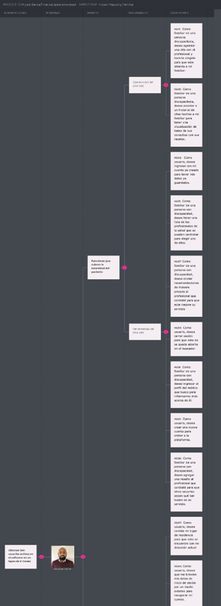

# INTRODUCTION 
## 1.1.	Startup Profile
 A continuación, procederemos a informar sobre a lo que se dedica nuestra empresa “MEDICARE”.

### 1.1.1.	 Descripción de la Startup
En la actualidad existe un número exorbitante de personas que necesitan ayuda para poder mantener o mejorar su calidad de vida. Específicamente en Lima, Perú. Se ha identificado que realizar un buen cuidado de personas discapacitadas, vulnerables o con una enfermedad grave, es una labor demasiado difícil. Asimismo, los familiares de estos individuos son directamente afectados por las condiciones en las que se encuentran, pues su cuidado requiere demasiado tiempo y, del mismo modo, un gran esfuerzo físico. Además, después de la aparición del COVID-19 en el país, las personas se han acostumbrado a tener una solución a sus problemas de forma remota sin tener que salir de casa. 
Por esta razón, hemos decidido crear un startup llamado “MEDICARE”. Somos una empresa emergente con grandes posibilidades de crecimiento. A una primera instancia, no contamos con una gran cantidad de clientes, pero con el transcurso del tiempo estamos enfocados en crecer en el mercado aplicando el potencial de las tecnologías.
Nuestra misión actual es encontrar la forma más viable e innovadora de ayudar a las personas que tienen familiares que padecen de enfermedades graves o limitaciones físicas o de otra índole, apoyándolos en su cuidado diario y facilitando esta tarea. Donde crearemos un software que ofrezca la ayuda de distintos enfermeros o doctores confiables para que realicen una visita médica a la casa del cliente. Al mismo tiempo, nuestra visión es convertirnos en un startup líder en el desarrollo de soluciones con la ventaja competitiva de emplear la tecnología para que ayuden a resolver distintas problemáticas médicas en el Perú.

## 1.2.	Solution Profile
 En este punto del informe, pasaremos a la explicación detallada de nuestro producto software, tanto su factor innovador y la forma en la cual será monetizada.

**Product Name**
 Se decidió llamar a nuestro producto “MEDICARE”, ya que, en el lenguaje inglés, ‘Medi’ es una abreviación de médico y ‘Care’, cuidado; por lo que el nombre completo se traduce como “Atención Medica”. Del mismo modo, se eligió este idioma porque, además de generar más atractivo hacia el público, es el idioma más hablado del mundo, lo cual vuelve más comercial a nuestra aplicación.

**Product Description**
 Este software es innovador ya que ofreceremos la posibilidad de contratar profesionales de salud que se encarguen de cuidar a personas con limitaciones físicas o de otra índole. En esta aplicación, los contratantes podrán visualizar una larga lista de personal de salud altamente calificado. Asimismo, se presentarán las referencias de pacientes o contratantes anteriores junto con la tarifa estándar de consulta y diferentes paquetes que se adecuen al área médica correspondiente a cada profesional. Con el registro del usuario y la elección del médico o enfermero se podrá dar seguimiento continuo al beneficiario, el cual será similar a un historial médico virtual que se adecue a la frecuencia de visita elegida por el contratante. 

**Monetization**
 Nuestro servicio podrá ser adquirido de manera gratuita. Sin embargo, los profesionales de la salud registrados tendrán una retención entre el 5% y 10% de sus ingresos mensuales por conceptos de captación de pacientes a través de nuestra plataforma. 
### 1.2.1.	Antecedentes y problemática del producto 
**Descripción de la problemática**
 Este software se enfoca en el sector de salud, ya que se ha evidenciado que hay leve incremento en pacientes insatisfechos con las citas brindadas por las clínicas.  Es por esta razón que “MediCare” busca cubrir las necesidades de la comunicación, seguridad y eficacia a la mayor cantidad de personas posibles en su domicilio.

**Objetivos**
 Este software tiene el principal objetivo de cubrir las necesidades básicas de atención médica a domicilio de las personas con limitaciones físicas o mentales que no puedan acudir a un centro médico. Por otro lado, lograr ser una empresa reconocida y contar con un producto sostenible económicamente es un objetivo general de MediCare. 

**Restricciones**
 Una principal restricción que delimita el alcance del proyecto es que el equipo desarrollador es nuevo en estas tendencias o técnicas a aplicar para lanzar nuestra aplicación. Por ello, es que puede ser una restricción de alcanzar el mejor escenario. Sin embargo, el equipo pondrá de su parte para lograr alcanzar el nivel deseable de cada entregable. 

**Antecedentes**
 Como se mencionó anteriormente, nuestro producto software “MediCare.” tiene la capacidad de contratar profesionales de salud que se encarguen de cuidar a personas con limitaciones físicas o de otra índole y además dar seguimiento continuo al beneficiario, el cual será similar a un historial médico virtual que se adecue a la frecuencia de visita elegida por el contratante. Es por ello por lo que, teniendo en cuenta el funcionamiento de nuestro producto, realizamos la búsqueda de posibles competidores, obteniendo como resultado dos productos software:
*	MedicApp:
    *	 Es una aplicación en la cual una persona puede agendar por medio de llamada o WhatsApp, una cita a domicilio de Médico o Enfermero. Cuenta con un horario limitado de lunes a sábados de 8 am a 8 pm. Asimismo, ofrece tele consultas y pruebas de descarte de la COVID-19. Cuenta con una alianza con una institución dedicada al transporte de pacientes con situaciones graves, ambulancias.Sin embargo, la principal diferencia que separa a MediCare.  de MedicApp es que, en nuestra aplicación, es posible contactar con un doctor específico que le brinde confianza al usuario. Por otro lado, en la aplicación MedicApp, los doctores son brindados según la disponibilidad que tiene la aplicación y el usuario no interactúa de manera constante en el proceso de selección. Asimismo, no mantienen, en la aplicación, un registro virtual de todas las citas que ha tenido el paciente ni de las recomendaciones brindadas. 
*	MediQuo:
    *  Es una aplicación donde se puede realizar consultas, gestionar citas mediante el chat que está disponible en su web, además que tiene seguimiento registrado en la aplicación móvil. Sin embargo, una de las diferencias que existe entre MediCare  y MediQuo es que, mientras en MediQuo solo se hacen consultas digitales, en MediCare se tiene contacto directo. Además, al contrario que la aplicación MediQuo, MediCare puede generar un historial médico virtual que varía dependiendo de cada contratante.

**Herramienta 5W y 2H**
* What - ¿Cuál es el problema?
    *  El problema identificado es la cantidad exorbitante de personas de edad avanzada y/o que sufren de limitaciones físicas o de otra índole. Es decir, que no pueden mantener un cuidado autónomo y requieren de la asistencia de otro individuo para mantener una salud estable.
* When - ¿Cuándo sucede el problema?
    *  Cuando es necesaria la supervisión o tratamiento de un médico para individuos con capacidades limitadas, o simplemente cuando se requiere de personas extras para el cuidado de los pacientes y los familiares que carecen de tiempo o son incapaces de atenderlos sin ayuda.

* Where - ¿Dónde surge el problema?
    *  El problema surge en los distintos hogares de la capital, pues día a día las personas deben salir a ejercer sus obligaciones laborales y no cuentan con el tiempo suficiente y la ayuda necesaria para mantener la calidad de vida y cuidado de sus familiares con limitaciones físicas o mentales.
* Who - ¿Quiénes son afectados por el problema?
    *  Los principales afectados son las personas de la tercera edad y aquellas que presentan enfermedades que precisan de atención inmediata.
* Why - ¿Cuál es la causa del problema?
    *  La causa del problema es principalmente la falta de tiempo por parte de los familiares de personas de edad avanzada y/o con discapacidades físicas o de otra índole para cuidarlos y mantenerlos con un estado de salud estable.
* How - ¿Cómo se llevan a cabo los hechos?
    *  Cuando una familia cuenta con un integrante que requiere de supervisión constante, los demás miembros tienen que brindar gran parte de su tiempo para su cuidado. Además, el encontrar personas de confianza y que estén capacitadas para la atención del individuo es complicado, lo cual solo genera que la situación sea más difícil, y esto empeora si el paciente requiere de uso de medicina. Por eso, es necesaria una forma fácil y sencilla de contactar con la ayuda necesaria para la atención de los familiares vulnerables.
* How much - ¿Cuál es la magnitud del problema?
    *  Según el INEI (2018), se recopiló a nivel de Lima metropolitana que el 84,9% de los adultos mayores femeninas y 67,3% de los adultos mayores masculinos presentan enfermedades crónicas como artritis, hipertensión, diabetes, etc. De esta manera, se identifica que existe un gran porcentaje de adultos mayores con necesidad de un cuidado médico. Cabe resaltar que en el presente informe del INEI (2018), se menciona que esta población mayor de 60 años con limitaciones o discapacidades físicas o mentales, no asistieron a un establecimiento para atenderse (72,7%) y un poco más de la cuarta parte (25,6%) no acudió a un establecimiento de salud porque le queda lejos, no le genera confianza o se demoran en la atención. Así, se identifica que hay una necesidad de atención médica a domicilio, pues es el lugar donde estas personas se sienten más cómodos y seguros.

### 1.2.2.	Lean UX Process 
#### 1.2.2.1.	Lean UX Problem Statement
**Problem Statement** 

 Con respecto a la atención médica en centros médicos públicos y privados, se evidencia el incremento de insatisfacción por el servicio brindado para los pacientes, ya sea por la mala atención, complicaciones para generar citas, incomodidad en las instalaciones y/o complicaciones de movilidad para desplazar al paciente a estos centros médicos.
 Hemos identificado una problemática en este proceso, los pacientes y sus familiares optan por no acudir a los centros de salud, pues el tiempo y el esfuerzo que les genera es mayor al tiempo que dura su consulta. En consecuencia, los profesionales de la salud se vieron obligados a recurrir a las teles consultas para registrar la condición del paciente. Sin embargo, no todos emplean este medio de atención porque no se ofrece un chequeo inmersivo. De esta manera, el número de pacientes ha disminuido y personas mayores con alguna discapacidad prefieren mantener el cuidado en casa con el apoyo de algún familiar.
 ¿Cómo podemos hacer que los pacientes reciban una atención íntegra, eficaz y beneficiosa para su salud en un ambiente en el que se sienta cómodo, como su domicilio sin la necesidad de realizar un gran traslado que tome demasiado tiempo y así los médicos tengan una mayor cantidad de pacientes y no vean perjudicados sus ingresos económicos?

#### 1.2.2.2.	Lean UX Assumptions

**Business Outcomes**
*  Generar una plataforma intuitiva, eficaz y óptima que genere ingresos a partir de la contratación de profesionales de la salud dispuestos a brindar sus servicios al domicilio de nuestros usuarios con limitaciones físicas o mentales.
*  Establecer nuestra posición en el mercado, a través de resultados efectivos de los pacientes que generará confianza en el público objetivo, calidad del servicio de los profesionales de salud y un sistema web sólido como práctico.
*  Producir una rentabilidad económica al servicio de los profesionales de salud, con precios económicos y variables dependiendo de la necesidad del usuario, en el servicio de consultas vía sitio web o por un profesional, y la publicidad de nuestra plataforma con el fin de generar mayores ingresos que costos.
*  Sentar una tasa de retención por determinado periodo, para verificar si nuestros usuarios siguen utilizando nuestro servicio, con campañas de marketing, servicio que cumple sus necesidades con funciones de la plataforma, y si no se cumple, identificar cuáles serían las razones del abandono del servicio.

**Users** 
*  Público adulto mayor o personas con discapacidades físicas o mentales y sus familiares.
*  Profesionales de la Salud.

**User Outcomes** 
*  Identificar el proceso de mejora de la limitación física o mental del familiar, e implementarlo a través de la atención adecuada por un profesional de la salud.
*  Generar confianza por el desarrollo constante de la salud del paciente, para que el familiar pueda tener seguridad en dejar cargo al profesional y concentrarse en sus demás actividades.
*  Solventar las dudas del familiar acerca de cómo se puede dar una mejora de la salud del paciente a través de las consultas médicas que dispone la plataforma.
*  Producir una mejora de la condición económica del profesional a través de propuestas de establecer su sector de pacientes con el tipo de especialidad que tenga, con paga en acuerdo mutuo, y una propuesta de proyección del trabajo en la que esté incluido(a).

**Features**
*  Información del paciente y registro de su condición actual para que el profesional de la salud pueda identificar el mejor tratamiento.
*  Sección para visualizar a los profesionales de la salud con sus reseñas y sus precios definidos por los conceptos de atención a domicilio.
*  Plan de atención por parte del médico.

 **1. Creo que mis usuarios necesitan**, empezando por los pacientes, recibir rápidamente una atención médica a su domicilio y tener la información de sus resultados al alcance de sus manos. Por otro lado, los profesionales de la salud necesitan realizar una revisión médica más íntegra e inmersiva para los pacientes que son atendidos desde su domicilio.

 **2. Estas necesidades se pueden resolver con** una plataforma que permita contactar a un profesional de la salud para que realice los análisis necesarios y publique los resultados en nuestra plataforma de manera rápida y eficaz. Por otro lado, que le permita al profesional a cargo acceder a la información del historial clínico, actualizado por un profesional anterior, del paciente.

 **3. Mis clientes iniciales son (o serán)** los pacientes que desean o necesitan ser atendidos por un profesional de la salud y presentan alguna dificultad de movimiento y, los profesionales de la salud que trabajan en el servicio a domicilio.

 **4. El valor #1 que un cliente quiere de mi** servicio es, empezando por los pacientes, recibir atención médica de un profesional de la salud a su domicilio de manera cómoda, rápida y personalizada. Por otro lado, los profesionales de la salud desean mejorar la calidad de atención/servicio que se le puede ofrecer a un paciente que no cuenta con la facilidad de transportarse a un centro de salud.

 **5. El usuario también puede obtener beneficios adicionales**, empezando por los pacientes, como la visualización del avance en su tratamiento, los resultados de sus análisis y las recomendaciones del profesional de salud. Asimismo, los profesionales de la salud podrán colocar su propia tarifa de pago, generar su horario médico virtual y que su servicio pueda ser calificado y recomendado por los usuarios. 

 **6. Voy a adquirir la mayoría** de mis clientes a través de marketing en los medios de comunicación más frecuentados como Facebook, Instagram o entre otros; con la publicación de casos de éxito con los pacientes que utilizan nuestra plataforma. Asimismo, demostrando las funcionalidades médicas y de apoyo para el profesional de la salud.

 **7. Vamos a subvencionar el app a través de** la retención del 5% - 10% de los ingresos mensuales de los profesionales de la salud inscritos en nuestra plataforma por conceptos de captación de pacientes y publicidad de nuestros auspiciadores.

 **8. Mi competencia principal en el mercado serán** las aplicaciones que brindan funciones similares al público objetivo o programas propios de un centro de salud. 

 **9. Los venceremos debido a** la diferenciación de nuestros beneficios para los pacientes, como seguimiento de los análisis, contacto casi inmediato con un profesional de la salud y visualización de las recomendaciones de este mismo. Asimismo, del lado de los profesionales de la salud, por la personalización de nuestras funcionalidades como registrar una tarifa propia, registrar/consultar el cuadro clínico de un paciente para acceder rápidamente a la información, recibir valoraciones de los usuarios para retroalimentarse y/u obtener más citas médicas.

 **10. Mi mayor riesgo de producto son** las fallas en el sistema de la plataforma, ya que los bugs o huecos de información impedirían al paciente revisar su progreso/tratamiento y, al profesional de la salud, realizar su servicio de manera efectiva.

 **11. Resolveremos esto a través de** una inversión constante en nuestra plataforma: formar un equipo profesional dedicado al mantenimiento de la plataforma y la solución de sus posibles fallos a través de las actualizaciones.

1.  **¿Quién es el usuario?**
 Nuestros usuarios son aquellas personas que tienen algún impedimento para movilizarse y necesitan atención médica profesional, o familiares preocupados por ellos. Asimismo, también lo son los profesionales de la salud que brindan atención médica a domicilio. 

2.  **¿Dónde encaja nuestro producto en su trabajo o vida?** 
 En el caso de los pacientes, en los días que necesiten tratar alguna enfermedad, seguir una terapia o simplemente un monitoreo de rutina. En el caso de los profesionales de la salud, encaja dentro de su ámbito laboral, específicamente durante el proceso de registro de pacientes, consulta médica y prescripción del tratamiento a seguir.

3.  **¿Cómo y cuándo es usado nuestro producto?**
 Para los pacientes, será usado a través de una aplicación o sitio web como un apoyo de interconexión médico-paciente, con la previa inscripción a nuestra plataforma, cuando el usuario requiera de un análisis a su estado de salud actual o quiera darle seguimiento a su tratamiento. Para los profesionales de la salud, será usado como una plataforma de apoyo para la recopilación de información médica relevante del paciente, cuando la cita agendada se realice de forma a domicilio.

4.  **¿Qué problema tendría nuestro producto y cómo se pueden resolver?**
 Nuestro producto está desarrollado en plataformas digitales, por lo que, al ser personas de tercera edad la mayoría de los pacientes, se pueden generar complicaciones al momento de entender el correcto funcionamiento de ella. Asimismo, al ser desarrollado también para un entorno sanitario puede carecer de las especificaciones reglamentarias necesarias para su uso, en otras palabras, las acciones realizadas por un profesional de la salud deben seguir un orden y proceso adecuado permitido por la ley, si no se cumple con ello nuestra plataforma sería inoperable. Sin embargo, esto se puede resolver con profesionales de diseño que hagan más intuitiva nuestra plataforma, así como también con profesionales especializados en el ámbito legal y la asesoría de los profesionales de la salud para la implementación de las funcionalidades adecuadas.

5.  **¿Qué características son importantes?**
 Debe ser intuitiva, las opciones que tendrá la plataforma deben ser específicas y prácticas para que el usuario no tenga complicaciones en su uso. A su vez, el tiempo de respuesta en cuanto a la atención al cliente u recomendaciones para su tratamiento deben ser atendidas con prontitud. Asimismo, la organización y distribución de las funcionalidades deben estar avaladas por la ley. Finalmente, la seguridad también será un factor importante porque estaremos trabajando con información confidencial del paciente.

6.  **¿Cómo debe verse nuestro servicio y cómo debe comportarse?** 
 Nuestro producto debe verse práctico, moderno y con contrastes de colores suaves; todo esto con la finalidad de hacer más satisfactoria la experiencia de usuario. Asimismo, debe comportarse como una interfaz fluida y con un manejo eficaz de la información.

#### 1.2.2.3.	Lean UX Hypothesis Statements
**1st Hypothesis Statement**

 **Creemos que** el uso de nuestra plataforma facilitará la comunicación entre el usuario y el profesional de salud; y así desarrollar una interacción práctica.

 **Sabremos que** hemos tenido éxito,

 **Cuando** veamos que el 70% de los usuarios están satisfechos con la prontitud que se contacta a un profesional médico a través de sus reseñas positivas en nuestra plataforma.

 **2nd Hypothesis Statement**

 **Creemos que** publicar los resultados de sus análisis en la plataforma permitirá a los usuarios hacer un seguimiento de su progreso con el tratamiento y su estado de salud actual.

 **Sabremos que** hemos tenido éxito,

 **Cuando** veamos que un 60% de los usuarios mantienen un progreso constante con cada análisis.

**3rd Hypothesis Statement**

 **Creemos que** publicar las recomendaciones del profesional de la salud para el tratamiento de los pacientes ayudará a estos últimos a conseguir mejores resultados en su tratamiento.

 **Sabremos que** hemos tenido éxito,

 **Cuando** veamos que un 50% de nuestros usuarios utilizan las recomendaciones del profesional de la salud y obtengan resultados óptimos.

#### 1.2.2.4.	Lean UX Canvas

 

## 1.3.	Segmento Objetivo

 De acuerdo con el INEI (2020), en el Perú se encuentran más de 3.3 millones de personas con alguna discapacidad, de los cuales el 31.2% están ubicados en la capital del país, lo que convierte a Lima en el departamento con más personas que tienen alguna limitación física o mental en nuestra nación.  Por eso, se escogió a Lima Metropolitana como la provincia en la cual nuestra aplicación comenzará a funcionar. De la misma manera, los adultos mayores son los que forman la mayor parte de este grupo de individuos con alguna discapacidad y, además, ellos necesitan de ayuda de terceros en su día a día, ya que no pueden valerse por sí mismos. Igualmente, el último reporte del INEI también menciona que el 52.2% del sector de personas limitadas se encontraron o se encuentran con la necesidad de acudir a centros de salud, tales como el MINSA, Essalud, entre otros. Esto evidencia que hay un menester de médicos o enfermeros para apoyar al cuidado de personas con discapacidad y no es posible que solo uno de los familiares se encargue de estos, pues en palabras de Pérez (2016), el cuidado informal de personas limitadas genera problemas de salud y alteraciones emocionales en los cuidadores principales y también en los que los rodean. En otras palabras, todos los miembros de una familia son afectados directamente cuando uno de ellos presenta algún tipo de limitación. 
 En el siguiente gráfico se muestra un aproximado del porcentaje de aumento de personas con discapacidad según sexo y edad.

 

 Tal como se puede apreciar en el gráfico, se estima que hasta el 2050 habrá un aumento en el porcentaje de adultos mayores, lo que conlleva a que crezca la demanda de enfermeros o médicos para su supervisión también se elevará en los próximos años. Además, en los mismos datos se evidencia que disminuirá la población de entre 20 a 45 años, lo que implica que los cuidados informales de personas discapacitadas se reducirán de igual manera. Por todo esto, llegamos a la conclusión de que los segmentos objetivos de nuestra aplicación son los siguientes.
*  Personas mayores que requieran supervisión o Personas discapacitadas o con alguna otra dificultad para movilizarse

 

 

*  Profesionales de la salud

  

# 2.	REQUIREMENTS ELICITATION & ANALYSIS
## 2.1.	Competidores.
### 2.1.1.	Análisis Competitivo.

<table>
<thead>
  <tr>
    <th colspan="7">Competitive Analysis Landscape</th>
  </tr>
</thead>
<tbody>
  <tr>
    <td colspan="3" rowspan="2">¿Por qué llevar a cabo este análisis? </td>
    <td colspan="4">¿Cómo identificar a nuestros principales competidores?</td>
  </tr>
  <tr>
    <td colspan="4">Con este análisis, podemos identificar el FODA,   es decir, las fortalezas, oportunidades, debilidades y amenazas de nuestros   competidores. Asimismo, se evalúa su participación en el mercado y qué   estrategias se pueden desarrollar para que nuestra aplicación surja en el   mercado laboral. Pero ¿Cómo identificamos a nuestros principales   competidores?, Debemos estudiar el mercado e identificar las aplicaciones más   usadas por los contratantes del servicio de los profesionales de la salud.   Así se concluyó que los principales competidores son:</td>
  </tr>
  <tr>
    <td colspan="2" rowspan="5">(En la cabecera colocar por cada competidor nombre y logo)</td>
    <td colspan="2" rowspan="5">MediCare
 
</td>
    <td rowspan="5">MedicApp
 

</td>
    <td rowspan="5">MediQuo
 

</td>
    <td rowspan="5">Heal
 

</td>
  </tr>
  <tr>
  </tr>
  <tr>
  </tr>
  <tr>
  </tr>
  <tr>
  </tr>
  <tr>
    <td rowspan="10">P E R F I L</td>
    <td rowspan="5">Overview</td>
    <td colspan="2" rowspan="5">Ofrecer una lista de profesionales de la salud por medio de una aplicación que integra a doctores, enfermeros o fisioterapeutas que acuden a los domicilios de sus pacientes para realizar un chequeo continuo a su salud, registrando sus avances médicos en la base de datos de la aplicación para que los familiares a cargo del adulto mayor o persona con discapacidad física o mental, pueda visualizar el seguimiento del paciente, desde cualquier lugar de Lima, Perú.</td>
    <td rowspan="5">Ofrecer consultas médicas a domicilio u online para aquellas personas que se contacten con ellos por medio de llamada, correo o por medio de su página web. Se encargan de brindar apoyo a los pacientes por medio de un diagnóstico que se almacena en su sistema, el cual solo puede visualizar el doctor. Asimismo, ofrece servicios de traslado de su domicilio a un hospital o clínica.</td>
    <td rowspan="5">Ofrece un chat de atención médica a las personas que se contacten con ellos por medio de su aplicación y de su página web. En este chat, se resuelven dudas sobre dolencias, malestares y dan un breve diagnóstico ante la situación que el paciente relata. Es una tele consulta escrita con un profesional de la salud aleatorio.</td>
    <td rowspan="5">Ofrece atención primaria a personas que requieran el servicio de un profesional de la salud específicamente en el lugar donde se sientan más cómodos. Es una aplicación conectada con Medicare que es la aplicación de salud del Gobierno de los Estados Unidos y permite acceder a médicos o enfermeros practicantes o graduados certificados. Estableciendo una relación solida entre el paciente y el proveedor para aumentar el nivel de confianza.</td>
  </tr>
  <tr>
  </tr>
  <tr>
  </tr>
  <tr>
  </tr>
  <tr>
  </tr>
  <tr>
    <td rowspan="5">Ventaja   competitiva  ¿Qué valor   ofrece a los   clientes? </td>
    <td colspan="2" rowspan="5">Formalidad y ofrecer una cartera de profesionales de la salud con reseñas de los pacientes anteriores y su tarifa estándar por consulta y/o visita al domicilio del paciente. Asimismo, un registro actualizado de las citas que el paciente ha tenido en el pasado.</td>
    <td rowspan="5">Cuenta con profesionales de la salud con experiencia laboral en instituciones médicas públicas y privadas. Asimismo, cuenta con un laboratorio</td>
    <td rowspan="5">Respuesta inmediata a la consulta médica que el paciente tenga que efectuar.</td>
    <td rowspan="5">Vínculo con Medicare y los planes selectos en esa plataforma federal que permite brindar seguridad y confianza a los posibles contratantes. Su participación en el mercado aumenta constantemente en USA. Con posibles expansiones a México y Sudamérica.</td>
  </tr>
  <tr>
  </tr>
  <tr>
  </tr>
  <tr>
  </tr>
  <tr>
  </tr>
  <tr>
    <td rowspan="21">P E R F I L       D E       M A R K E T I N G</td>
    <td rowspan="18">Mercado objetivo</td>
    <td colspan="2" rowspan="18">Personas que tengan un familiar adulto mayor o con alguna limitación física o mental y que no cuenten con el tiempo necesario para encargarse del cuidado de su familiar y que requiera de tratamiento y de un control remoto de la salud.</td>
    <td rowspan="18">Personas que requieran el apoyo de un profesional para un diagnóstico rápido y seguro.</td>
    <td rowspan="18">Personas con dudas o consultas médicas donde no sea necesario la revisión presencial del paciente.</td>
    <td rowspan="18">Personas mayores en todas las etapas de su proceso de salud, y aquellas que precisen de algún tratamiento.</td>
  </tr>
  <tr>
  </tr>
  <tr>
  </tr>
  <tr>
  </tr>
  <tr>
  </tr>
  <tr>
  </tr>
  <tr>
  </tr>
  <tr>
  </tr>
  <tr>
  </tr>
  <tr>
  </tr>
  <tr>
  </tr>
  <tr>
  </tr>
  <tr>
  </tr>
  <tr>
  </tr>
  <tr>
  </tr>
  <tr>
  </tr>
  <tr>
  </tr>
  <tr>
  </tr>
  <tr>
    <td rowspan="3">Estrategias de marketing</td>
    <td colspan="2" rowspan="3">Hacer uso de publicidad para así obtener un mayor número de usuarios.  Publicidad en Redes Sociales como Facebook, Instagram y Twitter. Pop-ups, banners y anuncios en sitios web pero que no sean intrusivos. Google anuncios. </td>
    <td rowspan="3">Hacer uso de publicidad para así obtener un mayor número de usuarios. Anuncios intrusivos no relacionados al ámbito laboral.</td>
    <td rowspan="3">Hacer uso de publicidad para así obtener un mayor número de usuarios. Posicionamiento en buscadores.</td>
    <td rowspan="3">Hacer uso de publicidad para así obtener un mayor número de usuarios. Posicionamiento en Buscadores. Aparición en medios de comunicación como podcasts, programas televisivos y redes sociales. </td>
  </tr>
  <tr>
  </tr>
  <tr>
  </tr>
  <tr>
    <td rowspan="25">P E R F I L  D E  P R O D U C T O</td>
    <td rowspan="15">Productos &amp;   Servicios </td>
    <td colspan="2" rowspan="15">Servicio de búsqueda de un profesional de la salud.  Servicio de seguimiento continuo, íntegro y seguro al paciente desde su domicilio. Servicio de almacenamiento de la información en un historial médico virtual con acceso desde la aplicación. </td>
    <td rowspan="15">Servicio de médicos a domicilio para un chequeo integral.</td>
    <td rowspan="15">Servicio de preguntas y respuestas de manera inmediata para cualquier disyuntiva médica por medio de su aplicación. Servicio de grupos focalizados relacionados a temas de salud. </td>
    <td rowspan="15">Servicio de médicos, enfermeros o practicantes médicos certificados a domicilio. Servicio de exámenes físicos mensuales y anuales. Servicio de vacunación integrado. </td>
  </tr>
  <tr>
  </tr>
  <tr>
  </tr>
  <tr>
  </tr>
  <tr>
  </tr>
  <tr>
  </tr>
  <tr>
  </tr>
  <tr>
  </tr>
  <tr>
  </tr>
  <tr>
  </tr>
  <tr>
  </tr>
  <tr>
  </tr>
  <tr>
  </tr>
  <tr>
  </tr>
  <tr>
  </tr>
  <tr>
    <td rowspan="7">Precios y Costos</td>
    <td colspan="2" rowspan="7">Paciente: Descarga: Gratuito Contratación: Depende de tarifa del profesional.  Profesional: Retención entre el 5% y 10% de sus ingresos mensuales por concepto de consultas médicas. </td>
    <td rowspan="7">Paciente:  Descarga: Gratuito Contratación: tarifa estándar, no mencionada.  Profesional: No menciona</td>
    <td rowspan="7">Paciente: Descarga: Gratuito Atención: Gratuito   Profesional: 10 – 30 dólares por consulta</td>
    <td rowspan="7">Paciente:  Descarga: Gratuito Contratación: Depende de tarifa del profesional y de lugar de residencia.  Profesional: No menciona</td>
  </tr>
  <tr>
  </tr>
  <tr>
  </tr>
  <tr>
  </tr>
  <tr>
  </tr>
  <tr>
  </tr>
  <tr>
  </tr>
  <tr>
    <td rowspan="3">Canales de   distribución   (Web y/o Móvil) </td>
    <td colspan="2" rowspan="3">Web y Móvil</td>
    <td rowspan="3">Web y Móvil</td>
    <td rowspan="3">Web y Móvil</td>
    <td rowspan="3">Web y móvil</td>
  </tr>
  <tr>
  </tr>
  <tr>
  </tr>
  <tr>
    <td rowspan="21">A N Á L I S I S  S W O T</td>
    <td colspan="6" rowspan="10">Realice esto para su startup y sus competidores. Sus fortalezas deberían apoyar sus oportunidades y contribuir a lo que ustedes definen como su posible ventaja competitiva.</td>
  </tr>
  <tr>
  </tr>
  <tr>
  </tr>
  <tr>
  </tr>
  <tr>
  </tr>
  <tr>
  </tr>
  <tr>
  </tr>
  <tr>
  </tr>
  <tr>
  </tr>
  <tr>
  </tr>
  <tr>
    <td rowspan="5">Fortalezas</td>
    <td colspan="2" rowspan="5">- Confianza. -Reseñas y elección del contratante. -Rápida respuesta. -Atención las 24 horas. -Asociación con farmacias para la compra y envío de medicamentos             </td>
    <td rowspan="5">-Gran participación en el mercado</td>
    <td rowspan="5">-Atención efectiva y al instante.</td>
    <td rowspan="5">-Gran participación en el mercado y con aumento constante -Vínculo con Medicare</td>
  </tr>
  <tr>
  </tr>
  <tr>
  </tr>
  <tr>
  </tr>
  <tr>
  </tr>
  <tr>
    <td rowspan="2">Debilidades</td>
    <td colspan="2" rowspan="2">Nuevo en el mercado de aplicaciones de búsqueda de profesionales de la salud.</td>
    <td rowspan="2">Horario de atención establecido de 8 am a 8 pm. El contratante no selecciona el profesional.</td>
    <td rowspan="2">Su idea de negocio puede ser fácilmente imitada, pues es solo un chat de respuesta inmediata.</td>
    <td rowspan="2">-Horario de atención de 8:00 am a 6:00 pm -Sistema de atención y reserva de citas deficiente e irregular.</td>
  </tr>
  <tr>
  </tr>
  <tr>
    <td rowspan="3">Oportunidades</td>
    <td colspan="2" rowspan="3">Tomar las funcionalidades deficientes de los aplicativos existentes e implementarlo para su beneficio. Mercado actual en crecimiento. </td>
    <td rowspan="3">Aumento de público en interacción con aplicaciones relacionadas al tema de salud por la coyuntura actual y nuevos convenios con instituciones médicas privadas.</td>
    <td rowspan="3">Aumento de la tele consultas y de los medios de comunicación tecnológicos integrados con sistemas de chat.</td>
    <td rowspan="3">Ampliar su zona de atención a nivel nacional en los Estados Unidos.  Expansión de su atención a México y América del Sur.</td>
  </tr>
  <tr>
  </tr>
  <tr>
  </tr>
  <tr>
    <td>Amenazas</td>
    <td colspan="2">Mucha Competencia</td>
    <td>Software e interfaz de interacción desactualizados.</td>
    <td>Falta de actualización de la máquina virtual integrada para respuestas aleatorias ante problemas de salud comunes.</td>
    <td>Sistema de atención, reserva de citas y facturación con deficiencias que perjudican su imagen con los contratantes.</td>
  </tr>
</tbody>
</table>

### 2.1.2.	Estrategias y tácticas frente a competidores.

1.	Aplicaremos una estrategia de supervisión de los indicadores de desempeño para evaluar el porcentaje de éxito en cada contratación del profesional de salud para medir las métricas de rendimiento de nuestra aplicación y sugerir cambios para el beneficio del usuario.
2.	La segunda estrategia es desarrollar un ataque en cadena, como estamos inmersos en un ámbito tecnológico, no puedes atacar directamente al competidor más potente, pues cuenta con más medios que nosotros y podría ser contraproducente. Entonces debemos ir obteniendo mayor participación en el mercado atacando los mercados más pequeños y posicionándonos directamente en ellos.
3.	La tercera estrategia por desarrollar es la maniobra envolvente, nosotros debemos evidenciar las debilidades de cada competidor y tomarlas en cuenta para mejorar nuestro producto.
4.  Finalmente, emplearemos la estrategia competitiva de diferenciación, consta en ofrecer un producto diferente con una interfaz única y con mejoras totalmente pensadas en la satisfacción del usuario.

## 2.2.	Entrevistas.

En este punto presentaremos los resultados de las entrevistas realizadas a los usuarios objetivos.

### 2.2.1.	Diseño de entrevistas.

En esta sección, mostraremos las preguntas que hemos generado para realizar las entrevistas a los dos tipos de usuarios objetivos. Cabe destacar, que las preguntas realizadas son de tipo abierto, con el objetivo de recolectar información relevante que nos ayude a tener una idea más precisa de cómo solucionar problemas de nuestros usuarios objetivos.

**Preguntas principales y complementarias para la entrevista**

**1.	Personas con dificultad para movilizarse o sus familiares:**

**a.	Preguntas principales:**
*	¿Cuáles son los principales motivos por el cual usted contrataría el servicio de un profesional de la salud a domicilio?
*   ¿Cuál es la mayor dificultad que ha identificado en el tiempo que lleva cuidando a su familiar?
*	¿Cuáles son las dificultades que ha encontrado en el servicio de clínica en la atención a su familiar?
*	¿Confiaría usted en una aplicación que le ayude a obtener un profesional de la salud calificado para cuidar a su familiar?
*	¿Cuáles serían los factores que determinan su confianza en un sistema web de atención a domicilio?
*	¿Qué tan importante es para usted tener el control de elegir (personalizar) a su profesional de la salud?
*	¿Considera una ventaja tener un registro actualizado de cada análisis que se le realiza a su familiar con limitación para un monitoreo más íntegro?
*	¿Considera que su trabajo u otras áreas de su vida se ven afectadas por el tiempo que debe dedicar a cuidar a su familiar?

**b.	Preguntas complementarias:**
*	¿Cuántos años tiene?
*	¿En qué distrito reside?
*   ¿Cuál es su estado civil?
*	¿Cuál es su ocupación?
*	Mencione algunas de sus habilidades, por favor.
*	¿Cuáles son sus dispositivos de preferencia?
*	¿Cuáles son sus principales frustraciones?
*	¿Cuánto tiempo le toma el cuidado de su familiar discapacitado diariamente?
*	¿Su familiar requiere de algún medicamento o tratamiento? y si así fuera ¿Quién es el responsable de administrar su medicina?

**2.	Personal de la salud:**

**a.	Preguntas principales:**
*	¿Cuál es el factor principal por el cual los adultos mayores optan por no acudir a los centros médicos?
*	¿Cuánta experiencia tiene usted como cuidador de personas mayores y/o personas con limitaciones físicas o mentales?
*	¿Con cuánta frecuencia atiende a personas con alguna discapacidad física, mental o de otra índole?
*	¿Cuál es el problema más frecuente que se da cuando familiares no capacitados se encargan de administrar el tratamiento médico de algún paciente con limitaciones físicas, mentales o con presencia de enfermedades crónicas?
*	¿Cuáles son las diferencias de ser un médico de casa a uno de clínica?
*	¿Qué características/opciones le gustaría que tuviera nuestra plataforma?
*	¿Qué opina acerca de que usted pueda colocar su propia tarifa de servicio?
*	¿Considera una ventaja para usted que en una plataforma se le pueda valorar su servicio a través de reseñas o puntuaciones?
*	¿Cuál sería el porcentaje apropiado que estaría dispuesto a descontar de sus ingresos mensuales por conceptos de captación de pacientes a través de una aplicación?

**b.	Preguntas complementarias:**
*	¿Cuántos años tiene?
*	¿En qué distrito reside?
*	¿Cuál es su estado civil?
*	¿Cuál es su ocupación?
*	¿Cuáles son sus dispositivos de preferencia?
*	¿Cuáles son sus principales frustraciones?
*	¿Cómo reacciona ante situaciones de gran estrés o cómo maneja eficazmente el estrés personal en su trabajo como profesional de la salud?
*	¿Cómo le han ayudado sus habilidades de escucha a entender y diagnosticar correctamente las necesidades de sus pacientes?

**Respuestas a las preguntas complementarias por cada entrevistado:**
1.	**Segmento 1: Personas con dificultad para movilizarse o sus familiares**

**a.	Entrevistado 1 – Alexis Frogoziolo:**
*	Edad: 25 años
*	Residencia: Comas
*	Estado Civil: Soltero
*	Ocupación: Estudiante
*	Dispositivos de preferencia: Celular y Laptop
*	Habilidades: Buen manejo de situaciones difíciles.
*	Frustraciones: No tener a nadie que supervise a su familiar.

**b.	Entrevistado 1 – Nicolas Haro:**
*	Edad: 22 años
*	Residencia: Surco
*	Estado Civil: Soltero
*	Ocupación: Estudiante
*	Dispositivos de preferencia: Celular y Laptop
*	Habilidades: Buen manejo de situaciones difíciles.
*	Frustraciones: Ninguno.

2.	**Segmento 2: Profesionales de la salud**

**a.   Entrevistado 2 – Nicoll Abarca:**
*	Edad: 26 años
*	Residencia: Miraflores
*	Estado civil: Soltera
*	Ocupación: Fisioterapeuta
*	Dispositivos de preferencia: Laptop.
*	Habilidades: Manejo adecuado de estrés, angustia en las situaciones.
*	Frustraciones: Ninguna.

**b.  Entrevistado 2 – Julio Cesías:**
*	Edad: 50 años.
*	Residencia: San Miguel
*	Estado civil: Conviviente
*	Ocupación: Médico Oftalmólogo
*	Dispositivos de preferencia: Laptop, Tablet.
*	Habilidades: Paciencia.
*	Frustraciones: Ninguno.

**c.  Entrevistado 3 – Zaira Salazar:**
*	Edad: 51 años.
*	Residencia: Lima
*	Estado civil: Casada
*	Ocupación: Enfermera Hospital del Niño
*	Dispositivos de preferencia: Celular.
*	Habilidades: Paciencia.
*	Frustraciones: Ninguno.

### 2.2.2.	Registro de entrevistas.
**Segmento 1: Personas con dificultad para movilizarse o sus familiares**
1.	Entrevistado 1:
      *	Nombres y Apellidos: Alexis Frogoziolo Lujan.
      * Edad: 25 años
      *	Distrito: Comas
      *	Evidencia de la reunión:
      * 
      *	URL de stream: https://web.microsoftstream.com/video/5c81c331-6307-4c7a-a2e5-148e2ff388d7
      *	Timing y duración: 0:00 – 4:43
      *	Resumen sobre la entrevista:
      
      La entrevista fue realizada a Alexis Frogoziolo Lujan, tiene 25 años y reside en Comas. Es un estudiante universitario, soltero y sus dispositivos de preferencia son su celular y su laptop. Sus principales canales digitales de interacción son WhatsApp e Instagram. Cuenta con habilidades como saber actuar en momentos difíciles. Además, cuenta con ciertas frustraciones como el estrés por el tiempo que cuida a su familiar discapacitado y no poder ayudar en todo a su abuela. Como se mencionó, él es una de las personas que se encargan del cuidado de un familiar con discapacidades, la cual necesita siempre de la compañía de alguien para su supervisión. Por ello, Alexis menciona que la ayuda o atención de un profesional de la salud en su domicilio le facilita el cuidado de su abuela, ya que ella requiere de constante observación y no puede realizar sus labores diarias sin preocuparse por si su familiar sigue con vida. Además, nos comentó que ha habido ciertas dificultades cuando lleva a su familiar a los hospitales, las cuales son como la demora de atención a los pacientes. De igual forma, Alexis asegura que son solo los familiares quienes se encargan de aplicar los medicamentos que son necesarios en el cuidado de su familiar. Por otro lado, con respecto a las plataformas de salud virtuales, él menciona que el principal factor de confianza en un doctor es que este sea verificado con papeles que avalen sus estudios, también piensa que el poder visualizar las recomendaciones, opiniones o experiencias de otros pacientes le sería de gran ayuda. Además, el entrevistado considera fundamental monitorear y controlar los análisis médicos hechos a su familiar.

2. Entrevistado 2:
    *	Nombres y Apellidos: Nicolas Haro
    *	Edad: 22 años
    *	Distrito: Surco
    *	Evidencia de la reunión:
    * 
    *	URL del Stream: https://web.microsoftstream.com/video/fb420e56-41aa-4d79-bca6-7e4f05c4b69e
    *	Timing y duración: 0:00 – 4:49
    *	Resumen sobre la entrevista:

   Esta entrevista fue realizada a Nicolas Haro, el cual tiene 22 años y reside en Surco- Lima. Actualmente soltero y estudiante de la UPC. Su dispositivo de preferencia es el celular. Las habilidades con las que se describe son que aprende muy rápido, se explaya con bastante facilidad y es muy hábil socialmente hablando. Nos cuenta que se siente frustrado por la poca empatía que hay en la sociedad con las personas discapacitadas, dice que en la ciudad de Lima debido al tránsito de personas no se les toma mucha importancia a las personas discapacitadas. En su experiencia con las clínicas, el siente que no se les da mucha importancia, ya que, si bien están en una situación delicada, no es tomada como de riesgo. Con respecto a nuestra aplicación, nos comenta que, debido a su situación, no es muy cómodo andarse moviendo de un lugar a otro como en este caso las clínicas, por ello siente que sería mucho mejor si le asistieran personalmente en su domicilio. Finalmente comenta que el factor que determinaría su confianza en nuestro sistema web es poder ver el trabajo que han realizado o curricular de los trabajadores de nuestra aplicación.

**Segmento 2: Profesionales de la salud**
1. Entrevistado 1:
    *	Nombres y Apellidos:  Nicoll Abarca Cabrera
    *	Edad: 26 años
    *   Distrito: Miraflores
    *	Evidencia de la reunión:
    *   
    *	URL de stream: https://web.microsoftstream.com/video/2b0f8d77-6af1-48d3-87cc-c592eb680c18
    *	Timing y duración: 0:00 – 7:14
    *	Resumen sobre la entrevista:

   La entrevistada Nicoll Abarca Cabrera labora actualmente en la clínica FisioProgres. Reside en el Miraflores, se encuentra soltera y tiene 26 años, sus dispositivos de preferencia son los dispositivos móviles como su celular. Nicoll nos cuenta de que el estrés en su trabajo es muy frecuente por lo que ella hace ejercicio en casa para sobrellevar el estrés del trabajo. La entrevistada nos comenta que una de las razones principales por las cuales los adultos mayores no quieren ir a los centros médicos es debido a que muchos de ellos no quieren ser una carga para sus familias y también por la situación de la pandemia. Además, Ella tiene 3 años de experiencia cuidando a personas con discapacidad física o mental, y adultos mayores, usualmente ella los atiende 3 días a la semana. Según Nicoll, ella piensa que automedicar a un paciente sin una receta médica es muy negligente por parte de los familiares, ya que en algunos casos estos empeoran y algunas hasta llegan a morir por tomar los medicamentos y las dosis inadecuadas. Así también, la entrevistada considera que un médico de casa suele ofrecer atención médica general y preventiva, mientras que un médico de clínica puede tener una especialización y ofrecer servicios más especializados y complejos en un entorno de atención médica más amplio.

2. Entrevistado 2:
    *	Nombres y Apellidos: Julio César Cesías López
    *	Edad: 50 años
    *	Distrito: San Miguel
    *	Evidencia de la reunión:
         
    *	URL de stream: https://web.microsoftstream.com/video/e3af4971-58d3-40e4-b21f-32b7f169c4bb
    *	Duración: 0:00 – 12:14
    *	Resumen sobre la entrevista:

   El entrevistado es el médico oftalmólogo Julio César Cesías López de 50 años, procedente de Lima, San Miguel y actualmente trabaja en Minsa. Sus dispositivos de preferencia son laptop y tablet. Mencionó que tiene mucha experiencia con el cuidado a personas, en este caso cuidados del tipo oftalmológicos a sus pacientes. Nos comenta que la principal razón que logró visualizar a el por qué las personas no asisten a sus citas es, en primer lugar, la distancia desde su hogar al destino y, en segundo lugar, sería su estado económico. Luego mencionó que la gran parte de personas adultas mayores tratan de automedicarse y eso en muchos casos en lugar de solucionar el problema lo empeoran. De igual manera mencionó que le parece muy importante conocer la opinión de sus clientes sobre cómo se sintieron mientras estuvieron en la cita. Finalmente, comentó que si estaría dispuesto por pagar tarifas en sus consultas, solo si la herramienta le proporciona realmente lo necesario y en correcto funcionamiento.

3. Entrevistado 3:
    *	Nombres y Apellidos: Ruth Zaira Salazar
    *	Edad: 51 años
    *	Distrito: Lima
    *	Evidencia de la reunión:
    *   
    *	URL de stream: https://web.microsoftstream.com/video/4e58e484-c56a-4af7-96e9-57bd5605f1db
    *	Duración: 0:00 – 8:23
    *	Resumen sobre la entrevista:

   La entrevistada Ruth Zaira Salazar Elliott labora actualmente en el Hospital del Niño. Reside en Lima, se encuentra casada y tiene 51 años, sus dispositivos de preferencia son los dispositivos móviles. La entrevistada nos cuenta que tiene habilidad del manejo de estrés y angustia en los horarios de trabajo. La señora Ruth comenta que la razón principal por la que los adultos mayores optan por no ir a los centros médicos se debe al tiempo que esto les consume y el costo de estos servicios. Además, sus años de experiencia laboral le han permitido estar familiarizada a conocer más a fondo a sus pacientes, debido a que en todos los días de trabajo tiene que cuidar a pacientes con limitaciones físicas y/o mentales. Según la enfermera Ruth, ella considera que el problema más frecuente cuando los familiares se encargan del cuidado de los pacientes es que estos no están capacitados y no saben cuáles son los cuidados necesarios que se deben realizar, además, que se encuentran desesperados y ansiosos, no tienen técnicas para manejar el estrés, por lo que terminan dando un tratamiento indebido o servir la cantidad incorrecta de dosis en los medicamentos recetados a los pacientes. Así también, la entrevistada considera que la mayor diferencia entre un médico de casa a uno de clínica es que al ser uno de casa, el cuidado que se brindará será exclusivamente al paciente en específico, pudiendo dedicar las 8 horas laborales directamente a este paciente, por lo que le brindarán un cuidado más privilegiado y cuidadoso. En cuanto a la idea de que pueda colocar su propia tarifa por sus servicios médicos, se encuentra de acuerdo. En cuanto a la idea de la posibilidad de dejar una puntuación y reseña del servicio realizado considera que está bien para una plataforma, y en esa misma clase de plataforma la señora Ruth estaría dispuesta a dar un 5% o hasta 10% de sus ganancias mensuales a dicha plataforma que la ayude en la captación de pacientes.

### 2.2.3.	Análisis de entrevistas.

A continuación, se desarrolla una estrategia en conjunto con el equipo para identificar los puntos en común en base a las respuestas de cada entrevistado a cada pregunta. Esto nos ayuda a realizar un análisis más conciso y seguro para desarrollar nuestra aplicación en base a la información recolectada.

**Puntos en común:**

**Segmento 1: Personas con dificultad para movilizarse o sus familiares**

**¿Cuáles son los principales motivos por el cual usted contrataría el servicio de un profesional de la salud a domicilio?**
*	El 100% de los entrevistados concuerdan en que el principal motivo por el cual contratan el servicio de un profesional de la salud a domicilio es para que se ocupen de todas las necesidades médicas de su familiar en la comodidad de su hogar, ya que es muy riesgoso y cansado para ellos el movilizarse.

**¿Cuál es la mayor dificultad que ha identificado en el tiempo que lleva cuidando a su familiar?**
*	El 100% de los entrevistados coinciden en que la mayor dificultad al momento de cuidar de un familiar con limitaciones es la mala atención en los centros de salud, sobre todo en los públicos.

**¿Cuánto tiempo le toma el cuidado de su familiar discapacitado diariamente?**
*	En base a las entrevistas, se deduce que el tiempo que se invierte en el cuidado del familiar varía entre 4 a 12 horas dependiendo de las actividades que se tengan que realizar en el día. Sin embargo, les cuesta realizar sus actividades normales debido al miedo de que sus familiares resulten lastimados cuando estén solos.

**¿Su familiar requiere de algún medicamento o tratamiento? y si así fuera ¿Quién es el responsable de administrar su medicina?**
*	El 50% de los entrevistados indica que sus familiares requieren la administración de medicamento constantemente, la cual es brindada por el familiar que se encuentre en casa.

**¿Cuáles son las dificultades que ha encontrado en el servicio de clínica en la atención a su familiar?**
*	El 50% de los entrevistados afirma que el tiempo de espera es muy lento, lo cual no satisface las necesidades del enfermo.

**¿Cuáles serían los factores que determinan su confianza en un sistema web de atención a domicilio?**
*	El 100% de los entrevistados consideran que la seguridad de los datos, como su curriculum o las opiniones de los pacientes anteriores. es uno de los factores que determinarían su confianza en una plataforma digital.

**¿Qué tan importante es para usted tener el control de elegir (personalizar) a su profesional de la salud?**
*	El 100% de los entrevistados coinciden en que es de suma importancia poder elegir al profesional de la salud que acudirá a su domicilio. Sin embargo, les parece más importante que la aplicación te recomiende los profesionales de salud según los síntomas que presenten.

**¿Considera una ventaja tener un registro actualizado de cada análisis que se le realiza a su familiar con limitación para un monitoreo más íntegro?**
*	El 100% de los entrevistados opina que el registro actualizado de cada análisis que se le realiza a su familiar es de suma importancia, pues permite acceder a la información sobre la condición actual del paciente.

**¿Considera que su trabajo u otras áreas de su vida se ven afectadas por el tiempo que debe dedicar a cuidar a su familiar?**
*	El 100% de los entrevistados afirma que varios aspectos de su vida se ven afectados por esto ya que reduce el tiempo disponible durante el día para realizar sus labores cotidianas.

Análisis General de las entrevistas del Segmento objetivo **Familiares de personas con dificultad para movilizarse o alguna limitación física o mental:**

Haciendo un análisis general de las entrevistas se puede evidenciar lo siguiente. La totalidad de los entrevistados coincide en que la mayor dificultad que se presenta durante el cuidado de algún familiar es la movilidad (100%), lo cual les consume mucho tiempo, por lo que varios aspectos de su vida se ven afectados debido a esto (labores diarias). Asimismo, consideran que es un aspecto muy importante que la aplicación le recomiende el personal médico y llevar un registro de los análisis de su familiar (100%). Sin embargo, para que esto sea viable es necesario que la seguridad de la aplicación sea alta ya que se estaría trabajando con los datos personales de los clientes, al igual que con los datos del personal de médico. Por otro lado, se identificó que, de los entrevistados, 2 eran hombres, y el margen de edades iba desde los 19 hasta los 25 años. Todos ellos vivían en Lima Metropolitana, pero en distintos distritos. La ocupación de cada uno era la misma, ambos eran solteros, los dispositivos que utilizaban son laptop y celular, todos utilizan WhatsApp e Instagram, cada uno posee distintas habilidades y, para terminar, 2 de ellos están frustrados por el deterioro de la salud de sus seres queridos.

**Segmento 2: Profesionales de la salud**

**¿Cuál es el factor principal por el cual los adultos mayores optan por no acudir a los centros médicos?**
*	Un 100% de los entrevistados menciona que la razón principal es debido al tiempo y costo que este les ocasiona al tener que viajar cada vez que necesitan de atención médica.

**¿Cuánta experiencia tiene usted como cuidador de personas mayores y/o personas con limitaciones físicas o mentales?**
*	El 100% de los entrevistados tiene mucha experiencia médica sobre el cuidado de personas con limitaciones físicas y/o mentales.

**¿Con cuánta frecuencia atiende a personas con alguna discapacidad física, mental o de otra índole?**
*	El 66,6% de los entrevistados mencionan que atienden con frecuencia a personas con alguna discapacidad, que en su mayoría presentan limitaciones físicas.

**¿Cuál es el problema más frecuente que se da cuando familiares no capacitados se encargan de administrar el tratamiento médico de algún paciente con limitaciones físicas, mentales o con presencia de enfermedades crónicas?**
*	El 100% de los entrevistados asegura que el desconocimiento del familiar, a cargo del cuidado del paciente, perjudica su condición. En otras palabras, no controlar o tratar la enfermedad de forma incorrecta puede agravar la condición del paciente.
*	Un 33.3% de los entrevistados mencionó que hay algunos adultos mayores que no tienen de cuidadores y terminan automedicándose, ocasionando que empeore su estado actual.
*	Además, el 100% de los entrevistados mencionan que los familiares desconocen cómo llevar un tratamiento. Por ejemplo, tienen dificultades cuando necesitan medir la cantidad de las dosis de los medicamentos y tampoco saben cómo dárselo al paciente cuando este se rehúsa a tomarlo.

**¿Cuáles son las diferencias de ser un médico de casa a uno de clínica?**
*	El 100% de entrevistados coincide en que, a diferencia del médico de clínica, el médico de casa genera una mayor conexión con el familiar, por el tiempo que tiene para solo un paciente.
*	Además, los entrevistados afirman que otra diferencia ventajosa para el paciente, es que la identificación entre paciente y médico es más abierta lo que permite que exista mayor comodidad para ambos. La atención es preferencial y existe una ayuda más efectiva, porque el médico de casa solo está enfocado en una persona.

**¿Qué opina acerca de que usted pueda colocar su propia tarifa de servicio?**
*	El 100% de los entrevistados está de acuerdo en poder colocar su propia tarifa. Así los clientes tendrán variedad para escoger al profesional de su preferencia.
*	Además, mencionan que es una medida justa y adecuada, ya que, dependiendo cada paciente que se les es asignado, el esfuerzo y los conocimientos que deben poseer y aplicar pueden variar. Por ejemplo, un paciente que puede caminar requiere de menos cuidados que un paciente con alguna discapacidad física.

**¿Considera una ventaja para usted que en una plataforma se le pueda valorar su servicio a través de reseñas o puntuaciones?**
*	El 100% de los entrevistados creen que es una característica positiva en el servicio, ya que podrán adquirir recomendaciones por el buen trabajo que realicen.

**¿Cómo reacciona ante situaciones de gran estrés o cómo maneja eficazmente el estrés personal en su trabajo como profesional de la salud?**
*	El 66,6% de los entrevistados, mencionan que ponen en práctica actividades de control de estrés como por ejemplo reflexionar de lo que debe y puede hacer o acudir a terapia para relajarse y buscar soluciones efectivas.
*	El 33,3% de los entrevistados mencionan que ponen en práctica sus habilidades de inteligencia emocional y siempre se mantienen serenos antes situaciones altamente estresantes. También, tienen un buen manejo de emociones.

**¿Cómo le han ayudado sus habilidades de escucha, a entender y diagnosticar correctamente las necesidades de sus pacientes?**
*	El 100% de los entrevistados considera que las habilidades de escuchar les ayudan a comprender mejor a sus pacientes y diagnosticarlos de manera eficaz.

**¿Cuál sería el porcentaje apropiado que estaría dispuesto a descontar de sus ingresos mensuales por conceptos de captación de pacientes a través de una aplicación?**
*	El 100% de los entrevistados está dispuesto a pagar entre el 5% al 10% de su sueldo mensual por el concepto de captación de cliente. Es importante recalcar, que la entrevistada menciona que este porcentaje debe variar dependiendo el monto que se le va a pagar.

Análisis General de las entrevistas del Segmento objetivo **Profesionales de la salud:**

Haciendo un análisis general de las entrevistas se puede evidenciar lo siguiente. La totalidad de los entrevistados cuenta con bastante experiencia respecto al cuidado de personas con limitaciones físicas y/o mentales. Asimismo, consideran que es peligroso que una persona no experimentada, familiar del paciente en este contexto o ellos mismos realizando automedicación, aplique los tratamientos o medicamentos al paciente ya que no tienen el conocimiento adecuado. Por otro lado, están de acuerdo en que nuestra plataforma les permita colocar su propia tarifa por concepto de atentación ya que de esta forma los usuarios podrán elegir al profesional de la salud que mejor le convenga y, después de realizado el tratamiento se le pueda calificar a través de reseñas o puntuaciones, esto no solo les permitiría obtener una retroalimentación de su servicio sino también una oportunidad de que los demás usuarios lo conozcan y elijan para tratar a sus familiares. Sin embargo, una gran parte de ellos (66,6%) no está dispuesto a tener una retención del 10% de sus ingresos mensuales. Por otro lado, 2 de los 3 entrevistados fueron mujeres, el margen de edades iba desde los 26 hasta los 51 años, 1 vive en Lima, 1 en Miraflores y 1 en San Miguel, los 3 trabajan en alguna rama de la medicina, 2 de los 3 ya se encontraban casados, 2 de los 3 utilizaban laptop y celular, los 3 utilizan WhatsApp, 2 de los 3 saben actuar en momentos de estrés y, para terminar, los 3 tienen distintas frustraciones.

## 2.3.	Needfinding
### 2.3.1.	User Personas.
A continuación, se construirán los User Persona de cada segmento objetivo de nuestra plataforma. Para ello, se utilizarán los datos recolectados de las entrevistas realizadas; principalmente, los que muestran los objetivos, motivaciones y frustraciones con las que cuentan cada uno de los sectores que conforman al público al que va dirigida la aplicación. Es decir, se presentará tanto un estereotipo de un familiar de una persona discapacitada, como uno de un profesional de la salud.

**User Persona – Familiares de pacientes con discapacidad o alguna limitación.**

**User Persona – Profesionales de la Salud (Doctores, enfermeros, etc.).**

### 2.3.2.	User Task Matrix.
En esta etapa nos enfocaremos en las tareas que los User Personas familiares de adultos mayores o personas con limitación física o mental, representados por Juan Mercedes. Asimismo, el segundo User Persona que son los profesionales de la salud, representados por Alejandra Mendoza. realizan para alcanzar su propósito, teniendo como segmentos objetivos a los pacientes con dificultades para movilizarse o sus familiares y, los profesionales de la salud.

<table>
<thead>
  <tr>
    <th rowspan="2"> User Task Matrix.</th>
    <th colspan="2"> Juan Mercedes</th>
    <th colspan="2"> Alejandra Mendoza</th>
  </tr>
  <tr>
    <th> Frecuencia</th>
    <th> Importancia</th>
    <th> Frecuencia</th>
    <th> Importancia</th>
  </tr>
</thead>
<tbody>
  <tr>
    <td> Supervisar el comportamiento del paciente durante el día</td>
    <td> Always</td>
    <td> High</td>
    <td> Always</td>
    <td> High</td>
  </tr>
  <tr>
    <td> Ayudar a movilizar a los pacientes</td>
    <td> Always</td>
    <td> Medium</td>
    <td> Always</td>
    <td> High</td>
  </tr>
  <tr>
    <td>    Realizar exámenes médicos   </td>
    <td>    Rarely   </td>
    <td>    High   </td>
    <td>    Always   </td>
    <td>    High   </td>
  </tr>
  <tr>
    <td>    Aplicar medicamentos y/o tratamiento   </td>
    <td>    Always   </td>
    <td>    Medium   </td>
    <td>    Often   </td>
    <td>    Medium   </td>
  </tr>
  <tr>
    <td>    Buscar al personal de la salud más adecuado   </td>
    <td>    Often   </td>
    <td>    High   </td>
    <td>    Rarely   </td>
    <td>    Low   </td>
  </tr>
  <tr>
    <td>    Contratar a un personal de la salud   </td>
    <td>    Often   </td>
    <td>    High   </td>
    <td>    Rarely   </td>
    <td>    Low   </td>
  </tr>
  <tr>
    <td>    Verificar los resultados de sus análisis   </td>
    <td>    Often   </td>
    <td>    Medium   </td>
    <td>    Always   </td>
    <td>    High   </td>
  </tr>
  <tr>
    <td>    Conseguir unidad médica para transportarlo   </td>
    <td>    Often   </td>
    <td>    Low   </td>
    <td>    Rarely   </td>
    <td>    High   </td>
  </tr>
  <tr>
    <td>    Registrar condición del paciente   </td>
    <td>    Rarely   </td>
    <td>    Low   </td>
    <td>    Always   </td>
    <td>    High   </td>
  </tr>
</tbody>
</table>

**Tareas con mayor frecuencia e importancia:**
*	**Frecuencia:** Las tareas con mayor frecuencia son aquellas relacionadas con la rutina diaria del paciente: supervisión de las acciones que realiza, ayuda para movilizarse y aplicar sus medicamentos. La primera, implica estar en constante supervisión del paciente ya que a menudo intenta realizar movimientos o desplazamientos que comprometen su condición. La segunda, corresponde a una ayuda continua para movilizarnos y, de esta forma, evitar que se lastimen. La tercera, es de suma importancia durante el proceso de recuperación del paciente porque se deben utilizar las dosis y los procedimientos adecuados en los horarios correspondientes.
*	**Importancia:** Como tareas de mayor importancia tenemos que supervisar el comportamiento del paciente, realizar los exámenes médicos correspondientes, buscar y contratar al personal médico adecuado y, obtener una unidad médica para el transporte. La primera, es considerada de gran importancia porque cualquier descuido hacia el paciente puede acabar en una complicación mayor. La segunda, implica conocer el estado actual y la evolución del cuadro clínico del paciente para realizar el siguiente paso en su tratamiento. La tercera, está relacionada con la calidad del trato que un personal médico puede otorgar ya que algunos de ellos son bruscos o carecen del conocimiento necesario. La cuarta, si bien no es muy frecuente ya que se utiliza cuando el cuadro clínico del paciente es grave, es vital que se pueda conseguir prontamente para que el paciente reciba una atención oportuna. Finalmente, una tarea de suma importancia es registrar la condición del paciente, ya que de esta manera se podrá saber el progreso de la enfermedad o la mejoría del paciente.

**Diferencias y Similitudes:**
La principal diferencia identificadas entre los User persona es que Juan Mercedes, representante de los familiares contratantes, no puede realizar exámenes médicos pues no cuenta con la instrucción necesaria para ejercer esa función. En cambio, Alejandra Mendoza si lo puede realizar pues es una doctora o enfermera certificada con experiencia en técnicas inmersivas. Otra diferencia, es que Juan Mercedes contrata a un profesional, y Alejandra mercedes es la contratada para brindar sus servicios de atención médica a domicilio. Finalmente, Juan Mercedes no registra la condición de su familiar con limitación por motivos de ignorancia en el tema, pues solo se encarga de las necesidades básicas de su familiar como alimentación o aseo. En cambio, Alejandra Mendoza se encarga de registrar toda la información necesaria para establecer la condición actual del paciente para tomar acciones de prevención y solución.

Algunas de las similitudes identificadas son que ambos User personas supervisan el comportamiento del paciente durante el tiempo que estén con él. Asimismo, ambos ayudan a movilizar al paciente con fines de aplicar un tratamiento o terapia.

### 2.3.3.	User Journey Mapping.

El User Journey Mapping es una herramienta de Design Thinking que nos ayuda a graficar un mapa con las etapas, canales, elementos e interacciones por las que pasa nuestro usuario durante el ciclo de uso del servicio.

<figure style="text-align: center">
    <figcaption > Segmento 1: Familiar de la persona con limitación.</figcaption>
    
</figure>

<figure style="text-align: center">
    <figcaption >Segmento 2: Profesional de la Salud.</figcaption>
    
</figure>

### 2.3.4.	Empathy Mapping.
En esta sección se presenta el Empathy Mapping de nuestros 2 segmentos objetivos. Esta herramienta se utilizó porque permite identificar nuestro público objetivo, conocer su entorno y sus necesidades, lo cual nos permite ver el mundo a través de su perspectiva.

<figure style="text-align: center">
    <figcaption> Segmento 1: Familiar de la persona con limitación.</figcaption>
    
</figure>

<figure style="text-align: center">
    <figcaption > Segmento 2: Profesional de la Salud.</figcaption>
    
</figure>

### 2.3.5.	As-is Scenario Mapping.
En esta sección, se identificó las fases que podría presentar a nuestros User persona, del cómo se afrontó, sus pensamientos, sus sentimientos para identificar qué soluciones son las más adecuadas para satisfacer sus inquietudes.

<figure style="text-align: center">
    <figcaption> Segmento 1: Familiar de la persona con limitación.</figcaption>
    
</figure>

<figure style="text-align: center">
    <figcaption > Segmento 2: Profesional de la Salud.</figcaption>
    
</figure>

# 3. REQUIREMENTS SPECIFICATION

## 3.1. To-Be Scenario Mapping.

To be Scenary map nos permite establecer las ideas, pensamientos y necesidades del usuario. Por ello, se decidió usar esta herramienta para tener un concepto de primera persona de nuestros usuarios, y así en nuestro sitio web tener las soluciones a sus problemas y ser su principal opción en el mercado.

<figure style="text-align: center">
    <figcaption> Segmento 1: Familiar de la persona con limitación.</figcaption>
    
</figure>

Se presenta la versión del usuario, familiar de la persona con limitación, en la cual se estableció ya sus necesidades satisfechas a través de nuestro sitio web.

<figure style="text-align: center">
    <figcaption> Segmento 2: Profesional de Salud.</figcaption>
    
</figure>

Se presenta la versión del usuario, profesional de salud, en la cual se ve el avance en la satisfacción de sus necesidades, gracias al afiliarse con nuestro servicio web.

## 3.2. User Stories

Epics

| Epics ID | Título                             | Descripción                                                                                                                            | Relacionado con (Epics ID) |
| -------- | ---------------------------------- | -------------------------------------------------------------------------------------------------------------------------------------- | -------------------------- |
| EP01     | Gestión de Cuenta                  | Como usuario deseo acceder a mi cuenta privada para entrar a la plataforma.                                                            | EP01                       |
| EP02     | Gestión de Perfil                  | Como usuario, deseo realizar cambios en mi perfil para que este se encuentre actualizado.                                              | EP02                       |
| EP03     | Gestión de Contrataciones          | Como familiar de una persona con discapacidad, deseo contratar a un profesional para que atienda a mi familiar.                        | EP03                       |
| EP04     | Gestión de Pago                    | Como profesional de la salud, deseo controlar los pagos de mis servicios para que estos sean recompensados de manera justa.            | EP04                       |
| EP05     | Gestión de Resultados de Consultas | Como usuario, deseo que todos los chequeos que se realicen en el paciente sean archivados en la plataforma para tener un buen control. | EP05                       |

### User Stories

A continuación, se redactarán las historias de usuario de nuestra aplicación. Estas manifestarán las necesidades que tiene cada uno de los involucrados en la Plataforma. Es decir, se representarán los requisitos que tiene la app. Además, se mostrarán los criterios de aceptación que contendrán cada uno de los posibles escenarios que involucran a cada US. Finalmente, se mostrarán las Epics con las que están relacionados.

<table class="tg" style="undefined;table-layout: fixed; width: 685px">
<colgroup>
<col style="width: 188.2px">
<col style="width: 102.2px">
<col style="width: 75.2px">
<col style="width: 319.2px">
</colgroup>
<thead>
  <tr>
    <th class="tg-fymr">    User Story ID   </th>
    <th class="tg-0pky">HU01</th>
    <th class="tg-fymr">    Epic ID   </th>
    <th class="tg-0pky">EP01</th>
  </tr>
</thead>
<tbody>
  <tr>
    <td class="tg-fymr">    Title   </td>
    <td class="tg-c3ow" colspan="3">    Registrar Cuenta   </td>
  </tr>
  <tr>
    <td class="tg-fymr">    Description   </td>
    <td class="tg-c3ow" colspan="3">Como usuario, quiero crear una nueva cuenta para entrar a la plataforma.</td>
  </tr>
  <tr>
    <td class="tg-fymr" colspan="4">    Acceptance criteria   </td>
  </tr>
  <tr>
    <td class="tg-lboi" colspan="4">&nbsp;&nbsp;&nbsp; E01: Ingreso correcto de&nbsp;&nbsp;&nbsp;datos &nbsp;&nbsp;&nbsp; CA01: &nbsp;&nbsp;&nbsp; Dado que el usuario se encuentra en el formulario de&nbsp;&nbsp;&nbsp;registro &nbsp;&nbsp;&nbsp; Cuando ingresa su nombre, correo, ubicación, edad,&nbsp;&nbsp;&nbsp;número de celular, contraseña y apellidos correctos, y elige su rol  &nbsp;&nbsp;&nbsp; Entonces se registra su nueva cuenta &nbsp;&nbsp;&nbsp;   &nbsp;&nbsp;&nbsp; E02: Ingreso incorrecto&nbsp;&nbsp;&nbsp;de datos &nbsp;&nbsp;&nbsp; CA02: &nbsp;&nbsp;&nbsp; Dado que el usuario se encuentra en el formulario de&nbsp;&nbsp;&nbsp;registro &nbsp;&nbsp;&nbsp; Cuando ingresa su ubicación, correo, edad, número&nbsp;&nbsp;&nbsp;de celular, contraseña y apellidos correctos, y elige su rol, pero su nombre&nbsp;&nbsp;&nbsp;está con caracteres no permitidos &nbsp;&nbsp;&nbsp; Entonces sale una equis roja al lado de la casilla&nbsp;&nbsp;&nbsp;con el mensaje de nombre incorrecto &nbsp;&nbsp;&nbsp; CA03: &nbsp;&nbsp;&nbsp; Dado que el usuario se encuentra en el formulario de&nbsp;&nbsp;&nbsp;registro &nbsp;&nbsp;&nbsp; Cuando ingresa su nombre, correo, edad, número de&nbsp;&nbsp;&nbsp;celular, contraseña y apellidos correctos, y elige su rol, pero su ubicación&nbsp;&nbsp;&nbsp;está con caracteres no permitidos &nbsp;&nbsp;&nbsp; Entonces Sale una equis roja al lado de la casilla&nbsp;&nbsp;&nbsp;con el mensaje de ubicación incorrecta &nbsp;&nbsp;&nbsp; CA04: &nbsp;&nbsp;&nbsp; Dado que el usuario se encuentra en el formulario de&nbsp;&nbsp;&nbsp;registro &nbsp;&nbsp;&nbsp; Cuando ingresa su nombre, correo, ubicación,&nbsp;&nbsp;&nbsp;número de celular, contraseña y apellidos correctos, y elige su rol, pero su edad&nbsp;&nbsp;&nbsp;está con caracteres no permitidos &nbsp;&nbsp;&nbsp; Entonces Sale una equis roja al lado de la casilla&nbsp;&nbsp;&nbsp;con el mensaje de edad incorrecta &nbsp;&nbsp;&nbsp; CA05: &nbsp;&nbsp;&nbsp; Dado que el usuario se encuentra en el formulario de&nbsp;&nbsp;&nbsp;registro &nbsp;&nbsp;&nbsp; Cuando ingresa su nombre, correo, edad, número de&nbsp;&nbsp;&nbsp;celular, contraseña y ubicación correctas, y elige su rol, pero sus apellidos&nbsp;&nbsp;&nbsp;están con caracteres no permitidos &nbsp;&nbsp;&nbsp; Entonces Sale una equis roja al lado de la casilla&nbsp;&nbsp;&nbsp;con el mensaje de apellido incorrecto &nbsp;&nbsp;&nbsp; CA06: &nbsp;&nbsp;&nbsp; Dado que el usuario se encuentra en el formulario de&nbsp;&nbsp;&nbsp;registro &nbsp;&nbsp;&nbsp; Cuando ingresa su nombre, apellidos, edad, número&nbsp;&nbsp;&nbsp;de celular, contraseña y ubicación correctas, y elige su rol, pero su correo&nbsp;&nbsp;&nbsp;está con caracteres no permitidos &nbsp;&nbsp;&nbsp; Entonces Sale una equis roja al lado de la casilla&nbsp;&nbsp;&nbsp;con el mensaje de correo incorrecto &nbsp;&nbsp;&nbsp; CA07: &nbsp;&nbsp;&nbsp; Dado que el usuario se encuentra en el formulario de&nbsp;&nbsp;&nbsp;registro &nbsp;&nbsp;&nbsp; Cuando ingresa su nombre, correo, edad, número de&nbsp;&nbsp;&nbsp;celular, ubicación, contraseña y apellidos correctos, pero no elige su rol &nbsp;&nbsp;&nbsp; Entonces Sale un&nbsp;&nbsp;&nbsp;mensaje que advierte que no se ha seleccionado rol en la plataforma.&nbsp;&nbsp;&nbsp;</td>
  </tr>
</tbody>
</table>

<table class="tg" style="undefined;table-layout: fixed; width: 685px">
<colgroup>
<col style="width: 188.2px">
<col style="width: 102.2px">
<col style="width: 75.2px">
<col style="width: 319.2px">
</colgroup>
<thead>
  <tr>
    <th class="tg-fymr">    User Story ID   </th>
    <th class="tg-0pky">HU02</th>
    <th class="tg-fymr">    Epic ID   </th>
    <th class="tg-0pky">EP01</th>
  </tr>
</thead>
<tbody>
  <tr>
    <td class="tg-fymr">    Title   </td>
    <td class="tg-c3ow" colspan="3">Iniciar Sesión</td>
  </tr>
  <tr>
    <td class="tg-fymr">    Description   </td>
    <td class="tg-c3ow" colspan="3">Como usuario, quiero ingresar con mi cuenta para tener mis datos ya guardados.</td>
  </tr>
  <tr>
    <td class="tg-fymr" colspan="4">    Acceptance criteria   </td>
  </tr>
  <tr>
    <td class="tg-lboi" colspan="4">&nbsp;&nbsp;&nbsp; E01: Ingreso correcto de&nbsp;&nbsp;&nbsp;datos &nbsp;&nbsp;&nbsp; CA01: &nbsp;&nbsp;&nbsp; Dado que el usuario se encuentra en el formulario de&nbsp;&nbsp;&nbsp;inicio de sesión &nbsp;&nbsp;&nbsp; Cuando ingresa su correo y contraseña de manera&nbsp;&nbsp;&nbsp;correcta &nbsp;&nbsp;&nbsp; Entonces ingresa a la plataforma con la sesión&nbsp;&nbsp;&nbsp;iniciada &nbsp;&nbsp;&nbsp;   &nbsp;&nbsp;&nbsp; E02: Ingreso incorrecto&nbsp;&nbsp;&nbsp;de datos &nbsp;&nbsp;&nbsp; CA02: &nbsp;&nbsp;&nbsp; Dado que el usuario se encuentra en el formulario de&nbsp;&nbsp;&nbsp;inicio de sesión &nbsp;&nbsp;&nbsp; Cuando ingresa mi correo correcto, pero su&nbsp;&nbsp;&nbsp;contraseña incorrecta &nbsp;&nbsp;&nbsp; Entonces Sale un mensaje que advierte que se ingresó&nbsp;&nbsp;&nbsp;el correo o la contraseña de manera incorrecta. &nbsp;&nbsp;&nbsp; CA03: &nbsp;&nbsp;&nbsp; Dado que el usuario se encuentra en el formulario de&nbsp;&nbsp;&nbsp;inicio de sesión &nbsp;&nbsp;&nbsp; Cuando ingresa su contraseña correcta, pero su&nbsp;&nbsp;&nbsp;correo incorrecto &nbsp;&nbsp;&nbsp; Entonces Sale un mensaje que advierte que se ingresó&nbsp;&nbsp;&nbsp;el correo o la contraseña de manera incorrecta.&nbsp;&nbsp;&nbsp;</td>
  </tr>
</tbody>
</table>

<table class="tg" style="undefined;table-layout: fixed; width: 685px">
<colgroup>
<col style="width: 188.2px">
<col style="width: 102.2px">
<col style="width: 75.2px">
<col style="width: 319.2px">
</colgroup>
<thead>
  <tr>
    <th class="tg-fymr">    User Story ID   </th>
    <th class="tg-0pky">HU03</th>
    <th class="tg-fymr">    Epic ID   </th>
    <th class="tg-0pky">EP01</th>
  </tr>
</thead>
<tbody>
  <tr>
    <td class="tg-fymr">    Title   </td>
    <td class="tg-c3ow" colspan="3">Cerrar Sesión</td>
  </tr>
  <tr>
    <td class="tg-fymr">    Description   </td>
    <td class="tg-c3ow" colspan="3">Como usuario, quiero cerrar sesión para que esta no se quede abierta en el buscador.</td>
  </tr>
  <tr>
    <td class="tg-fymr" colspan="4">    Acceptance criteria   </td>
  </tr>
  <tr>
    <td class="tg-lboi" colspan="4">&nbsp;&nbsp;&nbsp; E01: No hay acciones en&nbsp;&nbsp;&nbsp;proceso &nbsp;&nbsp;&nbsp; CA01: &nbsp;&nbsp;&nbsp; Dado que el usuario se encuentra dentro de la&nbsp;&nbsp;&nbsp;plataforma &nbsp;&nbsp;&nbsp; Cuando presiona la opción de cerrar sesión y no&nbsp;&nbsp;&nbsp;tiene una contratación ni una reseña en proceso &nbsp;&nbsp;&nbsp; Entonces se cierra sesión correctamente &nbsp;&nbsp;&nbsp;   &nbsp;&nbsp;&nbsp; E02: Hay acciones en proceso &nbsp;&nbsp;&nbsp; CA02: &nbsp;&nbsp;&nbsp; Dado que el usuario se encuentra dentro de la&nbsp;&nbsp;&nbsp;plataforma &nbsp;&nbsp;&nbsp; Cuando presiona la opción de cerrar sesión y no&nbsp;&nbsp;&nbsp;tiene una contratación en proceso, pero sí una reseña &nbsp;&nbsp;&nbsp; Entonces sale un mensaje que advierte que aún hay&nbsp;&nbsp;&nbsp;acciones en proceso &nbsp;&nbsp;&nbsp; CA03 &nbsp;&nbsp;&nbsp; Dado que el usuario se encuentra dentro de la&nbsp;&nbsp;&nbsp;plataforma &nbsp;&nbsp;&nbsp; Cuando presiona la opción de cerrar sesión y no&nbsp;&nbsp;&nbsp;tiene una reseña en proceso, pero sí una contratación &nbsp;&nbsp;&nbsp; Entonces sale un mensaje que advierte que aún hay&nbsp;&nbsp;&nbsp;acciones en proceso&nbsp;&nbsp;&nbsp;</td>
  </tr>
</tbody>
</table>

<table class="tg">
<thead>
  <tr>
    <th class="tg-0pky">    User Story ID   </th>
    <th class="tg-0pky">HU04</th>
    <th class="tg-0pky">    Epic ID   </th>
    <th class="tg-0pky">EP01</th>
  </tr>
</thead>
<tbody>
  <tr>
    <td class="tg-0pky">    Title   </td>
    <td class="tg-0pky" colspan="3">Recuperar Cuenta</td>
  </tr>
  <tr>
    <td class="tg-0pky">    Description   </td>
    <td class="tg-0pky" colspan="3">Como usuario, quiero que me brinden mis datos de inicio de sesión por un medio externo para recuperar mi cuenta.</td>
  </tr>
  <tr>
    <td class="tg-0pky" colspan="4">    Acceptance criteria   </td>
  </tr>
  <tr>
    <td class="tg-lboi" colspan="4">&nbsp;&nbsp;&nbsp; E01: Ingreso correcto de&nbsp;&nbsp;&nbsp;datos &nbsp;&nbsp;&nbsp; CA01: &nbsp;&nbsp;&nbsp; Dado que el usuario se encuentra en el formulario de&nbsp;&nbsp;&nbsp;recuperar cuenta por correo electrónico &nbsp;&nbsp;&nbsp; Cuando ingresa un correo válido &nbsp;&nbsp;&nbsp; Entonces se envía la contraseña en un email &nbsp;&nbsp;&nbsp;   &nbsp;&nbsp;&nbsp; E02: Ingreso incorrecto&nbsp;&nbsp;&nbsp;de datos &nbsp;&nbsp;&nbsp; CA02: &nbsp;&nbsp;&nbsp; Dado que el usuario se encuentra en el formulario de&nbsp;&nbsp;&nbsp;recuperar cuenta por correo electrónico &nbsp;&nbsp;&nbsp; Cuando ingresa un correo no afiliado &nbsp;&nbsp;&nbsp; Entonces sale un mensaje que advierte que el correo&nbsp;&nbsp;&nbsp;no es válido&nbsp;&nbsp;&nbsp;</td>
  </tr>
</tbody>
</table>

<table class="tg">
<thead>
  <tr>
    <th class="tg-0pky">    User Story ID   </th>
    <th class="tg-0pky">HU05</th>
    <th class="tg-0pky">    Epic ID   </th>
    <th class="tg-0pky">EP02</th>
  </tr>
</thead>
<tbody>
  <tr>
    <td class="tg-0pky">    Title   </td>
    <td class="tg-0pky" colspan="3">Visualización de Perfil</td>
  </tr>
  <tr>
    <td class="tg-0pky">    Description   </td>
    <td class="tg-0pky" colspan="3">Como usuario, deseo ingresar a mi perfil para observar todos mis datos.</td>
  </tr>
  <tr>
    <td class="tg-0pky" colspan="4">    Acceptance criteria   </td>
  </tr>
  <tr>
    <td class="tg-lboi" colspan="4">&nbsp;&nbsp;&nbsp; E01: Sesión ya iniciada &nbsp;&nbsp;&nbsp; CA01: &nbsp;&nbsp;&nbsp; Dado que el usuario se encuentra dentro de la&nbsp;&nbsp;&nbsp;plataforma &nbsp;&nbsp;&nbsp; Cuando inicia sesión y presiona la opción de ver&nbsp;&nbsp;&nbsp;perfil &nbsp;&nbsp;&nbsp; Entonces se le concede acceso a su perfil&nbsp;&nbsp;&nbsp;</td>
  </tr>
</tbody>
</table>
<table class="tg">
<thead>
  <tr>
    <th class="tg-0pky">    User Story ID   </th>
    <th class="tg-0pky">HU06</th>
    <th class="tg-0pky">    Epic ID   </th>
    <th class="tg-0pky">EP02</th>
  </tr>
</thead>
<tbody>
  <tr>
    <td class="tg-0pky">    Title   </td>
    <td class="tg-0pky" colspan="3">Cambio de Foto</td>
  </tr>
  <tr>
    <td class="tg-0pky">    Description   </td>
    <td class="tg-0pky" colspan="3">Como usuario, deseo ingresar una foto de perfil para que las personas con las que realizo algún contrato tengan una representación mía.</td>
  </tr>
  <tr>
    <td class="tg-0pky" colspan="4">    Acceptance criteria   </td>
  </tr>
  <tr>
    <td class="tg-lboi" colspan="4">&nbsp;&nbsp;&nbsp; E01: Ingreso de una foto con un tamaño menor al&nbsp;&nbsp;&nbsp;límite &nbsp;&nbsp;&nbsp; CA01: &nbsp;&nbsp;&nbsp; Dado que el&nbsp;&nbsp;&nbsp;usuario se encuentra en su perfil de usuario &nbsp;&nbsp;&nbsp; Cuando presiona&nbsp;&nbsp;&nbsp;subir foto e ingresa una imagen correcta &nbsp;&nbsp;&nbsp; Entonces se&nbsp;&nbsp;&nbsp;cambia la foto de perfil &nbsp;&nbsp;&nbsp;   &nbsp;&nbsp;&nbsp; E02: Ingreso de una foto con un tamaño mayor al&nbsp;&nbsp;&nbsp;límite &nbsp;&nbsp;&nbsp; CA02: &nbsp;&nbsp;&nbsp; Dado que el&nbsp;&nbsp;&nbsp;usuario se encuentra en su perfil de usuario &nbsp;&nbsp;&nbsp; Cuando presiona&nbsp;&nbsp;&nbsp;subir foto e ingresa una imagen que excede el tamaño permitido &nbsp;&nbsp;&nbsp; Entonces se cambia la foto de perfil por un recorte&nbsp;&nbsp;&nbsp;de la imagen ingresada&nbsp;&nbsp;&nbsp;</td>
  </tr>
</tbody>
</table>
<table class="tg">
<thead>
  <tr>
    <th class="tg-0pky">    User Story ID   </th>
    <th class="tg-0pky">HU07</th>
    <th class="tg-0pky">    Epic ID   </th>
    <th class="tg-0pky">EP02</th>
  </tr>
</thead>
<tbody>
  <tr>
    <td class="tg-0pky">    Title   </td>
    <td class="tg-0pky" colspan="3">Cambio de Ubicación</td>
  </tr>
  <tr>
    <td class="tg-0pky">    Description   </td>
    <td class="tg-0pky" colspan="3">Como usuario, deseo cambia mi lugar de residencia para que este se encuentre con mi dirección actual.</td>
  </tr>
  <tr>
    <td class="tg-0pky" colspan="4">    Acceptance criteria   </td>
  </tr>
  <tr>
    <td class="tg-lboi" colspan="4">&nbsp;&nbsp;&nbsp; E01: Ingreso correcto de&nbsp;&nbsp;&nbsp;datos &nbsp;&nbsp;&nbsp; CA01: &nbsp;&nbsp;&nbsp; Dado que el usuario se encuentra en su perfil de&nbsp;&nbsp;&nbsp;usuario &nbsp;&nbsp;&nbsp; Cuando presiona la opción de modificar ubicación e&nbsp;&nbsp;&nbsp;ingresa una correcta &nbsp;&nbsp;&nbsp; Entonces se cambia la ubicación del usuario &nbsp;&nbsp;&nbsp;   &nbsp;&nbsp;&nbsp; E02: Ingreso incorrecto&nbsp;&nbsp;&nbsp;de datos &nbsp;&nbsp;&nbsp; CA02: &nbsp;&nbsp;&nbsp; Dado que el usuario se encuentra en su perfil de&nbsp;&nbsp;&nbsp;usuario &nbsp;&nbsp;&nbsp; Cuando presiona la opción de modificar ubicación e&nbsp;&nbsp;&nbsp;ingresa caracteres no permitidos &nbsp;&nbsp;&nbsp; Entonces sale un mensaje que advierta que se ingresó&nbsp;&nbsp;&nbsp;una ubicación incorrecta&nbsp;&nbsp;&nbsp;</td>
  </tr>
</tbody>
</table>
<table class="tg">
<thead>
  <tr>
    <th class="tg-0pky">    User Story ID   </th>
    <th class="tg-0pky">HU08</th>
    <th class="tg-0pky">    Epic ID   </th>
    <th class="tg-0pky">EP02</th>
  </tr>
</thead>
<tbody>
  <tr>
    <td class="tg-0pky">    Title   </td>
    <td class="tg-0pky" colspan="3">Cambio de Número Telefónico</td>
  </tr>
  <tr>
    <td class="tg-0pky">    Description   </td>
    <td class="tg-0pky" colspan="3">Como usuario, deseo cambiar mi número de teléfono o celular para que puedan contactarse conmigo</td>
  </tr>
  <tr>
    <td class="tg-0pky" colspan="4">    Acceptance criteria   </td>
  </tr>
  <tr>
    <td class="tg-lboi" colspan="4">&nbsp;&nbsp;&nbsp; E01: Ingreso correcto de&nbsp;&nbsp;&nbsp;datos &nbsp;&nbsp;&nbsp; CA01: &nbsp;&nbsp;&nbsp; Dado que el usuario se encuentra en su perfil de&nbsp;&nbsp;&nbsp;usuario &nbsp;&nbsp;&nbsp; Cuando presiona la opción de modificar número&nbsp;&nbsp;&nbsp;telefónico e ingresa uno correcta &nbsp;&nbsp;&nbsp; Entonces se cambia el número del usuario &nbsp;&nbsp;&nbsp;   &nbsp;&nbsp;&nbsp; E02: Ingreso incorrecto&nbsp;&nbsp;&nbsp;de datos &nbsp;&nbsp;&nbsp; CA02: &nbsp;&nbsp;&nbsp; Dado que el usuario se encuentra en su perfil de&nbsp;&nbsp;&nbsp;usuario &nbsp;&nbsp;&nbsp; Cuando presiona la opción de modificar número&nbsp;&nbsp;&nbsp;telefónico e ingresa caracteres no permitidos &nbsp;&nbsp;&nbsp; Entonces sale un mensaje que advierta que se ingresó&nbsp;&nbsp;&nbsp;un número incorrecto &nbsp;&nbsp;&nbsp; CA03: &nbsp;&nbsp;&nbsp; Dado que el usuario se encuentra en su perfil de&nbsp;&nbsp;&nbsp;usuario &nbsp;&nbsp;&nbsp; Cuando presiona la opción de modificar número&nbsp;&nbsp;&nbsp;telefónico e ingresa uno inexistente &nbsp;&nbsp;&nbsp; Entonces sale un&nbsp;&nbsp;&nbsp;mensaje que advierta que se ingresó un número incorrecto&nbsp;&nbsp;&nbsp;</td>
  </tr>
</tbody>
</table>

<table class="tg">
<thead>
  <tr>
    <th class="tg-0pky">    User Story ID   </th>
    <th class="tg-0pky">HU09</th>
    <th class="tg-0pky">    Epic ID   </th>
    <th class="tg-0pky">EP02</th>
  </tr>
</thead>
<tbody>
  <tr>
    <td class="tg-0pky">    Title   </td>
    <td class="tg-0pky" colspan="3">Cambio de Correo Afiliado</td>
  </tr>
  <tr>
    <td class="tg-0pky">    Description   </td>
    <td class="tg-0pky" colspan="3">Como usuario, deseo cambiar de correo afiliado a mi cuenta para que esta se encuentre vinculada al que más utilizo.</td>
  </tr>
  <tr>
    <td class="tg-0pky" colspan="4">    Acceptance criteria   </td>
  </tr>
  <tr>
    <td class="tg-lboi" colspan="4">&nbsp;&nbsp;&nbsp; E01: Ingreso correcto de&nbsp;&nbsp;&nbsp;datos &nbsp;&nbsp;&nbsp; CA01: &nbsp;&nbsp;&nbsp; Dado que el usuario se encuentra en su perfil de&nbsp;&nbsp;&nbsp;usuario &nbsp;&nbsp;&nbsp; Cuando presiona la opción de modificar correo e&nbsp;&nbsp;&nbsp;ingresa uno correcta &nbsp;&nbsp;&nbsp; Entonces se cambia el correo del usuario &nbsp;&nbsp;&nbsp;   &nbsp;&nbsp;&nbsp; E02: Ingreso incorrecto&nbsp;&nbsp;&nbsp;de datos &nbsp;&nbsp;&nbsp; CA02: &nbsp;&nbsp;&nbsp; Dado que el usuario se encuentra en su perfil de&nbsp;&nbsp;&nbsp;usuario &nbsp;&nbsp;&nbsp; Cuando presiona la opción de modificar número&nbsp;&nbsp;&nbsp;correo e ingresa caracteres no permitidos &nbsp;&nbsp;&nbsp; Entonces sale un mensaje que advierta que se ingresó&nbsp;&nbsp;&nbsp;un correo incorrecto &nbsp;&nbsp;&nbsp; CA03: &nbsp;&nbsp;&nbsp; Dado que el usuario se encuentra en su perfil de&nbsp;&nbsp;&nbsp;usuario &nbsp;&nbsp;&nbsp; Cuando presiona la opción de modificar correo e&nbsp;&nbsp;&nbsp;ingresa uno inexistente &nbsp;&nbsp;&nbsp; Entonces sale un&nbsp;&nbsp;&nbsp;mensaje que advierta que se ingresó un correo incorrecto&nbsp;&nbsp;&nbsp;</td>
  </tr>
</tbody>
</table>

<table class="tg">
<thead>
  <tr>
    <th class="tg-0pky">    User Story ID   </th>
    <th class="tg-0pky">HU10</th>
    <th class="tg-0pky">    Epic ID   </th>
    <th class="tg-0pky">EP02</th>
  </tr>
</thead>
<tbody>
  <tr>
    <td class="tg-0pky">    Title   </td>
    <td class="tg-0pky" colspan="3">Cambio de Nombre</td>
  </tr>
  <tr>
    <td class="tg-0pky">    Description   </td>
    <td class="tg-0pky" colspan="3">Como usuario, deseo cambiar mi nombre en mi perfil para que este se encuentre escrito correctamente.</td>
  </tr>
  <tr>
    <td class="tg-0pky" colspan="4">    Acceptance criteria   </td>
  </tr>
  <tr>
    <td class="tg-lboi" colspan="4">&nbsp;&nbsp;&nbsp; E01: Ingreso correcto de&nbsp;&nbsp;&nbsp;datos &nbsp;&nbsp;&nbsp; CA01: &nbsp;&nbsp;&nbsp; Dado que el usuario se encuentra en su perfil de usuario &nbsp;&nbsp;&nbsp; Cuando presiona la opción de modificar nombre e&nbsp;&nbsp;&nbsp;ingresa uno correcta &nbsp;&nbsp;&nbsp; Entonces se cambia el nombre del usuario &nbsp;&nbsp;&nbsp;   &nbsp;&nbsp;&nbsp; E02: Ingreso incorrecto&nbsp;&nbsp;&nbsp;de datos &nbsp;&nbsp;&nbsp; CA02: &nbsp;&nbsp;&nbsp; Dado que el usuario se encuentra en su perfil de&nbsp;&nbsp;&nbsp;usuario &nbsp;&nbsp;&nbsp; Cuando presiona la opción de modificar nombre e&nbsp;&nbsp;&nbsp;ingresa caracteres no permitidos &nbsp;&nbsp;&nbsp; Entonces sale un&nbsp;&nbsp;&nbsp;mensaje que advierta que se ingresó un nombre incorrecto&nbsp;&nbsp;&nbsp;</td>
  </tr>
</tbody>
</table>

<table class="tg">
<thead>
  <tr>
    <th class="tg-0pky">    User Story ID   </th>
    <th class="tg-0pky">HU11</th>
    <th class="tg-0pky">    Epic ID   </th>
    <th class="tg-0pky">EP02</th>
  </tr>
</thead>
<tbody>
  <tr>
    <td class="tg-0pky">    Title   </td>
    <td class="tg-0pky" colspan="3">Ingreso de Historial médico</td>
  </tr>
  <tr>
    <td class="tg-0pky">    Description   </td>
    <td class="tg-0pky" colspan="3">Como familiar de una persona con discapacidad, deseo ingresar el historial médico de mi familiar para que el profesional que contrate sepa la situación de su paciente.</td>
  </tr>
  <tr>
    <td class="tg-0pky" colspan="4">    Acceptance criteria   </td>
  </tr>
  <tr>
    <td class="tg-lboi" colspan="4">&nbsp;&nbsp;&nbsp; E01: Ingreso correcto de&nbsp;&nbsp;&nbsp;datos &nbsp;&nbsp;&nbsp; CA01: &nbsp;&nbsp;&nbsp; Dado que el usuario se encuentra en el formulario de&nbsp;&nbsp;&nbsp;adjuntar historial médico &nbsp;&nbsp;&nbsp; Cuando ingresa un archivo pdf &nbsp;&nbsp;&nbsp; Entonces se ingresan los datos generales y el&nbsp;&nbsp;&nbsp;historial médico del familiar discapacitado &nbsp;&nbsp;&nbsp;   &nbsp;&nbsp;&nbsp; E02: Ingreso incorrecto&nbsp;&nbsp;&nbsp;de datos &nbsp;&nbsp;&nbsp; CA02: &nbsp;&nbsp;&nbsp; Dado que el usuario se encuentra en el formulario de&nbsp;&nbsp;&nbsp;adjuntar historial médico &nbsp;&nbsp;&nbsp; Cuando ingresa datos generales y un archivo que no&nbsp;&nbsp;&nbsp;es pdf &nbsp;&nbsp;&nbsp; Entonces saldrá un mensaje que advierte que no se&nbsp;&nbsp;&nbsp;admiten archivos que no sean pdf&nbsp;&nbsp;&nbsp;</td>
  </tr>
</tbody>
</table>
<table class="tg">
<thead>
  <tr>
    <th class="tg-0pky">    User Story ID   </th>
    <th class="tg-0pky">HU12</th>
    <th class="tg-0pky">    Epic ID   </th>
    <th class="tg-0pky">EP03</th>
  </tr>
</thead>
<tbody>
  <tr>
    <td class="tg-0pky">    Title   </td>
    <td class="tg-0pky" colspan="3">Búsqueda por nombre</td>
  </tr>
  <tr>
    <td class="tg-0pky">    Description   </td>
    <td class="tg-0pky" colspan="3">Como familiar de una persona con discapacidad, deseo ingresar el nombre del especialista que estoy buscando para encontrarlo de manera más rápida.</td>
  </tr>
  <tr>
    <td class="tg-0pky" colspan="4">    Acceptance criteria   </td>
  </tr>
  <tr>
    <td class="tg-lboi" colspan="4">&nbsp;&nbsp;&nbsp; E01: Hay Coincidencias &nbsp;&nbsp;&nbsp; CA01: &nbsp;&nbsp;&nbsp; Dado que el usuario se encuentra en el menú&nbsp;&nbsp;&nbsp;principal de la plataforma &nbsp;&nbsp;&nbsp; Cuando ingresa un nombre correcto en la barra de&nbsp;&nbsp;&nbsp;búsqueda y sí existen especialistas con ese nombre &nbsp;&nbsp;&nbsp; Entonces Se muestran los profesionales de la salud&nbsp;&nbsp;&nbsp;que coincidan con el nombre &nbsp;&nbsp;&nbsp;   &nbsp;&nbsp;&nbsp; E02: No hay coincidencias &nbsp;&nbsp;&nbsp; CA02: &nbsp;&nbsp;&nbsp; Dado que el usuario se encuentra en el menú&nbsp;&nbsp;&nbsp;principal de la plataforma &nbsp;&nbsp;&nbsp; Cuando ingresa un nombre en la barra de búsqueda y&nbsp;&nbsp;&nbsp;no existen especialistas con ese nombre &nbsp;&nbsp;&nbsp; Entonces Se&nbsp;&nbsp;&nbsp;muestra un mensaje que dice que no existen profesionales con el nombre&nbsp;&nbsp;&nbsp;ingresado&nbsp;&nbsp;&nbsp;</td>
  </tr>
</tbody>
</table>

<table class="tg">
<thead>
  <tr>
    <th class="tg-0pky">    User Story ID   </th>
    <th class="tg-0pky">HU13</th>
    <th class="tg-0pky">    Epic ID   </th>
    <th class="tg-0pky">EP03</th>
  </tr>
</thead>
<tbody>
  <tr>
    <td class="tg-0pky">    Title   </td>
    <td class="tg-0pky" colspan="3">Visualización de Perfiles de Profesionales de la Salud</td>
  </tr>
  <tr>
    <td class="tg-0pky">    Description   </td>
    <td class="tg-0pky" colspan="3">Como familiar de una persona con discapacidad, deseo ingresar al perfil del médico que busco para informarme más acerca de él.</td>
  </tr>
  <tr>
    <td class="tg-0pky" colspan="4">    Acceptance criteria   </td>
  </tr>
  <tr>
    <td class="tg-lboi" colspan="4">&nbsp;&nbsp;&nbsp; E01: Selección de&nbsp;&nbsp;&nbsp;especialista &nbsp;&nbsp;&nbsp; CA01: &nbsp;&nbsp;&nbsp; Dado que el usuario se encuentra en la lista de&nbsp;&nbsp;&nbsp;profesionales de la salud &nbsp;&nbsp;&nbsp; Cuando presiona el nombre de un especialista &nbsp;&nbsp;&nbsp; Entonces se muestra su perfil &nbsp;&nbsp;&nbsp; CA02: &nbsp;&nbsp;&nbsp; Dado que el usuario se encuentra en la lista de&nbsp;&nbsp;&nbsp;profesionales de la salud &nbsp;&nbsp;&nbsp; Cuando presiona la foto de un especialista &nbsp;&nbsp;&nbsp; Entonces se muestra su perfil&nbsp;&nbsp;&nbsp;</td>
  </tr>
</tbody>
</table>

<table class="tg">
<thead>
  <tr>
    <th class="tg-0pky">    User Story ID   </th>
    <th class="tg-0pky">HU14</th>
    <th class="tg-0pky">    Epic ID   </th>
    <th class="tg-0pky">EP03</th>
  </tr>
</thead>
<tbody>
  <tr>
    <td class="tg-0pky">    Title   </td>
    <td class="tg-0pky" colspan="3">Separación de Cita Médica</td>
  </tr>
  <tr>
    <td class="tg-0pky">    Description   </td>
    <td class="tg-0pky" colspan="3">Como familiar de una persona discapacitada, deseo agendar una cita con el profesional y horario elegido para que este atienda a mi familiar.</td>
  </tr>
  <tr>
    <td class="tg-0pky" colspan="4">    Acceptance criteria   </td>
  </tr>
  <tr>
    <td class="tg-lboi" colspan="4">&nbsp;&nbsp;&nbsp; E01: El horario está&nbsp;&nbsp;&nbsp;disponible &nbsp;&nbsp;&nbsp; CA01: &nbsp;&nbsp;&nbsp; Dado que el usuario se encuentra en el formulario de&nbsp;&nbsp;&nbsp;contratación &nbsp;&nbsp;&nbsp; Cuando selecciona una fecha en la que el médico&nbsp;&nbsp;&nbsp;está disponible &nbsp;&nbsp;&nbsp; Entonces se agenda esa cita tanto en la cuenta del&nbsp;&nbsp;&nbsp;profesional como la del cliente &nbsp;&nbsp;&nbsp;   &nbsp;&nbsp;&nbsp; E02: El horario no está&nbsp;&nbsp;&nbsp;disponible &nbsp;&nbsp;&nbsp; CA02: &nbsp;&nbsp;&nbsp; Dado que el usuario se encuentra en el formulario de&nbsp;&nbsp;&nbsp;contratación &nbsp;&nbsp;&nbsp; Cuando selecciona una fecha en la que el médico&nbsp;&nbsp;&nbsp;tiene agendada otra cita &nbsp;&nbsp;&nbsp; Entonces sale un&nbsp;&nbsp;&nbsp;mensaje que advierte que el horario seleccionado no se encuentra disponible&nbsp;&nbsp;&nbsp;</td>
  </tr>
</tbody>
</table>

<table class="tg">
<thead>
  <tr>
    <th class="tg-0pky">    User Story ID   </th>
    <th class="tg-0pky">HU15</th>
    <th class="tg-0pky">    Epic ID   </th>
    <th class="tg-0pky">EP03</th>
  </tr>
</thead>
<tbody>
  <tr>
    <td class="tg-0pky">    Title   </td>
    <td class="tg-0pky" colspan="3">Visualización de Calendario de Citas</td>
  </tr>
  <tr>
    <td class="tg-0pky">    Description   </td>
    <td class="tg-0pky" colspan="3">Como Profesional de la Salud, deseo tener una agenda con el horario de mis citas en la plataforma para saber mis horas de trabajo.</td>
  </tr>
  <tr>
    <td class="tg-0pky" colspan="4">    Acceptance criteria   </td>
  </tr>
  <tr>
    <td class="tg-lboi" colspan="4">&nbsp;&nbsp;&nbsp; E01: Hay citas agendadas &nbsp;&nbsp;&nbsp; CA01: &nbsp;&nbsp;&nbsp; Dado que el usuario se encuentra en el menú&nbsp;&nbsp;&nbsp;principal de la plataforma &nbsp;&nbsp;&nbsp; Cuando selecciona la opción de agenda y sí lo han&nbsp;&nbsp;&nbsp;contratado para citas médicas &nbsp;&nbsp;&nbsp; Entonces aparece una lista con las fechas agendadas&nbsp;&nbsp;&nbsp;desde la más pronta hasta la más lejana &nbsp;&nbsp;&nbsp;   &nbsp;&nbsp;&nbsp; E02: Hay citas agendadas &nbsp;&nbsp;&nbsp; CA02: &nbsp;&nbsp;&nbsp; Dado que el usuario se encuentra en el menú&nbsp;&nbsp;&nbsp;principal de la plataforma &nbsp;&nbsp;&nbsp; Cuando selecciona la opción de agenda y no lo han&nbsp;&nbsp;&nbsp;contratado para citas médicas &nbsp;&nbsp;&nbsp; Entonces aparece un mensaje que advierte que no&nbsp;&nbsp;&nbsp;existen citas médicas agendadas.&nbsp;&nbsp;&nbsp;</td>
  </tr>
</tbody>
</table>

<table class="tg">
<thead>
  <tr>
    <th class="tg-0pky">    User Story ID   </th>
    <th class="tg-0pky">HU16</th>
    <th class="tg-0pky">    Epic ID   </th>
    <th class="tg-0pky">EP04</th>
  </tr>
</thead>
<tbody>
  <tr>
    <td class="tg-0pky">    Title   </td>
    <td class="tg-0pky" colspan="3">Ingreso de Precio por Consulta</td>
  </tr>
  <tr>
    <td class="tg-0pky">    Description   </td>
    <td class="tg-0pky" colspan="3">Como profesional de la salud, deseo establecer mi precio inicial por consulta para que los clientes sepan cuánto cobro.</td>
  </tr>
  <tr>
    <td class="tg-0pky" colspan="4">    Acceptance criteria   </td>
  </tr>
  <tr>
    <td class="tg-lboi" colspan="4">&nbsp;&nbsp;&nbsp; E01: Ingreso correcto de&nbsp;&nbsp;&nbsp;datos &nbsp;&nbsp;&nbsp; CA01: &nbsp;&nbsp;&nbsp; Dado que el usuario se encuentra en su perfil de&nbsp;&nbsp;&nbsp;profesional de la salud &nbsp;&nbsp;&nbsp; Cuando selecciona modificar monto inicial por&nbsp;&nbsp;&nbsp;consulta e ingresa un monto correcto &nbsp;&nbsp;&nbsp; Entonces aparece el monto establecido por consulta &nbsp;&nbsp;&nbsp;   &nbsp;&nbsp;&nbsp; E02: Ingreso incorrecto&nbsp;&nbsp;&nbsp;de datos &nbsp;&nbsp;&nbsp; CA02: &nbsp;&nbsp;&nbsp; Dado que el usuario se encuentra en su perfil de&nbsp;&nbsp;&nbsp;profesional de la salud &nbsp;&nbsp;&nbsp; Cuando selecciona modificar monto inicial por&nbsp;&nbsp;&nbsp;consulta e ingresa un monto con caracteres incorrectos &nbsp;&nbsp;&nbsp; Entonces aparece un mensaje que advierte que se&nbsp;&nbsp;&nbsp;ingresó una cantidad incorrecta&nbsp;&nbsp;&nbsp;</td>
  </tr>
</tbody>
</table>

<table class="tg">
<thead>
  <tr>
    <th class="tg-0pky">    User Story ID   </th>
    <th class="tg-0pky">HU17</th>
    <th class="tg-0pky">    Epic ID   </th>
    <th class="tg-0pky">EP05</th>
  </tr>
</thead>
<tbody>
  <tr>
    <td class="tg-0pky">    Title   </td>
    <td class="tg-lboi" colspan="3">    Registro de Chequeo   </td>
  </tr>
  <tr>
    <td class="tg-0pky">    Description   </td>
    <td class="tg-lboi" colspan="3">&nbsp;&nbsp;&nbsp; Como profesional de la salud, deseo ingresar&nbsp;&nbsp;&nbsp;los datos obtenidos del paciente en cada cita médica a la plataforma para&nbsp;&nbsp;&nbsp;tener un control de su caso.&nbsp;&nbsp;&nbsp;</td>
  </tr>
  <tr>
    <td class="tg-0pky" colspan="4">    Acceptance criteria   </td>
  </tr>
  <tr>
    <td class="tg-lboi" colspan="4">&nbsp;&nbsp;&nbsp; E01: Ingreso correcto de&nbsp;&nbsp;&nbsp;datos &nbsp;&nbsp;&nbsp; CA01: &nbsp;&nbsp;&nbsp; Dado que el usuario se encuentra en la lista de&nbsp;&nbsp;&nbsp;pacientes &nbsp;&nbsp;&nbsp; Cuando presiona archivar consulta, ingresa el nombre&nbsp;&nbsp;&nbsp;de uno de sus pacientes y sube los análisis realizados en pdf &nbsp;&nbsp;&nbsp; Entonces sale un mensaje que confirma que se&nbsp;&nbsp;&nbsp;archivaron los datos correctamente &nbsp;&nbsp;&nbsp;   &nbsp;&nbsp;&nbsp; E02: Ingreso incorrecto&nbsp;&nbsp;&nbsp;de datos &nbsp;&nbsp;&nbsp; CA02: &nbsp;&nbsp;&nbsp; Dado que el usuario se encuentra en la lista de&nbsp;&nbsp;&nbsp;pacientes &nbsp;&nbsp;&nbsp; Cuando presiona archivar consulta, ingresa el&nbsp;&nbsp;&nbsp;nombre de alguien que no es su paciente y sube los análisis realizados en pdf &nbsp;&nbsp;&nbsp; Entonces sale un mensaje que advierte que no se&nbsp;&nbsp;&nbsp;encontró el paciente &nbsp;&nbsp;&nbsp; CA03: &nbsp;&nbsp;&nbsp; Dado que el usuario se encuentra en la lista de&nbsp;&nbsp;&nbsp;pacientes &nbsp;&nbsp;&nbsp; Cuando presiona archivar consulta, ingresa el&nbsp;&nbsp;&nbsp;nombre de alguien que es su paciente y sube los análisis realizados en un&nbsp;&nbsp;&nbsp;formato que no es pdf &nbsp;&nbsp;&nbsp; Entonces sale un mensaje que advierte que el formato&nbsp;&nbsp;&nbsp;del archivo subido no es correcto&nbsp;&nbsp;&nbsp;</td>
  </tr>
</tbody>
</table>

<table class="tg">
<thead>
  <tr>
    <th class="tg-0pky">    User Story ID   </th>
    <th class="tg-0pky">HU18</th>
    <th class="tg-0pky">    Epic ID   </th>
    <th class="tg-0pky">EP05</th>
  </tr>
</thead>
<tbody>
  <tr>
    <td class="tg-0pky">    Title   </td>
    <td class="tg-lboi" colspan="3">Visualización de Consultas Realizadas</td>
  </tr>
  <tr>
    <td class="tg-0pky">    Description   </td>
    <td class="tg-lboi" colspan="3">Como familiar de una persona discapacitada, deseo acceder a un historial de citas hechas a mi familiar para tener una visualización de todas de sus consultas con sus recetas.</td>
  </tr>
  <tr>
    <td class="tg-0pky" colspan="4">    Acceptance criteria   </td>
  </tr>
  <tr>
    <td class="tg-lboi" colspan="4">&nbsp;&nbsp;&nbsp; E01: Ya se han realizado&nbsp;&nbsp;&nbsp;citas médicas &nbsp;&nbsp;&nbsp; CA01: &nbsp;&nbsp;&nbsp; Dado que el usuario se encuentra en el historial de&nbsp;&nbsp;&nbsp;citas médicas &nbsp;&nbsp;&nbsp; Cuando ya ha contratado consultas anteriormente &nbsp;&nbsp;&nbsp; Entonces se muestran los chequeos que he realizado&nbsp;&nbsp;&nbsp;en orden de fecha de más reciente a más antiguo &nbsp;&nbsp;&nbsp;   &nbsp;&nbsp;&nbsp; E02: No se han realizado&nbsp;&nbsp;&nbsp;citas médicas &nbsp;&nbsp;&nbsp; CA02: &nbsp;&nbsp;&nbsp; Dado que el usuario se encuentra en el historial de&nbsp;&nbsp;&nbsp;citas médicas &nbsp;&nbsp;&nbsp; Cuando no ha separado consultas anteriormente &nbsp;&nbsp;&nbsp; Entonces sale un mensaje que indica que el usuario&nbsp;&nbsp;&nbsp;no ha contratado un especialista anteriormente.&nbsp;&nbsp;&nbsp;</td>
  </tr>
</tbody>
</table>

<table class="tg">
<thead>
  <tr>
    <th class="tg-0pky">    User Story ID   </th>
    <th class="tg-0pky">HU19</th>
    <th class="tg-0pky">    Epic ID   </th>
    <th class="tg-0pky">EP05</th>
  </tr>
</thead>
<tbody>
  <tr>
    <td class="tg-0pky">    Title   </td>
    <td class="tg-lboi" colspan="3">Monitoreo de Paciente</td>
  </tr>
  <tr>
    <td class="tg-0pky">    Description   </td>
    <td class="tg-lboi" colspan="3">Como profesional de la salud, deseo visualizar análisis antiguos y actuales del paciente para realizar comparaciones.</td>
  </tr>
  <tr>
    <td class="tg-0pky" colspan="4">    Acceptance criteria   </td>
  </tr>
  <tr>
    <td class="tg-lboi" colspan="4">&nbsp;&nbsp;&nbsp; E01: Selecciona más de un&nbsp;&nbsp;&nbsp;análisis &nbsp;&nbsp;&nbsp; CA01: &nbsp;&nbsp;&nbsp; Dado que el usuario se encuentra en el historial&nbsp;&nbsp;&nbsp;médico de un paciente &nbsp;&nbsp;&nbsp; Cuando selecciona dos o más análisis que contengan&nbsp;&nbsp;&nbsp;datos medibles y del mismo tipo   &nbsp;&nbsp;&nbsp; Entonces se genera y muestra automáticamente una&nbsp;&nbsp;&nbsp;comparación entre ambos registros &nbsp;&nbsp;&nbsp;   &nbsp;&nbsp;&nbsp; E02: Selecciona menos de&nbsp;&nbsp;&nbsp;dos análisis &nbsp;&nbsp;&nbsp; CA02: &nbsp;&nbsp;&nbsp; Dado que el usuario se encuentra en el historial médico&nbsp;&nbsp;&nbsp;de un paciente &nbsp;&nbsp;&nbsp; Cuando no selecciona ningún análisis realizado  &nbsp;&nbsp;&nbsp; Entonces solo se muestra el historial médico con una&nbsp;&nbsp;&nbsp;lista de análisis realizados por especialistas de la plataforma &nbsp;&nbsp;&nbsp; CA03 &nbsp;&nbsp;&nbsp; Dado que el usuario se encuentra en el historial&nbsp;&nbsp;&nbsp;médico de un paciente &nbsp;&nbsp;&nbsp; Cuando selecciona un análisis realizado  &nbsp;&nbsp;&nbsp; Entonces solo se muestra los resultados de ese&nbsp;&nbsp;&nbsp;análisis&nbsp;&nbsp;&nbsp;</td>
  </tr>
</tbody>
</table>

<table class="tg">
<thead>
  <tr>
    <th class="tg-0pky">    User Story ID   </th>
    <th class="tg-0pky">HU20</th>
    <th class="tg-0pky">    Epic ID   </th>
    <th class="tg-0pky">EP01</th>
  </tr>
</thead>
<tbody>
  <tr>
    <td class="tg-0pky">    Title   </td>
    <td class="tg-lboi" colspan="3">Obtención de las credenciales del usuario</td>
  </tr>
  <tr>
    <td class="tg-0pky">    Description   </td>
    <td class="tg-lboi" colspan="3">Como developer, deseo poder recuperar las credenciales del usuario desde la base de datos para autenticar el inicio de sesión.</td>
  </tr>
  <tr>
    <td class="tg-0pky" colspan="4">    Acceptance criteria   </td>
  </tr>
  <tr>
    <td class="tg-lboi" colspan="4">&nbsp;&nbsp;&nbsp; E01: Recuperación de datos correcta  &nbsp;&nbsp;&nbsp; CA01:  &nbsp;&nbsp;&nbsp; Dado que el servicio que almacena credenciales para&nbsp;&nbsp;&nbsp;el inicio de sesión está disponible  &nbsp;&nbsp;&nbsp; Cuando recupero correctamente los datos de inicio&nbsp;&nbsp;&nbsp;de sesión del usuario  &nbsp;&nbsp;&nbsp; Entonces se envían los datos solicitados a través del&nbsp;&nbsp;&nbsp;protocolo HTTP  &nbsp;&nbsp;&nbsp; Y se presenta el mensaje que indica “200(OK)”.  &nbsp;&nbsp;&nbsp;   &nbsp;&nbsp;&nbsp; E02: Recuperación de datos incorrecta  &nbsp;&nbsp;&nbsp; CA02:  &nbsp;&nbsp;&nbsp; Dado que existe un servicio que almacena credenciales&nbsp;&nbsp;&nbsp;para el inicio de sesión  &nbsp;&nbsp;&nbsp; Cuando no se encuentran datos que concuerden con&nbsp;&nbsp;&nbsp;las credenciales ingresadas por el usuario dentro de la tabla Usuarios en la&nbsp;&nbsp;&nbsp;base de datos de DocSeeker  &nbsp;&nbsp;&nbsp; Entonces&nbsp;&nbsp;&nbsp;se presenta el mensaje que indica “error 404(Not Found)”. &nbsp;&nbsp;&nbsp;</td>
  </tr>
</tbody>
</table>

<table class="tg">
<thead>
  <tr>
    <th class="tg-0pky">    User Story ID   </th>
    <th class="tg-0pky">HU21</th>
    <th class="tg-0pky">    Epic ID   </th>
    <th class="tg-0pky">EP01</th>
  </tr>
</thead>
<tbody>
  <tr>
    <td class="tg-0pky">    Title   </td>
    <td class="tg-lboi" colspan="3">Registro de usuario en la base de datos</td>
  </tr>
  <tr>
    <td class="tg-0pky">    Description   </td>
    <td class="tg-lboi" colspan="3">Como developer, deseo poder almacenar un nuevo usuario dentro de la base de datos para registrar su cuenta.</td>
  </tr>
  <tr>
    <td class="tg-0pky" colspan="4">    Acceptance criteria   </td>
  </tr>
  <tr>
    <td class="tg-lboi" colspan="4">&nbsp;&nbsp;&nbsp; E01: Envío de datos correcto  &nbsp;&nbsp;&nbsp; CA01:  &nbsp;&nbsp;&nbsp; Dado que el servicio de registro de cuenta está&nbsp;&nbsp;&nbsp;disponible  &nbsp;&nbsp;&nbsp; Cuando se envían los datos de registro &nbsp;&nbsp;&nbsp;Y se almacenan en una tupla  &nbsp;&nbsp;&nbsp; Entonces se añaden en la tabla Usuarios de la base de&nbsp;&nbsp;&nbsp;datos de DocSeeker.  &nbsp;&nbsp;&nbsp; Y se presenta el mensaje que indica “200(OK)”.  &nbsp;&nbsp;&nbsp;   &nbsp;&nbsp;&nbsp; E02: Envío de datos incorrecto  &nbsp;&nbsp;&nbsp; CA02:  &nbsp;&nbsp;&nbsp; Dado que el servicio registro de cuenta está&nbsp;&nbsp;&nbsp;disponible  &nbsp;&nbsp;&nbsp; Cuando se envían los datos de registro &nbsp;&nbsp;&nbsp;Y el protocolo HTTP no logra conectarse con&nbsp;&nbsp;&nbsp;la base de datos  &nbsp;&nbsp;&nbsp; Entonces sale un mensaje que indica “error 404(Not&nbsp;&nbsp;&nbsp;Found)”. &nbsp;&nbsp;&nbsp;</td>
  </tr>
</tbody>
</table>

<table class="tg">
<thead>
  <tr>
    <th class="tg-0pky">    User Story ID   </th>
    <th class="tg-0pky">HU22</th>
    <th class="tg-0pky">    Epic ID   </th>
    <th class="tg-0pky">EP02</th>
  </tr>
</thead>
<tbody>
  <tr>
    <td class="tg-0pky">    Title   </td>
    <td class="tg-lboi" colspan="3">Obtención de datos personales del usuario</td>
  </tr>
  <tr>
    <td class="tg-0pky">    Description   </td>
    <td class="tg-lboi" colspan="3">Como developer, deseo poder obtener los datos personales del usuario desde la base datos para que presentar en su perfil.</td>
  </tr>
  <tr>
    <td class="tg-0pky" colspan="4">    Acceptance criteria   </td>
  </tr>
  <tr>
    <td class="tg-lboi" colspan="4">&nbsp;&nbsp;&nbsp; E01: Recuperación de datos correcta  &nbsp;&nbsp;&nbsp; CA01:  &nbsp;&nbsp;&nbsp; Dado que el servicio que almacena datos personales&nbsp;&nbsp;&nbsp;para el inicio de sesión está disponible  &nbsp;&nbsp;&nbsp; Cuando recupero correctamente los datos personales&nbsp;&nbsp;&nbsp;del usuario  &nbsp;&nbsp;&nbsp; Entonces se envían los datos solicitados a través del&nbsp;&nbsp;&nbsp;protocolo HTTP  &nbsp;&nbsp;&nbsp; Y se presenta el mensaje que indica “200(OK)”.  &nbsp;&nbsp;&nbsp;   &nbsp;&nbsp;&nbsp; E02: Recuperación de datos incorrecta  &nbsp;&nbsp;&nbsp; CA02:  &nbsp;&nbsp;&nbsp; Dado que el servicio que almacena credenciales para&nbsp;&nbsp;&nbsp;el inicio de sesión está disponible  &nbsp;&nbsp;&nbsp; Cuando no se encuentran los datos que concuerden&nbsp;&nbsp;&nbsp;con las credenciales ingresadas por el usuario dentro de la tabla Usuarios en&nbsp;&nbsp;&nbsp;la base de datos de DocSeeker  &nbsp;&nbsp;&nbsp; Entonces se presenta el mensaje que indica “error&nbsp;&nbsp;&nbsp;404(Not Found)”. &nbsp;&nbsp;&nbsp;</td>
  </tr>
</tbody>
</table>

<table class="tg">
<thead>
  <tr>
    <th class="tg-0pky">    User Story ID   </th>
    <th class="tg-0pky">HU23</th>
    <th class="tg-0pky">    Epic ID   </th>
    <th class="tg-0pky">EP02</th>
  </tr>
</thead>
<tbody>
  <tr>
    <td class="tg-0pky">    Title   </td>
    <td class="tg-lboi" colspan="3">Almacenamiento de historial médico</td>
  </tr>
  <tr>
    <td class="tg-0pky">    Description   </td>
    <td class="tg-lboi" colspan="3">Como developer, deseo poder almacenar el historial médico del usuario en la base de datos para que los usuarios tengan acceso a este desde la aplicación.</td>
  </tr>
  <tr>
    <td class="tg-0pky" colspan="4">    Acceptance criteria   </td>
  </tr>
  <tr>
    <td class="tg-lboi" colspan="4">&nbsp;&nbsp;&nbsp; E01: Envío de datos correcto  &nbsp;&nbsp;&nbsp; CA01:  &nbsp;&nbsp;&nbsp; Dado que el servicio de registro de historial médico&nbsp;&nbsp;&nbsp;está disponible  &nbsp;&nbsp;&nbsp; Cuando se envían los nuevos datos &nbsp;&nbsp;&nbsp;Y se almacenan en una tupla  &nbsp;&nbsp;&nbsp; Entonces se modifica correctamente el historial en la&nbsp;&nbsp;&nbsp;base de datos de DocSeeker   &nbsp;&nbsp;&nbsp; Y muestra el mensaje “200”.  &nbsp;&nbsp;&nbsp;   &nbsp;&nbsp;&nbsp; E02: Envío de datos incorrecto  &nbsp;&nbsp;&nbsp; CA02:  &nbsp;&nbsp;&nbsp; Dado que el servicio de registro de historial médico&nbsp;&nbsp;&nbsp;está disponible  &nbsp;&nbsp;&nbsp; Cuando se envían los nuevos datos &nbsp;&nbsp;&nbsp;Y el protocolo HTTP no logra conectarse con&nbsp;&nbsp;&nbsp;la base de datos  &nbsp;&nbsp;&nbsp; Entonces sale un mensaje que indica “error 404”. &nbsp;&nbsp;&nbsp;</td>
  </tr>
</tbody>
</table>

<table class="tg">
<thead>
  <tr>
    <th class="tg-0pky">    User Story ID   </th>
    <th class="tg-0pky">HU24</th>
    <th class="tg-0pky">    Epic ID   </th>
    <th class="tg-0pky">EP05</th>
  </tr>
</thead>
<tbody>
  <tr>
    <td class="tg-0pky">    Title   </td>
    <td class="tg-lboi" colspan="3">Agregación de diagnóstico</td>
  </tr>
  <tr>
    <td class="tg-0pky">    Description   </td>
    <td class="tg-lboi" colspan="3">Como developer, deseo poder insertar un diagnóstico en la tabla diagnósticos de la base de datos para que los usuarios fisioterapeutas pueden visualizarlas desde la aplicación.</td>
  </tr>
  <tr>
    <td class="tg-0pky" colspan="4">    Acceptance criteria   </td>
  </tr>
  <tr>
    <td class="tg-lboi" colspan="4">&nbsp;&nbsp;&nbsp; E01: Almacenamiento correcto del archivo   &nbsp;&nbsp;&nbsp; CA01:  &nbsp;&nbsp;&nbsp; Dado que el servicio de agregación de diagnóstico&nbsp;&nbsp;&nbsp;está disponible  &nbsp;&nbsp;&nbsp; Cuando se envían los datos del nuevo diagnóstico &nbsp;&nbsp;&nbsp;Y se almacenan en una tupla  &nbsp;&nbsp;&nbsp; Entonces se añade en la tabla Diagnósticos de la base&nbsp;&nbsp;&nbsp;de datos de DocSeeker  &nbsp;&nbsp;&nbsp; Y se presenta el mensaje que indica “200(OK)”.  &nbsp;&nbsp;&nbsp;   &nbsp;&nbsp;&nbsp; E02: Almacenamiento incorrecto del archivo  &nbsp;&nbsp;&nbsp; CA02:  &nbsp;&nbsp;&nbsp; Dado que el servicio de agregación de diagnóstico&nbsp;&nbsp;&nbsp;está disponible  &nbsp;&nbsp;&nbsp; Cuando se envían los datos y el protocolo HTPP no&nbsp;&nbsp;&nbsp;logra encontrar a la base de datos  &nbsp;&nbsp;&nbsp; Entonces sale un mensaje que indica “error 404(Not&nbsp;&nbsp;&nbsp;Found)”. &nbsp;&nbsp;&nbsp;</td>
  </tr>
</tbody>
</table>

<table class="tg">
<thead>
  <tr>
    <th class="tg-0pky">    User Story ID   </th>
    <th class="tg-0pky">HU25</th>
    <th class="tg-0pky">    Epic ID   </th>
    <th class="tg-0pky">EP05</th>
  </tr>
</thead>
<tbody>
  <tr>
    <td class="tg-0pky">    Title   </td>
    <td class="tg-lboi" colspan="3">Obtención de datos de consultas</td>
  </tr>
  <tr>
    <td class="tg-0pky">    Description   </td>
    <td class="tg-lboi" colspan="3">Como developer, deseo poder obtener los datos de las consultas almacenadas en la base de datos para que los usuarios tengan acceso a estas desde la aplicación.</td>
  </tr>
  <tr>
    <td class="tg-0pky" colspan="4">    Acceptance criteria   </td>
  </tr>
  <tr>
    <td class="tg-lboi" colspan="4">&nbsp;&nbsp;&nbsp; E01: Recuperación de datos correcta  &nbsp;&nbsp;&nbsp; CA01:  &nbsp;&nbsp;&nbsp; Dado que el servicio que almacena datos&nbsp;&nbsp;&nbsp;de las consultas realizadas está disponible  &nbsp;&nbsp;&nbsp; Cuando recupero correctamente los datos&nbsp;&nbsp;&nbsp;de la consulta  &nbsp;&nbsp;&nbsp; Entonces se envían los datos solicitados&nbsp;&nbsp;&nbsp;a través del protocolo HTTP  &nbsp;&nbsp;&nbsp; Y se presenta el mensaje que&nbsp;&nbsp;&nbsp;indica “200(OK)”.  &nbsp;&nbsp;&nbsp;   &nbsp;&nbsp;&nbsp; E02: Recuperación de datos incorrecta  &nbsp;&nbsp;&nbsp; CA02:  &nbsp;&nbsp;&nbsp; Dado que el servicio que almacena datos&nbsp;&nbsp;&nbsp;de las consultas realizadas está disponible  &nbsp;&nbsp;&nbsp; Cuando no encuentro los datos de&nbsp;&nbsp;&nbsp;acuerdo con las credenciales ingresadas por el usuario dentro de la tabla&nbsp;&nbsp;&nbsp;Consultas en la base de datos de DocSeeker  &nbsp;&nbsp;&nbsp; Entonces se presenta el mensaje que&nbsp;&nbsp;&nbsp;indica “error 404(Not Found)”. &nbsp;&nbsp;&nbsp;</td>
  </tr>
</tbody>
</table>

<table class="tg">
<thead>
  <tr>
    <th class="tg-0pky">    User Story ID   </th>
    <th class="tg-0pky">HU26</th>
    <th class="tg-0pky">    Epic ID   </th>
    <th class="tg-0pky">EP05</th>
  </tr>
</thead>
<tbody>
  <tr>
    <td class="tg-0pky">    Title   </td>
    <td class="tg-lboi" colspan="3">Visualización de Landing Page</td>
  </tr>
  <tr>
    <td class="tg-0pky">    Description   </td>
    <td class="tg-lboi" colspan="3">Como administrador, deseo que se visualice lo que ofrece la plataforma al momento de ingresar a ella para que las personas la utilicen.</td>
  </tr>
  <tr>
    <td class="tg-0pky" colspan="4">    Acceptance criteria   </td>
  </tr>
  <tr>
    <td class="tg-lboi" colspan="4">    E01: Ingreso desde el   buscador     CA01:     Dado que el usuario se encuentra en un   buscador     Cuando ingresa al dominio de MediCare     Entonces aparece el LandingPage de la plataforma           E02: Ingreso desde el   Menú de Inicio     CA02:     Dado que el usuario se encuentra en el menú   principal de DocSeeker     Cuando presiona selecciona la opción de más   información     Entonces aparece el LandingPage de la plataforma   </td>
  </tr>
</tbody>
</table>

<table class="tg">
<thead>
  <tr>
    <th class="tg-0pky">    User Story ID   </th>
    <th class="tg-0pky">HU27</th>
    <th class="tg-0pky">    Epic ID   </th>
    <th class="tg-0pky">EP05</th>
  </tr>
</thead>
<tbody>
  <tr>
    <td class="tg-0pky">    Title   </td>
    <td class="tg-lboi" colspan="3">Contacto con la Empresa</td>
  </tr>
  <tr>
    <td class="tg-0pky">    Description   </td>
    <td class="tg-lboi" colspan="3">Como administrador, deseo ofrecer distintos canales de comunicación para ayudar a usuarios con problemas que presenten al momento de utilizar el sitio web</td>
  </tr>
  <tr>
    <td class="tg-0pky" colspan="4">    Acceptance criteria   </td>
  </tr>
  <tr>
    <td class="tg-lboi" colspan="4">&nbsp;&nbsp;&nbsp; E01: Ingreso de datos correcto &nbsp;&nbsp;&nbsp; CA01: &nbsp;&nbsp;&nbsp; Dado que el usuario se encuentra en el formulario de&nbsp;&nbsp;&nbsp;mensaje a DocSeeker &nbsp;&nbsp;&nbsp; Cuando ingresa un asunto y mensaje correctos &nbsp;&nbsp;&nbsp; Entonces se envía el mensaje a la plataforma &nbsp;&nbsp;&nbsp;   &nbsp;&nbsp;&nbsp; E02: Ingreso de datos&nbsp;&nbsp;&nbsp;incorrecto &nbsp;&nbsp;&nbsp; CA02: &nbsp;&nbsp;&nbsp; Dado que el usuario se encuentra en el formulario de&nbsp;&nbsp;&nbsp;mensaje a DocSeeker &nbsp;&nbsp;&nbsp; Cuando ingresa un asunto correcto, pero un mensaje&nbsp;&nbsp;&nbsp;con caracteres no permitidos &nbsp;&nbsp;&nbsp; Entonces sale un mensaje que advierte que se&nbsp;&nbsp;&nbsp;ingresaron caracteres no permitidos en el mensaje &nbsp;&nbsp;&nbsp; CA03: &nbsp;&nbsp;&nbsp; Dado que el usuario se encuentra en el formulario de&nbsp;&nbsp;&nbsp;mensaje a DocSeeker &nbsp;&nbsp;&nbsp; Cuando ingresa un mensaje correcto, pero un asunto&nbsp;&nbsp;&nbsp;con caracteres no permitidos &nbsp;&nbsp;&nbsp; Entonces sale un mensaje que advierte que se&nbsp;&nbsp;&nbsp;ingresaron caracteres no permitidos en el asunto&nbsp;&nbsp;&nbsp;</td>
  </tr>
</tbody>
</table>

<table class="tg">
<thead>
  <tr>
    <th class="tg-0pky">    User Story ID   </th>
    <th class="tg-0pky">HU28</th>
    <th class="tg-0pky">    Epic ID   </th>
    <th class="tg-0pky">EP05</th>
  </tr>
</thead>
<tbody>
  <tr>
    <td class="tg-0pky">    Title   </td>
    <td class="tg-lboi" colspan="3">Traslación en el Landing Page</td>
  </tr>
  <tr>
    <td class="tg-0pky">    Description   </td>
    <td class="tg-lboi" colspan="3">Como usuario, deseo contar con opciones para trasladarme rápidamente al sector del Landing Page que deseo</td>
  </tr>
  <tr>
    <td class="tg-0pky" colspan="4">    Acceptance criteria   </td>
  </tr>
  <tr>
    <td class="tg-lboi" colspan="4">&nbsp;&nbsp;&nbsp; E01: Selección de&nbsp;&nbsp;&nbsp;opciones del menú de traslación &nbsp;&nbsp;&nbsp; CA01: &nbsp;&nbsp;&nbsp; Dado que el usuario se encuentra en el Landing Page &nbsp;&nbsp;&nbsp; Cuando selecciona la opción de inicio &nbsp;&nbsp;&nbsp; Entonces se traslada al inicio de la página &nbsp;&nbsp;&nbsp; CA02: &nbsp;&nbsp;&nbsp; Dado que el usuario se encuentra en el Landing Page &nbsp;&nbsp;&nbsp; Cuando selecciona la opción de conócenos &nbsp;&nbsp;&nbsp; Entonces se traslada al sector de información de la&nbsp;&nbsp;&nbsp;empresa &nbsp;&nbsp;&nbsp; CA03: &nbsp;&nbsp;&nbsp; Dado que el usuario se encuentra en el Landing Page &nbsp;&nbsp;&nbsp; Cuando selecciona la opción de servicios &nbsp;&nbsp;&nbsp; Entonces se traslada al sector que muestra los&nbsp;&nbsp;&nbsp;servicios brindados en la plataforma &nbsp;&nbsp;&nbsp;CA04: &nbsp;&nbsp;&nbsp; Dado que el usuario se encuentra en el Landing Page &nbsp;&nbsp;&nbsp; Cuando selecciona la opción de contáctanos &nbsp;&nbsp;&nbsp; Entonces se traslada al final de la página y muestra&nbsp;&nbsp;&nbsp;los canales de contacto&nbsp;&nbsp;&nbsp;</td>
  </tr>
</tbody>
</table>

<table class="tg">
<thead>
  <tr>
    <th class="tg-0pky">    User Story ID   </th>
    <th class="tg-0pky">HU29</th>
    <th class="tg-0pky">    Epic ID   </th>
    <th class="tg-0pky">EP05</th>
  </tr>
</thead>
<tbody>
  <tr>
    <td class="tg-0pky">    Title   </td>
    <td class="tg-lboi" colspan="3">Acceso a redes sociales</td>
  </tr>
  <tr>
    <td class="tg-0pky">    Description   </td>
    <td class="tg-lboi" colspan="3">Como usuario, deseo contar con accesos rápidos a las redes de la plataforma para entrar en contacto con ella.</td>
  </tr>
  <tr>
    <td class="tg-0pky" colspan="4">    Acceptance criteria   </td>
  </tr>
  <tr>
    <td class="tg-lboi" colspan="4">&nbsp;&nbsp;&nbsp; E01: Selección una de las&nbsp;&nbsp;&nbsp;redes sociales &nbsp;&nbsp;&nbsp; CA01: &nbsp;&nbsp;&nbsp; Dado que el usuario se encuentra en el apartado de&nbsp;&nbsp;&nbsp;contacto del Landing Page &nbsp;&nbsp;&nbsp; Cuando selecciona la opción de Facebook &nbsp;&nbsp;&nbsp; Entonces se le redirige a la página de Facebook de&nbsp;&nbsp;&nbsp;la empresa &nbsp;&nbsp;&nbsp; CA02: &nbsp;&nbsp;&nbsp; Dado que el usuario se encuentra en el apartado de&nbsp;&nbsp;&nbsp;contacto del Landing Page &nbsp;&nbsp;&nbsp; Cuando selecciona la opción de Twitter &nbsp;&nbsp;&nbsp; Entonces se le redirige a la página de Twitter de la&nbsp;&nbsp;&nbsp;empresa &nbsp;&nbsp;&nbsp; CA03: &nbsp;&nbsp;&nbsp; Dado que el usuario se encuentra en el apartado de&nbsp;&nbsp;&nbsp;contacto del Landing Page &nbsp;&nbsp;&nbsp; Cuando selecciona la opción de Instagram &nbsp;&nbsp;&nbsp; Entonces se le redirige a la página de Instagram de&nbsp;&nbsp;&nbsp;la empresa &nbsp;&nbsp;&nbsp; CA04: &nbsp;&nbsp;&nbsp; Dado que el usuario se encuentra en el apartado de&nbsp;&nbsp;&nbsp;contacto del Landing Page &nbsp;&nbsp;&nbsp; Cuando selecciona la opción de LinkedIn &nbsp;&nbsp;&nbsp; Entonces se le redirige a la página de LinkedIn de&nbsp;&nbsp;&nbsp;la empresa&nbsp;&nbsp;&nbsp;</td>
  </tr>
</tbody>
</table>

## 3.3. Impact Mapping

Impact Mapping es una metodología que ayuda de una forma visual a pensar en las metas que realmente queremos lograr para tener el alcance de nuestros usuarios. Por ello usamos esta herramienta con el fin de establecer enfoque y alcanzar las metas de nuestro objetivo principal. De tal manera, que al final del mapa mental identificamos las acciones y funcionalidades que debemos llevar a cabo para formar el proyecto de manera eficiente.

### User: Familiar de la persona con limitación

Se presenta la sección del Impact Map en el usuario, familiar del paciente, en la que se basó en las User Stories de nuestro proyecto, dónde se da opciones que dispone el sitio web para solucionar el percance del usuario, así como satisfacer las necesidades que presente en la situación de la salud de la persona con limitación física.

    
    

### User: Profesional de la Salud

En esta versión del profesional de salud, se implementó la meta principal a largo plazo del proyecto del software, que consiste en aumentar nuestros ingresos y usuarios en un periodo determinado. En la cual, gracias a la herramienta Impact map, diseñamos los impacts y deliverables que nos ayudará a establecer las opciones determinantes que llamen la atención del usuario y accede a usar nuestra plataforma. Por último, se utilizó las User Stories como base para implementar casos determinados que pueda presentar el médico, y sus soluciones.

## 3.4. Product Backlog

Una vez ya redactadas todas las User Stories, debemos priorizarlas. El Product Backlog se encarga de generar un orden de importancia entre todas las historias de usuarios, mientras más Story Points contenga, más relevante será para la plataforma. Por esta razón, se antepondrá el desarrollo de las US que tengan más puntos.

| # Orden | User Story ID | Título                                                 | Descripción                                                                                                                                                                      | Story Points (1 / 2 / 3 / 5 / 8) |
| ------- | ------------- | ------------------------------------------------------ | -------------------------------------------------------------------------------------------------------------------------------------------------------------------------------- | -------------------------------- |
| 01      | HU26          | Visualización de Landing Page                          | Como administrador, deseo que se visualice lo que ofrece la plataforma al momento de ingresar a ella para que las personas la utilicen.                                          | 1                                |
| 02      | HU29          | Acceso a redes sociales                                | Como usuario, deseo contar con accesos rápidos a las redes de la plataforma para entrar en contacto con ella.                                                                    | 2                                |
| 03      | HU28          | Traslación en el Landing Page                          | Como usuario, deseo contar con opciones para trasladarme rápidamente al sector del Landing Page que deseo                                                                        | 2                                |
| 04      | HU27          | Contacto con la Empresa                                | Como administrador, deseo ofrecer distintos canales de comunicación para ayudar a usuarios con problemas que presenten al momento de utilizar el sitio web                       | 2                                |
| 05      | HU16          | Separación de Cita Médica                              | Como familiar de una persona discapacitada, deseo agendar una cita con el profesional y horario elegido para que este atienda a mi familiar.                                     | 5                                |
| 06      | HU17          | Registro de Chequeo                                    | Como profesional de la salud, deseo ingresar los datos obtenidos del paciente en cada cita médica a la plataforma para tener un control de su caso.                              | 3                                |
| 07      | HU19          | Monitoreo de Paciente                                  | Como profesional de la salud, deseo visualizar análisis antiguos y actuales del paciente para realizar comparaciones.                                                            | 8                                |
| 08      | HU11          | Ingreso de Historial médico                            | Como familiar de una persona con discapacidad, deseo ingresar el historial médico de mi familiar para que el profesional que contrate sepa la situación de su paciente.          | 3                                |
| 09      | HU23          | Almacenamiento de historial médico                     | Como developer, deseo poder almacenar el historial médico del usuario en la base de datos para que los usuarios tengan acceso a este desde la aplicación.                        | 3                                |
| 10      | HU24          | Agregación de diagnóstico                              | Como developer, deseo poder insertar un diagnóstico en la tabla diagnósticos de la base de datos para que los usuarios fisioterapeutas pueden visualizarlas desde la aplicación. | 3                                |
| 11      | HU12          | Búsqueda por nombre                                    | Como familiar de una persona con discapacidad, deseo ingresar el nombre del especialista que estoy buscando para encontrarlo de manera más rápida.                               | 3                                |
| 12      | HU13          | Visualización de Perfiles de Profesionales de la Salud | Como familiar de una persona con discapacidad, deseo ingresar al perfil del médico que busco para informarme más acerca de él.                                                   | 2                                |
| 13      | HU15          | Visualización de Calendario de Citas                   | Como Profesional de la Salud, deseo tener una agenda con el horario de mis citas en la plataforma para saber mis horas de trabajo.                                               | 3                                |
| 14      | HU16          | Ingreso de Precio por Consulta                         | Como profesional de la salud, deseo establecer mi precio inicial por consulta para que los clientes sepan cuánto cobro.                                                          | 1                                |
| 15      | HU18          | Visualización de Consultas Realizadas                  | Como familiar de una persona discapacitada, deseo acceder a un historial de citas hechas a mi familiar para tener una visualización de todas de sus consultas con sus recetas.   | 2                                |
| 16      | HU25          | Obtención de datos de consultas                        | Como developer, deseo poder obtener los datos de las consultas almacenadas en la base de datos para que los usuarios tengan acceso a estas desde la aplicación.                  | 2                                |
| 17      | HU01          | Registrar Cuenta                                       | Como usuario, deseo crear una nueva cuenta para entrar a la plataforma.                                                                                                          | 2                                |
| 18      | HU21          | Registro de usuario en la base de datos                | Como developer, deseo poder almacenar un nuevo usuario dentro de la base de datos para registrar su cuenta.                                                                      | 2                                |
| 19      | HU05          | Visualización de Perfil                                | Como usuario, deseo ingresar a mi perfil para observar todos mis datos.                                                                                                          | 2                                |
| 20      | HU22          | Obtención de datos personales del usuario              | Como developer, deseo poder obtener los datos personales del usuario desde la base datos para que presentar en su perfil.                                                        | 2                                |
| 21      | HU02          | Iniciar Sesión                                         | Como usuario, deseo ingresar con mi cuenta ya creada para tener mis datos ya guardados.                                                                                          | 1                                |
| 22      | HU20          | Obtención de las credenciales del usuario              | Como developer, deseo poder recuperar las credenciales del usuario desde la base de datos para autenticar el inicio de sesión.                                                   | 1                                |
| 23      | HU03          | Cerrar Sesión                                          | Como usuario, deseo cerrar sesión para que esta no se quede abierta en el buscador.                                                                                              | 1                                |
| 24      | HU04          | Recuperar Cuenta                                       | Como usuario, deseo que me brinden mis datos de inicio de sesión por un medio externo para recuperar mi cuenta.                                                                  | 2                                |
| 25      | HU06          | Cambio de Foto                                         | Como usuario, deseo ingresar una foto de perfil para que las personas con las que realizo algún contrato tengan una representación mía.                                          | 2                                |
| 26      | HU07          | Cambio de Ubicación                                    | Como usuario, deseo cambia mi lugar de residencia para que este se encuentre con mi dirección actual.                                                                            | 1                                |
| 27      | HU08          | Cambio de Número Telefónico                            | Como usuario, deseo cambiar mi número de teléfono o celular para que puedan contactarse conmigo                                                                                  | 1                                |
| 28      | HU09          | Cambio de Correo Afiliado                              | Como usuario, deseo cambiar de correo afiliado a mi cuenta para que esta se encuentre vinculada al que más utilizo.                                                              | 1                                |
| 29      | HU10          | Cambio de Nombre                                       | Como usuario, deseo cambiar mi nombre en mi perfil para que este se encuentre escrito correctamente.                                                                             | 1                                |

